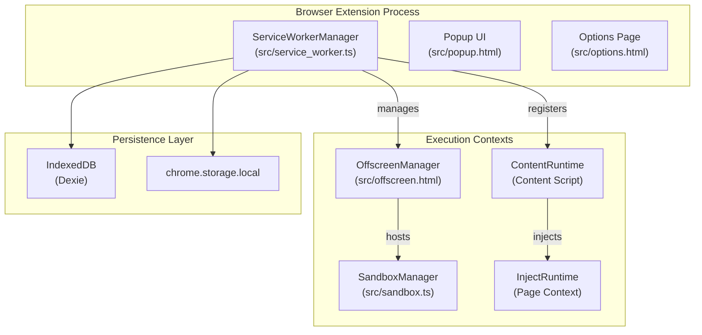
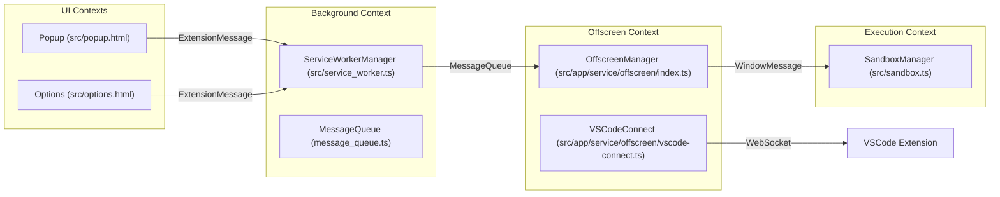

# Extension Architecture

<details>
<summary>Relevant source files</summary>

The following files were used as context for generating this wiki page:

- [docs/architecture.md](../docs/architecture.md)
- [docs/references/architecture-build.md](../docs/references/architecture-build.md)
- [docs/references/architecture-data.md](../docs/references/architecture-data.md)
- [docs/references/architecture-gm-api.md](../docs/references/architecture-gm-api.md)
- [docs/references/architecture-services.md](../docs/references/architecture-services.md)
- [docs/references/design-components.md](../docs/references/design-components.md)
- [package.json](../package.json)
- [pnpm-lock.yaml](../pnpm-lock.yaml)
- [src/app/const.ts](../src/app/const.ts)
- [src/app/migrate.ts](../src/app/migrate.ts)
- [src/app/service/offscreen/base.ts](../src/app/service/offscreen/base.ts)
- [src/app/service/offscreen/client.ts](../src/app/service/offscreen/client.ts)
- [src/app/service/offscreen/event_page_manager.ts](../src/app/service/offscreen/event_page_manager.ts)
- [src/app/service/offscreen/index.ts](../src/app/service/offscreen/index.ts)
- [src/app/service/offscreen/script.ts](../src/app/service/offscreen/script.ts)
- [src/app/service/offscreen/vscode-connect.test.ts](../src/app/service/offscreen/vscode-connect.test.ts)
- [src/app/service/offscreen/vscode-connect.ts](../src/app/service/offscreen/vscode-connect.ts)
- [src/manifest.json](../src/manifest.json)
- [src/pkg/config/consts.ts](../src/pkg/config/consts.ts)
- [src/sandbox.ts](../src/sandbox.ts)
- [src/service_worker.ts](../src/service_worker.ts)
- [tests/mocks/network.ts](../tests/mocks/network.ts)
- [tsconfig.json](../tsconfig.json)

</details>


## Purpose and Scope

This document details the technical architecture of ScriptCat as a Manifest V3 browser extension. It explores the relationship between the service worker, the UI components (popup and options), the sandbox environment, and the multi-context script execution model.

ScriptCat leverages Manifest V3 features such as the `chrome.userScripts` API, `offscreen` documents, and service worker-based background processing to provide a high-performance userscript management platform.

---

## Manifest V3 Structure

ScriptCat is built on Chrome's Manifest V3 architecture, which replaces persistent background pages with an event-driven service worker. The extension configuration defines several critical entry points and permission sets.

| Property | Value | Purpose |
|----------|-------|---------|
| `manifest_version` | `3` | Manifest V3 compliance [src/manifest.json:2](../src/manifest.json#L2) |
| `background.service_worker` | `src/service_worker.js` | Main background execution context [src/manifest.json:12](../src/manifest.json#L12) |
| `options_ui.page` | `src/options.html` | Full management interface [src/manifest.json:8](../src/manifest.json#L8) |
| `action.default_popup` | `src/popup.html` | Toolbar quick-access menu [src/manifest.json:18](../src/manifest.json#L18) |
| `sandbox.pages` | `src/sandbox.html` | Isolated background script environment [src/manifest.json:49](../src/manifest.json#L49) |
| `incognito` | `split` | Separate process for incognito windows [src/manifest.json:15](../src/manifest.json#L15) |

The extension requests a broad set of permissions to enable userscript functionality, including `userScripts` for native script injection, `scripting` for dynamic execution, and `offscreen` for persistent background tasks [src/manifest.json:27-45](../src/manifest.json#L27-L45).

**Sources:** [src/manifest.json:1-57](../src/manifest.json#L1-L57)

---

## Core Components Overview

The architecture is divided into the extension's management layer (Service Worker/UI) and the script execution layer (Sandbox/Content/Inject).

### System Component Map

**Sources:** [src/service_worker.ts:63-98](../src/service_worker.ts#L63-L98), [src/sandbox.ts:1-22](../src/sandbox.ts#L1-L22), [src/app/service/offscreen/index.ts:8-28](../src/app/service/offscreen/index.ts#L8-L28)

---

## Service Worker

The `ServiceWorkerManager` is the central orchestrating class. It is initialized in `src/service_worker.ts` and manages the lifecycle of all core services [src/service_worker.ts:79-81](../src/service_worker.ts#L79-L81).

### Browser-Specific Implementations (Chrome vs. Firefox)
ScriptCat handles the architectural differences between Chrome and Firefox MV3 implementations:
- **Chrome**: Uses a true `offscreen` document for persistent background tasks [src/service_worker.ts:76-85](../src/service_worker.ts#L76-L85).
- **Firefox**: Since Firefox MV3 does not support `offscreen` documents, it uses an `EventPageOffscreenManager` which operates within the event page context, using an `InProcessMessage` bridge to communicate with the Service Worker [src/service_worker.ts:87-98](../src/service_worker.ts#L87-L98).

### Core Services
The manager instantiates specialized services to handle different extension domains:
- **MessageQueue**: An internal pub/sub system (`IMessageQueue`) used to decouple services and broadcast events like `installScript` or `enableScripts` [src/app/service/offscreen/script.ts:45-85](../src/app/service/offscreen/script.ts#L45-L85).
- **LoggerCore**: Centralized logging system using `DBWriter` to persist logs via `LoggerDAO` [src/service_worker.ts:68-72](../src/service_worker.ts#L68-L72).

**Sources:** [src/service_worker.ts:63-102](../src/service_worker.ts#L63-L102), [src/app/service/offscreen/script.ts:18-90](../src/app/service/offscreen/script.ts#L18-L90)

---

## Sandbox and Offscreen Environment

To execute background scripts (which require a persistent DOM-like environment not available in a service worker), ScriptCat utilizes an **Offscreen Document** containing a **Sandboxed Iframe**.

### Implementation Flow
1. **Offscreen Document**: The service worker creates the document via `chrome.offscreen.createDocument` with reasons including `BLOBS`, `CLIPBOARD`, `DOM_SCRAPING`, and `LOCAL_STORAGE` [src/service_worker.ts:39-49](../src/service_worker.ts#L39-L49).
2. **OffscreenManager**: Inside `src/offscreen.html`, the `OffscreenManager` coordinates communication between the Service Worker and the sandbox iframe named `sandbox` [src/app/service/offscreen/index.ts:8-27](../src/app/service/offscreen/index.ts#L8-L27).
3. **SandboxManager**: Loaded in `src/sandbox.html`, it initializes the execution environment and establishes a `WindowMessage` link to the offscreen parent [src/sandbox.ts:8-19](../src/sandbox.ts#L8-L19).

### Offscreen Initialization Sequence
```mermaid
sequenceDiagram
    participant SW as "ServiceWorkerManager (src/service_worker.ts)"
    participant Off as "OffscreenManager (src/app/service/offscreen/index.ts)"
    participant SB as "SandboxManager (src/app/service/sandbox.ts)"
    
    SW->>SW: "setupOffscreenDocument()"
    SW->>Off: "Load src/offscreen.html"
    Off->>SB: "Initialize Sandbox (src/sandbox.ts)"
    SB->>Off: "preparationSandbox (WindowMessage)"
    Off->>SW: "offscreenDocumentReady (MessageQueue)"
```
**Sources:** [src/service_worker.ts:29-61](../src/service_worker.ts#L29-L61), [src/app/service/offscreen/index.ts:8-28](../src/app/service/offscreen/index.ts#L8-L28), [src/app/service/offscreen/client.ts:9-11](../src/app/service/offscreen/client.ts#L9-L11)

---

## Data Persistence and Migration

ScriptCat uses a DAO (Data Access Object) pattern for persistence, abstracting IndexedDB (via Dexie) and `chrome.storage`.

### Migration Logic
The system includes robust migration paths to handle schema updates and the transition to Manifest V3:
- **migrateToChromeStorage**: Transfers scripts, code, values, and permissions from legacy IndexedDB tables to their MV3 counterparts [src/app/migrate.ts:15-204](../src/app/migrate.ts#L15-L204).
- **renameField**: Handles field renaming (e.g., `origin_domain` to `originDomain`) for consistency [src/app/migrate.ts:207-230](../src/app/migrate.ts#L207-L230).

### Storage Inventory
- **ScriptDAO / ScriptCodeDAO**: Manages script metadata and the actual source code [src/app/migrate.ts:21-22](../src/app/migrate.ts#L21-L22).
- **ValueDAO**: Handles `GM_setValue` data storage, indexed by a `storageName` derived from script metadata [src/app/migrate.ts:120-160](../src/app/migrate.ts#L120-L160).
- **SubscribeDAO**: Manages userscript subscription metadata [src/app/migrate.ts:88-108](../src/app/migrate.ts#L88-L108).

**Sources:** [src/app/migrate.ts:1-230](../src/app/migrate.ts#L1-L230), [src/app/repo/dao.ts:2](../src/app/repo/dao.ts#L2)

---

## Component Communication

Communication is standardized through several message passing abstractions to bridge the distributed contexts:

1. **ExtensionMessage**: Wraps `chrome.runtime.sendMessage` for UI-to-Background communication [src/service_worker.ts:66](../src/service_worker.ts#L66).
2. **WindowMessage**: Handles `postMessage` communication between the Offscreen document and the Sandbox iframe [src/sandbox.ts:8](../src/sandbox.ts#L8).
3. **Server/Client**: An RPC-like abstraction. For example, `ScriptClient` allows services to invoke script-related actions across process boundaries [src/app/service/offscreen/script.ts:32](../src/app/service/offscreen/script.ts#L32).
4. **ExternalAccessConnectClient**: A specialized client for managing WebSocket connections to external tools like VSCode [src/app/service/offscreen/client.ts:126-142](../src/app/service/offscreen/client.ts#L126-L142).

### VSCode Connectivity
ScriptCat supports a hot-reload development workflow via `VSCodeConnect`. It establishes a WebSocket connection in the offscreen context to `scriptcat-vscode`, allowing for instant script updates [src/app/service/offscreen/vscode-connect.ts:37-63](../src/app/service/offscreen/vscode-connect.ts#L37-L63).

### Message Routing Architecture


**Sources:** [src/service_worker.ts:63-98](../src/service_worker.ts#L63-L98), [src/app/service/offscreen/vscode-connect.ts:9-63](../src/app/service/offscreen/vscode-connect.ts#L9-L63), [src/app/service/offscreen/client.ts:1-142](../src/app/service/offscreen/client.ts#L1-L142)

---
