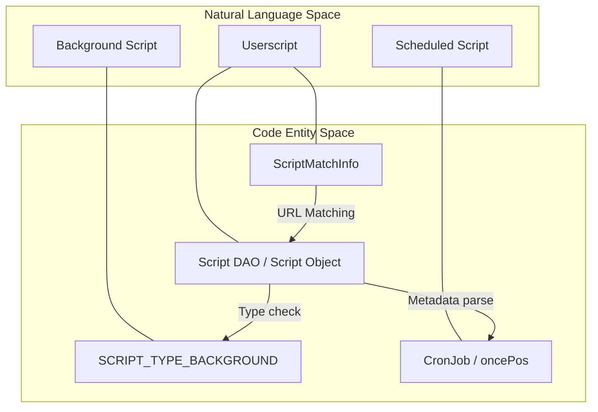
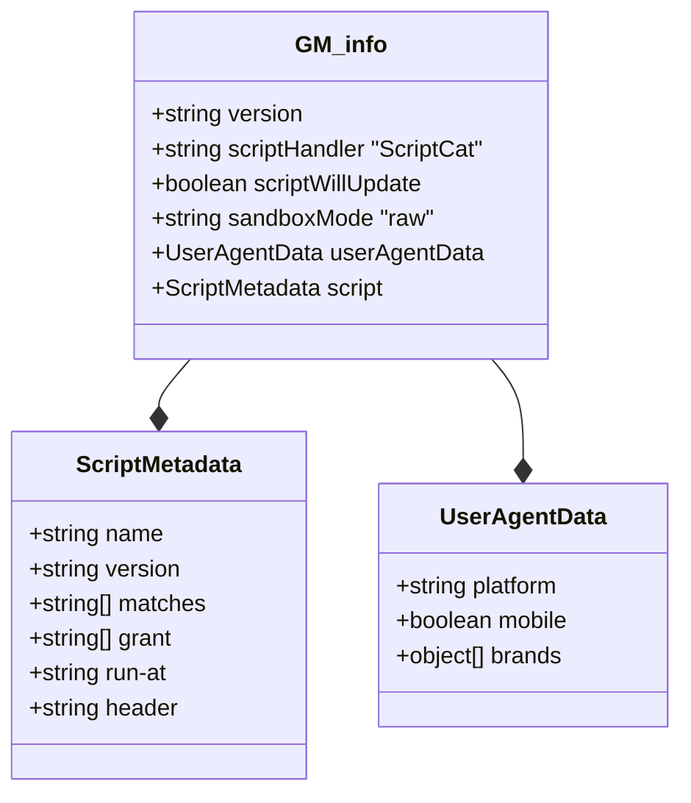

# Core Concepts and Terminology

<details>
<summary>Relevant source files</summary>

The following files were used as context for generating this wiki page:

- [README.md](../README.md)
- [docs/README_RU.md](../docs/README_RU.md)
- [docs/README_ja.md](../docs/README_ja.md)
- [docs/README_zh-CN.md](../docs/README_zh-CN.md)
- [docs/README_zh-TW.md](../docs/README_zh-TW.md)
- [src/app/service/offscreen/gm_api.ts](../src/app/service/offscreen/gm_api.ts)
- [src/app/service/sandbox/runtime.ts](../src/app/service/sandbox/runtime.ts)
- [src/app/service/service_worker/clipboard.ts](../src/app/service/service_worker/clipboard.ts)
- [src/app/service/service_worker/permission_verify.ts](../src/app/service/service_worker/permission_verify.ts)
- [src/app/service/service_worker/types.ts](../src/app/service/service_worker/types.ts)
- [src/app/service/service_worker/value.ts](../src/app/service/service_worker/value.ts)
- [src/assets/_locales/de/messages.json](../src/assets/_locales/de/messages.json)
- [src/assets/_locales/en/messages.json](../src/assets/_locales/en/messages.json)
- [src/assets/_locales/ja/messages.json](../src/assets/_locales/ja/messages.json)
- [src/assets/_locales/ru/messages.json](../src/assets/_locales/ru/messages.json)
- [src/assets/_locales/tr/messages.json](../src/assets/_locales/tr/messages.json)
- [src/assets/_locales/vi/messages.json](../src/assets/_locales/vi/messages.json)
- [src/pages/options/routes/Agent/Tasks/cron.ts](../src/pages/options/routes/Agent/Tasks/cron.ts)
- [src/pkg/utils/cron.test.ts](../src/pkg/utils/cron.test.ts)
- [src/pkg/utils/cron.ts](../src/pkg/utils/cron.ts)
- [src/template/scriptcat.d.tpl](../src/template/scriptcat.d.tpl)
- [src/types/main.d.ts](../src/types/main.d.ts)
- [src/types/scriptcat.d.ts](../src/types/scriptcat.d.ts)

</details>


This document defines the fundamental concepts, data structures, and terminology used throughout the ScriptCat browser extension system. Understanding these core concepts is essential for navigating the codebase and comprehending how scripts are managed, executed, and secured.

For information about the browser extension's overall architecture, see page **1.1**. For details about script execution and sandboxing, see page **3**. For script management operations, see page **2**.

## Fundamental Concepts

### Userscripts

A **userscript** is a JavaScript program that executes on web pages to modify their behavior or appearance. In ScriptCat, userscripts are managed entities with metadata, permissions, and execution rules. Each userscript contains:

- **Metadata Block**: Header comments starting with `@` directives that define script properties.
- **JavaScript Code**: The executable script body.
- **Storage**: Isolated key-value storage accessible via `GM_setValue`/`GM_getValue`.
- **Permissions**: Explicitly granted capabilities via `@grant` directives.

ScriptCat is fully compatible with Tampermonkey userscripts, supporting standard GM APIs while providing additional `CAT_` extensions like `CAT_fileStorage` and `CAT_scriptLoaded`. [src/types/scriptcat.d.ts:35-78](../src/types/scriptcat.d.ts#L35-L78), [src/types/scriptcat.d.ts:179-179](../src/types/scriptcat.d.ts#L179-L179)

Sources: [src/types/scriptcat.d.ts:35-188](../src/types/scriptcat.d.ts#L35-L188), [README.md:28-32](../README.md#L28-L32)

### Background Scripts

**Background scripts** are a ScriptCat innovation that execute independently of any webpage. Unlike traditional userscripts that run only when specific pages load, background scripts:

- Execute in an isolated sandbox environment (offscreen document).
- Run continuously without page dependencies.
- Are instantiated via `BgExecScriptWarp` and managed by the `Runtime` class. [src/app/service/sandbox/runtime.ts:193-194](../src/app/service/sandbox/runtime.ts#L193-L194)
- Identified by `SCRIPT_TYPE_BACKGROUND`. [src/app/service/sandbox/runtime.ts:105-107](../src/app/service/sandbox/runtime.ts#L105-L107)

Sources: [README.md:46-47](../README.md#L46-L47), [src/app/service/sandbox/runtime.ts:105-107](../src/app/service/sandbox/runtime.ts#L105-L107), [src/app/service/sandbox/runtime.ts:193-198](../src/app/service/sandbox/runtime.ts#L193-L198)

### Scheduled Scripts

**Scheduled scripts** are background scripts with time-based execution triggers using `cron` expressions.

- **Cron Execution**: Managed by `createCronJob` and tracked in `Runtime.cronJob` map. [src/app/service/sandbox/runtime.ts:32-32](../src/app/service/sandbox/runtime.ts#L32-L32), [src/pkg/utils/cron.ts:154-184](../src/pkg/utils/cron.ts#L154-L184)
- **Once Execution**: ScriptCat supports a `once` extension in cron syntax (e.g., `once(day)`) to ensure a task runs only once per period. [src/pkg/utils/cron.ts:32-36](../src/pkg/utils/cron.ts#L32-L36), [src/pkg/utils/cron.ts:193-207](../src/pkg/utils/cron.ts#L193-L207)
- **Execution Tracking**: The system tracks `lastruntime` to calculate the next trigger. [src/app/service/sandbox/runtime.ts:143-169](../src/app/service/sandbox/runtime.ts#L143-L169)

Sources: [src/pkg/utils/cron.ts:5-48](../src/pkg/utils/cron.ts#L5-L48), [src/app/service/sandbox/runtime.ts:109-112](../src/app/service/sandbox/runtime.ts#L109-L112), [src/app/service/sandbox/runtime.ts:143-169](../src/app/service/sandbox/runtime.ts#L143-L169)

### Sandbox Environment

The **sandbox** is an isolated execution context where untrusted userscripts run. ScriptCat uses an offscreen document to provide a stable environment for background APIs.

- **Offscreen GMApi**: The `GMApi` class in the offscreen context handles privileged requests like `xmlHttpRequest`, `windowOpen`, and `setClipboard`. [src/app/service/offscreen/gm_api.ts:23-32](../src/app/service/offscreen/gm_api.ts#L23-L32)
- **Permission Verification**: Before an API is executed, `PermissionVerify.verify` checks the script's `@grant` metadata and may trigger a user confirmation UI. [src/app/service/service_worker/permission_verify.ts:125-163](../src/app/service/service_worker/permission_verify.ts#L125-L163)

Sources: [src/app/service/offscreen/gm_api.ts:23-32](../src/app/service/offscreen/gm_api.ts#L23-L32), [src/app/service/service_worker/permission_verify.ts:79-163](../src/app/service/service_worker/permission_verify.ts#L79-L163)

## Script Types and Classifications

### Script Entity Mapping

This diagram bridges the natural language concepts to the internal code structures used for script management.



Sources: [src/app/service/service_worker/types.ts:15-20](../src/app/service/service_worker/types.ts#L15-L20), [src/app/service/sandbox/runtime.ts:105-112](../src/app/service/sandbox/runtime.ts#L105-L112), [src/app/service/sandbox/runtime.ts:143-169](../src/app/service/sandbox/runtime.ts#L143-L169)

### User Configuration (UserConfig)

Scripts can define custom settings via a `UserConfig` structure.

- **Config Types**: Supports `text`, `checkbox`, `select`, `mult-select`, `number`, `textarea`, and `time`. [src/types/scriptcat.d.ts:5-5](../src/types/scriptcat.d.ts#L5-L5)
- **Data Binding**: The `bind` property allows two-way data flow between UI widgets and script storage. [src/types/scriptcat.d.ts:17-18](../src/types/scriptcat.d.ts#L17-L18)
- **Parsing**: Handled via `parseUserConfig` during script initialization. [src/app/service/sandbox/runtime.ts:98-98](../src/app/service/sandbox/runtime.ts#L98-L98)

Sources: [src/types/scriptcat.d.ts:5-33](../src/types/scriptcat.d.ts#L5-L33), [src/app/service/sandbox/runtime.ts:96-104](../src/app/service/sandbox/runtime.ts#L96-L104)

## Core Data Models

### Script Metadata (GM_info)

The `GM_info` object provides scripts with information about their own execution environment.



Sources: [src/types/scriptcat.d.ts:35-78](../src/types/scriptcat.d.ts#L35-L78)

### Script Management Entities

- **ScriptMatchInfo**: Extends the base script entity with URL patterns (both original and user-overridden). [src/app/service/service_worker/types.ts:15-20](../src/app/service/service_worker/types.ts#L15-L20)
- **TScriptMatchInfoEntry**: A performance-optimized version of match info used for caching, which excludes heavy fields like `code` and `resource`. [src/app/service/service_worker/types.ts:28-33](../src/app/service/service_worker/types.ts#L28-L33)

Sources: [src/app/service/service_worker/types.ts:15-33](../src/app/service/service_worker/types.ts#L15-L33)

## Execution and API Interaction

### GM API Surface

ScriptCat provides both synchronous and asynchronous (Promise-based) APIs.

| API Category | Sync Version | Async (GM.*) Version |
|--------------|--------------|----------------------|
| **Values** | `GM_setValue`, `GM_getValue` | `GM.setValue`, `GM.getValue` |
| **Resources**| `GM_getResourceText` | `GM.getResourceText` |
| **Tabs** | `GM_openInTab` | `GM.openInTab` |
| **XHR** | `GM_xmlhttpRequest` | `GM.xmlHttpRequest` |

Sources: [src/types/scriptcat.d.ts:80-230](../src/types/scriptcat.d.ts#L80-L230)

### Value Service and Storage

The `ValueService` manages script persistence and cross-context synchronization.

- **Storage Name**: Derived via `getStorageName(script)`, providing isolation between scripts unless `@storagename` is shared. [src/app/service/service_worker/value.ts:98-98](../src/app/service/service_worker/value.ts#L98-L98)
- **Value Update**: When `GM_setValue` is called, `ValueService.setValues` updates the `ValueDAO` and broadcasts the change to other tabs via `pushValueUpdate`. [src/app/service/service_worker/value.ts:84-171](../src/app/service/service_worker/value.ts#L84-L171)
- **Caching**: Uses `CACHE_KEY_SET_VALUE` to prevent race conditions during concurrent writes. [src/app/service/service_worker/value.ts:100-102](../src/app/service/service_worker/value.ts#L100-L102)

Sources: [src/app/service/service_worker/value.ts:27-171](../src/app/service/service_worker/value.ts#L27-L171)

## Communication and IPC

The extension uses a structured messaging system to handle API requests.

```mermaid
sequenceDiagram
    participant Script as "Userscript Context"
    participant SW as "Service Worker (RuntimeService)"
    participant PV as "PermissionVerify"
    participant Off as "Offscreen (GMApi)"

    Script->>SW: GMApiRequest (uuid, api, params)
    SW->>PV: verify(request)
    alt Permission Denied
        PV-->>Script: Error: permission not requested
    else Requires Confirmation
        PV->>PV: pushConfirmQueue()
        Note over PV: User accepts in UI
    end
    PV-->>SW: true
    SW->>Off: xmlHttpRequest (if applicable)
    Off-->>SW: Response
    SW->>Script: API Result
```

- **GMApiRequest**: The standard structure for messages sent from scripts to the background, containing the script ID (`uuid`), the requested `api`, and `params`. [src/app/service/service_worker/types.ts:51-53](../src/app/service/service_worker/types.ts#L51-L53)
- **ConfirmParam**: Data structure used to request user permission for sensitive APIs (e.g., cross-origin XHR). [src/app/service/service_worker/permission_verify.ts:17-36](../src/app/service/service_worker/permission_verify.ts#L17-L36)

Sources: [src/app/service/service_worker/types.ts:44-53](../src/app/service/service_worker/types.ts#L44-L53), [src/app/service/service_worker/permission_verify.ts:125-163](../src/app/service/service_worker/permission_verify.ts#L125-L163), [src/app/service/offscreen/gm_api.ts:23-32](../src/app/service/offscreen/gm_api.ts#L23-L32)

## Terminology Reference

- **Storage Name**: The unique key (usually script UUID or `@storagename`) used to identify a script's private IndexedDB partition. [src/app/service/service_worker/value.ts:98-98](../src/app/service/service_worker/value.ts#L98-L98)
- **Run Flag**: An identifier (`runFlag`) used to track a specific execution session of a script. [src/app/service/service_worker/types.ts:47-47](../src/app/service/service_worker/types.ts#L47-L47)
- **Grant**: The list of privileged APIs requested by a script in its metadata. [src/app/service/service_worker/permission_verify.ts:139-144](../src/app/service/service_worker/permission_verify.ts#L139-L144)
- **Spanning Mode**: A Firefox-specific extension behavior where a single background context is shared between normal and incognito windows. [src/app/service/sandbox/runtime.ts:184-184](../src/app/service/sandbox/runtime.ts#L184-L184)

Sources: [src/app/service/service_worker/types.ts:44-53](../src/app/service/service_worker/types.ts#L44-L53), [src/app/service/service_worker/value.ts:98-98](../src/app/service/service_worker/value.ts#L98-L98), [src/app/service/sandbox/runtime.ts:180-191](../src/app/service/sandbox/runtime.ts#L180-L191)

---
