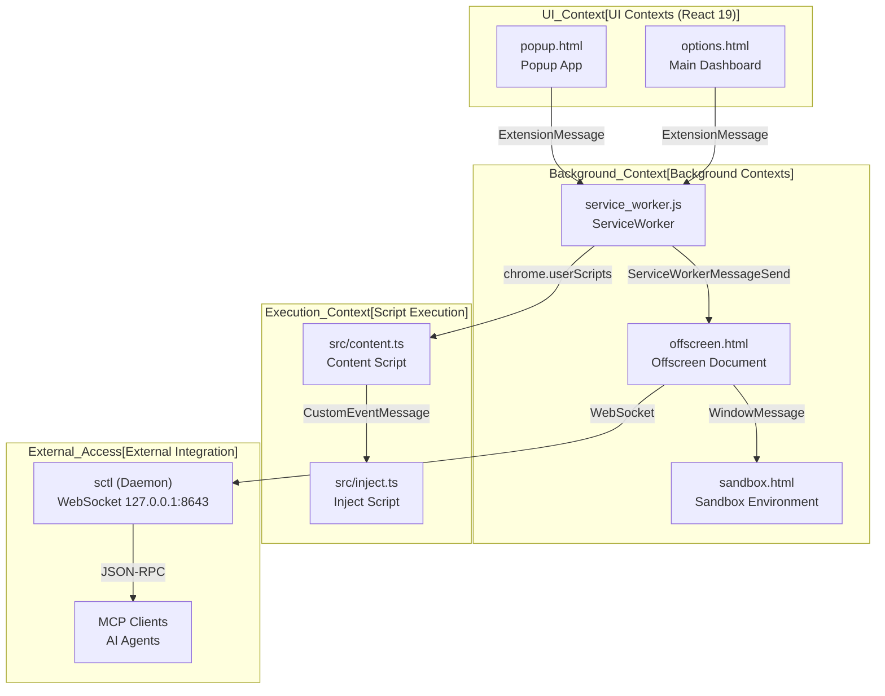

# Overview

Relevant source files

The following files were used as context for generating this wiki page:

- [AGENTS.md](../AGENTS.md)
- [README.md](../README.md)
- [docs/DOC-MAINTENANCE.md](../docs/DOC-MAINTENANCE.md)
- [docs/README.md](../docs/README.md)
- [docs/README_RU.md](../docs/README_RU.md)
- [docs/README_ja.md](../docs/README_ja.md)
- [docs/README_zh-CN.md](../docs/README_zh-CN.md)
- [docs/README_zh-TW.md](../docs/README_zh-TW.md)
- [docs/design.md](../docs/design.md)
- [docs/develop.md](../docs/develop.md)
- [docs/pull-request.md](../docs/pull-request.md)
- [docs/references/develop-testing.md](../docs/references/develop-testing.md)
- [docs/verification.md](../docs/verification.md)
- [eslint.config.mjs](../eslint.config.mjs)
- [package.json](../package.json)
- [pnpm-lock.yaml](../pnpm-lock.yaml)
- [scripts/git-staged-snapshot.test.mjs](../scripts/git-staged-snapshot.test.mjs)
- [src/app/const.ts](../src/app/const.ts)
- [src/assets/_locales/de/messages.json](../src/assets/_locales/de/messages.json)
- [src/assets/_locales/en/messages.json](../src/assets/_locales/en/messages.json)
- [src/assets/_locales/ja/messages.json](../src/assets/_locales/ja/messages.json)
- [src/assets/_locales/ru/messages.json](../src/assets/_locales/ru/messages.json)
- [src/assets/_locales/tr/messages.json](../src/assets/_locales/tr/messages.json)
- [src/assets/_locales/vi/messages.json](../src/assets/_locales/vi/messages.json)
- [src/manifest.json](../src/manifest.json)
- [src/pages/components/NameAvatar.test.tsx](../src/pages/components/NameAvatar.test.tsx)
- [src/pages/components/ui/empty-state.test.tsx](../src/pages/components/ui/empty-state.test.tsx)
- [tests/mocks/network.ts](../tests/mocks/network.ts)
- [tsconfig.json](../tsconfig.json)

This document provides a high-level introduction to the ScriptCat browser extension codebase, covering its architecture, core components, and technology stack. ScriptCat is a Manifest V3 browser extension that functions as a powerful userscript manager with advanced features like background script execution, scheduled tasks, and an integrated AI agent subsystem.

For detailed information about specific subsystems, see:
- [Extension Architecture](./1-1-extension-architecture.md) — Detail the Manifest V3 architecture including service worker, content, inject, offscreen, and sandbox contexts.
- [Core Concepts and Terminology](./1-2-core-concepts-and-terminology.md) — Define key terminology like userscripts, background scripts, GM APIs, and fundamental data structures.

## What is ScriptCat

ScriptCat is a Manifest V3 userscript manager based on Tampermonkey's design philosophy and is fully compatible with Tampermonkey scripts [README.md:28-29](../README.md#L28-L29). It manages userscript installation, execution, and synchronization across multiple execution contexts.

**Core Capabilities:**
- **Tampermonkey Compatibility**: Seamlessly migrate existing scripts with zero learning curve [README.md:45-45](../README.md#L45-L45).
- **Background Scripts**: An innovative execution mechanism allowing scripts to run continuously without page limitations [README.md:46-47](../README.md#L46-L47).
- **Scheduled Scripts**: Support for timed tasks such as auto check-ins and reminders [README.md:48-48](../README.md#L48-L48).
- **AI Agent**: An integrated subsystem for automated tasks, tool loops, and DOM interaction [src/app/const.ts:5-6](../src/app/const.ts#L5-L6), [AGENTS.md:70-70](../AGENTS.md#L70-L70).
- **Smart Editor**: Built-in Monaco-based editor with syntax highlighting, intelligent completion, and ESLint [README.md:59-59](../README.md#L59-L59), [package.json:51](../package.json#L51).
- **Cloud Sync**: Sync scripts across devices using providers like WebDAV, S3, Google Drive, or Dropbox [README.md:40-41](../README.md#L40-L41), [package.json:65-66](../package.json#L65-L66).

Sources: [README.md:28-63](../README.md#L28-L63), [package.json:2-4](../package.json#L2-L4), [src/manifest.json:1-10](../src/manifest.json#L1-L10), [src/app/const.ts:1-20](../src/app/const.ts#L1-L20)

## High-Level Architecture

The extension follows the Manifest V3 standard, utilizing a Service Worker for background orchestration and specialized environments for script execution. It utilizes a distributed-system model across five distinct isolated contexts.

### System Component Overview

**Key Architectural Components:**
- **Service Worker**: The central hub (`src/service_worker.ts`) managing script lifecycle, resource caching, and message routing [src/manifest.json:11-14](../src/manifest.json#L11-L14), [AGENTS.md:58-58](../AGENTS.md#L58-L58).
- **Offscreen Document**: Provides a DOM-capable background environment for persistent scripts and WebSocket connections to external tools [src/manifest.json:32](../src/manifest.json#L32), [AGENTS.md:61-61](../AGENTS.md#L61-L61).
- **Sandbox**: A dedicated environment (`src/sandbox.html`) for running scripts in an isolated manner using `with(arguments[0])` and handling cron scheduling [src/manifest.json:48-50](../src/manifest.json#L48-L50), [AGENTS.md:62-62](../AGENTS.md#L62-L62).
- **External Access**: A subsystem allowing external tools (CLI, MCP clients) to interact with ScriptCat via WebSocket [docs/develop.md:43-58](../docs/develop.md#L43-L58).

For a deep dive into component interactions, see [Extension Architecture](./1-1-extension-architecture.md).

Sources: [src/manifest.json:1-57](../src/manifest.json#L1-L57), [AGENTS.md:42-73](../AGENTS.md#L42-L73), [docs/develop.md:43-58](../docs/develop.md#L43-L58)

## Script Execution Model

ScriptCat supports a multi-context execution model to provide both security and deep page integration.

| Context | Source File | Description | Access Level |
|---------|-------------|-------------|--------------|
| **Content** | `src/content.ts` | Bridge between SW and Inject script. | Isolated world, chrome.userScripts [AGENTS.md:59-59](../AGENTS.md#L59-L59). |
| **Inject** | `src/inject.ts` | Runs in the page's "Main World". | Access to `unsafeWindow` [AGENTS.md:60-60](../AGENTS.md#L60-L60). |
| **Offscreen** | `src/offscreen.ts` | DOM-capable background. | Persistent background scripts [AGENTS.md:61-61](../AGENTS.md#L61-L61). |
| **Sandbox** | `src/sandbox.ts` | Isolated execution environment. | Background/Scheduled script logic [AGENTS.md:62-62](../AGENTS.md#L62-L62). |

Scripts are matched to URLs using patterns like `@match`, `@include`, and `@exclude`. The extension requests broad permissions, including `userScripts` and `scripting`, to facilitate these execution paths [src/manifest.json:27-45](../src/manifest.json#L27-L45).

For details on terminology and data structures, see [Core Concepts and Terminology](./1-2-core-concepts-and-terminology.md).

Sources: [src/manifest.json:27-57](../src/manifest.json#L27-L57), [AGENTS.md:42-73](../AGENTS.md#L42-L73), [README.md:43-50](../README.md#L43-L50)

## Technology Stack

ScriptCat is built with a modern stack, having recently migrated to Tailwind CSS v4 and shadcn/ui.

| Category | Technology |
|----------|------------|
| **Framework** | React 19 [package.json:53](../package.json#L53), [AGENTS.md:21](../AGENTS.md#L21) |
| **UI Library** | shadcn/ui + Tailwind CSS v4 [AGENTS.md:21](../AGENTS.md#L21) |
| **Database** | Dexie.js (IndexedDB) [package.json:43](../package.json#L43) |
| **Editor** | Monaco Editor [package.json:51](../package.json#L51) |
| **Bundler** | Rspack [package.json:72-73](../package.json#L72-L73) |
| **Testing** | Vitest & Playwright [package.json:71, 111](../package.json) |

**Build & Development:**
- `pnpm run dev`: Starts the development server using Rspack [package.json:11](../package.json#L11).
- `pnpm run build`: Production Rspack build [package.json:14](../package.json#L14).
- `pnpm run lint`: Runs a comprehensive linting suite including i18n and type checks [package.json:17](../package.json#L17).

Sources: [package.json:8-113](../package.json#L8-L113), [AGENTS.md:21-21](../AGENTS.md#L21-L21), [docs/develop.md:9-30](../docs/develop.md#L9-L30)

## Entry Points

The extension provides several user-facing interfaces defined in the manifest:
- **Options Page**: `src/options.html` serves as the primary dashboard for script management and configuration [src/manifest.json:7-10](../src/manifest.json#L7-L10).
- **Popup**: `src/popup.html` provides quick access to scripts active on the current tab [src/manifest.json:17-22](../src/manifest.json#L17-L22).
- **Install Page**: `src/install.html` is used to confirm userscript installation [src/manifest.json:53-56](../src/manifest.json#L53-L56).

Sources: [src/manifest.json:7-57](../src/manifest.json#L7-L57)

---
