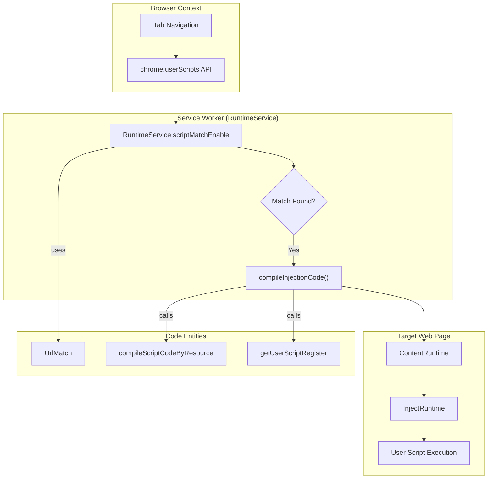
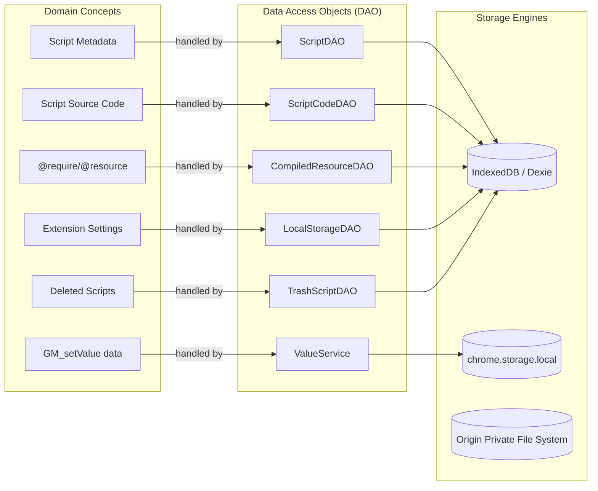

# Glossary

Relevant source files

The following files were used as context for generating this wiki page:

- [README.md](../README.md)
- [docs/README_RU.md](../docs/README_RU.md)
- [docs/README_ja.md](../docs/README_ja.md)
- [docs/README_zh-CN.md](../docs/README_zh-CN.md)
- [docs/README_zh-TW.md](../docs/README_zh-TW.md)
- [packages/message/extension_message.ts](../packages/message/extension_message.ts)
- [packages/message/message_queue.ts](../packages/message/message_queue.ts)
- [packages/message/mock_message.ts](../packages/message/mock_message.ts)
- [packages/message/server.ts](../packages/message/server.ts)
- [packages/message/types.ts](../packages/message/types.ts)
- [packages/message/window_message.ts](../packages/message/window_message.ts)
- [src/app/service/agent/core/compact_prompt.ts](../src/app/service/agent/core/compact_prompt.ts)
- [src/app/service/agent/core/sub_agent_types.ts](../src/app/service/agent/core/sub_agent_types.ts)
- [src/app/service/agent/core/system_prompt.test.ts](../src/app/service/agent/core/system_prompt.test.ts)
- [src/app/service/agent/core/system_prompt.ts](../src/app/service/agent/core/system_prompt.ts)
- [src/app/service/offscreen/gm_api.ts](../src/app/service/offscreen/gm_api.ts)
- [src/app/service/queue.ts](../src/app/service/queue.ts)
- [src/app/service/service_worker/client.ts](../src/app/service/service_worker/client.ts)
- [src/app/service/service_worker/clipboard.ts](../src/app/service/service_worker/clipboard.ts)
- [src/app/service/service_worker/index.ts](../src/app/service/service_worker/index.ts)
- [src/app/service/service_worker/popup.ts](../src/app/service/service_worker/popup.ts)
- [src/app/service/service_worker/runtime.ts](../src/app/service/service_worker/runtime.ts)
- [src/app/service/service_worker/script.ts](../src/app/service/service_worker/script.ts)
- [src/app/service/service_worker/subscribe.ts](../src/app/service/service_worker/subscribe.ts)
- [src/app/service/service_worker/synchronize.test.ts](../src/app/service/service_worker/synchronize.test.ts)
- [src/app/service/service_worker/synchronize.ts](../src/app/service/service_worker/synchronize.ts)
- [src/app/service/service_worker/system.ts](../src/app/service/service_worker/system.ts)
- [src/app/service/service_worker/types.ts](../src/app/service/service_worker/types.ts)
- [src/assets/_locales/de/messages.json](../src/assets/_locales/de/messages.json)
- [src/assets/_locales/en/messages.json](../src/assets/_locales/en/messages.json)
- [src/assets/_locales/ja/messages.json](../src/assets/_locales/ja/messages.json)
- [src/assets/_locales/ru/messages.json](../src/assets/_locales/ru/messages.json)
- [src/assets/_locales/tr/messages.json](../src/assets/_locales/tr/messages.json)
- [src/assets/_locales/vi/messages.json](../src/assets/_locales/vi/messages.json)
- [src/pages/install/App.tsx](../src/pages/install/App.tsx)
- [src/pages/store/features/script.ts](../src/pages/store/features/script.ts)
- [src/pkg/utils/script.ts](../src/pkg/utils/script.ts)
- [src/template/scriptcat.d.tpl](../src/template/scriptcat.d.tpl)
- [src/types/main.d.ts](../src/types/main.d.ts)
- [src/types/scriptcat.d.ts](../src/types/scriptcat.d.ts)

This glossary defines technical terms, domain-specific jargon, and architectural concepts used within the ScriptCat codebase. It serves as a reference for onboarding engineers to understand the relationships between high-level userscript concepts and their specific implementations.

## Purpose and Scope

ScriptCat is a browser extension built on **Manifest V3** that manages and executes userscripts. Unlike traditional managers, it supports specialized runtimes like background and scheduled scripts, and an advanced AI Agent subsystem. This page maps these domain concepts to the classes and services defined in the `src/` and `packages/` directories.

---

## 1. Script Types and Lifecycle

ScriptCat categorizes scripts based on their execution context and trigger mechanism.

| Term | Definition | Code Entity |
| :--- | :--- | :--- |
| **Normal Script** | Standard userscripts that run on specific web pages (content/inject contexts). | `SCRIPT_TYPE_NORMAL` [src/app/service/service_worker/runtime.ts:7-7](../src/app/service/service_worker/runtime.ts#L7-L7) |
| **Background Script** | Scripts that run persistently in a background environment (Offscreen Document). | `SCRIPT_TYPE_BACKGROUND` [src/pkg/utils/script.ts:8-8](../src/pkg/utils/script.ts#L8-L8) |
| **Scheduled Script** | Scripts executed based on cron-like intervals or specific times. | `SCRIPT_TYPE_CRONTAB` [src/pkg/utils/script.ts:9-9](../src/pkg/utils/script.ts#L9-L9) |
| **Metadata** | The header block of a script (e.g., `@match`, `@grant`) parsed into a structured object. | `SCMetadata` [src/app/repo/scripts.ts](../src/app/repo/scripts.ts) / `parseMetadata` [src/pkg/utils/script.ts:25-47](../src/pkg/utils/script.ts#L25-L47) |
| **Silent Update** | Updating a script without user intervention if critical permissions haven't changed. | `checkSilenceUpdate` [src/app/service/service_worker/script.ts:7-7](../src/app/service/service_worker/script.ts#L7-L7) |
| **Storage Name** | A unique identifier for a script's storage, usually the UUID or a custom `@storagename`. | `getStorageName` [src/app/service/service_worker/runtime.ts:24-24](../src/app/service/service_worker/runtime.ts#L24-L24) |
| **Trash System** | A temporary storage for deleted scripts allowing restoration before final purging. | `TrashScriptDAO` [src/app/service/service_worker/script.ts:85-85](../src/app/service/service_worker/script.ts#L85-L85) |

**Sources:** [src/app/service/service_worker/runtime.ts:7-28](../src/app/service/service_worker/runtime.ts#L7-L28), [src/pkg/utils/script.ts:8-47](../src/pkg/utils/script.ts#L8-L47), [src/app/service/service_worker/script.ts:7-85](../src/app/service/service_worker/script.ts#L7-L85)

---

## 2. Runtime and Execution Environments

The system utilizes multiple environments to bypass Manifest V3 limitations and provide a rich API surface.

### Contexts and Sandboxing
*   **Service Worker (SW):** The extension's entry point and primary orchestrator. It handles script matching and lifecycle events.
    *   *Implementation:* `RuntimeService` [src/app/service/service_worker/runtime.ts:131-131](../src/app/service/service_worker/runtime.ts#L131-L131)
*   **Offscreen Document:** A hidden DOM environment used to execute background scripts and provide a persistent environment that the Service Worker lacks.
    *   *Implementation:* `runScript` [src/app/service/service_worker/runtime.ts:12-12](../src/app/service/service_worker/runtime.ts#L12-L12)
*   **Sandbox:** An isolated environment where script logic is executed. ScriptCat primarily uses a "raw" sandbox mode for compatibility.
    *   *Implementation:* `sandboxMode: "raw"` [src/types/scriptcat.d.ts:50-50](../src/types/scriptcat.d.ts#L50-L50)
*   **Agent Environment:** A specialized context for AI-driven automation, integrating LLMs and DOM tools.
    *   *Implementation:* `AgentService` [src/app/service/service_worker/index.ts:24-24](../src/app/service/service_worker/index.ts#L24-L24)

### Logic Flow: Script Execution
The following diagram illustrates the flow from a page load to script execution, bridging the gap between natural language concepts and code entities.

**Page Load to Script Injection Flow**

**Sources:** [src/app/service/service_worker/runtime.ts:131-150](../src/app/service/service_worker/runtime.ts#L131-L150), [src/app/service/service_worker/runtime.ts:15-20](../src/app/service/service_worker/runtime.ts#L15-L20), [src/app/service/service_worker/index.ts:124-124](../src/app/service/service_worker/index.ts#L124-L124)

---

## 3. API and Messaging

ScriptCat provides standard `GM_*` APIs and proprietary `CAT_*` extensions.

### API Categories
*   **GM (Greasemonkey) APIs:** Compatibility layer for standard userscript functions like `GM_xmlhttpRequest`, `GM_setValue`, and `GM_notification`.
    *   *Definition:* `GMApi` [src/app/service/service_worker/runtime.ts:9-9](../src/app/service/service_worker/runtime.ts#L9-L9)
    *   *Typedefs:* `src/types/scriptcat.d.ts` [src/types/scriptcat.d.ts:85-117](../src/types/scriptcat.d.ts#L85-L117)
*   **CAT APIs:** ScriptCat-specific enhancements such as `CAT_registerMenuInput` and `CAT_scriptLoaded`.
    *   *Implementation:* `CAT_registerMenuInput` [src/types/scriptcat.d.ts:151-173](../src/types/scriptcat.d.ts#L151-L173)

### Messaging Infrastructure
Communication between different extension parts (SW, Content, Inject, Popup) is handled by a unified messaging system.

| Term | Definition | Code Entity |
| :--- | :--- | :--- |
| **Message Queue** | A pub/sub system for internal extension events like script installation or status changes. | `IMessageQueue` [src/app/service/service_worker/runtime.ts:181-181](../src/app/service/service_worker/runtime.ts#L181-L181) |
| **Group / Server** | The server-side component of the internal RPC system for cross-context calls. | `Group` [src/app/service/service_worker/runtime.ts:3-3](../src/app/service/service_worker/runtime.ts#L3-L3) / `Server` [src/app/service/service_worker/index.ts:2-2](../src/app/service/service_worker/index.ts#L2-L2) |
| **Client** | The consumer side of the RPC system (e.g., `ScriptClient`). | `Client` [src/app/service/service_worker/client.ts:7-7](../src/app/service/service_worker/client.ts#L7-L7) |
| **Extension Message** | Wrapper for `chrome.runtime.sendMessage` communication. | `ExtensionContentMessageSend` [src/app/service/service_worker/runtime.ts:33-33](../src/app/service/service_worker/runtime.ts#L33-L33) |

**Sources:** [src/types/scriptcat.d.ts:85-173](../src/types/scriptcat.d.ts#L85-L173), [src/app/service/service_worker/runtime.ts:2-33](../src/app/service/service_worker/runtime.ts#L2-L33), [src/app/service/service_worker/client.ts:7-33](../src/app/service/service_worker/client.ts#L7-L33)

---

## 4. Data Persistence and Synchronization

The storage layer is built on top of IndexedDB (via Dexie) and Chrome's storage APIs, with advanced cloud synchronization logic.

### Storage Taxonomy
*   **DAO (Data Access Object):** Low-level interface for database tables (e.g., `ScriptDAO`, `ScriptCodeDAO`).
*   **Repo (Repository):** Higher-level abstraction often managing complex entities like `AgentModelRepo` [src/app/service/service_worker/synchronize.ts:36-36](../src/app/service/service_worker/synchronize.ts#L36-L36).
*   **ValueService:** Manages `GM_setValue` data, typically stored in `chrome.storage.local`.

### Persistence Mapping
The following diagram maps domain concepts to the Data Access Objects (DAOs) and storage engines.

**Data Persistence Architecture**

**Sources:** [src/app/service/service_worker/script.ts:82-86](../src/app/service/service_worker/script.ts#L82-L86), [src/app/service/service_worker/runtime.ts:189-200](../src/app/service/service_worker/runtime.ts#L189-L200), [src/app/service/service_worker/synchronize.ts:176-194](../src/app/service/service_worker/synchronize.ts#L176-L194)

---

## 5. Technical Abbreviations and Jargon

*   **MV3:** Manifest V3. The current Chrome extension architecture requiring Service Workers and `chrome.userScripts`.
*   **DNR:** `declarativeNetRequest`. Used for intercepting network requests, specifically for script installation detection [src/app/service/service_worker/script.ts:142-168](../src/app/service/service_worker/script.ts#L142-L168).
*   **OPFS:** Origin Private File System. Used for high-performance file storage, especially for Agent skills and logs.
*   **MCP:** Model Context Protocol. A protocol used to connect the Agent subsystem to external tools and servers [src/app/service/service_worker/index.ts:166-177](../src/app/service/service_worker/index.ts#L166-L177).
*   **SRI:** Subresource Integrity. Validation mechanism for `@require` and `@resource` dependencies [src/app/service/service_worker/runtime.ts:17-17](../src/app/service/service_worker/runtime.ts#L17-L17).
*   **External Access:** A subsystem allowing external apps (via WebSocket) to manage scripts or request AI tool execution [src/app/service/service_worker/index.ts:29-35](../src/app/service/service_worker/index.ts#L29-L35).
*   **Tombstone:** A record indicating a script has been deleted, used during cloud sync to propagate deletions to other devices [src/app/service/service_worker/synchronize.ts:62-62](../src/app/service/service_worker/synchronize.ts#L62-L62).

**Sources:** [src/app/service/service_worker/script.ts:142-168](../src/app/service/service_worker/script.ts#L142-L168), [src/app/service/service_worker/index.ts:29-177](../src/app/service/service_worker/index.ts#L29-L177), [src/app/service/service_worker/synchronize.ts:62-62](../src/app/service/service_worker/synchronize.ts#L62-L62)
