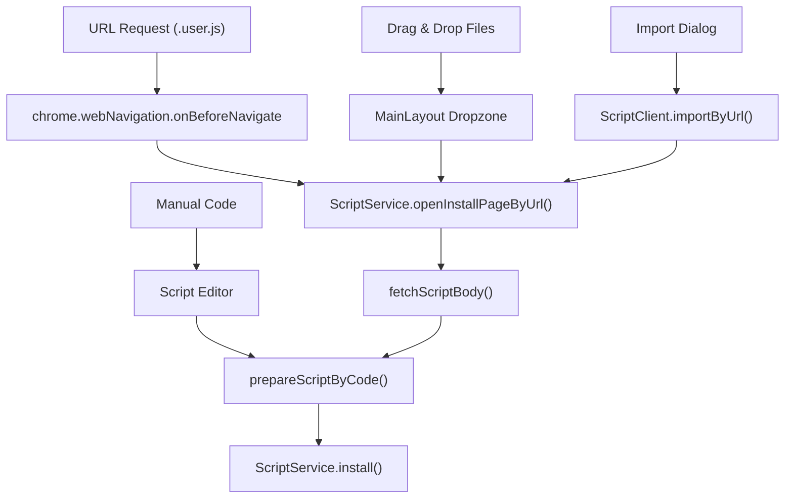
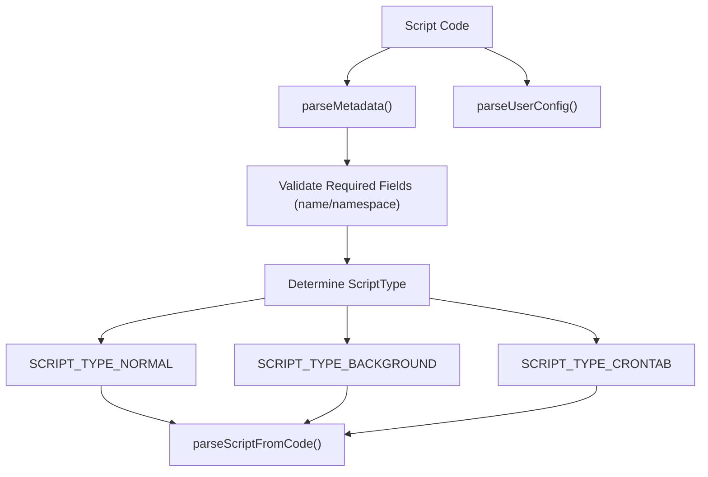
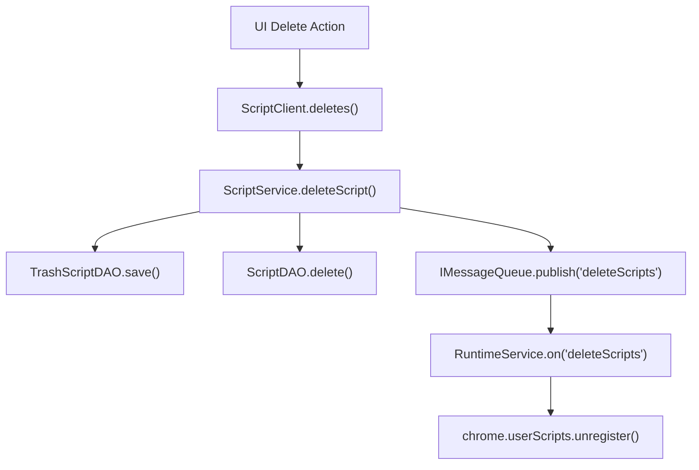

# Script Installation and Lifecycle

Relevant source files

The following files were used as context for generating this wiki page:

- [src/app/service/queue.ts](../src/app/service/queue.ts)
- [src/app/service/service_worker/client.ts](../src/app/service/service_worker/client.ts)
- [src/app/service/service_worker/index.ts](../src/app/service/service_worker/index.ts)
- [src/app/service/service_worker/popup.ts](../src/app/service/service_worker/popup.ts)
- [src/app/service/service_worker/runtime.ts](../src/app/service/service_worker/runtime.ts)
- [src/app/service/service_worker/script.ts](../src/app/service/service_worker/script.ts)
- [src/app/service/service_worker/subscribe.ts](../src/app/service/service_worker/subscribe.ts)
- [src/app/service/service_worker/synchronize.test.ts](../src/app/service/service_worker/synchronize.test.ts)
- [src/app/service/service_worker/synchronize.ts](../src/app/service/service_worker/synchronize.ts)
- [src/app/service/service_worker/system.ts](../src/app/service/service_worker/system.ts)
- [src/locales/de-DE/install.json](../src/locales/de-DE/install.json)
- [src/locales/en-US/install.json](../src/locales/en-US/install.json)
- [src/locales/ja-JP/install.json](../src/locales/ja-JP/install.json)
- [src/locales/ru-RU/install.json](../src/locales/ru-RU/install.json)
- [src/locales/vi-VN/install.json](../src/locales/vi-VN/install.json)
- [src/locales/zh-CN/install.json](../src/locales/zh-CN/install.json)
- [src/locales/zh-TW/install.json](../src/locales/zh-TW/install.json)
- [src/pages/batchupdate/App.tsx](../src/pages/batchupdate/App.tsx)
- [src/pages/install/App.test.tsx](../src/pages/install/App.test.tsx)
- [src/pages/install/App.tsx](../src/pages/install/App.tsx)
- [src/pages/install/useInstallData.test.ts](../src/pages/install/useInstallData.test.ts)
- [src/pages/install/useInstallData.ts](../src/pages/install/useInstallData.ts)
- [src/pages/store/features/script.ts](../src/pages/store/features/script.ts)
- [src/pkg/utils/script.ts](../src/pkg/utils/script.ts)

This document covers how userscripts are installed, updated, enabled/disabled, and removed in ScriptCat. It explains the complete lifecycle from script source detection through installation confirmation, registration with the browser's `userScripts` API, and ongoing lifecycle management via `ScriptService` and `RuntimeService`.

## Script Installation Sources

ScriptCat supports multiple installation methods that feed into a common installation pipeline. The extension intercepts script requests and handles local file imports.

### Installation Methods

| Method | Entry Point | Handler | Description |
|--------|-------------|---------|-------------|
| URL Installation | `ScriptService.listenerScriptInstall()` | Web Navigation listener | Intercepts `.user.js` requests and redirects to install page |
| Drag & Drop | `MainLayout` dropzone | React dropzone handler | Handles local file drag & drop into the dashboard |
| Import by URL | `ScriptClient.importByUrl()` | `ScriptService.importByUrl()` | Fetches script body from URL and prepares for installation |
| Manual Install | Script Editor | `prepareScriptByCode()` | Direct code input in the built-in editor |
| Subscription | `SubscribeService` | Automated installation | Script updates via the subscription system |

**Script Installation Interception**
The `ScriptService` sets up listeners for `chrome.webNavigation.onBeforeNavigate` to catch script URLs. It specifically targets patterns like `file:///*.user.js` or URLs containing `url=` hashes common in userscript repositories.
Sources: [src/app/service/service_worker/script.ts:106-134](../src/app/service/service_worker/script.ts#L106-L134), [src/app/service/service_worker/script.ts:138-140](../src/app/service/service_worker/script.ts#L138-L140)

### Code Entity Flow: Installation Interception
The following diagram maps the network interception logic to the code entities in `ScriptService`.

Sources: [src/app/service/service_worker/script.ts:138-140](../src/app/service/service_worker/script.ts#L138-L140), [src/pkg/utils/script.ts:56-60](../src/pkg/utils/script.ts#L56-L60), [src/pkg/utils/script.ts:173-183](../src/pkg/utils/script.ts#L173-L183), [src/app/service/service_worker/script.ts:61-68](../src/app/service/service_worker/script.ts#L61-L68)

## Script Preparation and Validation

Before a script is committed to storage, it is parsed to extract metadata and determine its execution type.

### Metadata Parsing Flow
The `parseMetadata` function extracts standard `==UserScript==` blocks and ScriptCat-specific blocks like `==UserSubscribe==` using regex patterns `HEADER_BLOCK` and `META_LINE`.
Sources: [src/pkg/utils/script.ts:21-47](../src/pkg/utils/script.ts#L21-L47), [src/pkg/utils/yaml.ts:17-18](../src/pkg/utils/yaml.ts#L17-L18)

Sources: [src/pkg/utils/script.ts:108-132](../src/pkg/utils/script.ts#L108-L132), [src/pkg/utils/script.ts:149-170](../src/pkg/utils/script.ts#L149-L170)

### Script Types and Characteristics

| Script Type | Metadata Trigger | Execution Environment |
|-------------|------------------|-----------------------|
| `SCRIPT_TYPE_NORMAL` | Default | Browser Tabs (Content/Inject) |
| `SCRIPT_TYPE_BACKGROUND` | `@background` | Offscreen Document |
| `SCRIPT_TYPE_CRONTAB` | `@crontab` | Offscreen Document (Scheduled) |

Sources: [src/pkg/utils/script.ts:122-132](../src/pkg/utils/script.ts#L122-L132)

## Script Registration and Runtime Integration

Once a script is saved via `ScriptDAO`, it must be registered with the browser's runtime to begin execution.

### Registration Flow
ScriptCat utilizes the Manifest V3 `chrome.userScripts` API for injecting scripts into web pages. The `RuntimeService` manages the state of these registrations, matching URLs via `UrlMatch`.
Sources: [src/app/service/service_worker/runtime.ts:131-133](../src/app/service/service_worker/runtime.ts#L131-L133), [src/app/service/service_worker/runtime.ts:156-157](../src/app/service/service_worker/runtime.ts#L156-L157)

### Chrome userScripts Availability
ScriptCat checks if the browser supports the `userScripts` API. In `RuntimeService`, `isUserScriptsAvailable` tracks this state, which is crucial for determining if scripts can be registered.
Sources: [src/app/service/service_worker/runtime.ts:156-157](../src/app/service/service_worker/runtime.ts#L156-L157), [src/app/service/service_worker/runtime.ts:185-188](../src/app/service/service_worker/runtime.ts#L185-L188)

## Update Lifecycle

ScriptCat manages updates through a background polling system and manual triggers.

### Update Checking Mechanism
Updates are managed by the `ScriptUpdateCheck` class, initialized within `ScriptService`.
Sources: [src/app/service/service_worker/script.ts:87](../src/app/service/service_worker/script.ts#L87), [src/app/service/service_worker/script.ts:101](../src/app/service/service_worker/script.ts#L101)

1.  **Regular Checks**: `initRegularUpdateCheck` and `watchRegularUpdateCheck` schedule update checks based on system alarms.
    Sources: [src/app/service/service_worker/regular_updatecheck.ts:47](../src/app/service/service_worker/regular_updatecheck.ts#L47)
2.  **Similarity Scoring**: `getSimilarityScore` (using Levenshtein distance) helps detect significant code changes during the update check process.
    Sources: [src/app/service/service_worker/script_update_check.ts:44](../src/app/service/service_worker/script_update_check.ts#L44)

### Silent and Batch Updates
If a script update meets criteria (e.g., version increment without drastic metadata changes), it may be eligible for a silent update.
Sources: [src/pkg/utils/utils.ts:147-158](../src/pkg/utils/utils.ts#L147-L158)

| Feature | Description | Code Reference |
|---------|-------------|----------------|
| Silent Update | Updates script without user intervention if specific conditions are met. | `checkSilenceUpdate` |
| Batch Update | Presents a list of available updates for bulk action. | `BatchUpdateListActionCode` |
| Update Status | Tracking the state of a script update (e.g., checking, downloading). | `UpdateStatusCode` |

Sources: [src/pkg/utils/utils.ts:147-158](../src/pkg/utils/utils.ts#L147-L158), [src/app/service/service_worker/types.ts:39-43](../src/app/service/service_worker/types.ts#L39-L43)

## Script Deletion and Trash System

ScriptCat implements a safety mechanism where deleted scripts are moved to a trash system before permanent removal.

### Deletion and Recovery Process
1.  **Move to Trash**: When `ScriptService.deletes()` is called, scripts are moved to `TrashScriptDAO`.
2.  **Restore**: `ScriptService.restores()` moves scripts from trash back to the active `ScriptDAO`.
3.  **Purge**: `ScriptService.purges()` permanently removes script data and source code.
Sources: [src/app/service/service_worker/script.ts:85](../src/app/service/service_worker/script.ts#L85), [src/app/service/service_worker/script.ts:63-73](../src/app/service/service_worker/script.ts#L63-L73) (via `ScriptClient`)

### Code Entity Flow: Deletion and Cleanup
The following diagram illustrates how `ScriptService` coordinates with DAOs and the message queue during deletion.

Sources: [src/app/service/service_worker/script.ts:85](../src/app/service/service_worker/script.ts#L85), [src/app/service/service_worker/runtime.ts:10-11](../src/app/service/service_worker/runtime.ts#L10-L11), [src/app/service/service_worker/client.ts:63-65](../src/app/service/service_worker/client.ts#L63-L65)

## Batch Update Page
The Batch Update page (`src/pages/batchupdate/App.tsx`) provides a unified interface for managing multiple script updates. It uses `requestBatchUpdateListAction` to communicate with the `ScriptService` to perform actions like "Update All" or "Ignore All".
Sources: [src/pages/store/features/script.ts:71-73](../src/pages/store/features/script.ts#L71-L73), [src/app/service/service_worker/client.ts:161-163](../src/app/service/service_worker/client.ts#L161-L163)

---
