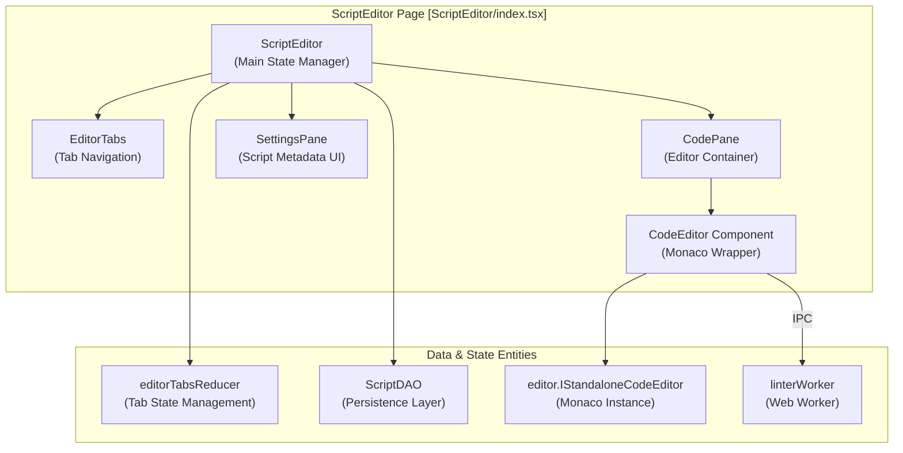

# Script Editor and Development

Relevant source files

The following files were used as context for generating this wiki page:

- [docs/references/terminology-zh-CN.md](../docs/references/terminology-zh-CN.md)
- [packages/eslint/compat-grant.js](../packages/eslint/compat-grant.js)
- [packages/eslint/compat-headers.js](../packages/eslint/compat-headers.js)
- [packages/eslint/linter-config.ts](../packages/eslint/linter-config.ts)
- [src/linter.worker.ts](../src/linter.worker.ts)
- [src/locales/de-DE/editor.json](../src/locales/de-DE/editor.json)
- [src/locales/en-US/editor.json](../src/locales/en-US/editor.json)
- [src/locales/ja-JP/editor.json](../src/locales/ja-JP/editor.json)
- [src/locales/ko-KR/editor.json](../src/locales/ko-KR/editor.json)
- [src/locales/pt-BR/editor.json](../src/locales/pt-BR/editor.json)
- [src/locales/ru-RU/editor.json](../src/locales/ru-RU/editor.json)
- [src/locales/tr-TR/editor.json](../src/locales/tr-TR/editor.json)
- [src/locales/vi-VN/editor.json](../src/locales/vi-VN/editor.json)
- [src/locales/zh-CN/editor.json](../src/locales/zh-CN/editor.json)
- [src/locales/zh-TW/editor.json](../src/locales/zh-TW/editor.json)
- [src/pages/components/CodeEditor/index.tsx](../src/pages/components/CodeEditor/index.tsx)
- [src/pages/options/routes/ScriptEditor/EditorTabs.test.tsx](../src/pages/options/routes/ScriptEditor/EditorTabs.test.tsx)
- [src/pages/options/routes/ScriptEditor/EditorTabs.tsx](../src/pages/options/routes/ScriptEditor/EditorTabs.tsx)
- [src/pages/options/routes/ScriptEditor/EditorToolbar.test.tsx](../src/pages/options/routes/ScriptEditor/EditorToolbar.test.tsx)
- [src/pages/options/routes/ScriptEditor/MobileEditor.test.tsx](../src/pages/options/routes/ScriptEditor/MobileEditor.test.tsx)
- [src/pages/options/routes/ScriptEditor/index.tsx](../src/pages/options/routes/ScriptEditor/index.tsx)
- [src/pages/options/routes/ScriptEditor/tabs/SettingsPane.test.tsx](../src/pages/options/routes/ScriptEditor/tabs/SettingsPane.test.tsx)
- [src/pages/options/routes/ScriptEditor/tabs/SettingsPane.tsx](../src/pages/options/routes/ScriptEditor/tabs/SettingsPane.tsx)
- [src/pages/options/routes/ScriptEditor/tabs/StoragePane.test.tsx](../src/pages/options/routes/ScriptEditor/tabs/StoragePane.test.tsx)
- [src/pkg/utils/monaco-editor/eslintFixCache.test.ts](../src/pkg/utils/monaco-editor/eslintFixCache.test.ts)
- [src/pkg/utils/monaco-editor/eslintFixCache.ts](../src/pkg/utils/monaco-editor/eslintFixCache.ts)
- [src/pkg/utils/monaco-editor/index.ts](../src/pkg/utils/monaco-editor/index.ts)
- [src/pkg/utils/monaco-editor/metadata.test.ts](../src/pkg/utils/monaco-editor/metadata.test.ts)
- [src/pkg/utils/monaco-editor/metadata.ts](../src/pkg/utils/monaco-editor/metadata.ts)
- [src/template/background.tpl](../src/template/background.tpl)
- [src/template/crontab.tpl](../src/template/crontab.tpl)
- [src/template/normal.tpl](../src/template/normal.tpl)
- [src/types/eslint-linter-browserify.d.ts](../src/types/eslint-linter-browserify.d.ts)

This page documents the **ScriptEditor** component and its supporting infrastructure for creating, editing, and managing userscripts. The editor provides a Monaco-based code editing environment with syntax highlighting, metadata parsing, template generation, and ESLint integration.

## Overview

The ScriptEditor is a full-featured IDE-like component that enables developers to write and manage userscripts within the browser extension. It supports multiple simultaneous editing sessions through a tabbed interface, provides script templates for different execution contexts, and integrates with auxiliary tools for managing script storage, resources, and settings.

**Sources:** [src/pages/options/routes/ScriptEditor/index.tsx:48-340](../src/pages/options/routes/ScriptEditor/index.tsx#L48-L340)

## Component Architecture

The ScriptEditor follows a complex state management pattern using `useReducer` to handle multiple tabs and editor instances.

### Editor Component Hierarchy

**Sources:** [src/pages/options/routes/ScriptEditor/index.tsx:56-72](../src/pages/options/routes/ScriptEditor/index.tsx#L56-L72), [src/pages/options/routes/ScriptEditor/index.tsx:24-34](../src/pages/options/routes/ScriptEditor/index.tsx#L24-L34), [src/pages/components/CodeEditor/index.tsx:47-48](../src/pages/components/CodeEditor/index.tsx#L47-L48)

The `ScriptEditor` maintains state via `editorTabsReducer`:
- `tabs`: An array of `EditorTab` objects containing the script metadata, current source code, and a dirty flag (`isChanged`) [src/pages/options/routes/ScriptEditor/useEditorTabs.ts:1-20](../src/pages/options/routes/ScriptEditor/useEditorTabs.ts#L1-L20).
- `activeUuid`: The UUID of the script currently being edited [src/pages/options/routes/ScriptEditor/index.tsx:153-154](../src/pages/options/routes/ScriptEditor/index.tsx#L153-L154).

## Monaco Editor Integration

ScriptCat integrates the Monaco Editor via a custom `CodeEditor` component. It supports standard JavaScript syntax highlighting and provides specific features for userscript development.

### Editor Configuration and Themes
The `CodeEditor` component initializes Monaco with specific options for performance and usability:
- **Options**: Enables `bracketPairColorization`, `automaticLayout`, and `parameterHints` [src/pages/components/CodeEditor/index.tsx:100-161](../src/pages/components/CodeEditor/index.tsx#L100-L161).
- **Themes**: Resolves the extension's light/dark theme to Monaco-compatible themes via `resolveMonacoTheme` [src/pages/components/CodeEditor/index.tsx:163-163](../src/pages/components/CodeEditor/index.tsx#L163-L163).
- **Multi-Instance**: Uses a `ref` to manage multiple editor instances across tabs, allowing the main component to focus or retrieve code from specific editors [src/pages/options/routes/ScriptEditor/index.tsx:72-72](../src/pages/options/routes/ScriptEditor/index.tsx#L72-L72).

### ESLint and Linting
The editor includes an ESLint-based linter specifically configured for userscripts, running in a Web Worker to ensure UI responsiveness.

| Component | Responsibility | File Reference |
|-----------|----------------|----------------|
| `LinterWorkerController` | Static controller for communicating with the ESLint worker | [src/pkg/utils/monaco-editor/index.ts:87-108](../src/pkg/utils/monaco-editor/index.ts#L87-L108) |
| `linter.worker.ts` | The background worker that runs the `eslint-linter-browserify` | [src/linter.worker.ts:1-6](../src/linter.worker.ts#L1-L6) |
| `linter-config.ts` | Defines the ESLint ruleset, including `eslint-plugin-userscripts` | [packages/eslint/linter-config.ts:1-84](../packages/eslint/linter-config.ts#L1-L84) |

The worker maps ESLint severity to Monaco `MarkerSeverity` (Warning=4, Error=8) and returns `markers` containing line/column data and suggested fixes [src/linter.worker.ts:16-19](../src/linter.worker.ts#L16-L19), [src/linter.worker.ts:62-91](../src/linter.worker.ts#L62-L91).

**Sources:** [src/pages/components/CodeEditor/index.tsx:5-6](../src/pages/components/CodeEditor/index.tsx#L5-L6), [src/pkg/utils/monaco-editor/index.ts:112-120](../src/pkg/utils/monaco-editor/index.ts#L112-L120)

## Metadata Parsing and Intelligence

ScriptCat provides intelligent features for the `==UserScript==` metadata block, including documentation tooltips and auto-alignment.

### Metadata Tooltips and Localization
The editor provides localized descriptions for Userscript header tags. These are loaded dynamically based on the user's language setting.

| Feature | Description | Source |
|-----|------------------------------|--------|
| **Tag Prompts** | Localized tooltips for tags like `@match`, `@grant`, and `@crontab` | [src/pkg/utils/monaco-editor/index.ts:61-69](../src/pkg/utils/monaco-editor/index.ts#L61-L69) |
| **Grant Prompts** | Specialized tooltips explaining specific GM/CAT APIs | [src/pkg/utils/monaco-editor/index.ts:149-172](../src/pkg/utils/monaco-editor/index.ts#L149-L172) |
| **Quick Fixes** | Automatic alignment of metadata attributes and removal of wildcards | [src/pkg/utils/monaco-editor/index.ts:112-119](../src/pkg/utils/monaco-editor/index.ts#L112-L119) |

### Metadata Alignment
ScriptCat implements a custom rule `scriptcat/align-metadata-attributes` to ensure metadata blocks are readable. It calculates the target column for alignment and provides a `CodeAction` to fix spacing [src/pkg/utils/monaco-editor/index.ts:114-114](../src/pkg/utils/monaco-editor/index.ts#L114-L114), [src/pkg/utils/monaco-editor/metadata.ts:1-20](../src/pkg/utils/monaco-editor/metadata.ts#L1-L20).

**Sources:** [src/pkg/utils/monaco-editor/index.ts:74-85](../src/pkg/utils/monaco-editor/index.ts#L74-L85), [packages/eslint/compat-headers.js:5-22](../packages/eslint/compat-headers.js#L5-L22)

## Script Templates

The editor provides pre-defined templates to bootstrap development based on the desired script type.

| Template | File | Key Metadata / Structure |
|----------|------|--------------|
| **Normal** | [src/template/normal.tpl:1-17](../src/template/normal.tpl#L1-L17) | Standard `@match` and IIFE wrapper |
| **Crontab** | [src/template/crontab.tpl:1-14](../src/template/crontab.tpl#L1-L14) | `@crontab` tag and Promise-based structure |
| **Background** | [src/template/background.tpl:1-8](../src/template/background.tpl#L1-L8) | `@background` tag for persistent scripts |

When creating a new script, the `emptyScript` loader populates these templates with context-aware defaults, such as the current page URL for the `@match` tag [src/pages/options/routes/ScriptEditor/editorScriptLoaders.ts:1-30](../src/pages/options/routes/ScriptEditor/editorScriptLoaders.ts#L1-L30).

**Sources:** [src/pages/options/routes/ScriptEditor/index.tsx:125-126](../src/pages/options/routes/ScriptEditor/index.tsx#L125-L126)

## Development Features

### SettingsPane
The `SettingsPane` component allows developers to manage script metadata and permissions through a GUI rather than editing the code block directly.

- **Execution Settings**: Configure `@run-at` (e.g., `document-start`, `early-start`) and `@run-in` environments [src/pages/options/routes/ScriptEditor/tabs/SettingsPane.tsx:30-39](../src/pages/options/routes/ScriptEditor/tabs/SettingsPane.tsx#L30-L39).
- **Permission Management**: Add/remove CORS and Cookie permissions [src/pages/options/routes/ScriptEditor/tabs/SettingsPane.tsx:40-41](../src/pages/options/routes/ScriptEditor/tabs/SettingsPane.tsx#L40-L41).
- **Bulk Editing**: Support for pasting multiple match patterns or permissions at once [src/pages/options/routes/ScriptEditor/tabs/SettingsPane.tsx:69-90](../src/pages/options/routes/ScriptEditor/tabs/SettingsPane.tsx#L69-L90).

### File Watching and Local Development
The editor supports a "Watch File" mode where it monitors a local file for changes and automatically updates the script in the extension [src/locales/en-US/editor.json:109-111](../src/locales/en-US/editor.json#L109-L111). This is intended for developers using external IDEs like VS Code while testing in the browser.

### Unsaved Changes Protection
The editor implements safety mechanisms to prevent data loss:
- **Navigation Blocker**: Uses `useBlocker` from `react-router-dom` to intercept navigation if any tab has `isChanged: true` [src/pages/options/routes/ScriptEditor/index.tsx:172-184](../src/pages/options/routes/ScriptEditor/index.tsx#L172-L184).
- **Close Confirmation**: A dialog appears if the user tries to close a modified tab or the entire editor [src/pages/options/routes/ScriptEditor/index.tsx:210-230](../src/pages/options/routes/ScriptEditor/index.tsx#L210-L230).

**Sources:** [src/pages/options/routes/ScriptEditor/index.tsx:108-130](../src/pages/options/routes/ScriptEditor/index.tsx#L108-L130), [src/pages/options/routes/ScriptEditor/tabs/SettingsPane.tsx:154-180](../src/pages/options/routes/ScriptEditor/tabs/SettingsPane.tsx#L154-L180)

---
