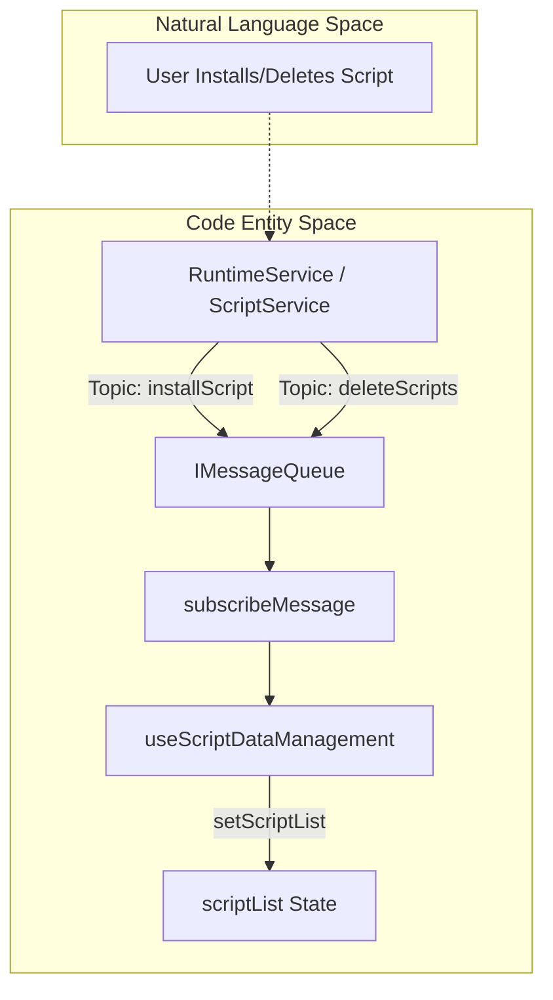
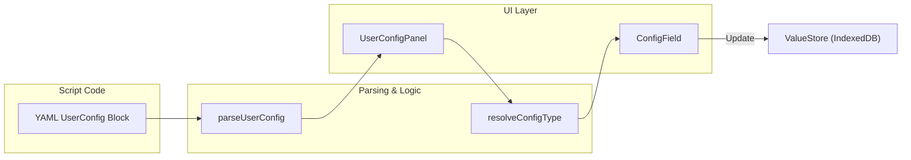

# Script Lists and Organization

Relevant source files

The following files were used as context for generating this wiki page:

- [example/userconfig.js](../example/userconfig.js)
- [src/app/repo/scripts.ts](../src/app/repo/scripts.ts)
- [src/pages/components/UserConfigPanel/index.tsx](../src/pages/components/UserConfigPanel/index.tsx)
- [src/pages/options/routes/ScriptList/ScriptCard.tsx](../src/pages/options/routes/ScriptList/ScriptCard.tsx)
- [src/pages/options/routes/ScriptList/ScriptTable.tsx](../src/pages/options/routes/ScriptList/ScriptTable.tsx)
- [src/pages/options/routes/ScriptList/components.tsx](../src/pages/options/routes/ScriptList/components.tsx)
- [src/pages/options/routes/ScriptList/index.tsx](../src/pages/options/routes/ScriptList/index.tsx)
- [src/pkg/utils/script.test.ts](../src/pkg/utils/script.test.ts)
- [src/pkg/utils/yaml.ts](../src/pkg/utils/yaml.ts)

This document describes the user interface components and functionality for displaying, searching, filtering, sorting, and organizing scripts within ScriptCat. It covers the main script list UI, its dual view modes (Table and Card), the sidebar filtering system, and the underlying data management hooks.

## Overview

The Script List is the central hub for managing installed scripts. It provides a highly customizable interface for organizing scripts based on their status, type, and origin. Following a migration to **React 19** and **shadcn/ui + Tailwind CSS v4**, the interface is optimized for both desktop and mobile contexts.

Key features include:
*   **View Modes**: Toggle between a data-dense `ScriptTable` and a visual `ScriptCard` layout [src/pages/options/routes/ScriptList/index.tsx:70-75](../src/pages/options/routes/ScriptList/index.tsx#L70-L75).
*   **Filtering & Sorting**: Advanced sidebar filters for status, type, tags, and source via the `useScriptFilters` hook [src/pages/options/routes/ScriptList/hooks.ts:33](../src/pages/options/routes/ScriptList/hooks.ts#L33).
*   **Search**: Multi-mode search supporting name and code-level filtering [src/pages/options/routes/ScriptList/SearchFilter.ts:32](../src/pages/options/routes/ScriptList/SearchFilter.ts#L32).
*   **Organization**: Manual drag-and-drop reordering for custom script execution priority using `@dnd-kit` [src/pages/options/routes/ScriptList/ScriptTable.tsx:5-15](../src/pages/options/routes/ScriptList/ScriptTable.tsx#L5-L15).
*   **Batch Operations**: Utilities for enabling, disabling, exporting, and deleting multiple scripts [src/pages/options/routes/ScriptList/BatchActionsBar.tsx:60-63](../src/pages/options/routes/ScriptList/BatchActionsBar.tsx#L60-L63).
*   **Trash System**: A specialized view for managing and restoring deleted scripts [src/pages/options/routes/ScriptList/TrashTable.tsx:39](../src/pages/options/routes/ScriptList/TrashTable.tsx#L39).

Sources: [src/pages/options/routes/ScriptList/index.tsx:1-130](../src/pages/options/routes/ScriptList/index.tsx#L1-L130), [src/pages/options/routes/ScriptList/ScriptTable.tsx:1-156](../src/pages/options/routes/ScriptList/ScriptTable.tsx#L1-L156)

## Architecture and Data Flow

The script list follows a reactive pattern where the UI stays in sync with the background service worker via a message subscription system.

### Data Management Hook (`useScriptDataManagement`)
The `useScriptDataManagement` hook serves as the primary data orchestrator. It fetches the initial script list from the `ScriptDAO` and sets up listeners for real-time updates.

**Key Responsibilities:**
1.  **Initialization**: Calls `scriptClient.getAllScripts()` to populate the initial state [src/pages/options/routes/ScriptList/hooks.ts:73](../src/pages/options/routes/ScriptList/hooks.ts#L73).
2.  **Real-time Sync**: Subscribes to `scriptRunStatus`, `installScript`, `deleteScripts`, `enableScripts`, and `sortedScripts` messages to update local state without a full refresh [src/pages/options/routes/ScriptList/hooks.ts:104-199](../src/pages/options/routes/ScriptList/hooks.ts#L104-L199).
3.  **Loading States**: Tracks `loadingList` and individual `enableLoading` flags for asynchronous operations [src/pages/options/routes/ScriptList/hooks.ts:119](../src/pages/options/routes/ScriptList/hooks.ts#L119).

Sources: [src/pages/options/routes/ScriptList/hooks.ts:65-203](../src/pages/options/routes/ScriptList/hooks.ts#L65-L203), [src/pages/store/features/script.ts:18-22](../src/pages/store/features/script.ts#L18-L22)

## View Modes: Table vs. Card

Users can toggle the `viewMode` state, which is persisted via `writeScriptListPreferences` to `localStorage` [src/pages/options/routes/ScriptList/preferences.ts:47-49](../src/pages/options/routes/ScriptList/preferences.ts#L47-L49).

### Script Table (`ScriptTable`)
A dense view optimized for power users.
*   **Draggable Rows**: Implements `@dnd-kit` to allow vertical reordering. Reordering is disabled when a specific column sort is active [src/pages/options/routes/ScriptList/ScriptTable.tsx:55-79](../src/pages/options/routes/ScriptList/ScriptTable.tsx#L55-L79).
*   **Custom Cells**: Includes specialized renderers like `EnableSwitch`, `RunStatusBadge`, and `UpdateTimeCell` [src/pages/options/routes/ScriptList/components.tsx:48-213](../src/pages/options/routes/ScriptList/components.tsx#L48-L213).
*   **Sortable Headers**: Clicking headers like "Name" or "Update Time" triggers `handleSort`, which updates the `SortState` [src/pages/options/routes/ScriptList/ScriptTable.tsx:87-128](../src/pages/options/routes/ScriptList/ScriptTable.tsx#L87-L128).

### Script Card (`ScriptCard`)
A visual grid layout.
*   **Layout**: Uses `ScriptCardGrid` to render scripts as interactive cards [src/pages/options/routes/ScriptList/ScriptCard.tsx:51-58](../src/pages/options/routes/ScriptList/ScriptCard.tsx#L51-L58).
*   **Responsive**: Automatically switches to `ScriptListMobile` on small screens [src/pages/options/routes/ScriptList/index.tsx:120](../src/pages/options/routes/ScriptList/index.tsx#L120).

Sources: [src/pages/options/routes/ScriptList/ScriptTable.tsx:157-208](../src/pages/options/routes/ScriptList/ScriptTable.tsx#L157-L208), [src/pages/options/routes/ScriptList/ScriptCard.tsx:24-61](../src/pages/options/routes/ScriptList/ScriptCard.tsx#L24-L61), [src/pages/options/routes/ScriptList/components.tsx:1-213](../src/pages/options/routes/ScriptList/components.tsx#L1-L213)

## Filtering and Search

### Sidebar Filtering
The `useScriptFilters` hook calculates `stats` (counts) and filters the master list based on `selectedFilters` [src/pages/options/routes/ScriptList/hooks.ts:208-250](../src/pages/options/routes/ScriptList/hooks.ts#L208-L250).

| Filter Category | Implementation |
| :--- | :--- |
| **Status** | Filters by `SCRIPT_STATUS_ENABLE` or `DISABLE` [src/app/repo/scripts.ts:16-17](../src/app/repo/scripts.ts#L16-L17) |
| **Type** | Filters by `NORMAL`, `CRONTAB`, or `BACKGROUND` [src/app/repo/scripts.ts:10-12](../src/app/repo/scripts.ts#L10-L12) |
| **Tags** | Parsed from `@tag` metadata using `parseTags` [src/pages/options/routes/ScriptList/ScriptTable.tsx:18](../src/pages/options/routes/ScriptList/ScriptTable.tsx#L18) |
| **Source** | Differentiates between local scripts and those with a `subscribeUrl` [src/app/repo/scripts.ts:69](../src/app/repo/scripts.ts#L69) |

### Search Functionality
The `SearchFilter` component provides a search input that updates the `searchRequest`.
*   **Keyword Search**: Matches script names and descriptions.
*   **Code Search**: If the search type is set to code, it can perform content-level lookups [src/pages/options/routes/ScriptList/SearchFilter.ts:32](../src/pages/options/routes/ScriptList/SearchFilter.ts#L32).

Sources: [src/pages/options/routes/ScriptList/hooks.ts:208-250](../src/pages/options/routes/ScriptList/hooks.ts#L208-L250), [src/pages/options/routes/ScriptList/SearchFilter.ts:1-50](../src/pages/options/routes/ScriptList/SearchFilter.ts#L1-L50)

## UserConfigPanel: Script Configuration

The `UserConfigPanel` provides a GUI for users to modify script settings defined via the `/* ==UserConfig== */` YAML block in the script metadata [src/pkg/utils/yaml.ts:4-6](../src/pkg/utils/yaml.ts#L4-L6).

### Configuration Schema
The configuration is parsed into a `UserConfig` object, which contains groups of `Config` items [src/app/repo/scripts.ts:28-52](../src/app/repo/scripts.ts#L28-L52).

| Field | Type | Description |
| :--- | :--- | :--- |
| `type` | `ConfigType` | text, checkbox, select, mult-select, number, textarea, switch [src/app/repo/scripts.ts:26](../src/app/repo/scripts.ts#L26) |
| `default` | `any` | The default value if no user value is set. |
| `bind` | `string` | Binds the options of a select to another config key (e.g., `$cookies`) [src/pages/components/UserConfigPanel/index.tsx:187-190](../src/pages/components/UserConfigPanel/index.tsx#L187-L190) |
| `password` | `boolean` | Renders a text input as a password field [src/pages/components/UserConfigPanel/index.tsx:150](../src/pages/components/UserConfigPanel/index.tsx#L150) |

### Implementation Details
*   **Control Inference**: If `type` is missing, `resolveConfigType` infers the control based on `default` or `values` properties [src/pages/components/UserConfigPanel/index.tsx:28-34](../src/pages/components/UserConfigPanel/index.tsx#L28-L34).
*   **Data Persistence**: Changes are saved using `valueClient.setValues`, which synchronizes values across the extension [src/pages/components/UserConfigPanel/index.tsx:20](../src/pages/components/UserConfigPanel/index.tsx#L20) [src/pages/store/features/script.ts:20](../src/pages/store/features/script.ts#L20).
*   **UI Components**: Uses standard shadcn components (`Input`, `Switch`, `Select`, `Tabs`) for a consistent look [src/pages/components/UserConfigPanel/index.tsx:11-19](../src/pages/components/UserConfigPanel/index.tsx#L11-L19).

Sources: [src/pages/components/UserConfigPanel/index.tsx:1-200](../src/pages/components/UserConfigPanel/index.tsx#L1-L200), [src/pkg/utils/yaml.ts:1-54](../src/pkg/utils/yaml.ts#L1-L54), [src/app/repo/scripts.ts:26-55](../src/app/repo/scripts.ts#L26-L55)

## Sorting Logic

Script reordering is handled by `reindexScriptList`. When a user drags a script, the `sort` property of affected scripts is updated to maintain a continuous integer sequence [src/pages/options/routes/ScriptList/sort.ts:42](../src/pages/options/routes/ScriptList/sort.ts#L42).

1.  **Manual Sort**: Uses `arrayMove` from `@dnd-kit` to update the local list [src/pages/options/routes/ScriptList/index.tsx:3](../src/pages/options/routes/ScriptList/index.tsx#L3).
2.  **Persistence**: The new indices are sent to the background via `sortScript` [src/pages/store/features/script.ts:21](../src/pages/store/features/script.ts#L21).
3.  **Automatic Sort**: When a column header is clicked, `sortScriptList` applies a temporary view-only sort (Ascending/Descending) based on keys like `name`, `updatetime`, or `lastruntime` [src/pages/options/routes/ScriptList/sort.ts:60-95](../src/pages/options/routes/ScriptList/sort.ts#L60-L95).

Sources: [src/pages/options/routes/ScriptList/sort.ts:1-100](../src/pages/options/routes/ScriptList/sort.ts#L1-L100), [src/pages/options/routes/ScriptList/index.tsx:150-158](../src/pages/options/routes/ScriptList/index.tsx#L150-L158)

---
