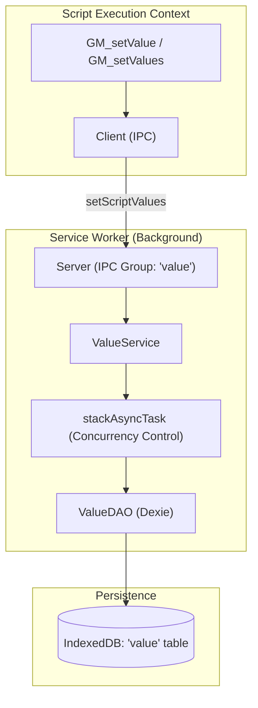
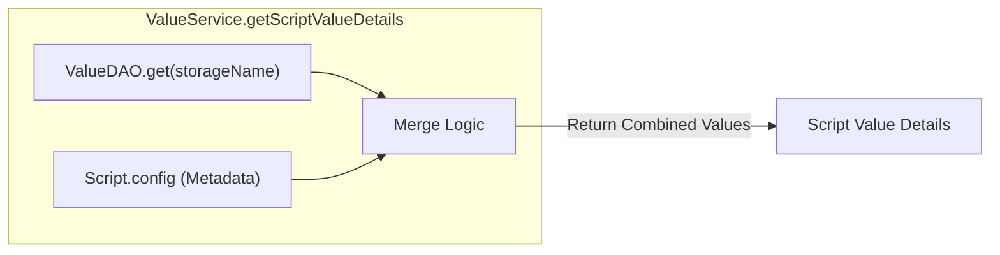

# Script Storage and Values

Relevant source files

The following files were used as context for generating this wiki page:

- [src/app/repo/value.ts](../src/app/repo/value.ts)
- [src/app/service/content/listener_manager.test.ts](../src/app/service/content/listener_manager.test.ts)
- [src/app/service/content/listener_manager.ts](../src/app/service/content/listener_manager.ts)
- [src/app/service/content/types.ts](../src/app/service/content/types.ts)
- [src/app/service/sandbox/runtime.ts](../src/app/service/sandbox/runtime.ts)
- [src/app/service/service_worker/permission_verify.ts](../src/app/service/service_worker/permission_verify.ts)
- [src/app/service/service_worker/value.test.ts](../src/app/service/service_worker/value.test.ts)
- [src/app/service/service_worker/value.ts](../src/app/service/service_worker/value.ts)
- [src/pages/install/components/InstallStates.test.tsx](../src/pages/install/components/InstallStates.test.tsx)
- [src/pages/options/layout/Sidebar.test.tsx](../src/pages/options/layout/Sidebar.test.tsx)
- [src/pages/options/routes/Agent/Tasks/cron.ts](../src/pages/options/routes/Agent/Tasks/cron.ts)
- [src/pkg/utils/async_queue.test.ts](../src/pkg/utils/async_queue.test.ts)
- [src/pkg/utils/async_queue.ts](../src/pkg/utils/async_queue.ts)
- [src/pkg/utils/cron.test.ts](../src/pkg/utils/cron.test.ts)
- [src/pkg/utils/cron.ts](../src/pkg/utils/cron.ts)
- [src/pkg/utils/message_value.test.ts](../src/pkg/utils/message_value.test.ts)
- [src/pkg/utils/message_value.ts](../src/pkg/utils/message_value.ts)

## Purpose and Scope

This document explains ScriptCat's script value storage system, which provides persistent key-value storage for userscripts. It covers the `GM_setValue`/`GM_getValue` API family, value change listeners for reactive programming, cross-tab synchronization mechanisms, and the internal architecture of the `ValueService`.

For information about script metadata and configuration, see **2.2 Script Editor and Development**. For resource caching, see **3.5 Resource and Dependency Management**.

---

## Overview

ScriptCat implements a per-script key-value storage system compatible with Tampermonkey and Greasemonkey. Each script gets an isolated storage namespace identified by its UUID or a custom `@storagename`. The system supports:

- **Dual API styles**: Callback-based (`GM_setValue`) and Promise-based (`GM.setValue`) [src/app/service/service_worker/permission_verify.ts:88-95](../src/app/service/service_worker/permission_verify.ts#L88-L95).
- **Batch operations**: Set/get/delete multiple values in single operations via `GM_setValues` [src/app/service/service_worker/value.ts:84-171](../src/app/service/service_worker/value.ts#L84-L171).
- **Real-time notifications**: Value change listeners with cross-tab support.
- **Type preservation**: Automatic serialization and deserialization for objects, arrays, booleans, and numbers via `REncoded` types [src/pkg/utils/message_value.ts:1-20](../src/pkg/utils/message_value.ts#L1-L20).
- **Persistence Layer**: Built on IndexedDB via `Dexie` with a memory caching layer [src/app/repo/value.ts:11-19](../src/app/repo/value.ts#L11-L19).

Sources: [src/app/service/service_worker/value.ts:27-41](../src/app/service/service_worker/value.ts#L27-L41), [src/app/repo/value.ts:3-9](../src/app/repo/value.ts#L3-L9), [src/pkg/utils/message_value.ts:1-20](../src/pkg/utils/message_value.ts#L1-L20)

---

## GM API for Values

### Basic Operations
The storage API provides symmetric get/set/delete operations. In the Service Worker, these are handled by the `ValueService` [src/app/service/service_worker/value.ts:27-41](../src/app/service/service_worker/value.ts#L27-L41).

- **GM_setValue(name, value)**: Persists a value.
- **GM_getValue(name, defaultValue)**: Retrieves a value or returns the default.
- **GM_deleteValue(name)**: Removes a key from storage.
- **GM_listValues()**: Returns an array of all keys.

### Batch Operations
ScriptCat extends the standard API with batch operations for efficiency, implemented in `ValueService.setValues` [src/app/service/service_worker/value.ts:84-171](../src/app/service/service_worker/value.ts#L84-L171).

- **GM_setValues(values)**: Sets multiple key-value pairs.
- **GM_getValues(keys)**: Retrieves multiple values at once.

**Supported value types**: ScriptCat uses `encodeRValue` and `decodeRValue` to handle serialization, supporting strings, numbers, booleans, objects, arrays, `null`, and `undefined` [src/pkg/utils/message_value.ts:22-55](../src/pkg/utils/message_value.ts#L22-L55).

Sources: [src/app/service/service_worker/value.ts:84-171](../src/app/service/service_worker/value.ts#L84-L171), [src/pkg/utils/message_value.ts:22-55](../src/pkg/utils/message_value.ts#L22-L55)

---

## Storage Architecture

### Data Flow: Script to Database
The system uses a `ValueDAO` which extends the base `Repo` class to interact with IndexedDB [src/app/repo/value.ts:11-19](../src/app/repo/value.ts#L11-L19).

Sources: [src/app/service/service_worker/value.ts:180-181](../src/app/service/service_worker/value.ts#L180-L181), [src/app/repo/value.ts:11-19](../src/app/repo/value.ts#L11-L19), [src/pkg/utils/async_queue.ts:54-76](../src/pkg/utils/async_queue.ts#L54-L76)

### Atomic Updates and Caching
To prevent race conditions when multiple tabs update values simultaneously, ScriptCat uses `stackAsyncTask` [src/pkg/utils/async_queue.ts:54-76](../src/pkg/utils/async_queue.ts#L54-L76). This utility ensures that updates for a specific `storageName` are queued and executed sequentially [src/app/service/service_worker/value.ts:102-159](../src/app/service/service_worker/value.ts#L102-L159).

- **Cache Key**: Built using `CACHE_KEY_SET_VALUE` + `storageName` [src/app/service/service_worker/value.ts:100](../src/app/service/service_worker/value.ts#L100).
- **Change Detection**: Before saving, the service compares the new value with the old value using `decodeRValue`. If no change is detected, the database write and broadcast are skipped [src/app/service/service_worker/value.ts:132-154](../src/app/service/service_worker/value.ts#L132-L154).

Sources: [src/app/service/service_worker/value.ts:100-159](../src/app/service/service_worker/value.ts#L100-L159), [src/pkg/utils/async_queue.ts:54-76](../src/pkg/utils/async_queue.ts#L54-L76)

---

## Value Change Listeners and Synchronization

### Cross-Context Synchronization
When a value is updated, the change is broadcasted to all active instances of the script across all browser tabs and background runtimes [src/app/service/service_worker/value.ts:160-171](../src/app/service/service_worker/value.ts#L160-L171).

1.  **Event Generation**: `ValueService` creates a `ValueUpdateDataEncoded` payload containing `entries` (a list of `[key, newValue, oldValue]`) [src/app/service/content/types.ts:26-33](../src/app/service/content/types.ts#L26-L33).
2.  **Broadcasting**: The `pushValueUpdate` method sends this data to the `RuntimeService` [src/app/service/service_worker/value.ts:79-81](../src/app/service/service_worker/value.ts#L79-L81).
3.  **Local Execution**: Each runtime receives the update and triggers any registered `GM_addValueChangeListener` callbacks.

### Implementation Entities

| Entity | Role | File Pointer |
| :--- | :--- | :--- |
| `ValueUpdateDataREntry` | Tuple format for [key, newValue, oldValue] using encoded types | [src/app/service/content/types.ts:16-16](../src/app/service/content/types.ts#L16-L16) |
| `ValueService.pushValueUpdate` | Forwards value updates to the script runtime | [src/app/service/service_worker/value.ts:79-81](../src/app/service/service_worker/value.ts#L79-L81) |
| `Runtime.execScript` | Manages background script execution and listener lifecycle | [src/app/service/sandbox/runtime.ts:133-198](../src/app/service/sandbox/runtime.ts#L133-L198) |

Sources: [src/app/service/service_worker/value.ts:79-81](../src/app/service/service_worker/value.ts#L79-L81), [src/app/service/content/types.ts:16-33](../src/app/service/content/types.ts#L16-L33), [src/app/service/sandbox/runtime.ts:193-195](../src/app/service/sandbox/runtime.ts#L193-L195)

---

## User Configuration (UserConfig) Integration

Scripts can define structured configuration via the `@UserConfig` metadata. The `ValueService` integrates these definitions with the persistent storage.

- **Merging Logic**: In `getScriptValueDetails`, ScriptCat merges data from `ValueDAO` with default values defined in the script's `config` metadata [src/app/service/service_worker/value.ts:43-73](../src/app/service/service_worker/value.ts#L43-L73).
- **Dynamic Binding**: Supports the `bind` property, which allows a configuration field to read/write to a specific storage key [src/app/service/service_worker/value.ts:63-66](../src/app/service/service_worker/value.ts#L63-L66).
- **Namespace Handling**: Values are often namespaced by `tabKey.key` within the configuration object [src/app/service/service_worker/value.ts:67-68](../src/app/service/service_worker/value.ts#L67-L68).

Sources: [src/app/service/service_worker/value.ts:43-73](../src/app/service/service_worker/value.ts#L43-L73), [src/app/repo/scripts.ts:70-75](../src/app/repo/scripts.ts#L70-L75)

---

## Cleanup and Deletion

When a script is deleted, its associated storage must be managed to prevent data leakage.

- **Trash System Awareness**: The `ValueService` subscribes to the `deleteScripts` message queue [src/app/service/service_worker/value.ts:183-195](../src/app/service/service_worker/value.ts#L183-L195).
- **Conditional Deletion**: It only deletes the `Value` record if no other script (including those in the trash) uses the same `storageName` [src/app/service/service_worker/value.ts:185-190](../src/app/service/service_worker/value.ts#L185-L190).
- **StorageName Resolver**: The `getStorageName` utility ensures that scripts sharing the same `@storagename` metadata are treated as a single storage unit [src/app/service/service_worker/value.ts:187](../src/app/service/service_worker/value.ts#L187).

Sources: [src/app/service/service_worker/value.ts:183-195](../src/app/service/service_worker/value.ts#L183-L195), [src/app/repo/trash_script.ts:1-10](../src/app/repo/trash_script.ts#L1-L10)

---
