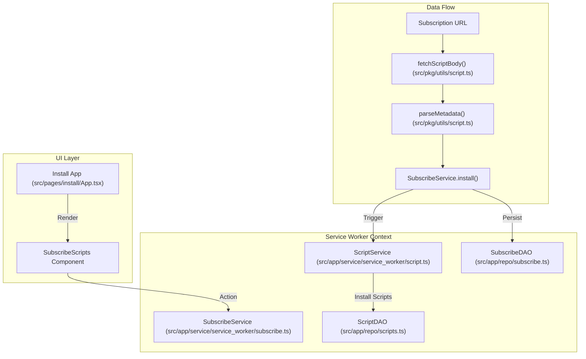
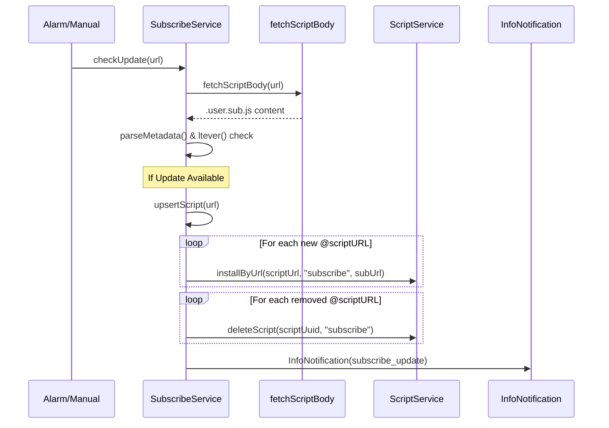

# Script Subscriptions

<details>
<summary>Relevant source files</summary>

The following files were used as context for generating this wiki page:

- [src/app/service/service_worker/subscribe.ts](../src/app/service/service_worker/subscribe.ts)
- [src/app/service/service_worker/synchronize.test.ts](../src/app/service/service_worker/synchronize.test.ts)
- [src/app/service/service_worker/synchronize.ts](../src/app/service/service_worker/synchronize.ts)
- [src/pages/install/App.tsx](../src/pages/install/App.tsx)
- [src/pkg/utils/script.ts](../src/pkg/utils/script.ts)

</details>


## Purpose and Scope

Script Subscriptions enable users to install and manage collections of userscripts through a single subscription file. A subscription is a special `.user.sub.js` file that declares a list of script URLs to be automatically installed and kept synchronized. This system simplifies deployment of related script sets and enables centralized distribution.

The core of this system is the `SubscribeService`, which handles the lifecycle of subscriptions, and the `SubscribeDAO`, which persists subscription metadata.

**Sources:** [src/app/service/service_worker/subscribe.ts:19-33](../src/app/service/service_worker/subscribe.ts#L19-L33), [src/app/repo/subscribe.ts:14-15](../src/app/repo/subscribe.ts#L14-L15)

---

## Subscription File Format

Subscription files use a metadata block similar to userscripts but with distinct delimiters and directives.

### Metadata Structure

```javascript
// ==UserSubscribe==
// @name         [Subscription Name]
// @description  [Subscription Description]
// @version      [Version Number]
// @author       [Author Name]
// @connect      [Domain Permissions]
// @scriptURL    [URL to Script 1]
// @scriptURL    [URL to Script 2]
// ==/UserSubscribe==
```

Key characteristics:
- **Delimiters**: Uses `// ==UserSubscribe==` instead of `// ==UserScript==`. The parser uses the regex `HEADER_BLOCK` to identify these [src/pkg/utils/script.ts:21-34](../src/pkg/utils/script.ts#L21-L34).
- **Directives**: Primary directive is `@scriptURL`, listing scripts to be managed.
- **Parsing**: Handled by `parseMetadata` which detects the `isSubscribe` flag if the header matches the "Subscribe" capture group [src/pkg/utils/script.ts:25-47](../src/pkg/utils/script.ts#L25-L47).

**Sources:** [src/pkg/utils/script.ts:21-47](../src/pkg/utils/script.ts#L21-L47)

---

## Subscription Architecture

### Component Integration

The `SubscribeService` interacts with the `ScriptService` to perform actual script operations and uses the `IMessageQueue` to notify the system of changes.



**Sources:** [src/app/service/service_worker/subscribe.ts:19-33](../src/app/service/service_worker/subscribe.ts#L19-L33), [src/pkg/utils/script.ts:25-47](../src/pkg/utils/script.ts#L25-L47), [src/pkg/utils/script.ts:56-70](../src/pkg/utils/script.ts#L56-L70), [src/pages/install/App.tsx:197-200](../src/pages/install/App.tsx#L197-L200)

---

## Core Implementation Detail

### SubscribeService Logic

The `SubscribeService` is responsible for the heavy lifting of synchronization. When a subscription is updated, it performs a diff between the new metadata and the current state.

| Function | Description |
|----------|-------------|
| `install(param)` | Saves the subscription to `SubscribeDAO` and publishes `installSubscribe` to the `IMessageQueue` [src/app/service/service_worker/subscribe.ts:32-52](../src/app/service/service_worker/subscribe.ts#L32-L52). |
| `delete(param)` | Removes the subscription and identifies all scripts where `script.subscribeUrl === url` to trigger their deletion via `ScriptService.deleteScript` [src/app/service/service_worker/subscribe.ts:54-87](../src/app/service/service_worker/subscribe.ts#L54-L87). |
| `upsertScript(url)` | Compares `@scriptURL` entries. Installs new scripts via `scriptService.installByUrl` and deletes scripts no longer present in the subscription [src/app/service/service_worker/subscribe.ts:91-188](../src/app/service/service_worker/subscribe.ts#L91-L188). |
| `checkUpdate(url)` | Fetches the remote file, compares versions using `ltever`, and triggers an update if a newer version exists [src/app/service/service_worker/subscribe.ts:208-245](../src/app/service/service_worker/subscribe.ts#L208-L245). |

**Sources:** [src/app/service/service_worker/subscribe.ts:32-245](../src/app/service/service_worker/subscribe.ts#L32-L245)

---

## Installation and Update Flow

The installation process is typically initiated by the **Install Page** (`src/pages/install/App.tsx`). When a `.user.sub.js` file is detected, the UI switches to a subscription-specific view.

### Subscription Update Sequence



**Sources:** [src/app/service/service_worker/subscribe.ts:91-188](../src/app/service/service_worker/subscribe.ts#L91-L188), [src/app/service/service_worker/subscribe.ts:208-245](../src/app/service/service_worker/subscribe.ts#L208-L245), [src/pkg/utils/script.ts:56-70](../src/pkg/utils/script.ts#L56-L70), [src/app/service/service_worker/subscribe.ts:144-152](../src/app/service/service_worker/subscribe.ts#L144-L152)

---

## UI Management

Users interact with subscriptions through the installation interface and the options page.

### Install Page Integration
- **Detection**: The `useInstallData` hook determines if the target is a subscription based on metadata parsing [src/pages/install/App.tsx:114-120](../src/pages/install/App.tsx#L114-L120).
- **Component**: `SubscribeScripts` displays the list of scripts contained within the subscription before the user confirms installation [src/pages/install/App.tsx:197-200](../src/pages/install/App.tsx#L197-L200).
- **Visuals**: Subscriptions are identified with the `Rss` icon in the installation header [src/pages/install/App.tsx:134-135](../src/pages/install/App.tsx#L134-L135).

**Sources:** [src/pages/install/App.tsx:114-140](../src/pages/install/App.tsx#L114-L140), [src/pages/install/App.tsx:197-200](../src/pages/install/App.tsx#L197-L200)

---

## Data Model

### Subscribe Entity
The `Subscribe` object (persisted via `SubscribeDAO`) contains:
- `url`: The primary key (source of the subscription).
- `name`: Display name from metadata.
- `scripts`: A map of `url -> {url, uuid}` tracking scripts currently managed by this subscription [src/app/service/service_worker/subscribe.ts:102-115](../src/app/service/service_worker/subscribe.ts#L102-L115).
- `metadata`: The full parsed `SCMetadata` object.
- `status`: `SubscribeStatusType.Enable` or `SubscribeStatusType.Disable`.

**Sources:** [src/app/repo/subscribe.ts:4-15](../src/app/repo/subscribe.ts#L4-L15), [src/app/service/service_worker/subscribe.ts:138-150](../src/app/service/service_worker/subscribe.ts#L138-L150)

### Script Entity Association
Scripts installed via this mechanism have their `subscribeUrl` property set to the URL of the parent subscription. This creates the link necessary for `SubscribeService.delete` to clean up scripts:
- `script.subscribeUrl === url` check during deletion [src/app/service/service_worker/subscribe.ts:68-70](../src/app/service/service_worker/subscribe.ts#L68-L70).
- `scriptService.installByUrl(url, "subscribe", subscribe.url)` sets the association during installation [src/app/service/service_worker/subscribe.ts:144](../src/app/service/service_worker/subscribe.ts#L144).

**Sources:** [src/app/service/service_worker/subscribe.ts:65-77](../src/app/service/service_worker/subscribe.ts#L65-L77), [src/app/service/service_worker/subscribe.ts:144-152](../src/app/service/service_worker/subscribe.ts#L144-L152)

---

## Integration with Global Systems

- **Message Queue**: Subscriptions use the `IMessageQueue` to publish `installSubscribe` events [src/app/service/service_worker/subscribe.ts:44-46](../src/app/service/service_worker/subscribe.ts#L44-L46).
- **Notification System**: Uses `InfoNotification` to alert the user when a subscription update results in new scripts being added or old ones being removed [src/app/service/service_worker/subscribe.ts:193-200](../src/app/service/service_worker/subscribe.ts#L193-L200).
- **I18n**: Subscription names are processed via `i18nName` to support localized metadata [src/app/service/service_worker/subscribe.ts:145](../src/app/service/service_worker/subscribe.ts#L145).
- **Cloud Sync**: Subscription metadata and states are synchronized via the `SynchronizeService`, which handles script and resource persistence across devices [src/app/service/service_worker/synchronize.ts:173-194](../src/app/service/service_worker/synchronize.ts#L173-L194).

**Sources:** [src/app/service/service_worker/subscribe.ts:44-46](../src/app/service/service_worker/subscribe.ts#L44-L46), [src/app/service/service_worker/subscribe.ts:193-200](../src/app/service/service_worker/subscribe.ts#L193-L200), [src/app/service/service_worker/synchronize.ts:173-194](../src/app/service/service_worker/synchronize.ts#L173-L194)

---
