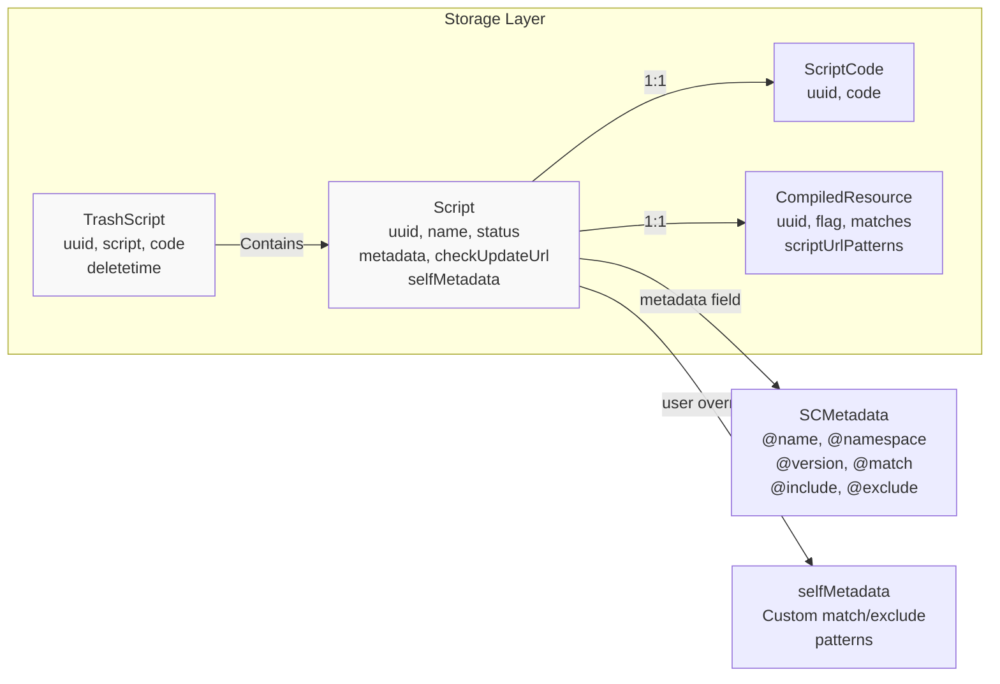
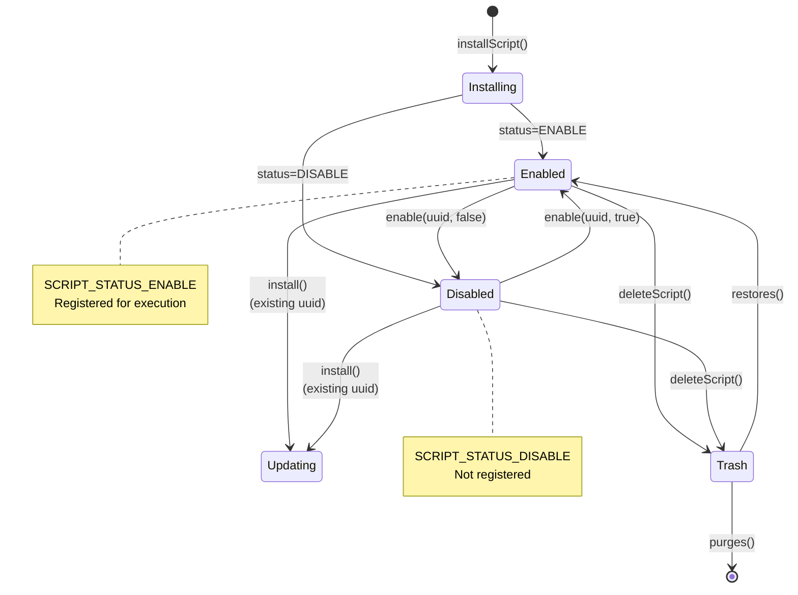
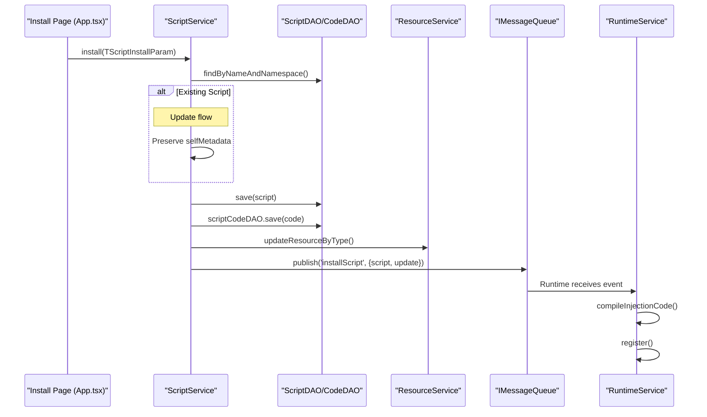
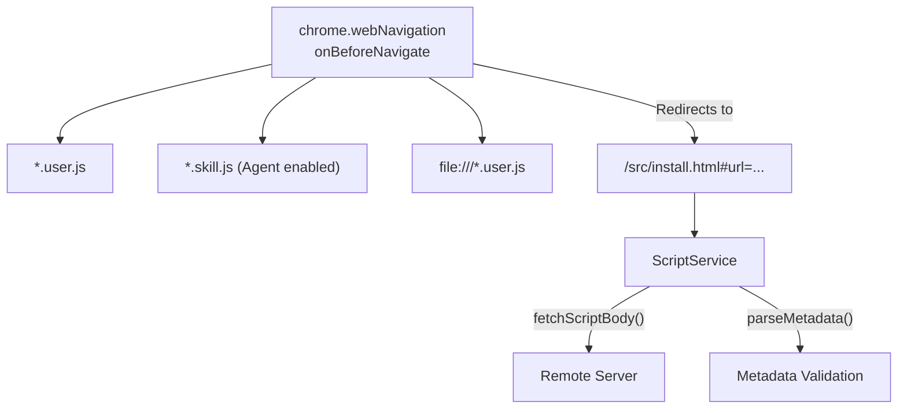
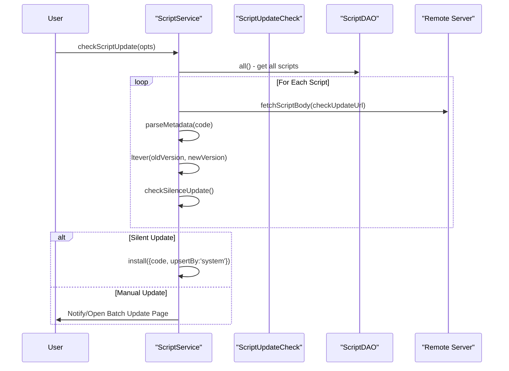

# Script Management

Relevant source files

The following files were used as context for generating this wiki page:

- [src/app/service/queue.ts](../src/app/service/queue.ts)
- [src/app/service/service_worker/client.ts](../src/app/service/service_worker/client.ts)
- [src/app/service/service_worker/index.ts](../src/app/service/service_worker/index.ts)
- [src/app/service/service_worker/popup.ts](../src/app/service/service_worker/popup.ts)
- [src/app/service/service_worker/runtime.ts](../src/app/service/service_worker/runtime.ts)
- [src/app/service/service_worker/script.ts](../src/app/service/service_worker/script.ts)
- [src/app/service/service_worker/subscribe.ts](../src/app/service/service_worker/subscribe.ts)
- [src/app/service/service_worker/synchronize.test.ts](../src/app/service/service_worker/synchronize.test.ts)
- [src/app/service/service_worker/synchronize.ts](../src/app/service/service_worker/synchronize.ts)
- [src/app/service/service_worker/system.ts](../src/app/service/service_worker/system.ts)
- [src/pages/install/App.tsx](../src/pages/install/App.tsx)
- [src/pages/store/features/script.ts](../src/pages/store/features/script.ts)
- [src/pkg/utils/script.ts](../src/pkg/utils/script.ts)

This page documents the core script management system in ScriptCat, covering how userscripts are installed, stored, updated, enabled/disabled, and deleted throughout their lifecycle. The `ScriptService` class orchestrates these operations, coordinating with data access objects and other services to maintain script state.

For information about how scripts are executed after installation, see [Script Execution Environment](./3-script-execution-environment.md). For details about the script editor and development tools, see [Script Editor and Development](./2-2-script-editor-and-development.md). For subscription-based script distribution, see [Script Subscriptions](./2-5-script-subscriptions.md).

## Architecture Overview

**ScriptService Component Relationships**

```mermaid
graph TB
    ScriptService["ScriptService<br/>(script.ts)"]
    ScriptDAO["ScriptDAO<br/>Script metadata"]
    ScriptCodeDAO["ScriptCodeDAO<br/>Script source code"]
    CompiledResourceDAO["CompiledResourceDAO<br/>Compiled resources"]
    TrashScriptDAO["TrashScriptDAO<br/>Deleted scripts"]
    ValueService["ValueService<br/>GM_setValue storage"]
    ResourceService["ResourceService<br/>@require/@resource"]
    RuntimeService["RuntimeService<br/>Execution & registration"]
    MQ["IMessageQueue<br/>Event bus"]
    SystemConfig["SystemConfig<br/>Settings"]
    ScriptUpdateCheck["ScriptUpdateCheck<br/>Update detection"]
    
    ScriptService --> ScriptDAO
    ScriptService --> ScriptCodeDAO
    ScriptService --> CompiledResourceDAO
    ScriptService --> TrashScriptDAO
    ScriptService --> ValueService
    ScriptService --> ResourceService
    ScriptService --> ScriptUpdateCheck
    ScriptService --> SystemConfig
    ScriptService --> MQ
    
    RuntimeService -.->|"listens to events"| MQ
    ScriptService -->|"publishes events"| MQ
    
    style ScriptService fill:#f9f9f9
    style MQ fill:#f0f0f0
```

Sources: [src/app/service/service_worker/script.ts:80-102](../src/app/service/service_worker/script.ts#L80-L102), [src/app/service/service_worker/runtime.ts:191-201](../src/app/service/service_worker/runtime.ts#L191-L201)

The script management system is built around the `ScriptService` class, which coordinates separate DAOs to manage different aspects of scripts:

| DAO | Purpose | Caching |
|-----|---------|---------|
| `ScriptDAO` | Stores script metadata (name, version, status, metadata fields) | Enabled [src/app/service/service_worker/index.ts:95](../src/app/service/service_worker/index.ts#L95) |
| `ScriptCodeDAO` | Stores script source code separately for performance | Enabled [src/app/service/service_worker/script.ts:98](../src/app/service/service_worker/script.ts#L98) |
| `TrashScriptDAO` | Manages deleted scripts for restoration | Enabled [src/app/service/service_worker/script.ts:100](../src/app/service/service_worker/script.ts#L100) |
| `CompiledResourceDAO` | Stores pre-compiled injection code and URL patterns | Not cached [src/app/service/service_worker/script.ts:84](../src/app/service/service_worker/script.ts#L84) |

This separation allows bulk operations on metadata without loading full source code, improving performance for script list operations.

Sources: [src/app/service/service_worker/script.ts:82-86](../src/app/service/service_worker/script.ts#L82-L86), [src/app/service/service_worker/index.ts:94-98](../src/app/service/service_worker/index.ts#L94-L98)

## Script Data Model

**Script Entity Structure**

Sources: [src/app/repo/scripts.ts:6-25](../src/app/repo/scripts.ts#L6-L25), [src/pkg/utils/script.ts:149-169](../src/pkg/utils/script.ts#L149-L169), [src/app/repo/trash_script.ts:1-10](../src/app/repo/trash_script.ts#L1-L10)

The `Script` entity contains two metadata structures:
- **`metadata`**: Parsed from the `==UserScript==` header block, read-only [src/pkg/utils/script.ts:25-47](../src/pkg/utils/script.ts#L25-L47)
- **`selfMetadata`**: User-customizable overrides for `@match`, `@include`, and `@exclude` patterns [src/app/service/service_worker/utils.ts:37-38](../src/app/service/service_worker/utils.ts#L37-L38)

When URL matching occurs, `selfMetadata` takes precedence if defined, allowing users to customize script behavior without editing source code.

Sources: [src/app/service/service_worker/script.ts:147-148](../src/app/service/service_worker/script.ts#L147-L148), [src/app/service/service_worker/utils.ts:37-41](../src/app/service/service_worker/utils.ts#L37-L41)

## Script Lifecycle States

**Script Status Transitions**

Sources: [src/app/service/service_worker/script.ts:22](../src/app/service/service_worker/script.ts#L22), [src/app/service/service_worker/runtime.ts:7](../src/app/service/service_worker/runtime.ts#L7), [src/app/service/service_worker/client.ts:63-73](../src/app/service/service_worker/client.ts#L63-L73)

Scripts maintain a `status` field:
- **`SCRIPT_STATUS_ENABLE` (1)**: Script is active and registered for execution.
- **`SCRIPT_STATUS_DISABLE` (2)**: Script is inactive and unregistered.

The `enable` method updates this status and publishes an `enableScripts` event that `RuntimeService` subscribes to, triggering registration or unregistration with the browser's `chrome.userScripts` API.

Sources: [src/app/repo/scripts.ts:7](../src/app/repo/scripts.ts#L7), [src/app/service/service_worker/runtime.ts:366-396](../src/app/service/service_worker/runtime.ts#L366-L396)

## Installation Flow

**Script Installation Process**

Sources: [src/app/service/service_worker/script.ts:61-74](../src/app/service/service_worker/script.ts#L61-L74), [src/pkg/utils/script.ts:173-183](../src/pkg/utils/script.ts#L173-L183), [src/pages/install/App.tsx:157](../src/pages/install/App.tsx#L157)

The installation process supports multiple entry points:

| Method | Source | Use Case |
|--------|--------|----------|
| `openInstallPageByUrl(url)` | User clicks `.user.js` link | Interactive installation [src/app/service/service_worker/script.ts:138](../src/app/service/service_worker/script.ts#L138) |
| `installByUrl(url)` | Subscription or API | Silent installation from URL [src/app/service/service_worker/script.ts:144](../src/app/service/service_worker/script.ts#L144) |
| `installByCode(uuid, code)` | Editor or DevTools | Direct code installation [src/app/service/service_worker/client.ts:137](../src/app/service/service_worker/client.ts#L137) |

All paths converge at `installScript()`, which handles both new installations and updates. The `update` flag is determined by checking if a script with the same name and namespace exists.

Sources: [src/app/service/service_worker/script.ts:61-74](../src/app/service/service_worker/script.ts#L61-L74), [src/pkg/utils/script.ts:185-193](../src/pkg/utils/script.ts#L185-L193)

### URL-Based Installation Listener

The service worker monitors web navigation using `chrome.webNavigation.onBeforeNavigate` to intercept `.user.js` and `.skill.js` file access:

Sources: [src/app/service/service_worker/script.ts:104-134](../src/app/service/service_worker/script.ts#L104-L134), [src/pkg/utils/script.ts:56-60](../src/pkg/utils/script.ts#L56-L60)

The listener intercepts navigation to script URLs and redirects the user to the internal installation UI (`install.html`), passing the target URL in the hash fragment.

Sources: [src/app/service/service_worker/script.ts:122-134](../src/app/service/service_worker/script.ts#L122-L134)

## Update Management

**Update Check Flow**

Sources: [src/app/service/service_worker/script.ts:101](../src/app/service/service_worker/script.ts#L101), [src/app/service/service_worker/script_update_check.ts](../src/app/service/service_worker/script_update_check.ts), [src/pkg/utils/utils.ts:147-158](../src/pkg/utils/utils.ts#L147-L158)

The update system uses the `ScriptUpdateCheck` class to coordinate version comparisons and silent update eligibility. Silent updates are automatically applied when no new permissions are required and the user has enabled the feature.

Sources: [src/app/service/service_worker/script.ts:101](../src/app/service/service_worker/script.ts#L101), [src/pkg/utils/utils.ts:7-13](../src/pkg/utils/utils.ts#L7-L13)

## Trash and Recovery

ScriptCat includes a "Trash" system to prevent accidental deletion of scripts.

| Action | Logic | Code Pointer |
|--------|-------|--------------|
| **Delete** | Move script and code to `TrashScriptDAO`, then remove from main DB | [src/app/service/service_worker/script.ts:85](../src/app/service/service_worker/script.ts#L85) |
| **Restore** | Move from `TrashScriptDAO` back to `ScriptDAO` | [src/app/service/service_worker/client.ts:68](../src/app/service/service_worker/client.ts#L68) |
| **Purge** | Permanently delete from `TrashScriptDAO` | [src/app/service/service_worker/client.ts:71](../src/app/service/service_worker/client.ts#L71) |

Sources: [src/app/service/service_worker/script.ts:85](../src/app/service/service_worker/script.ts#L85), [src/app/repo/trash_script.ts:1-10](../src/app/repo/trash_script.ts#L1-L10)

## Batch Operations

ScriptService provides batch methods for efficient bulk operations:

**Batch Operation Methods**

| Method | Payload | Description |
|--------|---------|-------------|
| `enables` | `uuids: string[], enable: boolean` | Bulk enable/disable scripts |
| `deletes` | `uuids: string[]` | Bulk move scripts to trash |
| `restores` | `uuids: string[]` | Bulk restore from trash |
| `purges` | `uuids: string[]` | Permanent bulk deletion |
| `pinToTop` | `uuids: string[]` | Move selected scripts to the top of the list |

Sources: [src/app/service/service_worker/client.ts:63-85](../src/app/service/service_worker/client.ts#L63-L85), [src/app/service/service_worker/client.ts:129-131](../src/app/service/service_worker/client.ts#L129-L131)

## Integration Points

ScriptService exposes RPC methods via the Group API for UI components:

**Service Worker RPC Handlers**

| Method | Purpose | Caller |
|--------|---------|--------|
| `getAllScripts()` | Retrieve all scripts for the Options page | `scriptClient.getAllScripts()` |
| `install()` | Main entry point for adding/updating scripts | `InstallActions.onInstall` |
| `updateMetadata()` | Save user-defined overrides (`selfMetadata`) | `UserConfigPanel` |
| `sortScript()` | Persist drag-and-drop order changes | `ScriptList` UI |
| `batchUpdateListAction()` | Process actions from the Batch Update page | `BatchUpdate` UI |

Sources: [src/app/service/service_worker/client.ts:49-51](../src/app/service/service_worker/client.ts#L49-L51), [src/app/service/service_worker/client.ts:146-148](../src/app/service/service_worker/client.ts#L146-L148), [src/app/service/service_worker/client.ts:161-163](../src/app/service/service_worker/client.ts#L161-L163)

---
