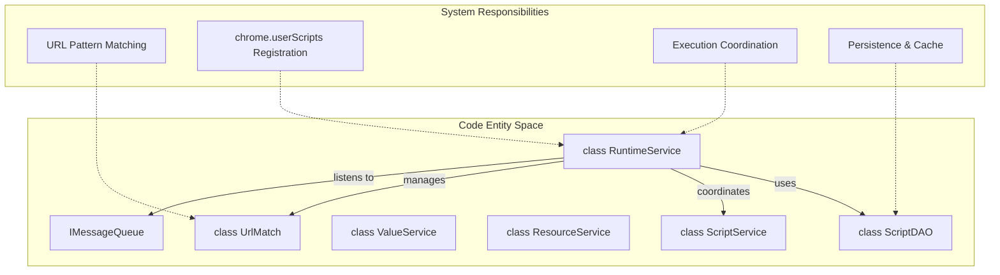
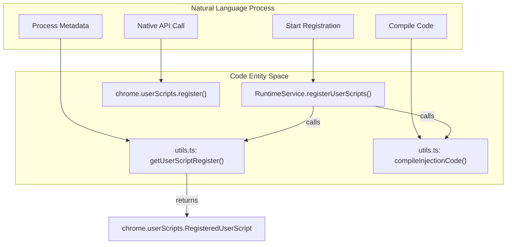
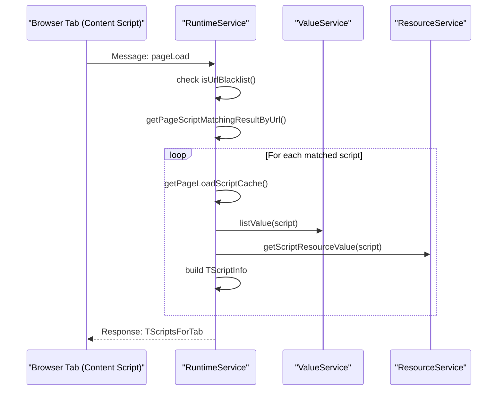

# Service Worker Runtime

Relevant source files

The following files were used as context for generating this wiki page:

- [example/tests/unwrap_e2e_test.js](../example/tests/unwrap_e2e_test.js)
- [src/app/repo/resource.ts](../src/app/repo/resource.ts)
- [src/app/service/queue.ts](../src/app/service/queue.ts)
- [src/app/service/service_worker/client.ts](../src/app/service/service_worker/client.ts)
- [src/app/service/service_worker/index.ts](../src/app/service/service_worker/index.ts)
- [src/app/service/service_worker/popup.ts](../src/app/service/service_worker/popup.ts)
- [src/app/service/service_worker/resource.test.ts](../src/app/service/service_worker/resource.test.ts)
- [src/app/service/service_worker/resource.ts](../src/app/service/service_worker/resource.ts)
- [src/app/service/service_worker/runtime.test.ts](../src/app/service/service_worker/runtime.test.ts)
- [src/app/service/service_worker/runtime.ts](../src/app/service/service_worker/runtime.ts)
- [src/app/service/service_worker/script.ts](../src/app/service/service_worker/script.ts)
- [src/app/service/service_worker/system.ts](../src/app/service/service_worker/system.ts)
- [src/app/service/service_worker/utils.test.ts](../src/app/service/service_worker/utils.test.ts)
- [src/app/service/service_worker/utils.ts](../src/app/service/service_worker/utils.ts)
- [src/pages/store/features/script.ts](../src/pages/store/features/script.ts)
- [src/pkg/utils/concurrency-control.test.ts](../src/pkg/utils/concurrency-control.test.ts)

The Service Worker Runtime system manages the execution lifecycle of user scripts within the ScriptCat browser extension. The `RuntimeService` class serves as the central coordinator for script matching, registration with the `chrome.userScripts` API, and runtime execution coordination across different contexts (content scripts, inject scripts, and the offscreen document).

## Core Architecture and Dependencies

The `RuntimeService` class coordinates multiple subsystems to manage script execution within the browser extension's Manifest V3 architecture. It acts as the primary bridge between persistent storage and active browser tabs.

### RuntimeService Entity Mapping

**Sources:** [src/app/service/service_worker/runtime.ts:131-205](../src/app/service/service_worker/runtime.ts#L131-L205), [src/app/service/service_worker/index.ts:113-124](../src/app/service/service_worker/index.ts#L113-L124)

The `RuntimeService` maintains specialized `UrlMatch` instances for different matching scenarios:
- `scriptMatchEnable`: Standard script URL pattern matching for enabled scripts [src/app/service/service_worker/runtime.ts:132](../src/app/service/service_worker/runtime.ts#L132).
- `blackMatch`: Global blacklist URL patterns that override script matches [src/app/service/service_worker/runtime.ts:133](../src/app/service/service_worker/runtime.ts#L133).
- `disabledMatcher`: Matching for disabled scripts (used for UI status reporting and popup display) [src/app/service/service_worker/runtime.ts:141](../src/app/service/service_worker/runtime.ts#L141).

## Script Registration and chrome.userScripts API

The runtime service manages script registration with Chrome's `userScripts` API (introduced in MV3), handling the conversion from ScriptCat's internal script format to Chrome's native registration format.

### Registration Flow to Code Entity Mapping

**Sources:** [src/app/service/service_worker/runtime.ts:1003-1070](../src/app/service/service_worker/runtime.ts#L1003-L1070), [src/app/service/service_worker/utils.ts:209-245](../src/app/service/service_worker/utils.ts#L209-L245)

The registration process involves several key transformations:
1. **Metadata Conversion**: `getUserScriptRegister` maps internal `scriptUrlPatterns` to Chrome's `matches`, `includeGlobs`, `excludeMatches`, and `excludeGlobs` [src/app/service/service_worker/utils.ts:209-225](../src/app/service/service_worker/utils.ts#L209-L225).
2. **Execution World**: Scripts are assigned to `MAIN` (page context) or `USER_SCRIPT` (isolated context) based on the `@inject-into` metadata or default settings [src/app/service/service_worker/utils.ts:230-233](../src/app/service/service_worker/utils.ts#L230-L233).
3. **Injection Timing**: `@run-at` values are mapped to `document_start`, `document_end`, or `document_idle` via `getRunAt` [src/app/service/service_worker/utils.ts:26-35](../src/app/service/service_worker/utils.ts#L26-L35).

## URL Pattern Matching System

The matching system determines which scripts apply to a specific URL, considering both script-specific rules and global extension settings.

### URL Matching Architecture

| Component | Responsibility | Code Reference |
|-----------|----------------|----------------|
| **UrlMatch** | Core logic for glob and match pattern resolution | [src/pkg/utils/match.ts](../src/pkg/utils/match.ts) |
| **obtainBlackList** | Parses global blacklist strings into matchable rules | [src/pkg/utils/utils.ts:337-360](../src/pkg/utils/utils.ts#L337-L360) |
| **getPageScriptMatchingResultByUrl** | Returns all scripts (effective or not) for a specific URL | [src/app/service/service_worker/runtime.ts:662-720](../src/app/service/service_worker/runtime.ts#L662-L720) |
| **isUrlBlacklist** | Checks if a URL is globally blocked | [src/app/service/service_worker/runtime.ts:650-660](../src/app/service/service_worker/runtime.ts#L650-L660) |

**Sources:** [src/app/service/service_worker/runtime.ts:650-720](../src/app/service/service_worker/runtime.ts#L650-L720)

## Script Execution Lifecycle

The runtime service orchestrates the loading of script data when a page requests it via the `pageLoad` message.

### Page Load Handling Sequence

**Sources:** [src/app/service/service_worker/runtime.ts:722-820](../src/app/service/service_worker/runtime.ts#L722-L820)

The `pageLoad` response (`TScriptsForTab`) includes:
- `injectScriptList`: Scripts to be injected into the page context (`MAIN` world) [src/app/service/service_worker/runtime.ts:118](../src/app/service/service_worker/runtime.ts#L118).
- `contentScriptList`: Scripts to run in the isolated content script context (`USER_SCRIPT` world) [src/app/service/service_worker/runtime.ts:119](../src/app/service/service_worker/runtime.ts#L119).
- `envInfo`: Environment metadata including `userAgentData` and locales [src/app/service/service_worker/runtime.ts:120](../src/app/service/service_worker/runtime.ts#L120).
- `scriptmenus`: Registered menu commands for the current page [src/app/service/service_worker/runtime.ts:121](../src/app/service/service_worker/runtime.ts#L121).

## Developer Mode and API Availability

Because the `chrome.userScripts` API requires Developer Mode to be enabled in many browser environments, `RuntimeService` performs an availability check during initialization.

1. **Availability Check**: `checkUserScriptsAvailable()` attempts to register a dummy script to verify API permissions [src/pkg/utils/utils.ts:215-259](../src/pkg/utils/utils.ts#L215-L259).
2. **Warning System**: If unavailable, `showNoDeveloperModeWarning()` sets a badge "!" on the extension icon and provides a notification [src/app/service/service_worker/runtime.ts:241-270](../src/app/service/service_worker/runtime.ts#L241-L270).
3. **UserAgent Initialization**: The service captures `navigator.userAgentData` to populate `GM_info` for scripts [src/app/service/service_worker/runtime.ts:218-239](../src/app/service/service_worker/runtime.ts#L218-L239).

**Sources:** [src/app/service/service_worker/runtime.ts:218-270](../src/app/service/service_worker/runtime.ts#L218-L270), [src/pkg/utils/utils.ts:215-259](../src/pkg/utils/utils.ts#L215-L259)

## Resource and Data Coordination

`RuntimeService` ensures that all dependencies (scripts, values, and resources) are ready before execution.

- **Resource Caching**: The `pageLoadCaches` map stores pre-compiled code and resources to minimize IndexedDB overhead during page navigation [src/app/service/service_worker/runtime.ts:145](../src/app/service/service_worker/runtime.ts#L145).
- **Value Synchronization**: It works with `ValueService` to provide initial script values and listen for updates [src/app/service/service_worker/runtime.ts:380-385](../src/app/service/service_worker/runtime.ts#L380-L385).
- **Message Queue Coordination**: Listens for `installScript`, `deleteScripts`, and `enableScripts` to update internal matchers and re-register scripts with the browser [src/app/service/service_worker/runtime.ts:367-375](../src/app/service/service_worker/runtime.ts#L367-L375).

**Sources:** [src/app/service/service_worker/runtime.ts:145-150](../src/app/service/service_worker/runtime.ts#L145-L150), [src/app/service/service_worker/runtime.ts:367-385](../src/app/service/service_worker/runtime.ts#L367-L385)

---
