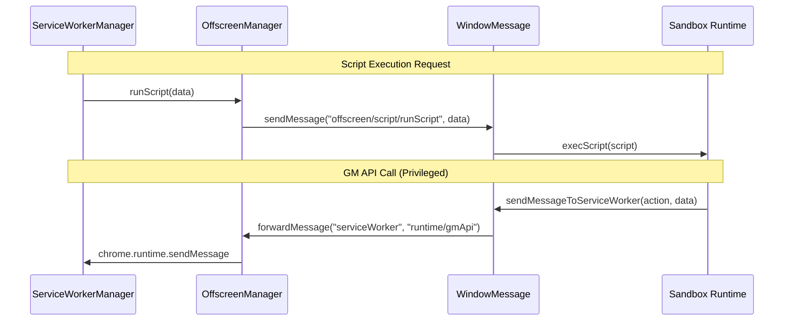

# Sandbox Environment

<details>
<summary>Relevant source files</summary>

The following files were used as context for generating this wiki page:

- [src/app/migrate.ts](../src/app/migrate.ts)
- [src/app/service/extension/extension_env.test.ts](../src/app/service/extension/extension_env.test.ts)
- [src/app/service/extension/extension_env.ts](../src/app/service/extension/extension_env.ts)
- [src/app/service/offscreen/base.ts](../src/app/service/offscreen/base.ts)
- [src/app/service/offscreen/client.ts](../src/app/service/offscreen/client.ts)
- [src/app/service/offscreen/event_page_manager.ts](../src/app/service/offscreen/event_page_manager.ts)
- [src/app/service/offscreen/index.ts](../src/app/service/offscreen/index.ts)
- [src/app/service/offscreen/script.ts](../src/app/service/offscreen/script.ts)
- [src/app/service/offscreen/vscode-connect.test.ts](../src/app/service/offscreen/vscode-connect.test.ts)
- [src/app/service/offscreen/vscode-connect.ts](../src/app/service/offscreen/vscode-connect.ts)
- [src/app/service/sandbox/index.ts](../src/app/service/sandbox/index.ts)
- [src/app/service/sandbox/runtime.test.ts](../src/app/service/sandbox/runtime.test.ts)
- [src/pkg/config/consts.ts](../src/pkg/config/consts.ts)
- [src/sandbox.ts](../src/sandbox.ts)
- [src/service_worker.ts](../src/service_worker.ts)

</details>


## Purpose and Scope

The Sandbox Environment provides an isolated execution context for background and crontab scripts in ScriptCat. Unlike content scripts that run attached to web pages, these scripts execute independently in a persistent sandboxed environment provided by an **offscreen document** in Manifest V3. This enables continuous or scheduled execution without requiring an active browser tab.

This document covers the `SandboxManager`, the `Runtime` execution engine, the `WindowMessage` IPC bridge, and the role of the offscreen document in supporting persistent script execution, including its role in browser-specific architectures (Chrome vs. Firefox).

## Architectural Context

The Sandbox Environment is hosted within an offscreen document (`src/offscreen.html`). This environment is initialized by `src/sandbox.ts`, which sets up the communication channels and the management layer.

### System Entity Map

This diagram associates natural language concepts with the specific code entities that implement them.

```mermaid
graph TB
    subgraph "Offscreen Context (sandbox.ts)"
        [Main] --> [WM]
        [Main] --> [SM]
        [SM] --> [RT]
        [Main] --> [Logger]
    end

    subgraph "Execution Wrapper"
        [Warp]
    end

    subgraph "Communication Bridge"
        [OM]
        [SS]
    end

    [Main] -- "main()" --> [WM]
    [WM] -- "WindowMessage" --> [SM]
    [SM] -- "SandboxManager" --> [RT]
    [RT] -- "Runtime" --> [Warp]
    [Warp] -- "BgExecScriptWarp" --> [Script]
    
    [WM] <--"IPC"--> [OM]
    [OM] -- "OffscreenManager" --> [SS]
    [SS] -- "ScriptService" --> [RT]
```

**Sources:** [src/sandbox.ts:6-22](../src/sandbox.ts#L6-L22), [src/app/service/sandbox/index.ts:11-29](../src/app/service/sandbox/index.ts#L11-L29), [src/app/service/offscreen/index.ts:8-28](../src/app/service/offscreen/index.ts#L8-L28)

## Sandbox Initialization

The initialization sequence begins when the service worker creates the offscreen document. The entry point `src/sandbox.ts` orchestrates the setup.

### Entry Point Flow
1. **IPC Setup**: A `WindowMessage` instance is created to establish a connection between the sandbox `window` and its `parent` (the offscreen host). [src/sandbox.ts:8](../src/sandbox.ts#L8)
2. **Logging**: `LoggerCore` is initialized with a `MessageWriter` that targets the `"offscreen/logger"` channel. [src/sandbox.ts:11-15](../src/sandbox.ts#L11-L15)
3. **Manager Startup**: The `SandboxManager` is instantiated and `initManager()` is called. [src/sandbox.ts:18-19](../src/sandbox.ts#L18-L19)

### SandboxManager
The `SandboxManager` acts as the top-level coordinator within the sandbox. It initializes a `Server` instance named `"sandbox"` to handle incoming RPC-style requests from the offscreen manager. [src/app/service/sandbox/index.ts:11-16](../src/app/service/sandbox/index.ts#L11-L16)

Upon initialization, the sandbox performs a **Channel Health Check**. It sends a `getExtensionEnv` request and observes the round-trip time, reporting the result back to the parent via `reportSandboxChannelHealth`. [src/app/service/sandbox/index.ts:31-48](../src/app/service/sandbox/index.ts#L31-L48)

**Sources:** [src/sandbox.ts:6-22](../src/sandbox.ts#L6-L22), [src/app/service/sandbox/index.ts:7-49](../src/app/service/sandbox/index.ts#L7-L49)

## The Runtime Engine

The `Runtime` class is the core execution engine for background and crontab scripts.

### Incognito and "Run-In" Filtering
The Sandbox Environment respects script isolation policies. Before execution, the `Runtime` checks the `run-in` metadata against the current `extensionEnv`.
- `normal-tabs`: Script only runs in non-incognito contexts.
- `incognito-tabs`: Script only runs in incognito contexts.
- `all`: Script runs in both.
- **Firefox Spanning**: In Firefox's "spanning" incognito mode, the `run-in` filter is bypassed for background/crontab scripts to prevent silent task loss, as they share a single process. [src/app/service/sandbox/runtime.test.ts:110-116](../src/app/service/sandbox/runtime.test.ts#L110-L116)

### Execution Wrapping
Scripts are wrapped in `BgExecScriptWarp` before execution. [src/app/service/sandbox/runtime.test.ts:13-19](../src/app/service/sandbox/runtime.test.ts#L13-L19) The runtime updates the script status to `SCRIPT_RUN_STATUS_RUNNING` and eventually `COMPLETE` or `ERROR` via `proxyUpdateRunStatus`. [src/app/service/offscreen/client.ts:39-44](../src/app/service/offscreen/client.ts#L39-L44)

**Sources:** [src/app/service/sandbox/runtime.test.ts:9-124](../src/app/service/sandbox/runtime.test.ts#L9-L124), [src/app/service/offscreen/client.ts:39-44](../src/app/service/offscreen/client.ts#L39-L44)

## WindowMessage IPC

Communication between the Sandbox and the Service Worker is mediated by the Offscreen document using `WindowMessage`.

### IPC Data Flow Diagram



**Sources:** [src/app/service/offscreen/index.ts:8-27](../src/app/service/offscreen/index.ts#L8-L27), [src/app/service/offscreen/client.ts:30-32](../src/app/service/offscreen/client.ts#L30-L32), [src/app/service/offscreen/script.ts:37-43](../src/app/service/offscreen/script.ts#L37-L43)

### Offscreen Bridge
The `OffscreenManager` ([src/app/service/offscreen/index.ts:8](../src/app/service/offscreen/index.ts#L8)) resides in the offscreen document but outside the isolated sandbox iframe. Its roles include:
- **Message Forwarding**: Routing calls from the sandbox to the Service Worker using `ServiceWorkerClient`. [src/app/service/offscreen/index.ts:25-26](../src/app/service/offscreen/index.ts#L25-L26)
- **Resource Management**: Handling `createObjectURL` and `fetchBlob` requests for the sandbox. [src/app/service/offscreen/base.ts:145-153](../src/app/service/offscreen/base.ts#L145-L153)
- **Lifecycle Management**: Managing background script state through `ScriptService`, which subscribes to `installScript`, `enableScripts`, and `deleteScripts` events via the `MessageQueue`. [src/app/service/offscreen/script.ts:49-85](../src/app/service/offscreen/script.ts#L49-L85)

**Sources:** [src/app/service/offscreen/index.ts:8-27](../src/app/service/offscreen/index.ts#L8-L27), [src/app/service/offscreen/script.ts:18-90](../src/app/service/offscreen/script.ts#L18-L90), [src/app/service/offscreen/base.ts:109-154](../src/app/service/offscreen/base.ts#L109-L154)

## Persistence and Keep-Alive

In Manifest V3, the Service Worker and Offscreen Document are ephemeral. ScriptCat implements mechanisms to maintain persistent execution for background tasks.

- **Chrome Offscreen**: ScriptCat creates an offscreen document with reasons such as `BLOBS`, `CLIPBOARD`, and `DOM_SCRAPING`. [src/service_worker.ts:39-49](../src/service_worker.ts#L39-L49)
- **Keep-Alive Loop**: The `OffscreenManager` listens for a `keepAlive` signal from the sandbox, which triggers `startChromeOffscreenKeepAliveLoop` to prevent the document from being throttled or closed. [src/app/service/offscreen/base.ts:116](../src/app/service/offscreen/base.ts#L116), [src/app/service/offscreen/client.ts:25-27](../src/app/service/offscreen/client.ts#L25-L27)
- **Firefox Event Page**: Since Firefox does not support offscreen documents, ScriptCat uses an `EventPageOffscreenManager` and an `InProcessMessage` bridge to run background tasks within the same context as the Service Worker. [src/service_worker.ts:87-98](../src/service_worker.ts#L87-L98)

**Sources:** [src/service_worker.ts:29-98](../src/service_worker.ts#L29-L98), [src/app/service/offscreen/base.ts:116](../src/app/service/offscreen/base.ts#L116), [src/app/service/offscreen/client.ts:25-27](../src/app/service/offscreen/client.ts#L25-L27)

## Integration with External Tools

The Sandbox Environment supports integration with development tools like VS Code and external AI agents.

- **VS Code Connection**: `VSCodeConnect` establishes a WebSocket connection to a local VS Code instance. It supports automatic reconnection and uses an `epoch` mechanism to prevent old connection callbacks from interfering with new sessions. [src/app/service/offscreen/vscode-connect.ts:37-76](../src/app/service/offscreen/vscode-connect.ts#L37-L76)
- **Hot-Loading**: When a file changes in VS Code, the `onchange` action triggers `scriptClient.installByCode`, allowing for rapid development of scripts. [src/app/service/offscreen/vscode-connect.ts:175-189](../src/app/service/offscreen/vscode-connect.ts#L175-L189)
- **External Access**: The `ExternalAccessConnect` service allows external agents to communicate with ScriptCat via a WebSocket transport driver hosted in the offscreen context. [src/app/service/offscreen/client.ts:126-142](../src/app/service/offscreen/client.ts#L126-L142)

**Sources:** [src/app/service/offscreen/vscode-connect.ts:37-237](../src/app/service/offscreen/vscode-connect.ts#L37-L237), [src/app/service/offscreen/client.ts:113-142](../src/app/service/offscreen/client.ts#L113-L142)

---
