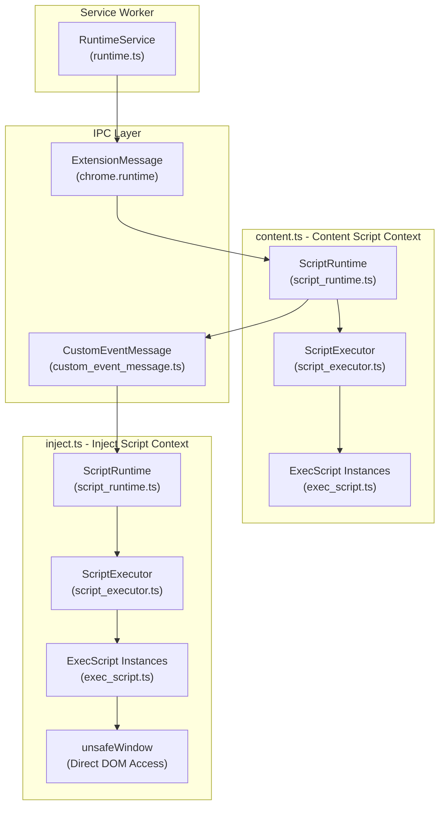
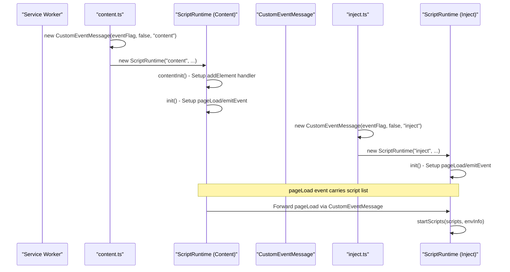
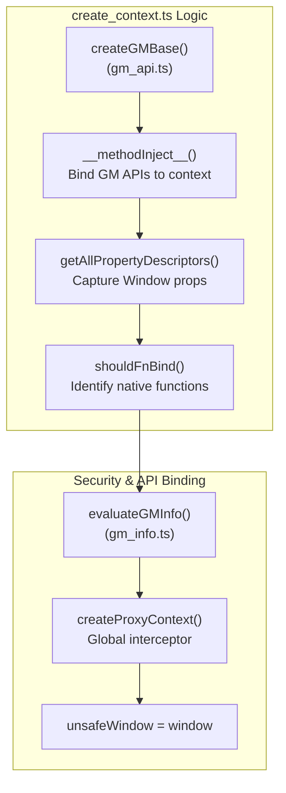

# Content and Inject Script Contexts

<details>
<summary>Relevant source files</summary>

The following files were used as context for generating this wiki page:

- [example/run-in/run-in_bg.js](../example/run-in/run-in_bg.js)
- [example/tests/sandbox_test.js](../example/tests/sandbox_test.js)
- [packages/message/common.ts](../packages/message/common.ts)
- [packages/message/custom_event_message.ts](../packages/message/custom_event_message.ts)
- [src/app/service/content/create_context.test.ts](../src/app/service/content/create_context.test.ts)
- [src/app/service/content/create_context.ts](../src/app/service/content/create_context.ts)
- [src/app/service/content/exec_script.test.ts](../src/app/service/content/exec_script.test.ts)
- [src/app/service/content/exec_script.ts](../src/app/service/content/exec_script.ts)
- [src/app/service/content/exec_warp.test.ts](../src/app/service/content/exec_warp.test.ts)
- [src/app/service/content/exec_warp.ts](../src/app/service/content/exec_warp.ts)
- [src/app/service/content/external.ts](../src/app/service/content/external.ts)
- [src/app/service/content/script_executor.ts](../src/app/service/content/script_executor.ts)
- [src/app/service/content/script_runtime.ts](../src/app/service/content/script_runtime.ts)
- [src/app/service/content/utils.test.ts](../src/app/service/content/utils.test.ts)
- [src/app/service/content/utils.ts](../src/app/service/content/utils.ts)
- [src/content.ts](../src/content.ts)
- [src/inject.ts](../src/inject.ts)
- [src/scripting.ts](../src/scripting.ts)
- [tests/vitest.setup.ts](../tests/vitest.setup.ts)

</details>


This document explains ScriptCat's dual execution context architecture for userscripts. ScriptCat executes userscripts in two distinct contexts: **Content Scripts** (privileged extension context with API access) and **Inject Scripts** (page context with direct DOM and variable access). These contexts communicate via `CustomEventMessage` IPC and share script execution logic through `ScriptExecutor`.

For service worker runtime details, see page 3.1. For sandbox environment details, see page 3.2. For URL pattern matching, see page 3.4.

## Dual Execution Context Architecture

ScriptCat executes userscripts in two isolated contexts based on the `@inject-into` metadata directive. Each context provides different capabilities and security boundaries.

### Dual Context Architecture



| Context | Entry File | Execution Environment | Capabilities | Limitations |
|---------|------------|-----------------------|--------------|-------------|
| **Content** | `src/content.ts` | Extension content script | `chrome.*` APIs, privileged operations | Cannot access page JS variables |
| **Inject** | `src/inject.ts` | Page's JavaScript context | Full page access, `unsafeWindow` | No `chrome.*` APIs, untrusted |

**Sources:** [src/content.ts:1-32](../src/content.ts#L1-L32), [src/inject.ts:1-34](../src/inject.ts#L1-L34), [src/app/service/content/script_runtime.ts:1-81](../src/app/service/content/script_runtime.ts#L1-L81)

## Context Initialization

Both content and inject contexts follow parallel initialization sequences but operate in different security contexts.

### Initialization Flow



**Sources:** [src/content.ts:13-32](../src/content.ts#L13-L32), [src/inject.ts:13-34](../src/inject.ts#L13-L34), [src/app/service/content/script_runtime.ts:19-71](../src/app/service/content/script_runtime.ts#L19-L71)

### Entry Point Logic

In both `src/content.ts` and `src/inject.ts`, the environment starts by obtaining an `eventFlag` via `getEventFlag` [src/content.ts:14](../src/content.ts#L14), [src/inject.ts:14](../src/inject.ts#L14). This flag is used to construct a `CustomEventMessage` for secure IPC.

- **Content Context**: Initializes `ScriptRuntime` and calls `contentInit()` to register privileged DOM operations like `runtime/addElement` [src/app/service/content/script_runtime.ts:20-53](../src/app/service/content/script_runtime.ts#L20-L53).
- **Inject Context**: Initializes `ScriptRuntime` and calls `externalMessage()` to expose `window.external` interfaces [src/inject.ts:34](../src/inject.ts#L34), [src/app/service/content/script_runtime.ts:77-79](../src/app/service/content/script_runtime.ts#L77-L79).

## CustomEventMessage IPC

ScriptCat uses `CustomEventMessage` for communication between content and inject contexts. This mechanism uses native DOM events on the `window` object (using `pageAddEventListener` and `pageDispatchEvent`) to bypass page JavaScript interference [packages/message/common.ts:7-13](../packages/message/common.ts#L7-L13).

### IPC Implementation Detail

[packages/message/custom_event_message.ts:35-192](../packages/message/custom_event_message.ts#L35-L192) implements the messaging logic:

1. **Flag Negotiation**: Uses `eventFlag` combined with `envTag` and direction flags (`inbound`/`outbound`) to establish unique event names [packages/message/custom_event_message.ts:49-51](../packages/message/custom_event_message.ts#L49-L51).
2. **Ready State**: Uses a `ReadyWrap` to ensure both sides of the bridge are active before sending data [packages/message/custom_event_message.ts:52-69](../packages/message/custom_event_message.ts#L52-L69).
3. **Message Types**:
    - `sendMessage`: Request/response messaging via `EventEmitter3` [packages/message/custom_event_message.ts:130-148](../packages/message/custom_event_message.ts#L130-L148).
    - `syncSendMessage`: Synchronous communication by exploiting the synchronous nature of DOM events [packages/message/custom_event_message.ts:153-171](../packages/message/custom_event_message.ts#L153-L171).
    - `connect`: Persistent port-like connections using `WindowMessageConnect` [packages/message/custom_event_message.ts:110-123](../packages/message/custom_event_message.ts#L110-L123).

### RelatedTarget Mechanism

[packages/message/custom_event_message.ts:173-191](../packages/message/custom_event_message.ts#L173-L191) allows passing DOM nodes between contexts:
- `sendRelatedTarget(target)`: Dispatches a `MouseEvent` where the node is stored in the `relatedTarget` property. It returns a numeric ID [packages/message/custom_event_message.ts:173-185](../packages/message/custom_event_message.ts#L173-L185).
- `getAndDelRelatedTarget(id)`: Retrieves the node on the receiving side using the ID from a internal `relatedTargetMap` [packages/message/custom_event_message.ts:187-191](../packages/message/custom_event_message.ts#L187-L191).

**Sources:** [packages/message/custom_event_message.ts:1-192](../packages/message/custom_event_message.ts#L1-L192), [packages/message/common.ts:1-13](../packages/message/common.ts#L1-L13)

## Early-Start Script Mechanism

ScriptCat supports scripts that execute before the environment fully initializes. This is handled by `ScriptExecutor.checkEarlyStartScript` [src/app/service/content/script_executor.ts:87-128](../src/app/service/content/script_executor.ts#L87-L128).

### Execution Flow

1. **Pre-Injection**: Scripts are compiled into a wrapper that dispatches a `scriptLoadComplete` event [src/app/service/content/utils.ts:198-212](../src/app/service/content/utils.ts#L198-L212).
2. **Detection**: `ScriptExecutor` listens for these events using `pageAddEventListener` [src/app/service/content/script_executor.ts:123](../src/app/service/content/script_executor.ts#L123).
3. **URL Filtering**: Even for early scripts, `isUrlExcluded` is checked to ensure `@include`/`@exclude` rules are respected [src/app/service/content/script_executor.ts:112-115](../src/app/service/content/script_executor.ts#L112-L115).
4. **Environment Sync**: Once the runtime environment is ready, it dispatches an `envLoadComplete` event to notify any waiting early scripts [src/app/service/content/script_executor.ts:126-127](../src/app/service/content/script_executor.ts#L126-L127).

**Sources:** [src/app/service/content/script_executor.ts:87-128](../src/app/service/content/script_executor.ts#L87-L128), [src/app/service/content/utils.ts:198-212](../src/app/service/content/utils.ts#L198-L212)

## Script Compilation and Execution

### Compilation Logic

[src/app/service/content/utils.ts:132-158](../src/app/service/content/utils.ts#L132-L158) defines how script code is wrapped:

```javascript
const joinedCode = [
  "with(arguments[0]||this.$){",
  `${preCode}`, // @require content
  "return(async function(){",
  `${code}`,    // User script content
  "}).call(this);}",
].join("\n");
```

- **`with` statement**: Injects the GM API context (either `arguments[0]` for non-sandbox or `this.$` for sandbox) [src/app/service/content/utils.ts:148](../src/app/service/content/utils.ts#L148).
- **Async Wrapper**: Allows the use of `top-level await` within userscripts [src/app/service/content/utils.ts:150-152](../src/app/service/content/utils.ts#L150-L152).
- **Try-Catch**: Wraps the entire execution to log errors with script names [src/app/service/content/utils.ts:114-130](../src/app/service/content/utils.ts#L114-L130).

### Execution via ExecScript

The `ExecScript` class [src/app/service/content/exec_script.ts:13-113](../src/app/service/content/exec_script.ts#L13-L113) manages the lifecycle:
1. **Context Creation**: Calls `createContext` to build the `GM_*` API environment [src/app/service/content/exec_script.ts:65](../src/app/service/content/exec_script.ts#L65).
2. **Sandbox Handling**: If `@grant none` is used, it injects `GM_info` into the global scope via `named` arguments [src/app/service/content/exec_script.ts:62](../src/app/service/content/exec_script.ts#L62).
3. **Execution**: Calls `scriptFunc.call(this.execContext, ...)` to start the script [src/app/service/content/exec_script.ts:91](../src/app/service/content/exec_script.ts#L91).

**Sources:** [src/app/service/content/exec_script.ts:13-113](../src/app/service/content/exec_script.ts#L13-L113), [src/app/service/content/utils.ts:103-158](../src/app/service/content/utils.ts#L103-L158)

## Sandbox Context Implementation

The `createContext` function [src/app/service/content/create_context.ts:15-113](../src/app/service/content/create_context.ts#L15-L113) builds a secure execution environment.

### Context Construction



- **API Binding**: Iterates through `@grant` directives and binds corresponding API implementations from `GMContextApiGet` to the script's context [src/app/service/content/create_context.ts:69-85](../src/app/service/content/create_context.ts#L69-L85).
- **Native Function Binding**: To prevent "Illegal Invocation" errors, native browser functions are identified by `shouldFnBind` and bound to the real `global` window [src/app/service/content/create_context.ts:133-156](../src/app/service/content/create_context.ts#L133-L156).
- **Property Redirection**: `getAllPropertyDescriptors` captures getters/setters from the global object (excluding `Object.prototype`) to ensure properties like `location` function correctly inside the sandbox [src/app/service/content/create_context.ts:161-186](../src/app/service/content/create_context.ts#L161-L186).

**Sources:** [src/app/service/content/create_context.ts:15-214](../src/app/service/content/create_context.ts#L15-L214), [src/app/service/content/exec_script.ts:87-91](../src/app/service/content/exec_script.ts#L87-L91)

---
