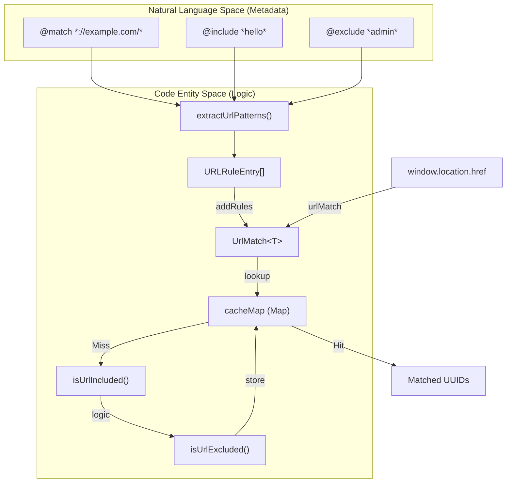
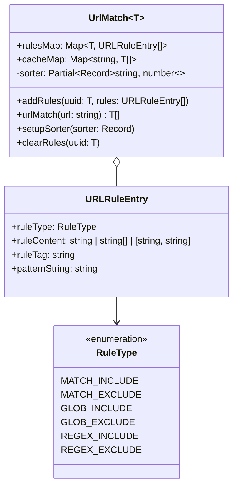
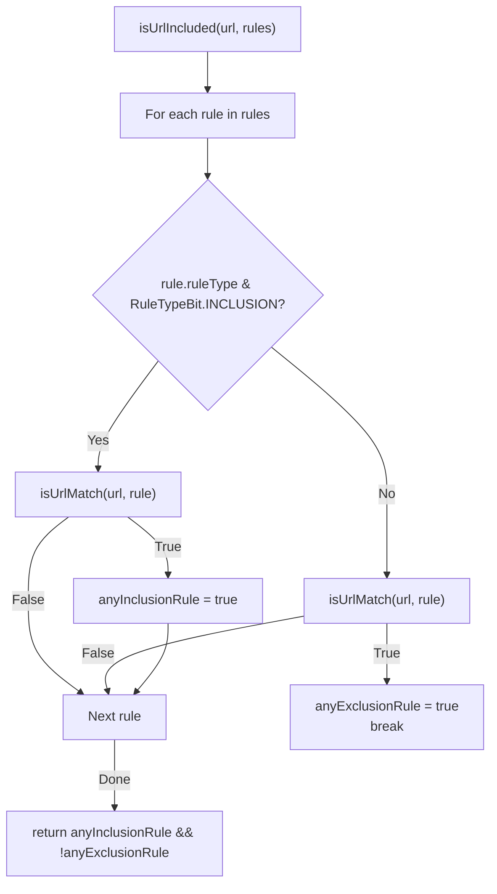

# URL Pattern Matching

Relevant source files

The following files were used as context for generating this wiki page:

- [src/pkg/utils/match.test.ts](../src/pkg/utils/match.test.ts)
- [src/pkg/utils/match.ts](../src/pkg/utils/match.ts)
- [src/pkg/utils/regex_to_glob.test.ts](../src/pkg/utils/regex_to_glob.test.ts)
- [src/pkg/utils/url_matcher.test.ts](../src/pkg/utils/url_matcher.test.ts)
- [src/pkg/utils/url_matcher.ts](../src/pkg/utils/url_matcher.ts)

The URL pattern matching system determines which user scripts should execute on which web pages based on URL patterns specified in script metadata. The system processes `@match`, `@include`, and `@exclude` directives and provides efficient pattern matching with a multi-level caching mechanism and support for glob/regex patterns.

## Core Architecture

The system is centered around the `UrlMatch<T>` class, which manages a collection of rules and provides an optimized matching interface. It handles the logic for determining if a URL is included (matches at least one `@match` or `@include` and no `@exclude`) or excluded.

### URL Matching System Overview

Sources: [src/pkg/utils/match.ts:4-55](../src/pkg/utils/match.ts#L4-L55), [src/pkg/utils/url_matcher.ts:71-160](../src/pkg/utils/url_matcher.ts#L71-L160), [src/pkg/utils/match.ts:93-114](../src/pkg/utils/match.ts#L93-L114)

### UrlMatch Class Structure

The `UrlMatch` class is generic, typically using script UUIDs as the key `T`. It maintains a `rulesMap` for raw patterns and a `cacheMap` for performance.

Sources: [src/pkg/utils/match.ts:4-7](../src/pkg/utils/match.ts#L4-L7), [src/pkg/utils/url_matcher.ts:3-21](../src/pkg/utils/url_matcher.ts#L3-L21)

## Pattern Type Support

The system categorizes patterns into three primary execution types via `RuleType` [src/pkg/utils/url_matcher.ts:3-10](../src/pkg/utils/url_matcher.ts#L3-L10).

### 1. Chrome Match Patterns
Validated by `checkUrlMatch()` [src/pkg/utils/url_matcher.ts:27-57](../src/pkg/utils/url_matcher.ts#L27-L57), these follow the Manifest V3 match pattern syntax (`<scheme>://<host><path>`).
- **Normalization**: Automatically converts `http*` to `*` [src/pkg/utils/url_matcher.ts:116-118](../src/pkg/utils/url_matcher.ts#L116-L118).
- **Port Handling**: Strips ports (e.g., `:80`, `:*`) to align with standard behavior [src/pkg/utils/url_matcher.ts:106-112](../src/pkg/utils/url_matcher.ts#L106-L112).
- **Compatibility**: If a pattern is not a valid MV3 match pattern, the system attempts a fallback to handle Tampermonkey-style patterns (e.g., missing protocol) [src/pkg/utils/url_matcher.ts:91-102](../src/pkg/utils/url_matcher.ts#L91-L102).

### 2. Glob Patterns
Used for `@include` and `@exclude` when they are not valid match patterns or regex.
- **Processing**: Patterns containing `*` or `?` are handled as globs.
- **Magic TLD**: Supports Greasemonkey's `.tld` suffix, converting it to the glob `.??*/` [src/pkg/utils/url_matcher.ts:143-152](../src/pkg/utils/url_matcher.ts#L143-L152).
- **Glob Normalization**: The system handles consecutive asterisks by replacing `**` with `*` [src/pkg/utils/url_matcher.ts:156-159](../src/pkg/utils/url_matcher.ts#L156-L159).
- **Internal Splitting**: `globSplit` divides patterns by `*` and `?` for internal processing [src/pkg/utils/url_matcher.ts:59-69](../src/pkg/utils/url_matcher.ts#L59-L69).

### 3. Regular Expressions
Detected if the pattern starts and ends with `/` [src/pkg/utils/url_matcher.ts:201-202](../src/pkg/utils/url_matcher.ts#L201-L202).
- **Defaults**: If no flags are provided, it defaults to case-insensitive (`i`) to match common userscript manager behavior [src/pkg/utils/url_matcher.ts:206-209](../src/pkg/utils/url_matcher.ts#L206-L209).
- **Regex to Glob**: The `regexToGlob` utility attempts to map regex literal structures, word boundaries, and quantifiers into simplified glob strings to optimize matching where full regex engines aren't required [src/pkg/utils/regex_to_glob.test.ts:24-196](../src/pkg/utils/regex_to_glob.test.ts#L24-L196).

## Inclusion and Exclusion Logic

The system follows specific boolean logic to determine script execution via `isUrlIncluded` and `isUrlExcluded`.

- **Included**: `(Match any @include/@match) AND (Match NO @exclude)` [src/pkg/utils/match.ts:112-113](../src/pkg/utils/match.ts#L112-L113).
- **Excluded**: `(Match NO @include/@match) OR (Match any @exclude)` [src/pkg/utils/match.ts:137-138](../src/pkg/utils/match.ts#L137-L138).

### URL Matching Flow

Sources: [src/pkg/utils/match.ts:93-114](../src/pkg/utils/match.ts#L93-L114), [src/pkg/utils/url_matcher.ts:12-14](../src/pkg/utils/url_matcher.ts#L12-L14)

## Performance and Caching

Matching can be computationally expensive. ScriptCat employs a multi-level caching strategy:

1.  **UrlMatch Cache (`cacheMap`)**: Maps a full URL string to an array of matching script UUIDs. This cache is cleared whenever rules are added or the sorter is updated [src/pkg/utils/match.ts:14, 85](../src/pkg/utils/match.ts).
2.  **Cache Eviction**: The `cacheMap` is limited to `maxCacheEntries` (default 4096). When the limit is reached, the oldest entry is removed [src/pkg/utils/match.ts:50-53](../src/pkg/utils/match.ts#L50-L53).
3.  **L2 Pattern Cache**: A global `URL_MATCH_CACHE_MAX_SIZE` (512) is used within the underlying matching engine to store results of specific pattern evaluations [src/pkg/utils/url_matcher.ts:23](../src/pkg/utils/url_matcher.ts#L23).

### Sorting Matched Scripts
Matched scripts are sorted based on a `sorter` provided via `setupSorter` [src/pkg/utils/match.ts:83-88](../src/pkg/utils/match.ts#L83-L88). If scripts have defined priorities in the sorter, they are ordered accordingly; otherwise, they fall back to a locale-based comparison of their UUIDs [src/pkg/utils/match.ts:39-47](../src/pkg/utils/match.ts#L39-L47).

## Blacklist and Self-Check Logic

The system provides a `blackListSelfCheck` function to validate user-defined blacklists. It ensures that provided patterns are valid globs or match patterns by generating template URLs (replacing `*` and `?` with random characters) and verifying if the pattern successfully matches its own generated template [src/pkg/utils/match.ts:141-168](../src/pkg/utils/match.ts#L141-L168).

Sources: [src/pkg/utils/match.ts:141-168](../src/pkg/utils/match.ts#L141-L168), [src/pkg/utils/match.ts:20-55](../src/pkg/utils/match.ts#L20-L55)

---
