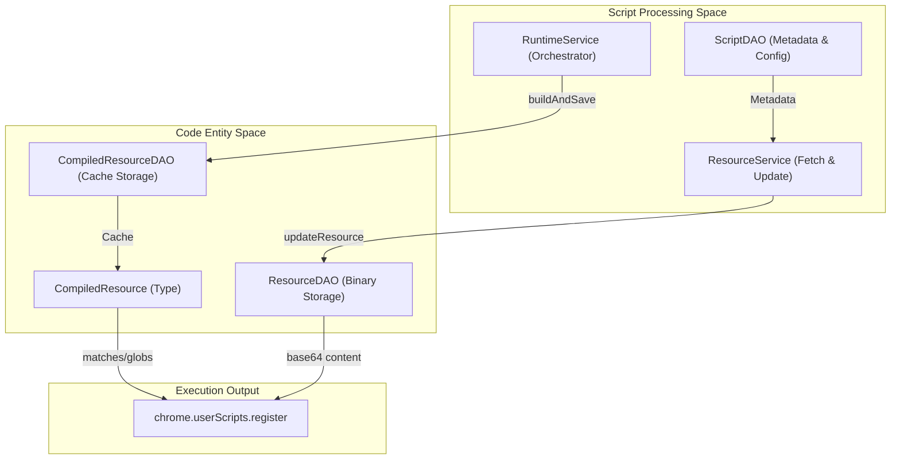
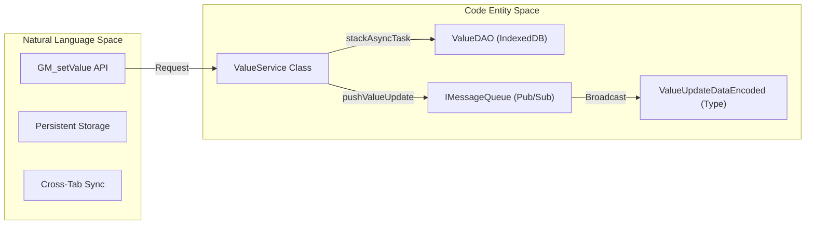

# Resource and Dependency Management

Relevant source files

The following files were used as context for generating this wiki page:

- [example/tests/unwrap_e2e_test.js](../example/tests/unwrap_e2e_test.js)
- [src/app/repo/resource.ts](../src/app/repo/resource.ts)
- [src/app/service/sandbox/runtime.ts](../src/app/service/sandbox/runtime.ts)
- [src/app/service/service_worker/permission_verify.ts](../src/app/service/service_worker/permission_verify.ts)
- [src/app/service/service_worker/resource.test.ts](../src/app/service/service_worker/resource.test.ts)
- [src/app/service/service_worker/resource.ts](../src/app/service/service_worker/resource.ts)
- [src/app/service/service_worker/runtime.test.ts](../src/app/service/service_worker/runtime.test.ts)
- [src/app/service/service_worker/utils.test.ts](../src/app/service/service_worker/utils.test.ts)
- [src/app/service/service_worker/utils.ts](../src/app/service/service_worker/utils.ts)
- [src/app/service/service_worker/value.ts](../src/app/service/service_worker/value.ts)
- [src/pages/options/routes/Agent/Tasks/cron.ts](../src/pages/options/routes/Agent/Tasks/cron.ts)
- [src/pkg/utils/concurrency-control.test.ts](../src/pkg/utils/concurrency-control.test.ts)
- [src/pkg/utils/cron.test.ts](../src/pkg/utils/cron.test.ts)
- [src/pkg/utils/cron.ts](../src/pkg/utils/cron.ts)

This document describes ScriptCat's system for managing external script dependencies (`@require`, `@require-css`) and named resources (`@resource`). It covers how resources are fetched, cached, compiled into executable form, and injected into scripts at runtime.

## Resource Types and Metadata Declarations

ScriptCat recognizes several metadata declarations that define script dependencies and resources. These are parsed from the script's `==UserScript==` block.

| Metadata Key | Purpose | Access Method |
|--------------|---------|---------------|
| `@require` | JavaScript dependency loaded before script execution | Injected into script context via concatenation |
| `@require-css`| CSS stylesheet injected into page | Injected as `<style>` or `<link>` |
| `@resource` | Named resource (image, text, etc.) | `GM_getResourceURL`, `GM_getResourceText` |

These declarations are stored in the `Script.metadata` object [src/app/repo/scripts.ts:7-17](../src/app/repo/scripts.ts#L7-L17). Resources are identified by URL and, in the case of `@resource`, a user-defined name key [src/app/service/service_worker/resource.ts:145-150](../src/app/service/service_worker/resource.ts#L145-L150).

**Sources:** [src/app/repo/scripts.ts:7-17](../src/app/repo/scripts.ts#L7-L17), [src/app/service/service_worker/resource.ts:133-155](../src/app/service/service_worker/resource.ts#L133-L155)

## CompiledResource Architecture

The `CompiledResource` system provides a performance optimization by pre-computing execution metadata and caching script matching results.

**Diagram: Natural Language to Code Entity Mapping (Compilation Flow)**

Key entities in the resource system:
- **`ResourceService`**: Manages the lifecycle of fetching and updating resources [src/app/service/service_worker/resource.ts:54](../src/app/service/service_worker/resource.ts#L54).
- **`ResourceDAO`**: Handles persistence of resource content, content-types, and hashes in IndexedDB [src/app/repo/resource.ts:52](../src/app/repo/resource.ts#L52).
- **`CompiledResource`**: A data structure containing pre-calculated execution context, including `uuid`, `require` URL lists, and effective `scriptUrlPatterns` [src/app/repo/resource.ts:34-48](../src/app/repo/resource.ts#L34-L48).
- **`CompiledResourceDAO`**: Specialized repository for caching `CompiledResource` objects to avoid redundant metadata parsing [src/app/repo/resource.ts:69](../src/app/repo/resource.ts#L69).

**Sources:** [src/app/service/service_worker/resource.ts:54-64](../src/app/service/service_worker/resource.ts#L54-L64), [src/app/repo/resource.ts:34-82](../src/app/repo/resource.ts#L34-L82)

## Resource Fetching and Concurrency Control

The `ResourceService` implements a sophisticated fetching strategy using a **Sliding Window Semaphore** to manage concurrent network requests.

### Concurrency and Jitter
To prevent overwhelming servers and avoid being flagged as DDoS, ScriptCat limits active fetches:
- **`MAX_ACTIVE_FETCHES`**: Limited to 5 simultaneous requests [src/app/service/service_worker/resource.ts:24](../src/app/service/service_worker/resource.ts#L24).
- **Random Jitter**: A delay of 100-150ms is added before fetches to disperse request timing [src/app/service/service_worker/resource.ts:27-28](../src/app/service/service_worker/resource.ts#L27-L28).
- **Sliding Window**: If a request takes longer than 800ms (`FETCH_SLOT_SLIDE_TIMEOUT_MS`), the concurrency slot is released for the next request while the original fetch continues in the background [src/app/service/service_worker/resource.ts:41-52](../src/app/service/service_worker/resource.ts#L41-L52).

### Caching and TTL
- **`RESOURCE_CACHE_TTL_MS`**: Remote resources are cached for 24 hours [src/app/service/service_worker/resource.ts:44](../src/app/service/service_worker/resource.ts#L44).
- **`file:///` Handling**: Local file resources bypass the TTL and are checked for updates every time they are requested [src/app/service/service_worker/resource.ts:89-91](../src/app/service/service_worker/resource.ts#L89-L91).
- **Reference Counting**: The `link` property in the `Resource` object tracks which script UUIDs are using a specific resource [src/app/repo/resource.ts:13](../src/app/repo/resource.ts#L13). Resources are only deleted when no scripts reference them [src/app/service/service_worker/resource.ts:183-195](../src/app/service/service_worker/resource.ts#L183-L195).

**Sources:** [src/app/service/service_worker/resource.ts:20-52](../src/app/service/service_worker/resource.ts#L20-L52), [src/app/service/service_worker/resource.ts:88-103](../src/app/service/service_worker/resource.ts#L88-L103), [src/app/repo/resource.ts:7-17](../src/app/repo/resource.ts#L7-L17)

## Integrity and SRI Validation

ScriptCat supports Subresource Integrity (SRI) to ensure fetched resources haven't been tampered with.

- **SRI Parsing**: The `parseUrlSRI` utility extracts hash values (sha256, md5, etc.) from URL fragments using patterns like `#sha256-hash` or `#md5=hash` [src/app/service/service_worker/utils.ts:81-105](../src/app/service/service_worker/utils.ts#L81-L105).
- **Hash Calculation**: After fetching, the system calculates hashes from the `ArrayBuffer` [src/app/service/service_worker/resource.ts:112](../src/app/service/service_worker/resource.ts#L112).
- **Validation**: If a hash is provided in the URL, the service compares it against the downloaded content's hash before saving [src/app/service/service_worker/utils.test.ts:16-59](../src/app/service/service_worker/utils.test.ts#L16-L59).

**Sources:** [src/app/service/service_worker/utils.ts:81-105](../src/app/service/service_worker/utils.ts#L81-L105), [src/app/service/service_worker/resource.ts:72-76](../src/app/service/service_worker/resource.ts#L72-L76), [src/app/service/service_worker/utils.test.ts:16-81](../src/app/service/service_worker/utils.test.ts#L16-L81)

## Value Storage and Synchronization

The `ValueService` manages script-specific persistent data accessed via `GM_setValue` and `GM_getValue`.

**Diagram: Value Storage Natural Language to Code Entity Bridge**

- **Atomic Updates**: `setValues` uses `stackAsyncTask` to ensure sequential updates to the same storage key, preventing race conditions [src/app/service/service_worker/value.ts:102-159](../src/app/service/service_worker/value.ts#L102-L159).
- **Reactive Updates**: When values change, a `ValueUpdateDataEncoded` message is broadcast to all active tabs running the script to synchronize state [src/app/service/service_worker/value.ts:162-170](../src/app/service/service_worker/value.ts#L162-L170).
- **User Configuration Binding**: `getScriptValueDetails` merges stored values with default values defined in the `@UserConfig` metadata [src/app/service/service_worker/value.ts:43-73](../src/app/service/service_worker/value.ts#L43-L73).

**Sources:** [src/app/service/service_worker/value.ts:27-41](../src/app/service/service_worker/value.ts#L27-L41), [src/app/service/service_worker/value.ts:84-171](../src/app/service/service_worker/value.ts#L84-L171), [src/app/service/service_worker/value.ts:183-195](../src/app/service/service_worker/value.ts#L183-L195)

## Cron and Scheduled Execution

For background and scheduled scripts, ScriptCat provides a cron-based execution system.

- **Syntax Support**: Supports standard 5-digit cron and 6-digit (including seconds) extensions [src/pkg/utils/cron.ts:20-22](../src/pkg/utils/cron.ts#L20-L22).
- **`once` Keyword**: A ScriptCat extension that allows execution only once within a specific time unit (minute, hour, day, etc.) [src/pkg/utils/cron.ts:192-207](../src/pkg/utils/cron.ts#L192-L207).
- **Timezone Handling**: Uses a `fixed offset zone` (e.g., `UTC+08:00`) calculated from the local environment to ensure consistent execution regardless of system IANA timezone issues [src/pkg/utils/cron.ts:154-184](../src/pkg/utils/cron.ts#L154-L184).
- **Retry Logic**: If a scheduled script fails with a `CATRetryError`, it is added to a `retryList` in the `Runtime` and re-executed after a delay [src/app/service/sandbox/runtime.ts:38-68](../src/app/service/sandbox/runtime.ts#L38-L68).

**Sources:** [src/pkg/utils/cron.ts:18-48](../src/pkg/utils/cron.ts#L18-L48), [src/pkg/utils/cron.ts:192-207](../src/pkg/utils/cron.ts#L192-L207), [src/app/service/sandbox/runtime.ts:31-69](../src/app/service/sandbox/runtime.ts#L31-L69), [src/app/service/sandbox/runtime.ts:198-215](../src/app/service/sandbox/runtime.ts#L198-L215)

---
