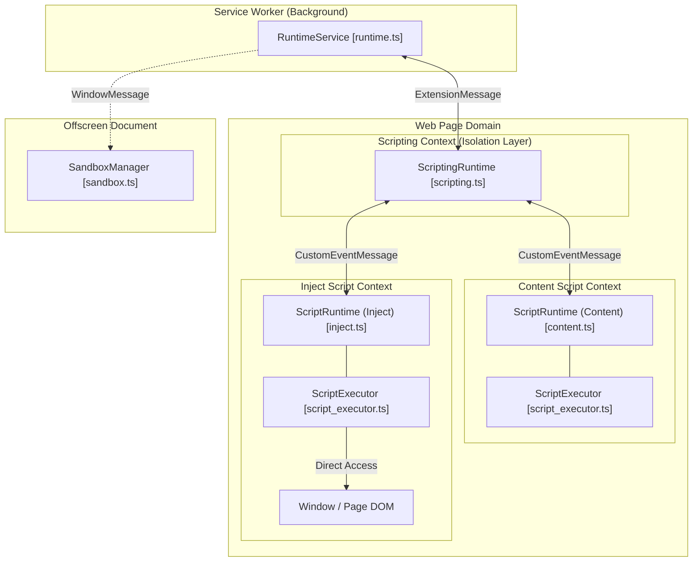
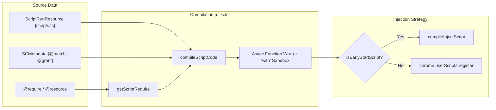
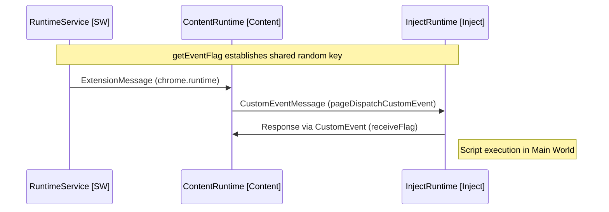

# Script Execution Environment

Relevant source files

The following files were used as context for generating this wiki page:

- [example/tests/sandbox_test.js](../example/tests/sandbox_test.js)
- [packages/message/custom_event_message.ts](../packages/message/custom_event_message.ts)
- [src/app/service/content/create_context.test.ts](../src/app/service/content/create_context.test.ts)
- [src/app/service/content/create_context.ts](../src/app/service/content/create_context.ts)
- [src/app/service/content/exec_script.test.ts](../src/app/service/content/exec_script.test.ts)
- [src/app/service/content/exec_script.ts](../src/app/service/content/exec_script.ts)
- [src/app/service/content/script_executor.ts](../src/app/service/content/script_executor.ts)
- [src/app/service/content/utils.test.ts](../src/app/service/content/utils.test.ts)
- [src/app/service/content/utils.ts](../src/app/service/content/utils.ts)
- [src/content.ts](../src/content.ts)
- [src/inject.ts](../src/inject.ts)
- [tests/vitest.setup.ts](../tests/vitest.setup.ts)

This document provides an overview of ScriptCat's multi-context execution model. It describes the isolated execution environments where userscripts run, how scripts are compiled and loaded, and the inter-process communication (IPC) mechanisms that connect these contexts.

For detailed information on specific subsystems:
- Service worker orchestration and script registration: see [Service Worker Runtime](./3-1-service-worker-runtime.md)
- Background script execution via offscreen documents: see [Sandbox Environment](./3-2-sandbox-environment.md)
- Content and inject script contexts with dual execution models: see [Content and Inject Script Contexts](./3-3-content-and-inject-script-contexts.md)
- URL pattern matching and script selection: see [URL Pattern Matching](./3-4-url-pattern-matching.md)
- Resource and dependency management: see [Resource and Dependency Management](./3-5-resource-and-dependency-management.md)

## Overview of Execution Contexts

ScriptCat implements a multi-tier execution architecture to balance security isolation with page manipulation capabilities. Each context has different access levels and responsibilities.

**Execution Context Architecture**

Sources: [src/content.ts:14-32](../src/content.ts#L14-L32), [src/inject.ts:14-31](../src/inject.ts#L14-L31), [src/app/service/content/script_executor.ts:32-39](../src/app/service/content/script_executor.ts#L32-L39)

### Context Capabilities Comparison

| Context | Execution Environment | API Access | Page Access | IPC Mechanism |
|---------|----------------------|------------|-------------|---------------|
| **Service Worker** | Extension Background | Full Chrome APIs | None | `ExtensionMessage` |
| **Content Script** | Isolated World | Extension APIs (via SW) | Isolated DOM | `CustomEventMessage` |
| **Inject Script** | Main World (`USER_SCRIPT`) | None (Proxied) | Full `unsafeWindow` | `CustomEventMessage` |
| **Background Script** | Offscreen Document | Full Extension APIs | None | `WindowMessage` |

Sources: [src/content.ts:15-17](../src/content.ts#L15-L17), [src/inject.ts:15-17](../src/inject.ts#L15-L17), [packages/message/custom_event_message.ts:35-51](../packages/message/custom_event_message.ts#L35-L51)

## Script Compilation and Injection

Scripts are transformed from raw source code into executable units based on their target context. This process involves assembling resources, wrapping code in sandboxed functions, and handling early-start logic.

**Script Compilation Pipeline**

Sources: [src/app/service/content/utils.ts:78-94](../src/app/service/content/utils.ts#L78-L94), [src/app/service/content/utils.ts:103-112](../src/app/service/content/utils.ts#L103-L112), [src/app/service/content/utils.ts:171-186](../src/app/service/content/utils.ts#L171-L186)

### Key Compilation Components

- **`compileScriptCode`**: Orchestrates the transformation of script resources into a single executable string, including `@require` contents and a `try-catch` wrapper [src/app/service/content/utils.ts:103-112](../src/app/service/content/utils.ts#L103-L112).
- **`ScriptExecutor`**: The client-side component in Content/Inject contexts that manages script entry points, styles injection, and `@run-at document-body` timing [src/app/service/content/script_executor.ts:32-176](../src/app/service/content/script_executor.ts#L32-L176).
- **`ExecScript`**: Manages the individual script execution instance, creating the `sandboxContext` (GM API provider) via `createContext` and calling the script function with a `Proxy` context [src/app/service/content/exec_script.ts:13-113](../src/app/service/content/exec_script.ts#L13-L113).
- **`createContext`**: Builds the sandboxed `GM` object and injects granted APIs into the script's scope [src/app/service/content/create_context.ts:15-113](../src/app/service/content/create_context.ts#L15-L113).

For details, see [Service Worker Runtime](./3-1-service-worker-runtime.md) and [Content and Inject Script Contexts](./3-3-content-and-inject-script-contexts.md).

## Inter-Process Communication (IPC)

ScriptCat uses a layered IPC architecture to bridge the gap between the privileged Service Worker and the unprivileged Page Context.

### CustomEventMessage: The Content-Inject Bridge

To communicate between the isolated "Content" world and the "Inject" (Main) world, ScriptCat uses `CustomEventMessage`. This leverages `CustomEvent` and `MouseEvent` cloning to pass data and even DOM targets across context boundaries.

**IPC Sequence**

**Implementation Highlights**:
- **Flag Negotiation**: `getEventFlag` is used to establish a random `eventFlag` between contexts at startup to prevent page interference [src/content.ts:14-17](../src/content.ts#L14-L17).
- **Related Target Mapping**: `sendRelatedTarget` allows passing DOM elements by mapping them to unique IDs transferred via `movementX` in a `MouseEvent` [packages/message/custom_event_message.ts:173-185](../packages/message/custom_event_message.ts#L173-L185).
- **Sandbox Context**: The `createProxyContext` function uses a `Proxy` to wrap the `sandboxContext`, providing an isolated `window`, `self`, and `globalThis` reference to the script [src/app/service/content/create_context.ts:183-200](../src/app/service/content/create_context.ts#L183-L200).

Sources: [packages/message/custom_event_message.ts:35-69](../packages/message/custom_event_message.ts#L35-L69), [src/app/service/content/create_context.ts:15-67](../src/app/service/content/create_context.ts#L15-L67), [src/content.ts:14-33](../src/content.ts#L14-L33)

## Script Matching and Filtering

Before execution, the `ScriptExecutor` in the content context performs final safety checks. Even if a script is injected by the browser, ScriptCat may skip execution if it matches exclusion patterns.

- **`isUrlExcluded`**: Checks the current `window.location.href` against `scriptUrlPatterns` to handle cases where browser-level matching is too broad [src/app/service/content/script_executor.ts:102-119](../src/app/service/content/script_executor.ts#L102-L119).
- **`waitBody`**: Ensures scripts targeting `@run-at document-body` are delayed until `document.body` is available, using listeners for `load` and `DOMContentLoaded` [src/app/service/content/utils.ts:17-54](../src/app/service/content/utils.ts#L17-L54).

For details, see [URL Pattern Matching](./3-4-url-pattern-matching.md).

## Resource Management

Scripts often depend on external libraries (`@require`) or assets (`@resource`). 

- **Resource Compilation**: `getScriptRequire` extracts the content of required scripts from the `ScriptRunResource` for inclusion in the final executable bundle [src/app/service/content/utils.ts:58-69](../src/app/service/content/utils.ts#L58-L69).
- **CSS Injection**: `addStyleSheet` is used by the `ScriptExecutor` to inject styles defined via `@require-css` metadata [src/app/service/content/script_executor.ts:157-164](../src/app/service/content/script_executor.ts#L157-L164).

For details, see [Resource and Dependency Management](./3-5-resource-and-dependency-management.md).

---
**Sources:**
- `src/app/service/content/utils.ts`
- `src/app/service/content/script_executor.ts`
- `src/app/service/content/exec_script.ts`
- `src/app/service/content/create_context.ts`
- `src/content.ts`
- `src/inject.ts`
- `packages/message/custom_event_message.ts`

---
