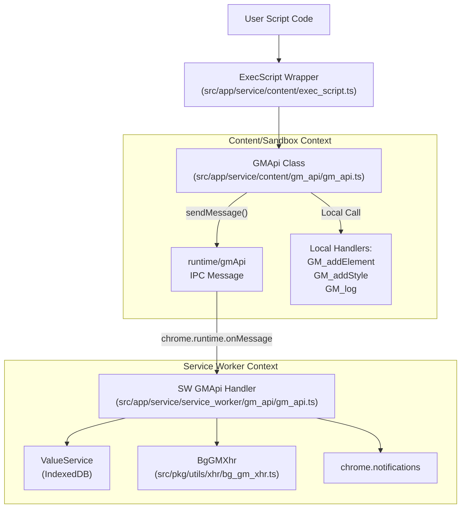
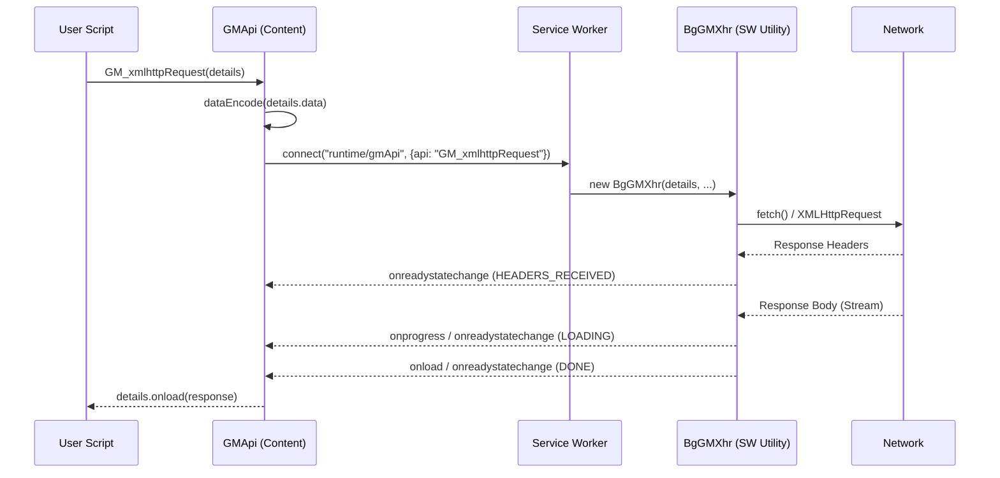

# Standard GM APIs

<details>
<summary>Relevant source files</summary>

The following files were used as context for generating this wiki page:

- [e2e/agent-provider.spec.ts](../e2e/agent-provider.spec.ts)
- [e2e/vscode-connect.spec.ts](../e2e/vscode-connect.spec.ts)
- [example/crontab/crontab.js](../example/crontab/crontab.js)
- [example/tests/gm_api_async_test.js](../example/tests/gm_api_async_test.js)
- [example/tests/gm_api_sync_test.js](../example/tests/gm_api_sync_test.js)
- [example/tests/gm_download_test.js](../example/tests/gm_download_test.js)
- [example/tests/gm_xhr_cookie_test.js](../example/tests/gm_xhr_cookie_test.js)
- [example/tests/gm_xhr_redirect_test.js](../example/tests/gm_xhr_redirect_test.js)
- [example/tests/gm_xhr_test.js](../example/tests/gm_xhr_test.js)
- [example/tests/window_message_test.js](../example/tests/window_message_test.js)
- [example/window_onurlchange.js](../example/window_onurlchange.js)
- [src/app/service/agent/core/tools/tab_tools.ts](../src/app/service/agent/core/tools/tab_tools.ts)
- [src/app/service/agent/service_worker/dom.ts](../src/app/service/agent/service_worker/dom.ts)
- [src/app/service/content/global.ts](../src/app/service/content/global.ts)
- [src/app/service/content/gm_api/gm_api.test.ts](../src/app/service/content/gm_api/gm_api.test.ts)
- [src/app/service/content/gm_api/gm_api.ts](../src/app/service/content/gm_api/gm_api.ts)
- [src/app/service/content/gm_api/gm_xhr.ts](../src/app/service/content/gm_api/gm_xhr.ts)
- [src/app/service/service_worker/gm_api/gm_api.test.ts](../src/app/service/service_worker/gm_api/gm_api.test.ts)
- [src/app/service/service_worker/gm_api/gm_api.ts](../src/app/service/service_worker/gm_api/gm_api.ts)
- [src/app/service/service_worker/gm_api/gm_xhr.ts](../src/app/service/service_worker/gm_api/gm_xhr.ts)
- [src/app/service/service_worker/gm_api/mv3_utils.ts](../src/app/service/service_worker/gm_api/mv3_utils.ts)
- [src/pkg/utils/xhr/bg_gm_xhr.ts](../src/pkg/utils/xhr/bg_gm_xhr.ts)
- [src/pkg/utils/xhr/fetch_xhr.ts](../src/pkg/utils/xhr/fetch_xhr.ts)
- [tests/example/crontab.test.ts](../tests/example/crontab.test.ts)
- [tests/runtime/gm_api.test.ts](../tests/runtime/gm_api.test.ts)

</details>


## Purpose and Scope

This page documents the standard Greasemonkey (GM) APIs that ScriptCat provides to userscripts for interacting with browser capabilities and persistent storage. These APIs follow Tampermonkey compatibility conventions and provide both callback-based (`GM_*`) and Promise-based (`GM.*`) interfaces.

**Related pages:**
- For ScriptCat-specific extensions (`CAT_*` APIs), see [ScriptCat Extensions (4.2)](./4-2-scriptcat-extensions-cat-apis.md)
- For menu command registration (`GM_registerMenuCommand`), see [Menu Command System (4.3)](./4-3-menu-command-system.md)
- For permission system and `@grant` directives, see [Script Execution Environment (3)](./3-script-execution-environment.md)

---

## Dual API Interface Design

ScriptCat implements two parallel API surfaces for Tampermonkey compatibility and modern async/await patterns. These are defined in the global type declarations and initialized during script execution.

### Callback-Based APIs (`GM_*`)

The traditional Tampermonkey-compatible interface using callbacks for asynchronous operations. 

```typescript
// Callback-based example
GM_setValue('key', 'value');  
GM_xmlhttpRequest({
  url: 'https://example.com',
  onload: (response) => { /* handle response */ }
});
```

### Promise-Based APIs (`GM.*`)

Modern Promise-based interface that returns Promises for all operations, enabling async/await usage. This is exposed via a global `GM` object. ScriptCat ensures that if a script `@grant`s a `GM_*` API, the corresponding `GM.*` version is also made available [src/app/service/content/gm_api/gm_api.test.ts:83-91](../src/app/service/content/gm_api/gm_api.test.ts#L83-L91).

```typescript
// Promise-based example
await GM.setValue('key', 'value');
const response = await GM.xmlHttpRequest({
  url: 'https://example.com'
});
```

**Sources:** [src/app/service/content/gm_api/gm_api.test.ts:33-158](../src/app/service/content/gm_api/gm_api.test.ts#L33-L158), [src/app/service/content/gm_api/gm_api.ts:212-300](../src/app/service/content/gm_api/gm_api.ts#L212-L300)

---

## API Architecture Flow

The following diagram illustrates the data flow from a User Script's API call through the execution environment to the final handler in the Service Worker or Content Script.

### System Entity Mapping: API Request Path



**Key architectural points:**
1. **GMApi Class**: The core implementation of the API surface in the content context. It inherits from `GM_Base` which provides the `sendMessage` and `connect` primitives for IPC [src/app/service/content/gm_api/gm_api.ts:75-209](../src/app/service/content/gm_api/gm_api.ts#L75-L209).
2. **Context Validation**: Every API call checks `isInvalidContext()` to ensure the extension context is still active before attempting IPC [src/app/service/content/gm_api/gm_api.ts:134-150](../src/app/service/content/gm_api/gm_api.ts#L134-L150).
3. **IPC Protocol**: Most APIs use the `runtime/gmApi` message topic, passing a `MessageRequest` object containing the `uuid`, `api` name, and `params` [src/app/service/content/gm_api/gm_api.ts:141-146](../src/app/service/content/gm_api/gm_api.ts#L141-L146).
4. **Permission Verification**: The Service Worker uses `PermissionVerify` to check if a script has the required `@grant` and if user confirmation is needed [src/app/service/service_worker/gm_api/gm_api.ts:10-11](../src/app/service/service_worker/gm_api/gm_api.ts#L10-L11).

**Sources:** [src/app/service/content/gm_api/gm_api.ts:75-209](../src/app/service/content/gm_api/gm_api.ts#L75-L209), [src/app/service/service_worker/gm_api/gm_api.ts:1-140](../src/app/service/service_worker/gm_api/gm_api.ts#L1-L140)

---

## Value Storage APIs

Persistent key-value storage scoped to each userscript. ScriptCat uses IndexedDB via Dexie for the underlying storage layer, managed by `ValueService`.

### Storage Operations

| Callback API | Promise API | Description |
|--------------|-------------|-------------|
| `GM_getValue(name, def?)` | `GM.getValue(name, def?)` | Retrieve a stored value [src/app/service/content/gm_api/gm_api.ts:212](../src/app/service/content/gm_api/gm_api.ts#L212) |
| `GM_setValue(name, val)` | `GM.setValue(name, val)` | Store a value [src/app/service/content/gm_api/gm_api.ts:212](../src/app/service/content/gm_api/gm_api.ts#L212) |
| `GM_deleteValue(name)` | `GM.deleteValue(name)` | Delete a stored value [src/app/service/content/gm_api/gm_api.ts:212](../src/app/service/content/gm_api/gm_api.ts#L212) |
| `GM_listValues()` | `GM.listValues()` | List all stored keys [src/app/service/content/gm_api/gm_api.ts:212](../src/app/service/content/gm_api/gm_api.ts#L212) |

### Value Change Listeners

Scripts can monitor changes to specific keys, even those triggered by other tabs or the background script.

```typescript
// Registration returns a listenerId used for removal
const id = GM_addValueChangeListener('config', (name, oldVal, newValue, remote) => {
    if (remote) console.log('Value changed in another tab');
});
GM_removeValueChangeListener(id);
```

**Implementation Details**:
- **Remote Flag**: The `remote` boolean indicates if the change originated from a different execution context (e.g., another tab) [src/app/service/content/gm_api/gm_api.ts:177-198](../src/app/service/content/gm_api/gm_api.ts#L177-L198).
- **Sync**: ScriptCat uses `valueUpdate` messages to synchronize state across contexts [src/app/service/content/gm_api/gm_api.ts:171-202](../src/app/service/content/gm_api/gm_api.ts#L171-L202).

**Sources:** [src/app/service/content/gm_api/gm_api.ts:171-202](../src/app/service/content/gm_api/gm_api.ts#L171-L202), [src/app/service/content/gm_api/gm_api.test.ts:179-209](../src/app/service/content/gm_api/gm_api.test.ts#L179-L209)

---

## HTTP Request APIs (GM_xmlhttpRequest)

Cross-origin HTTP requests that bypass the standard browser Same-Origin Policy (SOP) by proxying through the Service Worker.

### System Entity Mapping: XHR Execution Flow



### Key Features
- **Response Types**: Supports `text`, `json`, `arraybuffer`, `blob`, `document`, and `stream` [src/app/service/content/gm_api/gm_xhr.ts:51](../src/app/service/content/gm_api/gm_xhr.ts#L51).
- **Streaming**: Implements a `ChunkResponseCode` system to handle data chunks for `stream` response types [src/app/service/content/gm_api/gm_xhr.ts:10-15](../src/app/service/content/gm_api/gm_xhr.ts#L10-L15).
- **Security**: Checks for `unsafeHeaders` (e.g., `user-agent`, `sec-`, `proxy-`) before sending [src/app/service/service_worker/gm_api/gm_api.ts:154-183](../src/app/service/service_worker/gm_api/gm_api.ts#L154-L183).
- **@connect Validation**: Enforces `@connect` metadata rules via `getConnectMatched` to verify if the script is permitted to access the target domain [src/app/service/service_worker/gm_api/gm_api.test.ts:24-109](../src/app/service/service_worker/gm_api/gm_api.test.ts#L24-L109).
- **MV3 Cookie Handling**: In Manifest V3, ScriptCat merges script-provided cookies with browser cookies for non-anonymous requests, ensuring priority for script-defined values [src/app/service/service_worker/gm_api/gm_api.ts:205-256](../src/app/service/service_worker/gm_api/gm_api.ts#L205-L256).

**Sources:** [src/app/service/content/gm_api/gm_xhr.ts:10-57](../src/app/service/content/gm_api/gm_xhr.ts#L10-L57), [src/app/service/service_worker/gm_api/gm_api.ts:154-256](../src/app/service/service_worker/gm_api/gm_api.ts#L154-L256), [src/app/service/service_worker/gm_api/gm_api.test.ts:148-165](../src/app/service/service_worker/gm_api/gm_api.test.ts#L148-L165)

---

## Notification API

ScriptCat supports system-level notifications with custom images and button interactions.

```typescript
GM_notification({
  text: "Hello from ScriptCat",
  title: "Notification",
  image: "https://example.com/icon.png",
  onclick: () => console.log("Clicked!"),
  buttons: [{ title: "Action 1" }]
});
```

**Implementation**:
- **Persistence**: Notifications are tracked in the Service Worker using `notificationsUpdate` and `NotificationOptionCache` [src/app/service/service_worker/gm_api/gm_api.ts:38-39](../src/app/service/service_worker/gm_api/gm_api.ts#L38-L39).
- **Event Handling**: Click events and button clicks are sent back from the Service Worker via the `EmitEventRequest` protocol to the specific tab [src/app/service/service_worker/gm_api/gm_api.ts:30-36](../src/app/service/service_worker/gm_api/gm_api.ts#L30-L36).

**Sources:** [src/app/service/service_worker/gm_api/gm_api.ts:30-40](../src/app/service/service_worker/gm_api/gm_api.ts#L30-L40), [example/tests/gm_api_sync_test.js:20-25](../example/tests/gm_api_sync_test.js#L20-L25)

---

## Tab and Window Management

Scripts can interact with browser tabs and control window focus.

- **`GM_openInTab(url, options)`**: Opens a new tab via `chrome.tabs.create`. Options include `active`, `insert`, and `setParent` [src/app/service/service_worker/gm_api/gm_api.ts:17-18](../src/app/service/service_worker/gm_api/gm_api.ts#L17-L18).
- **`window.focus()`**: ScriptCat provides a special implementation for `window.focus` that ensures both the tab is active and the parent window is brought to the foreground [src/app/service/service_worker/gm_api/gm_api.test.ts:127-146](../src/app/service/service_worker/gm_api/gm_api.test.ts#L127-L146).

**Sources:** [src/app/service/service_worker/gm_api/gm_api.test.ts:127-146](../src/app/service/service_worker/gm_api/gm_api.test.ts#L127-L146), [src/app/service/service_worker/gm_api/gm_api.ts:17-18](../src/app/service/service_worker/gm_api/gm_api.ts#L17-L18)

---

## DOM and Style APIs

These APIs are typically executed within the content script context to modify the page UI using native browser primitives.

- **`GM_addStyle(css)`**: Injects a `<style>` element into the document [example/tests/gm_api_async_test.js:140-150](../example/tests/gm_api_async_test.js#L140-L150).
- **`GM_addElement(tag, attributes)`**: Creates and appends an element, ensuring compatibility with modern web standards [example/tests/gm_api_sync_test.js:17-18](../example/tests/gm_api_sync_test.js#L17-L18).
- **`GM_setClipboard(data, info)`**: Copies data to the system clipboard. In Manifest V3 background contexts, this uses an `Offscreen` document for reliable execution [src/app/service/service_worker/gm_api/gm_api.ts:60](../src/app/service/service_worker/gm_api/gm_api.ts#L60).

**Sources:** [example/tests/gm_api_async_test.js:140-165](../example/tests/gm_api_async_test.js#L140-L165), [src/app/service/service_worker/gm_api/gm_api.ts:60](../src/app/service/service_worker/gm_api/gm_api.ts#L60)

---

## Script Information (GM_info)

The `GM_info` object provides metadata about the script and its environment, including the `sandboxMode` and `userAgentData` [src/app/service/content/gm_api/gm_api.test.ts:23-31](../src/app/service/content/gm_api/gm_api.test.ts#L23-L31).

**Sources:** [src/app/service/content/gm_api/gm_api.test.ts:23-31](../src/app/service/content/gm_api/gm_api.test.ts#L23-L31), [example/tests/gm_api_sync_test.js:85-92](../example/tests/gm_api_sync_test.js#L85-L92)

---
