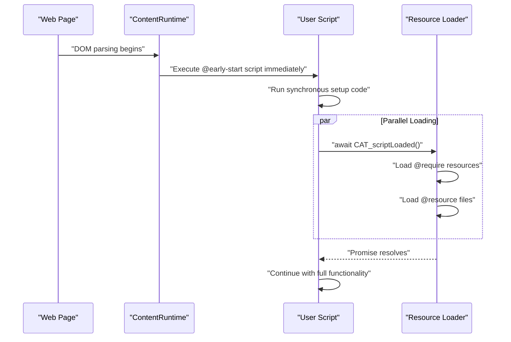
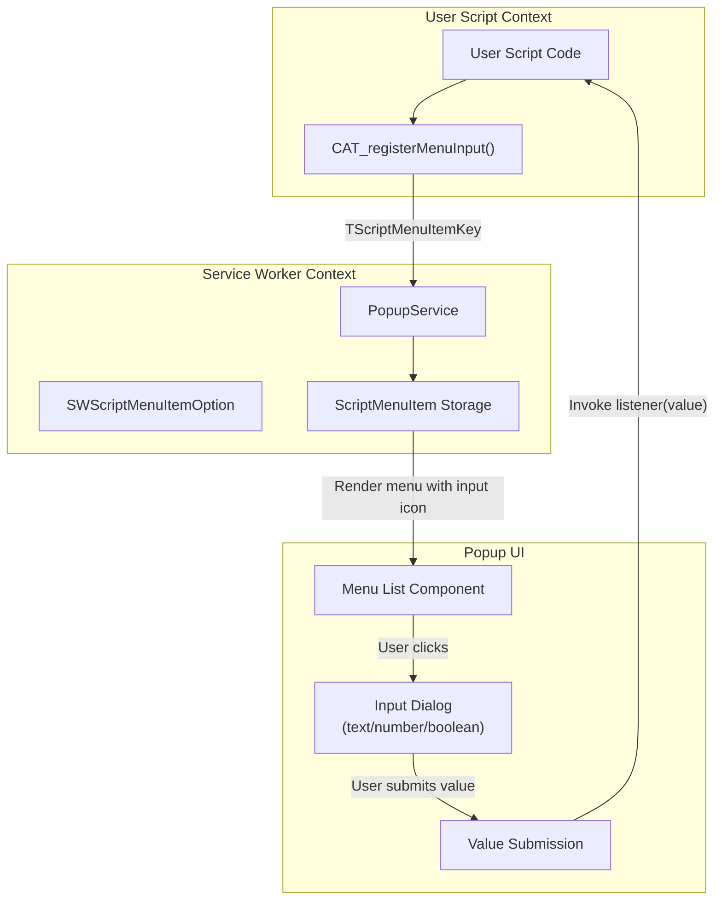
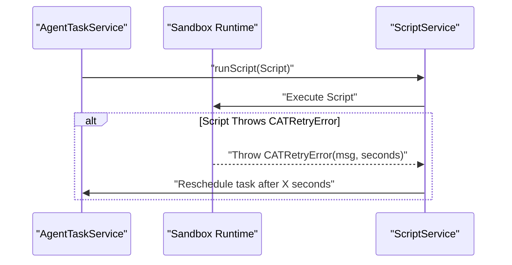

# ScriptCat Extensions (CAT_* APIs)

<details>
<summary>Relevant source files</summary>

The following files were used as context for generating this wiki page:

- [e2e/agent-provider.spec.ts](../e2e/agent-provider.spec.ts)
- [e2e/vscode-connect.spec.ts](../e2e/vscode-connect.spec.ts)
- [example/window_onurlchange.js](../example/window_onurlchange.js)
- [src/app/service/content/global.ts](../src/app/service/content/global.ts)
- [src/app/service/content/gm_api/gm_api.test.ts](../src/app/service/content/gm_api/gm_api.test.ts)
- [src/app/service/content/gm_api/gm_api.ts](../src/app/service/content/gm_api/gm_api.ts)
- [src/app/service/content/gm_api/gm_xhr.ts](../src/app/service/content/gm_api/gm_xhr.ts)
- [src/app/service/offscreen/gm_api.ts](../src/app/service/offscreen/gm_api.ts)
- [src/app/service/service_worker/clipboard.ts](../src/app/service/service_worker/clipboard.ts)
- [src/app/service/service_worker/types.ts](../src/app/service/service_worker/types.ts)
- [src/template/scriptcat.d.tpl](../src/template/scriptcat.d.tpl)
- [src/types/main.d.ts](../src/types/main.d.ts)
- [src/types/scriptcat.d.ts](../src/types/scriptcat.d.ts)

</details>


## Purpose and Scope

This document covers the **ScriptCat-specific API extensions** (prefixed with `CAT_*`) that extend beyond the standard Greasemonkey/Tampermonkey `GM_*` APIs. These extensions provide enhanced functionality for file storage, background script lifecycle management, advanced menu inputs, and specialized helper functions for handling binary data and documents.

For standard Greasemonkey-compatible APIs (`GM_setValue`, `GM_xmlhttpRequest`, etc.), see [Standard GM APIs](./4-1-standard-gm-apis.md). For menu command registration, see [Menu Command System](./4-3-menu-command-system.md).

---

## API Overview

The `CAT_*` API namespace provides ScriptCat-exclusive functionality organized into the following categories:

| Category | APIs | Description |
|----------|------|-------------|
| **Lifecycle Management** | `CAT_scriptLoaded()` | Synchronization for `@early-start` scripts. |
| **Enhanced Menu System** | `CAT_registerMenuInput()`, `CAT_unregisterMenuInput()` | Interactive menu items with UI widgets. |
| **Binary & DOM Helpers** | `CAT_createBlobUrl()`, `CAT_fetchBlob()`, `CAT_fetchDocument()` | Advanced data handling utilities. |
| **Agent & Automation** | `CAT_agent`, `CAT_agent_dom`, etc. | AI-driven automation extensions. |
| **Background Retry** | `CATRetryError` | Scheduling logic for background scripts. |

**Sources:** [src/types/scriptcat.d.ts:138-188](../src/types/scriptcat.d.ts#L138-L188), [src/template/scriptcat.d.tpl:138-163](../src/template/scriptcat.d.tpl#L138-L163)

---

## Lifecycle Management APIs

### CAT_scriptLoaded()

**Purpose:** Provides a promise that resolves when the script has fully loaded all dependencies. This is essential when using the `@early-start` metadata directive, which allows scripts to execute before the page's DOM is ready.

**Signature:**
```typescript
declare function CAT_scriptLoaded(): Promise<void>;
```

**Implementation Details:**
In the `GM_Base` class, this is handled via a `loadScriptPromise`. If a script is waiting for initialization, `sendMessage` calls are deferred until the promise resolves.

**Sources:** [src/types/scriptcat.d.ts:179-179](../src/types/scriptcat.d.ts#L179-L179), [src/app/service/content/gm_api/gm_api.ts:111-115](../src/app/service/content/gm_api/gm_api.ts#L111-L115), [src/app/service/content/gm_api/gm_api.ts:136-138](../src/app/service/content/gm_api/gm_api.ts#L136-L138)

### Early Start Execution Flow



**Sources:** [src/types/scriptcat.d.ts:179-179](../src/types/scriptcat.d.ts#L179-L179), [src/app/service/content/gm_api/gm_api.ts:111-115](../src/app/service/content/gm_api/gm_api.ts#L111-L115)

---

## Enhanced Menu System APIs

### CAT_registerMenuInput()

**Purpose:** Registers an **interactive menu item with input capabilities**, extending the standard `GM_registerMenuCommand` to support text, number, and boolean inputs.

**Signature:**
```typescript
declare function CAT_registerMenuInput(
  name: string,
  listener?: (inputValue?: any) => void,
  options_or_accessKey?:
    | {
        id?: number | string;
        accessKey?: string;
        autoClose?: boolean;
        nested?: boolean;
        individual?: boolean;
        inputType?: "text" | "number" | "boolean";
        title?: string;
        inputLabel?: string;
        inputDefaultValue?: string | number | boolean;
        inputPlaceholder?: string;
      }
    | string
): number;
```

**Sources:** [src/types/scriptcat.d.ts:151-172](../src/types/scriptcat.d.ts#L151-L172), [src/app/service/service_worker/types.ts:69-81](../src/app/service/service_worker/types.ts#L69-L81)

### Menu Input Architecture



**Sources:** [src/app/service/service_worker/types.ts:115-166](../src/app/service/service_worker/types.ts#L115-L166), [src/app/service/service_worker/types.ts:175-184](../src/app/service/service_worker/types.ts#L175-L184)

---

## Binary and DOM Helpers

### CAT_createBlobUrl()
Generates a blob URL from a `Blob` object. ScriptCat manages the lifecycle of these URLs to ensure they remain valid for script operations.

**Sources:** [src/types/scriptcat.d.ts:182-182](../src/types/scriptcat.d.ts#L182-L182), [src/app/service/content/gm_api/gm_xhr.ts:76-83](../src/app/service/content/gm_api/gm_xhr.ts#L76-L83)

### CAT_fetchBlob()
A helper function specifically for fetching a URL and returning the raw `Blob` data. This is often used in conjunction with `GM_xmlhttpRequest` when the `responseType` is set to `stream` or `blob`.

**Sources:** [src/types/scriptcat.d.ts:185-185](../src/types/scriptcat.d.ts#L185-L185)

### CAT_fetchDocument()
Fetches a URL and parses it as a `Document`. In content scripts, it leverages `CustomEventMessage` to pass the document node between the extension context and the page context using `relatedTarget`.

**Sources:** [src/types/scriptcat.d.ts:188-188](../src/types/scriptcat.d.ts#L188-L188), [src/app/service/content/gm_api/gm_xhr.ts:115-119](../src/app/service/content/gm_api/gm_xhr.ts#L115-L119)

---

## Background Script Retry System

### CATRetryError

**Purpose:** A specialized error class for **background scripts**. When a background script throws a `CATRetryError`, the `ScriptService` reschedules the execution based on the provided time or date instead of marking the task as failed.

**Signature:**
```typescript
declare class CATRetryError {
  constructor(message: string, seconds: number);
  constructor(message: string, date: Date);
}
```

### Retry Error Flow



**Sources:** [src/app/service/service_worker/types.ts:1-40](../src/app/service/service_worker/types.ts#L1-L40), [src/types/scriptcat.d.ts:179-180](../src/types/scriptcat.d.ts#L179-L180)

---

## Implementation Architecture

CAT APIs are implemented as methods on the `GMApi` class. They often bridge between the Content Script environment and the Service Worker via the `sendMessage` and `connect` protocols.

```mermaid
graph LR
    subgraph "Content/Inject Context"
        [GMApi_Instance] --> [GMContext_Decorator]
        [GMApi_Instance] -- "sendMessage" --> [Message_Bus]
    end

    subgraph "Service Worker / Offscreen"
        [Message_Bus] --> [RuntimeService]
        [RuntimeService] --> [BgGMXhr]
        [RuntimeService] --> [ClipboardService]
    end

    [BgGMXhr] -- "Network" --> [Remote_Server]
```

**Sources:** [src/app/service/content/gm_api/gm_api.ts:212-225](../src/app/service/content/gm_api/gm_api.ts#L212-L225), [src/app/service/offscreen/gm_api.ts:6-11](../src/app/service/offscreen/gm_api.ts#L6-L11), [src/app/service/service_worker/clipboard.ts:5-15](../src/app/service/service_worker/clipboard.ts#L5-L15)

---

## Clipboard and Window Management

### CAT_setClipboard
While scripts use `GM_setClipboard`, the underlying implementation often routes through `CAT_setClipboard` logic in the Offscreen document to bypass Manifest V3 limitations on background page DOM access.

**Sources:** [src/app/service/offscreen/gm_api.ts:19-21](../src/app/service/offscreen/gm_api.ts#L19-L21), [src/app/service/service_worker/clipboard.ts:18-39](../src/app/service/service_worker/clipboard.ts#L18-L39)

### nativePageWindowOpen
A specialized handler in the Offscreen document that ensures `window.open` calls from background contexts are handled correctly by the browser.

**Sources:** [src/app/service/offscreen/gm_api.ts:14-17](../src/app/service/offscreen/gm_api.ts#L14-L17)

---
