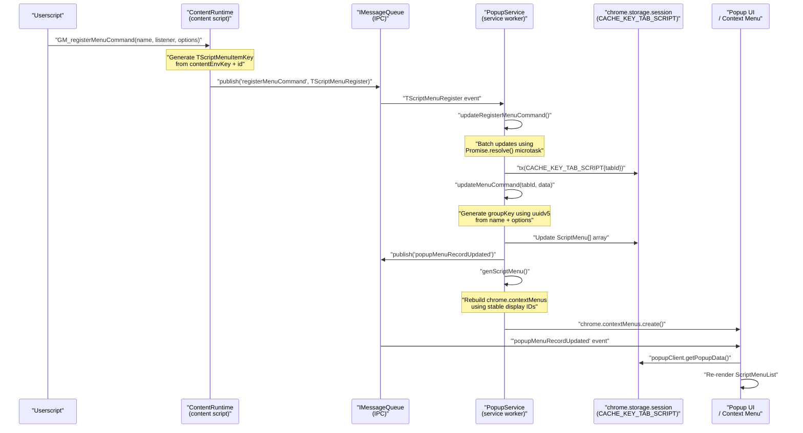
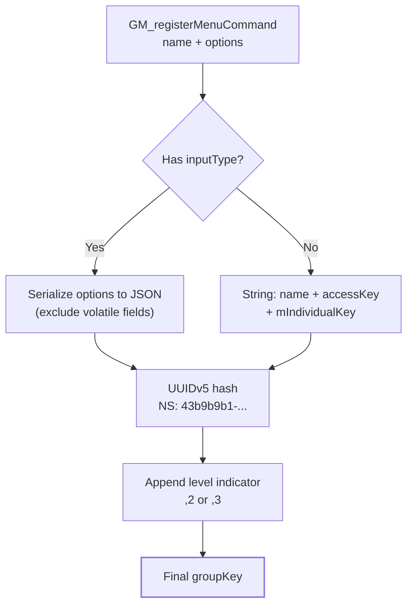
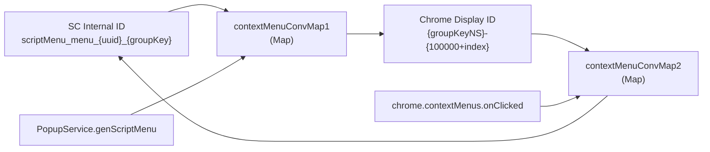
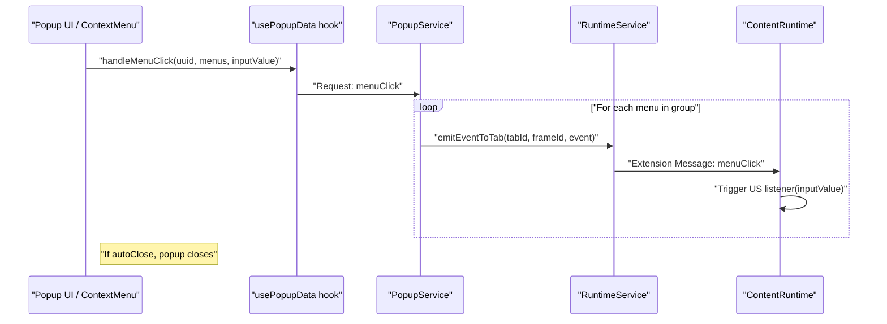

# Menu Command System

<details>
<summary>Relevant source files</summary>

The following files were used as context for generating this wiki page:

- [src/app/service/offscreen/gm_api.ts](../src/app/service/offscreen/gm_api.ts)
- [src/app/service/service_worker/clipboard.ts](../src/app/service/service_worker/clipboard.ts)
- [src/app/service/service_worker/types.ts](../src/app/service/service_worker/types.ts)
- [src/pages/popup/App.tsx](../src/pages/popup/App.tsx)
- [src/pkg/utils/utils.test.ts](../src/pkg/utils/utils.test.ts)
- [src/pkg/utils/utils.ts](../src/pkg/utils/utils.ts)
- [src/template/scriptcat.d.tpl](../src/template/scriptcat.d.tpl)
- [src/types/main.d.ts](../src/types/main.d.ts)
- [src/types/scriptcat.d.ts](../src/types/scriptcat.d.ts)

</details>


The Menu Command System enables userscripts to register custom menu items that appear in the ScriptCat popup and browser context menus. Scripts can create clickable commands, input fields, keyboard shortcuts, and organize menus hierarchically. The system handles menu registration across multiple execution contexts (main frame, iframes, background scripts), consolidates duplicate entries, and propagates clicks back to the originating script.

For information about the popup UI component that displays these menus, see [7.2 Popup Interface](./7-2-popup-interface.md). For the underlying message passing infrastructure, see [5. Inter-Process Communication](./5-inter-process-communication.md).

---

## API Surface

Userscripts interact with the menu system through two primary APIs with both callback and Promise-based interfaces:

### GM_registerMenuCommand / GM.registerMenuCommand

The standard Greasemonkey/Tampermonkey-compatible API for registering menu commands.

**Callback-based signature:**
```typescript
function GM_registerMenuCommand(
  name: string,
  listener?: (inputValue?: any) => void,
  options_or_accessKey?: string | {
    id?: number | string;
    accessKey?: string;
    autoClose?: boolean;
    nested?: boolean;
    individual?: boolean;
  }
): number;
```

**Promise-based signature (GM object):**
```typescript
GM.registerMenuCommand(
  name: string,
  listener?: (inputValue?: any) => void,
  options?: string | {
    id?: number | string;
    accessKey?: string;
    autoClose?: boolean;
    title?: string;
    icon?: string;
    closeOnClick?: boolean;
  }
): Promise<number | string | undefined>;
```

Returns a numeric ID that can be used with `GM_unregisterMenuCommand` to remove the menu item.

Sources: [src/types/scriptcat.d.ts:125-142](../src/types/scriptcat.d.ts#L125-L142), [src/template/scriptcat.d.tpl:119-131](../src/template/scriptcat.d.tpl#L119-L131)

### CAT_registerMenuInput (ScriptCat Extension)

ScriptCat-specific API that extends menu commands with input field capabilities, allowing users to provide values before execution.

```typescript
function CAT_registerMenuInput(
  name: string,
  listener?: (inputValue?: any) => void,
  options?: string | {
    id?: number | string;
    accessKey?: string;
    autoClose?: boolean;
    nested?: boolean;
    individual?: boolean;
    inputType?: "text" | "number" | "boolean";
    title?: string;
    inputLabel?: string;
    inputDefaultValue?: string | number | boolean;
    inputPlaceholder?: string;
  }
): number;
```

The `inputType` option determines the input control rendered:
- `"text"`: Text input field
- `"number"`: Numeric input field  
- `"boolean"`: Toggle switch

Sources: [src/types/scriptcat.d.ts:151-173](../src/types/scriptcat.d.ts#L151-L173), [src/template/scriptcat.d.tpl:138-156](../src/template/scriptcat.d.tpl#L138-L156)

### Menu Unregistration

Both standard and input menus are unregistered using the same function:

```typescript
function GM_unregisterMenuCommand(id: number): void;
const CAT_unregisterMenuInput: typeof GM_unregisterMenuCommand;
```

Sources: [src/types/scriptcat.d.ts:145,176](../src/types/scriptcat.d.ts), [src/template/scriptcat.d.tpl:133,158](../src/template/scriptcat.d.tpl)

---

## Menu Registration Flow

Registration involves capturing the command in the script context and propagating it to the `PopupService` in the Service Worker.

### Registration Data Flow
Title: Menu Command Registration Flow


Sources: [src/app/service/service_worker/types.ts:146-154](../src/app/service/service_worker/types.ts#L146-L154), [src/app/service/service_worker/types.ts:187-203](../src/app/service/service_worker/types.ts#L187-L203)

---

## Menu Item Data Structures

The system transforms user-facing options through several internal representations:

### ScriptMenuItemOption (User-facing)

The options object accepted by `GM_registerMenuCommand` and `CAT_registerMenuInput`.

| Field | Type | Default | Description |
|-------|------|---------|-------------|
| `id` | `number \| string` | auto-increment | User-specified menu ID for later unregistration |
| `accessKey` | `string` | - | Keyboard shortcut (single character) |
| `autoClose` | `boolean` | `true` | Close popup after menu click |
| `nested` | `boolean` | `true` | Display as 3-level menu (ScriptCat→Script→Command) vs 2-level |
| `individual` | `boolean` | `false` | Don't merge identical menu items from different frames |
| `inputType` | `"text" \| "number" \| "boolean"` | - | Enable input field (CAT_registerMenuInput only) |
| `title` | `string` | - | Tooltip for input field |
| `inputLabel` | `string` | - | Label text for input field |
| `inputDefaultValue` | `string \| number \| boolean` | - | Pre-filled input value |
| `inputPlaceholder` | `string` | - | Input placeholder text |

Sources: [src/app/service/service_worker/types.ts:69-81](../src/app/service/service_worker/types.ts#L69-L81)

### ScriptMenuItem (Storage Format)

Individual menu command stored in session cache within a `ScriptMenu` object.

```typescript
type ScriptMenuItem = {
  groupKey: string;           // UUIDv5 hash for display consolidation
  key: TScriptMenuItemKey;    // Unique key: "{contentEnvKey}.t{id}"
  name: TScriptMenuItemName;  // Display text
  options?: SWScriptMenuItemOption;
  tabId: number;              // -1 for background scripts
  frameId?: number;           // iframe identifier
  documentId?: string;        // Document identifier for multi-doc frames
};
```

Sources: [src/app/service/service_worker/types.ts:146-154](../src/app/service/service_worker/types.ts#L146-L154)

---

## Menu Grouping and Deduplication

The system employs a grouping strategy to consolidate menus from multiple frames while preserving all listeners.

### GroupKey Calculation

Title: GroupKey Logic for Deduplication


Sources: [src/app/service/service_worker/types.ts:147-160](../src/app/service/service_worker/types.ts#L147-L160)

---

## Chrome Context Menu Integration

ScriptCat displays script menus in the browser's native right-click context menu. Because Chrome context menu IDs must be stable to avoid internal conflicts, ScriptCat uses a mapping system.

### Context Menu ID Mapping (Code Entity Space)

Title: Context Menu ID Mapping Logic


Sources: [src/app/service/service_worker/types.ts:125-135](../src/app/service/service_worker/types.ts#L125-L135), [src/app/service/service_worker/types.ts:162-166](../src/app/service/service_worker/types.ts#L162-L166)

---

## Popup Menu Display

The popup window renders menus in a collapsible list format.

### Input Menu Rendering

For menus registered with `inputType`, the popup renders Shadcn/UI (Tailwind v4) form controls:

| `inputType` | Component | Property Mapping |
|-------------|-----------|------------------|
| `"text"` | `Input` | `placeholder: options.inputPlaceholder` |
| `"number"` | `Input` (type number) | `placeholder: options.inputPlaceholder` |
| `"boolean"` | `Switch` | `defaultChecked: options.inputDefaultValue` |

Sources: [src/pages/popup/App.tsx:26-38](../src/pages/popup/App.tsx#L26-L38), [src/app/service/service_worker/types.ts:75-80](../src/app/service/service_worker/types.ts#L75-L80)

### Keyboard Shortcuts (accessKey)

The popup registers keypress listeners for menu commands via a `useEffect` hook in the main `App` component. When the popup is open, pressing the defined `accessKey` triggers the command, provided the focus is not on an input or editable element.

Sources: [src/pages/popup/App.tsx:65-93](../src/pages/popup/App.tsx#L65-L93)

---

## Menu Click Execution

When a menu is clicked, the system routes the event back to the originating script's listener.

### Menu Click Execution Path
Title: Menu Click Execution Path


Sources: [src/pages/popup/App.tsx:64-65](../src/pages/popup/App.tsx#L64-L65), [src/pages/popup/App.tsx:173](../src/pages/popup/App.tsx#L173), [src/app/service/service_worker/types.ts:175-176](../src/app/service/service_worker/types.ts#L175-L176)

---

## Background Script Menu Handling

Background scripts have menus managed separately using a virtual `tabId: -1`.

### Background Menu Lifecycle

Background menus are persisted in the session cache and rendered in a separate section of the popup accordion. They allow background tasks to expose configuration or manual triggers to the user interface.

Sources: [src/app/service/service_worker/types.ts:151](../src/app/service/service_worker/types.ts#L151), [src/pages/popup/App.tsx:186-188](../src/pages/popup/App.tsx#L186-L188)

---

## Implementation Details

### Tab and Frame Isolation
The system uses `TScriptMenuItemKey` (formatted as `{contentEnvKey}.t{id}`) to ensure that menu commands from different frames within the same tab do not collide, while `groupKey` allows the UI to merge visually identical commands for a cleaner interface.

Sources: [src/app/service/service_worker/types.ts:125-135](../src/app/service/service_worker/types.ts#L125-L135), [src/app/service/service_worker/types.ts:147-148](../src/app/service/service_worker/types.ts#L147-L148)

### Offscreen Integration
For specific operations like clipboard access or complex XHR initiated from menu commands, the system utilizes an offscreen document (`GMApi`) to perform privileged actions that are restricted in the Service Worker context.

Sources: [src/app/service/offscreen/gm_api.ts:19-21](../src/app/service/offscreen/gm_api.ts#L19-L21), [src/app/service/service_worker/clipboard.ts:5-15](../src/app/service/service_worker/clipboard.ts#L5-L15)

---
