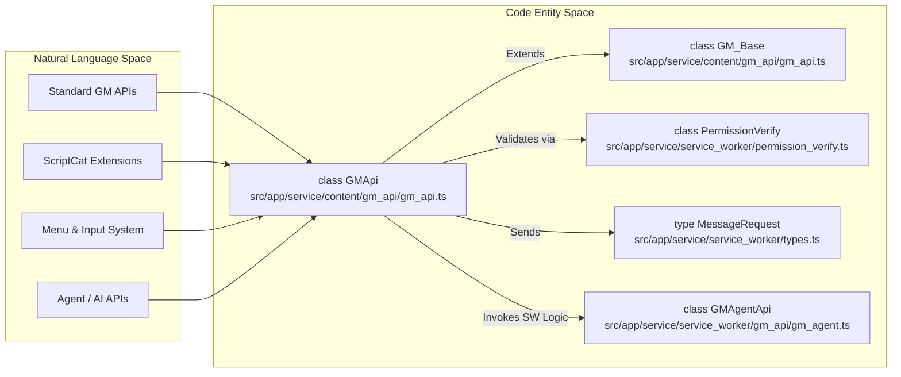
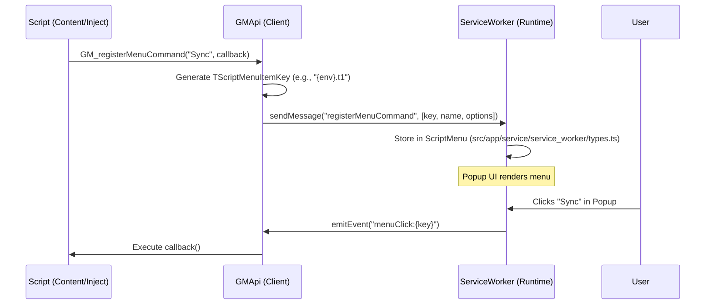

# GM API Reference

Relevant source files

The following files were used as context for generating this wiki page:

- [e2e/agent-provider.spec.ts](../e2e/agent-provider.spec.ts)
- [e2e/vscode-connect.spec.ts](../e2e/vscode-connect.spec.ts)
- [example/tests/gm_xhr_cookie_test.js](../example/tests/gm_xhr_cookie_test.js)
- [example/window_onurlchange.js](../example/window_onurlchange.js)
- [src/app/service/agent/core/tools/tab_tools.ts](../src/app/service/agent/core/tools/tab_tools.ts)
- [src/app/service/agent/service_worker/dom.ts](../src/app/service/agent/service_worker/dom.ts)
- [src/app/service/content/global.ts](../src/app/service/content/global.ts)
- [src/app/service/content/gm_api/gm_api.test.ts](../src/app/service/content/gm_api/gm_api.test.ts)
- [src/app/service/content/gm_api/gm_api.ts](../src/app/service/content/gm_api/gm_api.ts)
- [src/app/service/content/gm_api/gm_xhr.ts](../src/app/service/content/gm_api/gm_xhr.ts)
- [src/app/service/offscreen/gm_api.ts](../src/app/service/offscreen/gm_api.ts)
- [src/app/service/service_worker/clipboard.ts](../src/app/service/service_worker/clipboard.ts)
- [src/app/service/service_worker/gm_api/gm_api.test.ts](../src/app/service/service_worker/gm_api/gm_api.test.ts)
- [src/app/service/service_worker/gm_api/gm_api.ts](../src/app/service/service_worker/gm_api/gm_api.ts)
- [src/app/service/service_worker/types.ts](../src/app/service/service_worker/types.ts)
- [src/template/scriptcat.d.tpl](../src/template/scriptcat.d.tpl)
- [src/types/main.d.ts](../src/types/main.d.ts)
- [src/types/scriptcat.d.ts](../src/types/scriptcat.d.ts)

This page provides a high-level overview of the GreaseMonkey (GM) and ScriptCat (CAT) APIs available to userscripts within the ScriptCat environment. ScriptCat provides a comprehensive set of APIs that maintain compatibility with standard userscript managers while extending functionality through specialized extensions, including a dedicated AI Agent subsystem.

The API layer is implemented via a client-bridge architecture where the userscript environment (Content/Inject/Sandbox) communicates with the extension's Service Worker to perform privileged operations.

## Architecture Overview

ScriptCat utilizes a multi-context execution model. APIs are injected into the script's scope based on the `@grant` metadata. The `GMApi` class acts as the primary orchestrator for these calls, translating local function calls into cross-context messages via the `GM_Base` internal messaging logic [src/app/service/content/gm_api/gm_api.ts:75-209](../src/app/service/content/gm_api/gm_api.ts#L75-L209).

### API Entity Mapping

The following diagram bridges the natural language concepts of userscript APIs to the specific code entities that implement them within ScriptCat.

**Sources:** [src/app/service/content/gm_api/gm_api.ts:212-225](../src/app/service/content/gm_api/gm_api.ts#L212-L225), [src/app/service/service_worker/types.ts:44-53](../src/app/service/service_worker/types.ts#L44-L53), [src/app/service/service_worker/gm_api/gm_api.ts:65-76](../src/app/service/service_worker/gm_api/gm_api.ts#L65-L76)

## Standard GM APIs

ScriptCat supports the standard `GM_*` functions and the modern Promise-based `GM.*` API (compatible with Greasemonkey 4+ and Tampermonkey). These include storage, network requests, and UI notifications.

*   **Storage:** `GM_setValue`, `GM_getValue`, `GM_listValues`, and `GM_deleteValue`. ScriptCat also provides batch versions like `GM_setValues` and `GM_getValues` for performance [src/types/scriptcat.d.ts:84-114](../src/types/scriptcat.d.ts#L84-L114).
*   **Network:** `GM_xmlhttpRequest` for cross-origin requests and `GM_download` for file saving. Requests are processed through specialized strategies in the Service Worker like `GMXhrFetchStrategy` or `GMXhrXhrStrategy` [src/app/service/service_worker/gm_api/gm_xhr.ts:48-52](../src/app/service/service_worker/gm_api/gm_xhr.ts#L48-L52).
*   **UI/DOM:** `GM_notification` for system alerts, `GM_addStyle` for CSS injection, and `GM_addElement` for safe DOM manipulation [src/types/scriptcat.d.ts:180-201](../src/types/scriptcat.d.ts#L180-L201).
*   **Cookies:** `GM_cookie` allows for fine-grained cookie management (get, set, list, delete) [src/types/scriptcat.d.ts:204-208](../src/types/scriptcat.d.ts#L204-L208).

For details, see [Standard GM APIs](./4-1-standard-gm-apis.md).

**Sources:** [src/types/scriptcat.d.ts:84-208](../src/types/scriptcat.d.ts#L84-L208), [src/app/service/content/gm_api/gm_api.ts:212-230](../src/app/service/content/gm_api/gm_api.ts#L212-L230), [src/app/service/service_worker/gm_api/gm_xhr.ts:48-52](../src/app/service/service_worker/gm_api/gm_xhr.ts#L48-L52)

## ScriptCat Extensions (CAT_* APIs)

Beyond standard compatibility, ScriptCat introduces unique APIs prefixed with `CAT_` to handle advanced scenarios like background script synchronization and specialized UI inputs.

*   **Lifecycle:** `CAT_scriptLoaded` allows scripts using `@early-start` to wait until the full environment is ready [src/types/scriptcat.d.ts:179](../src/types/scriptcat.d.ts#L179).
*   **Input Handling:** `CAT_registerMenuInput` provides enhanced menu interactions that allow scripts to prompt users for text, number, or boolean data directly from the extension popup [src/types/scriptcat.d.ts:151-173](../src/types/scriptcat.d.ts#L151-L173).
*   **Agent Integration:** `CAT_agentConversation`, `CAT_agentDom`, and `CAT_agentSkills` provide scripts access to the AI Agent subsystem for DOM automation and LLM interactions [src/app/service/service_worker/gm_api/gm_api.ts:65-76](../src/app/service/service_worker/gm_api/gm_api.ts#L65-L76).
*   **Utility:** `CAT_createBlobUrl` and `CAT_fetchBlob` for managing large data transfers between contexts [src/types/scriptcat.d.ts:182-185](../src/types/scriptcat.d.ts#L182-L185).

For details, see [ScriptCat Extensions (CAT_* APIs)](./4-2-scriptcat-extensions-cat-apis.md).

**Sources:** [src/types/scriptcat.d.ts:151-185](../src/types/scriptcat.d.ts#L151-L185), [src/app/service/service_worker/gm_api/gm_api.ts:65-76](../src/app/service/service_worker/gm_api/gm_api.ts#L65-L76), [src/app/service/content/gm_api/gm_api.ts:29-41](../src/app/service/content/gm_api/gm_api.ts#L29-L41)

## Menu Command System

The menu system allows scripts to register custom actions in the ScriptCat popup and browser context menus. ScriptCat enhances this with nested menus and individual frame handling.

| Function | Purpose | Key Options |
| :--- | :--- | :--- |
| `GM_registerMenuCommand` | Registers a clickable menu item | `accessKey`, `autoClose`, `nested`, `individual` |
| `CAT_registerMenuInput` | Registers a menu item with an input field | `inputType`, `inputPlaceholder`, `inputDefaultValue` |
| `GM_unregisterMenuCommand` | Removes a previously registered command | `id` |

### Menu Communication Flow

The interaction between the content script and the Service Worker for menu registration uses unique keys derived from the environment to prevent collisions between frames.

For details, see [Menu Command System](./4-3-menu-command-system.md).

**Sources:** [src/app/service/service_worker/types.ts:146-184](../src/app/service/service_worker/types.ts#L146-L184), [src/types/scriptcat.d.ts:126-156](../src/types/scriptcat.d.ts#L126-L156), [src/app/service/content/gm_api/gm_api.ts:64-71](../src/app/service/content/gm_api/gm_api.ts#L64-L71)

## API Availability Matrix

| Feature | GM_* (Callback) | GM.* (Promise) | CAT_* (Extension) |
| :--- | :--- | :--- | :--- |
| **Values** | Supported | Supported | - |
| **Network** | Supported | Supported | - |
| **Tabs** | Supported | Supported | - |
| **Menus** | Supported | - | Supported (Inputs) |
| **Lifecycle** | - | - | Supported |
| **Agent / AI** | - | - | Supported |
| **Cookies** | Supported | Supported | - |

**Sources:** [src/types/scriptcat.d.ts:80-230](../src/types/scriptcat.d.ts#L80-L230), [src/app/service/content/gm_api/gm_api.test.ts:33-158](../src/app/service/content/gm_api/gm_api.test.ts#L33-L158), [src/app/service/service_worker/gm_api/gm_api.ts:65-76](../src/app/service/service_worker/gm_api/gm_api.ts#L65-L76)

---
