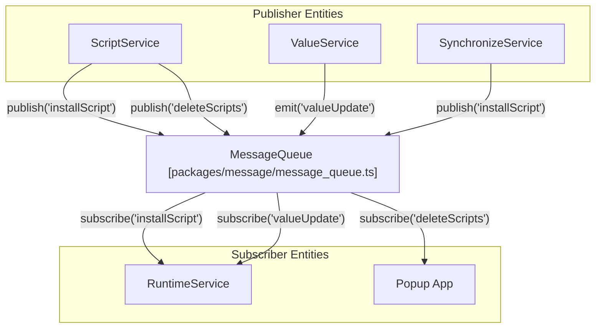
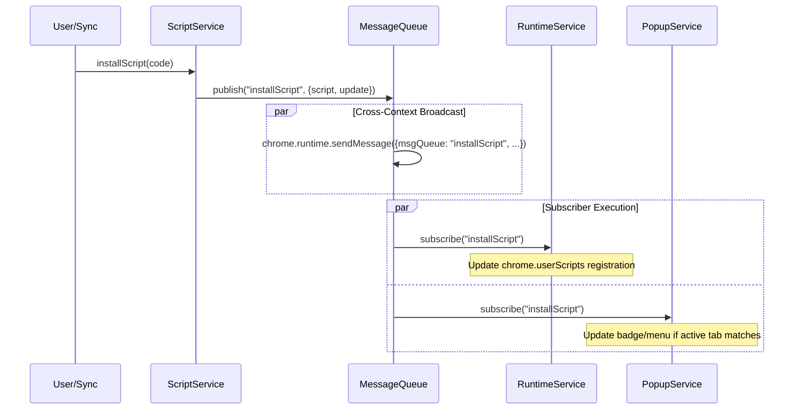

# Message Queue Architecture

<details>
<summary>Relevant source files</summary>

The following files were used as context for generating this wiki page:

- [e2e/keep-alive.spec.ts](../e2e/keep-alive.spec.ts)
- [packages/message/extension_message.ts](../packages/message/extension_message.ts)
- [packages/message/message_queue.test.ts](../packages/message/message_queue.test.ts)
- [packages/message/message_queue.ts](../packages/message/message_queue.ts)
- [packages/message/mock_message.ts](../packages/message/mock_message.ts)
- [packages/message/server.test.ts](../packages/message/server.test.ts)
- [packages/message/server.ts](../packages/message/server.ts)
- [packages/message/types.ts](../packages/message/types.ts)
- [packages/message/window_message.test.ts](../packages/message/window_message.test.ts)
- [packages/message/window_message.ts](../packages/message/window_message.ts)
- [src/pages/options/routes/Setting/sections/RuntimeSection.tsx](../src/pages/options/routes/Setting/sections/RuntimeSection.tsx)

</details>


## Purpose and Scope

The Message Queue Architecture provides a **publish/subscribe (pub/sub) event bus** for domain events within ScriptCat. It enables temporal decoupling between services—publishers emit events without waiting for subscribers to process them. This architecture implements an event-driven model where state changes broadcast notifications to all interested parties, including the service worker, UI components, and synchronization services.

This document covers the `IMessageQueue` interface, event topics, subscriber patterns, and the implementation of middleware and grouping. For **RPC-style request/response communication** and **cross-context IPC mechanisms**, see [5.2 Cross-Context Communication](./5-2-cross-context-communication.md).

**Sources**: [packages/message/message_queue.ts:18-30](../packages/message/message_queue.ts#L18-L30), [packages/message/types.ts:1-9](../packages/message/types.ts#L1-L9)

---

## Core Interface: IMessageQueue

The `IMessageQueue` interface is the central abstraction for pub/sub communication. Services interact with it through three primary methods:

- **`subscribe<T>(topic: string, handler: (data: T) => void)`**: Registers a handler for events on a specific topic. It returns a function to cancel the subscription [packages/message/message_queue.ts:70-73](../packages/message/message_queue.ts#L70-L73).
- **`publish<T>(topic: string, data: T)`**: Broadcasts an event to all subscribers. It uses `chrome.runtime.sendMessage` to propagate the event to other extension contexts (like the popup or options page) and also triggers local listeners [packages/message/message_queue.ts:75-83](../packages/message/message_queue.ts#L75-L83).
- **`emit<T>(topic: string, data: T)`**: Broadcasts an event **only** to the current environment's listeners, bypassing the cross-context broadcast [packages/message/message_queue.ts:101-103](../packages/message/message_queue.ts#L101-L103).

### Implementation: MessageQueue and MessageQueueGroup

The system uses `EventEmitter` (from `eventemitter3`) internally to manage local listeners [packages/message/message_queue.ts:41](../packages/message/message_queue.ts#L41). When a message is received via the Chrome runtime, the `handler` method routes it to the correct internal topic [packages/message/message_queue.ts:57-68](../packages/message/message_queue.ts#L57-L68).

The message queue supports **hierarchical grouping** and **middleware** via the `group()` method. This allows services to create scoped queues with shared logic:

- **Namespace Isolation**: Groups automatically prefix topics (e.g., a group named `api` prefixing topic `user` results in `api/user`) [packages/message/message_queue.ts:120-122](../packages/message/message_queue.ts#L120-L122).
- **Middleware Chain**: Groups can define `MiddlewareFunction` handlers that execute before the final subscriber. This is used for async checks, logging, or synchronization [packages/message/message_queue.ts:151-168](../packages/message/message_queue.ts#L151-L168).
- **Inheritance**: Sub-groups inherit the middleware of their parent groups [packages/message/message_queue.ts:132](../packages/message/message_queue.ts#L132).

**Sources**: [packages/message/message_queue.ts:40-109](../packages/message/message_queue.ts#L40-L109), [packages/message/message_queue.ts:112-185](../packages/message/message_queue.ts#L112-L185), [packages/message/message_queue.test.ts:69-95](../packages/message/message_queue.test.ts#L69-L95)

---

## Event Topics and Payloads

Event topics and their payloads are strictly typed to ensure consistency across the system. Topics often follow a hierarchical structure enabled by `MessageQueueGroup`.

| Event Topic | Semantic Meaning |
|-------------|------------------|
| `installScript` | Script installed or code updated. |
| `deleteScripts` | Script removed from storage. |
| `enableScripts` | Script enabled/disabled status change. |
| `sortedScripts` | Script display/execution order changed. |
| `valueUpdate` | `GM_setValue` triggered a storage change. |
| `scriptRunStatus` | Background/Scheduled script status change. |
| `registerMenuCommand` | `GM_registerMenuCommand` called by a script. |
| `unregisterMenuCommand`| Menu item removal requested. |

**Sources**: [packages/message/message_queue.ts:6-10](../packages/message/message_queue.ts#L6-L10), [packages/message/types.ts:1-9](../packages/message/types.ts#L1-L9)

---

## Publisher and Subscriber Patterns

### Service Architecture Mapping

The following diagram bridges the "Natural Language Space" of system events to the "Code Entity Space" of the services that interact with the `MessageQueue`.



**Sources**: [packages/message/message_queue.ts:40-98](../packages/message/message_queue.ts#L40-L98), [packages/message/message_queue.test.ts:19-27](../packages/message/message_queue.test.ts#L19-L27)

### Subscriber Implementation Examples

#### UI State Reactivity
The extension UI components subscribe to messages to provide live updates. For example, the options page or popup listens for script deletions to remove items from the visible list without requiring a manual refresh.

```typescript
// Conceptual example of subscription in UI
const mq = new MessageQueue();
mq.subscribe("deleteScripts", (data) => {
  // Update React state or local cache
});
```

**Sources**: [packages/message/message_queue.ts:70-74](../packages/message/message_queue.ts#L70-L74), [packages/message/message_queue.test.ts:19-27](../packages/message/message_queue.test.ts#L19-L27)

---

## Data Flow: Script Installation

The installation of a script demonstrates how the Message Queue coordinates different services across contexts.



### Key Logic in Script Events
1. **Cross-Context Propagation**: When `publish` is called, the message is sent via `chrome.runtime.sendMessage`. ScriptCat handles the Firefox-specific "Could not establish connection" error by catching the rejection to prevent unhandled promise errors [packages/message/message_queue.ts:82-94](../packages/message/message_queue.ts#L82-L94).
2. **Local Execution**: The same context that published the message also executes its own listeners via `this.EE.emit` [packages/message/message_queue.ts:95](../packages/message/message_queue.ts#L95).
3. **Middleware Processing**: If the subscriber is part of a group, the middleware chain (e.g., for logging or initialization checks) is executed before the final handler [packages/message/message_queue.ts:151-168](../packages/message/message_queue.ts#L151-L168).

**Sources**: [packages/message/message_queue.ts:75-98](../packages/message/message_queue.ts#L75-L98), [packages/message/message_queue.ts:143-172](../packages/message/message_queue.ts#L143-L172)

---

## Value Update Propagation

When a script calls `GM_setValue`, the system handles persistence and then signals the rest of the system.

1. **Persistence**: The value is saved to the database.
2. **Local Signal**: The service uses `mq.emit` to broadcast a `valueUpdate` event to the local environment, ensuring immediate feedback for listeners in the same process [packages/message/message_queue.ts:101-103](../packages/message/message_queue.ts#L101-L103).
3. **Subscriber Action**: Services like `RuntimeService` receive this signal and may re-configure execution parameters or notify content scripts.

**Sources**: [packages/message/message_queue.ts:101-103](../packages/message/message_queue.ts#L101-L103), [packages/message/message_queue.test.ts:24-26](../packages/message/message_queue.test.ts#L24-L26)

---
