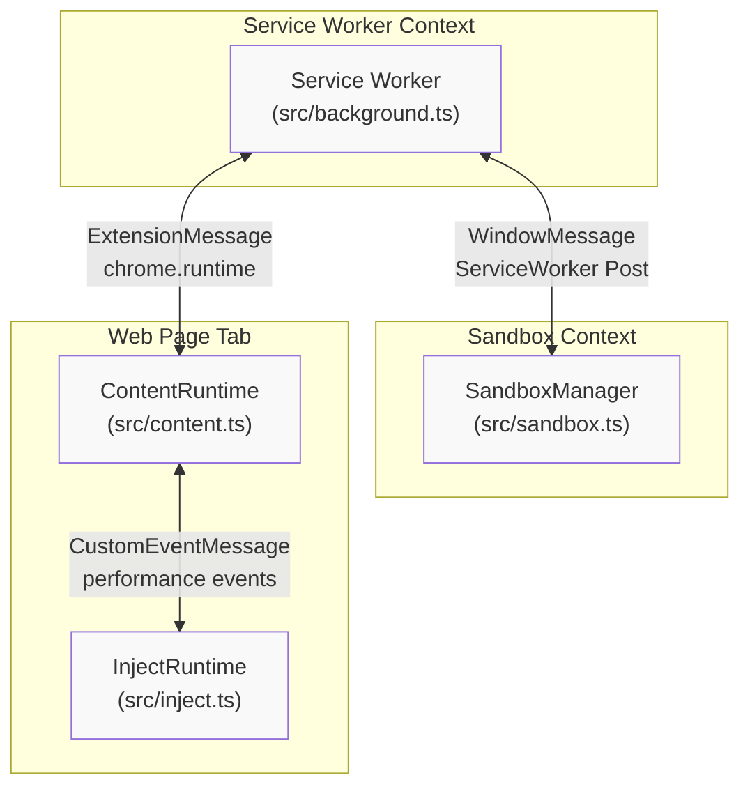
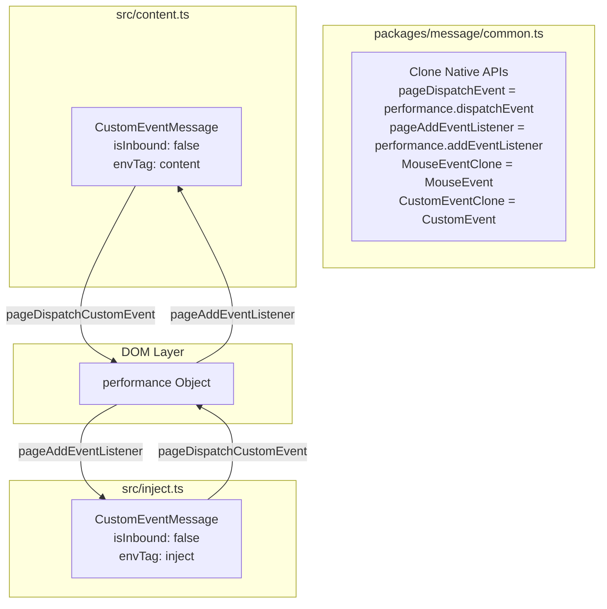
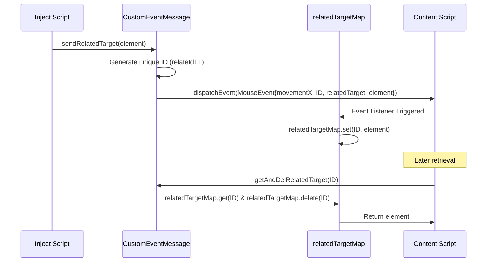
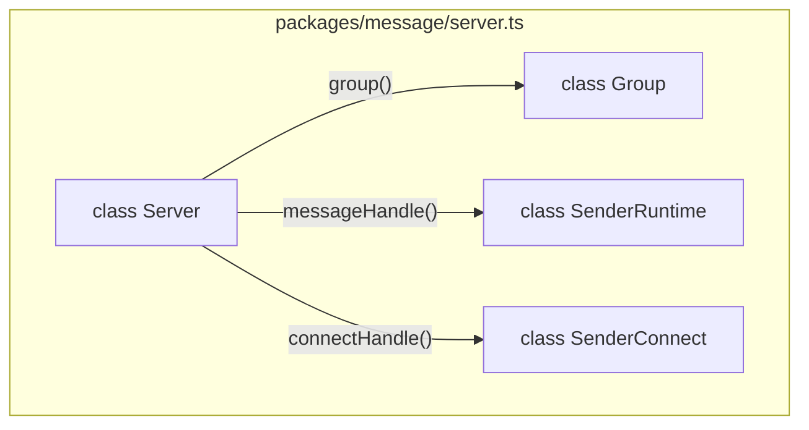
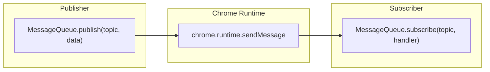

# Cross-Context Communication

<details>
<summary>Relevant source files</summary>

The following files were used as context for generating this wiki page:

- [example/run-in/run-in_bg.js](../example/run-in/run-in_bg.js)
- [packages/message/common.ts](../packages/message/common.ts)
- [packages/message/custom_event_message.ts](../packages/message/custom_event_message.ts)
- [packages/message/extension_message.ts](../packages/message/extension_message.ts)
- [packages/message/message_queue.ts](../packages/message/message_queue.ts)
- [packages/message/mock_message.ts](../packages/message/mock_message.ts)
- [packages/message/server.ts](../packages/message/server.ts)
- [packages/message/types.ts](../packages/message/types.ts)
- [packages/message/window_message.ts](../packages/message/window_message.ts)
- [src/app/service/content/exec_warp.test.ts](../src/app/service/content/exec_warp.test.ts)
- [src/app/service/content/exec_warp.ts](../src/app/service/content/exec_warp.ts)
- [src/app/service/content/external.ts](../src/app/service/content/external.ts)
- [src/app/service/content/script_executor.ts](../src/app/service/content/script_executor.ts)
- [src/app/service/content/script_runtime.ts](../src/app/service/content/script_runtime.ts)
- [src/content.ts](../src/content.ts)
- [src/inject.ts](../src/inject.ts)
- [src/scripting.ts](../src/scripting.ts)

</details>


## Purpose and Scope

This document explains the inter-process communication (IPC) mechanisms that enable ScriptCat's different execution contexts to communicate across security boundaries. ScriptCat implements specialized message transport layers to bridge the service worker, content scripts, inject scripts, and sandbox environment.

For information about the execution contexts themselves, see [3. Script Execution Environment](./3-script-execution-environment.md). For the event-driven pub/sub system used within the service worker, see [5.1 Message Queue Architecture](./5-1-message-queue-architecture.md).

## IPC Mechanisms Overview

ScriptCat uses three distinct message transport implementations, each optimized for specific context boundaries:

| Transport | Context Bridge | Technology | DOM Element Passing |
|-----------|---------------|------------|---------------------|
| **CustomEventMessage** | Content ↔ Inject | DOM CustomEvent via `performance` | ✓ Via MouseEvent relatedTarget |
| **WindowMessage** | Sandbox ↔ Service Worker | `window.postMessage` | ✗ JSON only |
| **ExtensionMessage** | Service Worker ↔ Content | `chrome.runtime` API | ✗ JSON only |

### Context Communication Map



**Sources:** [src/content.ts:13-32](../src/content.ts#L13-L32), [src/inject.ts:13-31](../src/inject.ts#L13-L31), [packages/message/custom_event_message.ts:35-69](../packages/message/custom_event_message.ts#L35-L69), [packages/message/window_message.ts:35-78](../packages/message/window_message.ts#L35-L78)

## CustomEventMessage: Content-Inject Bridge

### Architecture and Security Design

`CustomEventMessage` enables bidirectional communication between content scripts (privileged context) and inject scripts (page context) using native DOM events. It clones native APIs at initialization to prevent page scripts from interfering with communications by overriding global objects.



**Sources:** [packages/message/common.ts:5-22](../packages/message/common.ts#L5-L22), [packages/message/custom_event_message.ts:35-69](../packages/message/custom_event_message.ts#L35-L69), [src/content.ts:14-17](../src/content.ts#L14-L17), [src/inject.ts:14-17](../src/inject.ts#L14-L17)

### Event Flag System

The event naming system prevents message crosstalk using a negotiated flag and environment tags. The `receiveFlag` and `sendFlag` are constructed based on the `isInbound` state and `ScriptEnvTag`. The `getEventFlag` function is used to handshake the initial `eventFlag` between contexts.

```typescript
// packages/message/custom_event_message.ts:49-51
const messageFlag = `${eventFlag}${envTag}`;
this.receiveFlag = `${messageFlag}${isInbound ? DefinedFlags.inboundFlag : DefinedFlags.outboundFlag}${DefinedFlags.domEvent}`;
this.sendFlag = `${messageFlag}${isInbound ? DefinedFlags.outboundFlag : DefinedFlags.inboundFlag}${DefinedFlags.domEvent}`;
```

**Sources:** [packages/message/custom_event_message.ts:44-51](../packages/message/custom_event_message.ts#L44-L51), [packages/message/common.ts:25-80](../packages/message/common.ts#L25-L80)

### RelatedTarget Mechanism for DOM Element Passing

A unique feature of `CustomEventMessage` is passing DOM elements between content and inject contexts using `MouseEvent.relatedTarget`. This bypasses JSON serialization limits by utilizing the native browser behavior where `relatedTarget` can hold a reference to an `EventTarget`.



**Sources:** [packages/message/custom_event_message.ts:17-21](../packages/message/custom_event_message.ts#L17-L21), [packages/message/custom_event_message.ts:56-58](../packages/message/custom_event_message.ts#L56-L58), [packages/message/custom_event_message.ts:173-191](../packages/message/custom_event_message.ts#L173-L191)

### Synchronous Messaging

`CustomEventMessage` supports synchronous message passing via `syncSendMessage`. This works because `EventEmitter3` used internally dispatches events synchronously within the same task, and the underlying `pageDispatchCustomEvent` is also a synchronous DOM operation.

**Sources:** [packages/message/custom_event_message.ts:153-171](../packages/message/custom_event_message.ts#L153-L171), [packages/message/common.ts:15-22](../packages/message/common.ts#L15-L22)

## WindowMessage: Sandbox-ServiceWorker Bridge

### Purpose and Design

`WindowMessage` enables communication between the service worker and the sandboxed offscreen document or iframes. It primarily uses `window.postMessage` and `onmessage` listeners. It supports both standard message passing and persistent connections via `WindowMessageConnect`.

**Sources:** [packages/message/window_message.ts:35-78](../packages/message/window_message.ts#L35-L78), [packages/message/window_message.ts:113-126](../packages/message/window_message.ts#L113-L126), [packages/message/window_message.ts:154-182](../packages/message/window_message.ts#L154-L182)

## ExtensionMessage: ServiceWorker-Content Bridge

### Chrome Runtime API Wrapper

`ExtensionMessage` wraps Chrome's extension messaging APIs (`chrome.runtime.sendMessage` and `chrome.runtime.connect`). It handles standard extension messages and specialized listeners like `chrome.runtime.onUserScriptMessage` for scripts registered via the `userScripts` API, which is critical for MV3 compatibility.

**Sources:** [packages/message/extension_message.ts:7-31](../packages/message/extension_message.ts#L7-L31), [packages/message/extension_message.ts:96-155](../packages/message/extension_message.ts#L96-L155)

## Server/Client RPC Architecture

### Server API Registration

The `Server` class provides a hierarchical RPC-style API registration system. It abstracts the underlying transport (`Message` or `Message[]`) and routes incoming messages to registered handlers.



**Sources:** [packages/message/server.ts:129-163](../packages/message/server.ts#L129-L163), [packages/message/server.ts:173-194](../packages/message/server.ts#L173-L194), [packages/message/server.ts:196-231](../packages/message/server.ts#L196-L231)

### Middleware System

The `Group` class allows for grouping API endpoints and applying `MiddlewareFunction` logic for pre-processing requests. This is used for cross-cutting concerns like logging or permission verification.

```typescript
// packages/message/server.ts:114
type MiddlewareFunction = (params: any, con: IGetSender, next: () => Promise<any> | any) => Promise<any> | any;
```

**Sources:** [packages/message/server.ts:234-259](../packages/message/server.ts#L234-L259)

## Message Queue Architecture

The `MessageQueue` system provides a pub/sub mechanism over `chrome.runtime.sendMessage`. It is used for broadcasting system-wide state changes like script installation or configuration updates.



**Sources:** [packages/message/message_queue.ts:40-55](../packages/message/message_queue.ts#L40-L55), [packages/message/message_queue.ts:75-98](../packages/message/message_queue.ts#L75-L98)

### Hierarchical Topics

The `MessageQueueGroup` allows creating nested topic structures (e.g., `config/update`), which helps organize complex event streams through prefixing.

**Sources:** [packages/message/message_queue.ts:112-134](../packages/message/message_queue.ts#L112-L134)

---
