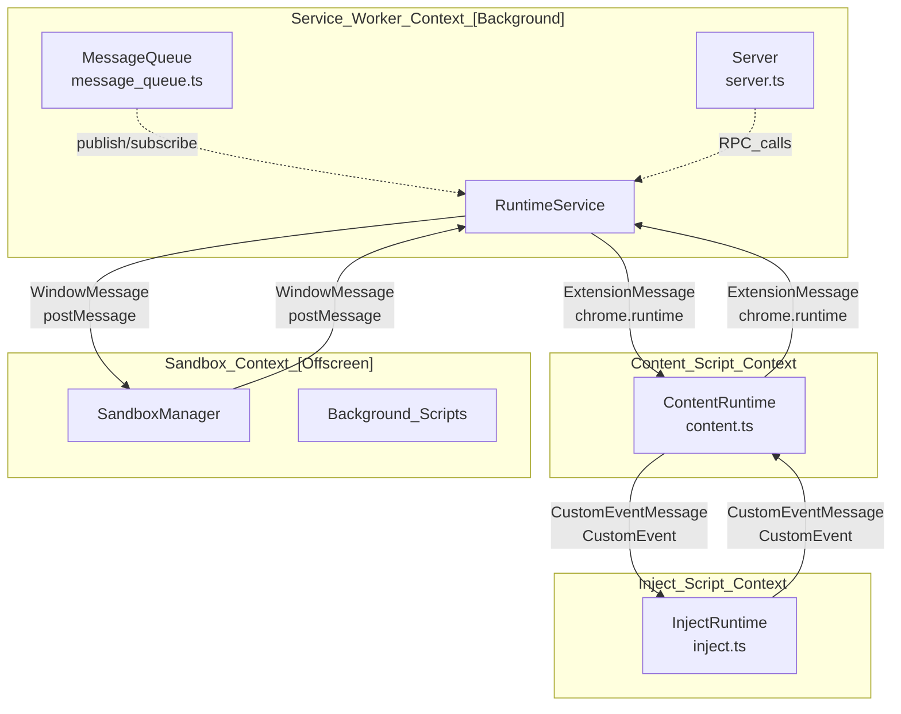
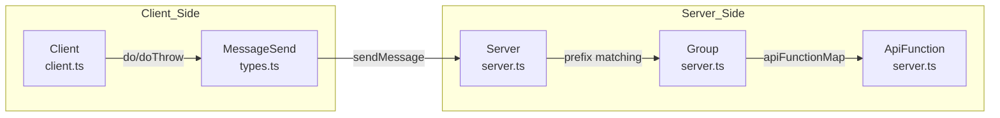

# Inter-Process Communication

Relevant source files

The following files were used as context for generating this wiki page:

- [e2e/keep-alive.spec.ts](../e2e/keep-alive.spec.ts)
- [packages/message/extension_message.ts](../packages/message/extension_message.ts)
- [packages/message/message_queue.test.ts](../packages/message/message_queue.test.ts)
- [packages/message/message_queue.ts](../packages/message/message_queue.ts)
- [packages/message/mock_message.ts](../packages/message/mock_message.ts)
- [packages/message/server.test.ts](../packages/message/server.test.ts)
- [packages/message/server.ts](../packages/message/server.ts)
- [packages/message/types.ts](../packages/message/types.ts)
- [packages/message/window_message.test.ts](../packages/message/window_message.test.ts)
- [packages/message/window_message.ts](../packages/message/window_message.ts)
- [src/pages/options/routes/Setting/sections/RuntimeSection.tsx](../src/pages/options/routes/Setting/sections/RuntimeSection.tsx)

This document describes the inter-process communication (IPC) architecture in ScriptCat, which enables communication between the Service Worker, Content Scripts, Inject Scripts, and Sandbox environments. ScriptCat implements a multi-layered IPC system using three distinct messaging mechanisms, each optimized for specific context boundaries.

For information about how scripts execute in these different contexts, see [Script Execution Environment](./3-script-execution-environment.md). For details on the Message Queue pub/sub system specifically, see [Message Queue Architecture](./5-1-message-queue-architecture.md).

## IPC Architecture Overview

ScriptCat's IPC system bridges isolated execution contexts using specialized messaging protocols. The architecture employs different transport mechanisms based on security boundaries and API availability.

### Overall IPC Architecture

**Sources:** [packages/message/server.ts:129-163](../packages/message/server.ts#L129-L163), [packages/message/message_queue.ts:40-55](../packages/message/message_queue.ts#L40-L55), [packages/message/window_message.ts:35-78](../packages/message/window_message.ts#L35-L78), [packages/message/extension_message.ts:7-31](../packages/message/extension_message.ts#L7-L31)

### IPC Mechanism Selection by Context Boundary

| Source Context | Target Context | IPC Mechanism | Transport | Bi-directional |
|----------------|----------------|---------------|-----------|----------------|
| Service Worker | Content Script | `ExtensionMessage` | `chrome.runtime.sendMessage` | Yes |
| Content Script | Inject Script | `CustomEventMessage` | `CustomEvent` dispatch | Yes |
| Service Worker | Sandbox | `WindowMessage` | `window.postMessage` | Yes |
| Sandbox (Offscreen) | Service Worker | `ServiceWorkerClientMessage` | `navigator.serviceWorker` | Yes |

**Sources:** [packages/message/extension_message.ts:7-31](../packages/message/extension_message.ts#L7-L31), [packages/message/window_message.ts:35-50](../packages/message/window_message.ts#L35-L50), [packages/message/window_message.ts:245-255](../packages/message/window_message.ts#L245-L255), [packages/message/window_message.ts:293-305](../packages/message/window_message.ts#L293-L305)

## Message Queue Architecture

The `IMessageQueue` system provides a pub/sub infrastructure for cross-environment event distribution. It is used for system-level events like script installation, deletion, or value updates. It supports middleware and grouping to namespace topics using a slash-separated hierarchy.

For details, see [Message Queue Architecture](./5-1-message-queue-architecture.md).

**Sources:** [packages/message/message_queue.ts:18-37](../packages/message/message_queue.ts#L18-L37), [packages/message/message_queue.ts:112-141](../packages/message/message_queue.ts#L112-L141)

## Cross-Context Communication

ScriptCat manages complex routing between the Service Worker and specific tabs or frames. The system uses a `Server` and `Group` pattern to provide RPC-like functionality over the various message transports.

### Server and Client RPC System

The `Server` class handles incoming messages and routes them to registered `ApiFunction` handlers. It supports grouping and middleware to organize complex API surfaces, providing structured response handling for both synchronous and asynchronous operations.

**Sources:** [packages/message/server.ts:129-163](../packages/message/server.ts#L129-L163), [packages/message/server.ts:234-250](../packages/message/server.ts#L234-L250), [packages/message/client.ts:60-85](../packages/message/client.ts#L60-L85), [packages/message/types.ts:44-47](../packages/message/types.ts#L44-L47)

### Specialized Transports

- **ExtensionMessage**: Wraps `chrome.runtime` APIs. It handles standard extension messages and supports `onUserScriptMessage` for specialized userscript context communication in browsers that support it [packages/message/extension_message.ts:7-156](../packages/message/extension_message.ts#L7-L156).
- **WindowMessage**: Facilitates communication between the Service Worker and the Sandbox (Offscreen document) via `window.postMessage`. It manages message IDs to simulate request-response cycles over an asynchronous fire-and-forget transport [packages/message/window_message.ts:35-152](../packages/message/window_message.ts#L35-L152).
- **CustomEventMessage**: Bridges Content and Inject scripts by dispatching events on the shared DOM. It uses `detail` for data serialization and supports a `syncSendMessage` mechanism for synchronous script requirements [packages/message/custom_event_message.ts:35-69](../packages/message/custom_event_message.ts#L35-L69).

### Sender Identification

The `IGetSender` interface and its implementations (`SenderConnect`, `SenderRuntime`) allow the `Server` to identify the origin of a message, providing metadata such as `tabId`, `frameId`, and `windowId` to the API handlers.

**Sources:** [packages/message/server.ts:12-18](../packages/message/server.ts#L12-L18), [packages/message/server.ts:20-68](../packages/message/server.ts#L20-L68), [packages/message/server.ts:70-110](../packages/message/server.ts#L70-L110)

For details, see [Cross-Context Communication](./5-2-cross-context-communication.md).

---
