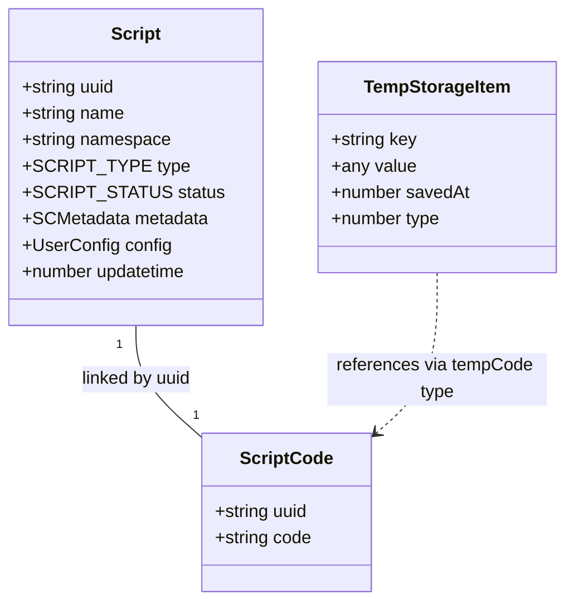
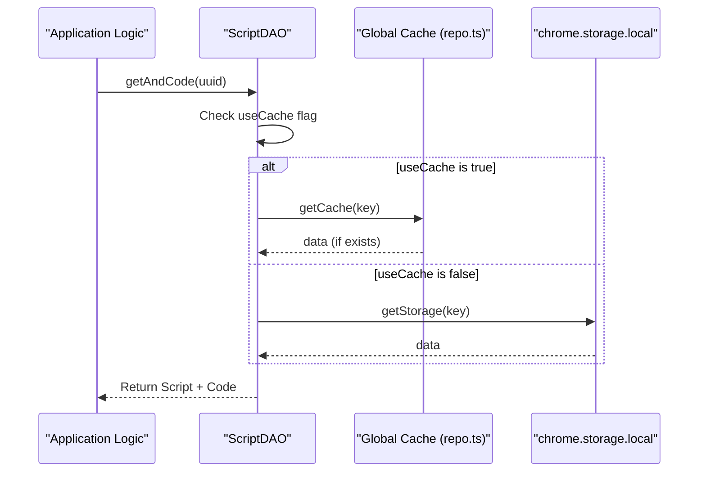

# Storage Layer

<details>
<summary>Relevant source files</summary>

The following files were used as context for generating this wiki page:

- [example/userconfig.js](../example/userconfig.js)
- [src/app/cache.ts](../src/app/cache.ts)
- [src/app/cache_key.ts](../src/app/cache_key.ts)
- [src/app/repo/repo.test.ts](../src/app/repo/repo.test.ts)
- [src/app/repo/repo.ts](../src/app/repo/repo.ts)
- [src/app/repo/scripts.ts](../src/app/repo/scripts.ts)
- [src/app/repo/tempStorage.ts](../src/app/repo/tempStorage.ts)
- [src/app/service/service_worker/temp.ts](../src/app/service/service_worker/temp.ts)
- [src/pages/components/UserConfigPanel/index.tsx](../src/pages/components/UserConfigPanel/index.tsx)
- [src/pkg/utils/script.test.ts](../src/pkg/utils/script.test.ts)
- [src/pkg/utils/scriptInstall.ts](../src/pkg/utils/scriptInstall.ts)
- [src/pkg/utils/yaml.ts](../src/pkg/utils/yaml.ts)

</details>


The storage layer implements ScriptCat's data persistence architecture, providing a multi-tier system combining structured data persistence, `chrome.storage` for configuration, and in-memory caching for performance optimization. This layer abstracts storage complexity through a DAO (Data Access Object) pattern, enabling services to perform CRUD operations without direct database manipulation.

---

## DAO Architecture

ScriptCat implements a DAO pattern that separates data access logic from business logic. Each major entity has a dedicated DAO class that handles persistence operations and optionally enables caching for frequently accessed data.

### Core DAO Classes

```mermaid
graph TB
    subgraph "DAO Layer (repo.ts / scripts.ts)"
        [ScriptDAO] -- "inherits" --> [RepoBase]
        [ScriptCodeDAO] -- "inherits" --> [RepoBase]
        [TempStorageDAO] -- "inherits" --> [RepoBase]
        [RepoBase] -- "implements" --> [Repo_T]
    end
    
    subgraph "Storage Backends"
        [ChromeLocal] -- "chrome.storage.local" --> [Persistence]
        [ChromeSession] -- "chrome.storage.session" --> [CacheLayer]
        [OPFS] -- "navigator.storage.getDirectory" --> [FileStorage]
    end
    
    subgraph "In-Memory Caches (repo.ts)"
        [GlobalCache] -- "Record<string, any>" --> [MemoryStore]
    end
    
    [Repo_T] -- "writes to" --> [ChromeLocal]
    [Repo_T] -- "optional" --> [GlobalCache]
    [CacheInstance] -- "uses" --> [ChromeSession]
```

**DAO Implementation Details**

| DAO Class | Caching | File Source | Purpose |
|-----------|---------|-------------|---------|
| `ScriptDAO` | ✓ Yes | [src/app/repo/scripts.ts:149-154](../src/app/repo/scripts.ts#L149-L154) | Script metadata (name, uuid, status, metadata). |
| `ScriptCodeDAO` | ✓ Yes | [src/app/repo/scripts.ts:150](../src/app/repo/scripts.ts#L150) | Script source code (separated to optimize metadata queries). |
| `TempStorageDAO`| ✗ No | [src/app/repo/tempStorage.ts:18-21](../src/app/repo/tempStorage.ts#L18-L21) | Temporary installation info and code buffers. |
| `Repo<T>` | ✓ Yes | [src/app/repo/repo.ts:170-178](../src/app/repo/repo.ts#L170-L178) | Abstract base class for storage operations. |

Sources: [src/app/repo/scripts.ts:149-160](../src/app/repo/scripts.ts#L149-L160), [src/app/repo/repo.ts:170-182](../src/app/repo/repo.ts#L170-L182), [src/app/repo/tempStorage.ts:18-43](../src/app/repo/tempStorage.ts#L18-L43)

---

## Storage Backends

### Chrome Local Storage via Repo
The base `Repo` class interacts primarily with `chrome.storage.local`. It uses a prefixing system to namespace different data types (e.g., `script:`, `tempStorage:`) [src/app/repo/repo.ts:174-178](../src/app/repo/repo.ts#L174-L178).

- **Caching**: When `useCache` is enabled, the Repo loads all keys with its prefix into an in-memory `cache` object via `loadCache()` [src/app/repo/repo.ts:7-26](../src/app/repo/repo.ts#L7-L26).
- **Persistence**: `_save` writes to `chrome.storage.local` and optionally updates the memory cache [src/app/repo/repo.ts:188-194](../src/app/repo/repo.ts#L188-L194).

### Session Storage (ExtCache)
`chrome.storage.session` is used for high-performance, temporary data that survives Service Worker restarts but is cleared when the browser closes [src/app/cache.ts:13-25](../src/app/cache.ts#L13-L25).

- **Transactional Updates**: The `tx<T>` method uses `stackAsyncTask` to ensure atomic updates to cached values, preventing race conditions between concurrent context accesses [src/app/cache.ts:135-173](../src/app/cache.ts#L135-L173).
- **Cache Keys**: Standardized keys are defined in `cache_key.ts`, such as `tabScript:`, `setValue:`, and `permission:` [src/app/cache_key.ts:1-6](../src/app/cache_key.ts#L1-L6).

### Origin Private File System (OPFS)
For large temporary files, specifically script code during the installation process, ScriptCat utilizes the browser's OPFS via `navigator.storage.getDirectory()` [src/pkg/utils/scriptInstall.ts:34-42](../src/pkg/utils/scriptInstall.ts#L34-L42).

- **Temp Code Storage**: Scripts are written to a `temp_install_codes` directory using `FileSystemFileHandle` [src/pkg/utils/scriptInstall.ts:37-38](../src/pkg/utils/scriptInstall.ts#L37-L38).
- **Cleanup**: The Service Worker runs `cleanupStaleTempStorageEntries` to remove code files older than 60 seconds [src/app/service/service_worker/temp.ts:5-13](../src/app/service/service_worker/temp.ts#L5-L13), [src/app/repo/tempStorage.ts:16](../src/app/repo/tempStorage.ts#L16).

Sources: [src/app/repo/repo.ts:7-26](../src/app/repo/repo.ts#L7-L26), [src/app/cache.ts:135-173](../src/app/cache.ts#L135-L173), [src/pkg/utils/scriptInstall.ts:34-42](../src/pkg/utils/scriptInstall.ts#L34-L42), [src/app/service/service_worker/temp.ts:5-13](../src/app/service/service_worker/temp.ts#L5-L13)

---

## Data Models

ScriptCat separates metadata from execution code to optimize listing and matching operations.



**Model Definitions:**
- **Script**: Contains metadata such as `author`, `version`, and `runStatus` [src/app/repo/scripts.ts:57-82](../src/app/repo/scripts.ts#L57-L82).
- **ScriptCode**: Dedicated interface for the actual JavaScript source [src/app/repo/scripts.ts:85-88](../src/app/repo/scripts.ts#L85-L88).
- **ScriptRunResource**: A composite object used at runtime containing code, values, and pre-processed resources [src/app/repo/scripts.ts:99-106](../src/app/repo/scripts.ts#L99-L106).

Sources: [src/app/repo/scripts.ts:57-106](../src/app/repo/scripts.ts#L57-L106), [src/app/repo/tempStorage.ts:9-14](../src/app/repo/tempStorage.ts#L9-L14)

---

## User Configuration Storage

ScriptCat supports a structured user configuration system defined via YAML blocks in script metadata.

### Configuration Parsing
The `parseUserConfig` utility extracts content between `/* ==UserConfig==` and `==/UserConfig== */` markers [src/pkg/utils/yaml.ts:4-9](../src/pkg/utils/yaml.ts#L4-L9). It parses the YAML and enforces a group-based structure, injecting an `index` for UI sorting [src/pkg/utils/yaml.ts:43-48](../src/pkg/utils/yaml.ts#L43-L48).

### UI Integration
The `UserConfigPanel` maps these parsed definitions to React components:
- **Field Resolution**: `resolveConfigType` determines the UI widget (e.g., `switch`, `select`, `mult-select`) based on the `type` property or inferred from `default` values [src/pages/components/UserConfigPanel/index.tsx:28-34](../src/pages/components/UserConfigPanel/index.tsx#L28-L34).
- **Data Binding**: Supports dynamic values via the `bind` property, allowing a field's options to be populated from another storage key [src/pages/components/UserConfigPanel/index.tsx:186-191](../src/pages/components/UserConfigPanel/index.tsx#L186-L191).

Sources: [src/pkg/utils/yaml.ts:4-53](../src/pkg/utils/yaml.ts#L4-L53), [src/pages/components/UserConfigPanel/index.tsx:28-34](../src/pages/components/UserConfigPanel/index.tsx#L28-L34), [example/userconfig.js:12-74](../example/userconfig.js#L12-L74)

---

## Caching Strategy for Scripts

The `ScriptDAO` utilizes a two-tier caching mechanism. When `enableCache()` is called, it initializes caching for both metadata and the associated `ScriptCodeDAO` [src/app/repo/scripts.ts:156-159](../src/app/repo/scripts.ts#L156-L159).

### Script Data Retrieval Flow



The `Repo` class implements `loadCache()` which pulls all data from `chrome.storage.local` into a memory variable `cache` to speed up subsequent reads [src/app/repo/repo.ts:7-26](../src/app/repo/repo.ts#L7-L26).

Sources: [src/app/repo/scripts.ts:156-175](../src/app/repo/scripts.ts#L156-L175), [src/app/repo/repo.ts:7-26](../src/app/repo/repo.ts#L7-L26), [src/app/repo/repo.ts:196-202](../src/app/repo/repo.ts#L196-L202)

---
