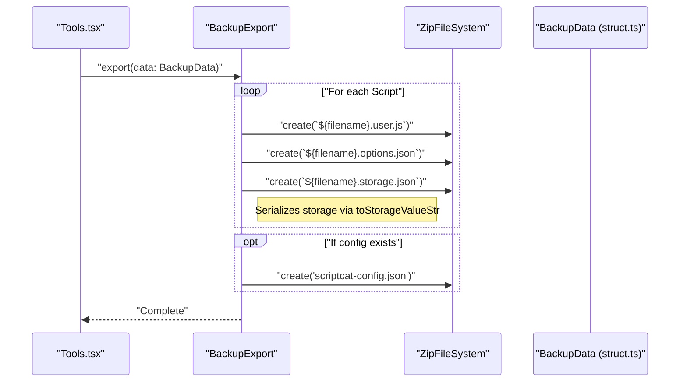
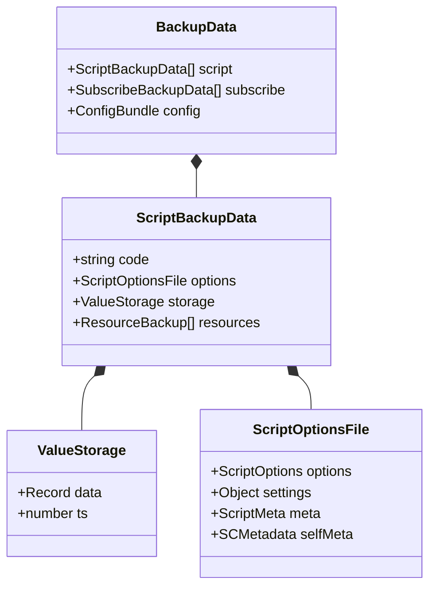

# Import and Export

Relevant source files

The following files were used as context for generating this wiki page:

- [src/pages/import/App.tsx](../src/pages/import/App.tsx)
- [src/pkg/backup/backup.test.ts](../src/pkg/backup/backup.test.ts)
- [src/pkg/backup/config_sections.ts](../src/pkg/backup/config_sections.ts)
- [src/pkg/backup/export.ts](../src/pkg/backup/export.ts)
- [src/pkg/backup/import.ts](../src/pkg/backup/import.ts)
- [src/pkg/backup/struct.ts](../src/pkg/backup/struct.ts)

This page documents ScriptCat's import and export functionality, which allows users to transfer scripts, subscriptions, settings, and full backups into and out of the extension. It covers individual script handling, batch backup/restore via ZIP files, and integration with the File System Access API.

---

## Overview

ScriptCat provides multiple mechanisms for data mobility, ranging from individual script installation to full environment synchronization. The system is designed to be compatible with other userscript managers like Tampermonkey and Violentmonkey.

| Operation | Method | Location | Key Entities |
|-----------|--------|----------|--------------|
| **Full Backup** | ZIP Export | Tools Page | `BackupExport`, `ZipFileSystem` |
| **Script Import** | URL/File/Drag-and-Drop | MainLayout | `prepareScriptByCode`, `FileSystemFileHandle` |
| **Full Restore** | ZIP Import | Tools Page | `BackupImport`, `parseBackupZipFile` |
| **Config Backup** | JSON Export | Tools Page | `ConfigBundle`, `scriptcat-config.json` |

---

## Full System Backup and Restore

ScriptCat supports exporting scripts, subscriptions, storage values, and extension settings into a compressed ZIP file.

### Export Architecture
The export process is handled by the `BackupExport` class, which uses an abstraction layer (`FileSystem`) to write files into a ZIP archive.

**Implementation Details:**
- **Storage Serialization**: Script storage values are transformed using `toStorageValueStr` ([src/pkg/backup/export.ts:47](../src/pkg/backup/export.ts#L47)) to preserve type information (e.g., prefixing numbers with `n`, booleans with `b`) inside `storage.json`.
- **Resource Management**: External resources (`@require`, `@resource`) are exported with filenames containing an MD5 hash of their URL to ensure uniqueness and compatibility with Tampermonkey's export format ([src/pkg/backup/export.ts:75-85](../src/pkg/backup/export.ts#L75-L85)).
- **Configuration Bundling**: Since version 1.5.3, the system supports exporting extension-wide settings (Appearance, Update, Editor, Agent models/tasks) into `scriptcat-config.json` ([src/pkg/backup/export.ts:21-25](../src/pkg/backup/export.ts#L21-L25)).

**Sources:** [src/pkg/backup/export.ts:8-102](../src/pkg/backup/export.ts#L8-L102), [src/pkg/backup/struct.ts:72-82](../src/pkg/backup/struct.ts#L72-L82)

### Restore Architecture
Importing a backup ZIP involves the `BackupImport` class. It parses the archive and reconstructs the `BackupData` structure.

1. **File Scanning**: `BackupImport.parse()` iterates through the ZIP contents ([src/pkg/backup/import.ts:45-48](../src/pkg/backup/import.ts#L45-L48)).
2. **Subscription Parsing**: Identifies `.user.sub.js` and `.user.sub.options.json` files ([src/pkg/backup/import.ts:66-89](../src/pkg/backup/import.ts#L66-L89)).
3. **Script Parsing**: Matches `.user.js` files with their corresponding `.options.json` and `.storage.json` ([src/pkg/backup/import.ts:92-135](../src/pkg/backup/import.ts#L92-L135)).
4. **Settings Restoration**: If `scriptcat-config.json` is present, it is parsed into a `ConfigBundle` ([src/pkg/backup/import.ts:51-63](../src/pkg/backup/import.ts#L51-L63)).

**Sources:** [src/pkg/backup/import.ts:27-135](../src/pkg/backup/import.ts#L27-L135), [src/pkg/backup/struct.ts:118-123](../src/pkg/backup/struct.ts#L118-L123)

---

## Configuration Section Filtering

When importing a backup that contains system settings, ScriptCat allows users to selectively restore specific categories of configuration.

| Group | Section ID | Included Settings |
|-------|------------|-------------------|
| **App** | `appearance` | Menu expand numbers, display types, badge colors ([src/pkg/backup/config_sections.ts:9-19](../src/pkg/backup/config_sections.ts#L9-L19)) |
| **App** | `update` | Update cycles, auto-sync, silence update settings ([src/pkg/backup/config_sections.ts:20-25](../src/pkg/backup/config_sections.ts#L20-L25)) |
| **App** | `editor` | Monaco preferences, ESLint configuration ([src/pkg/backup/config_sections.ts:26](../src/pkg/backup/config_sections.ts#L26)) |
| **Agent** | `models` | LLM provider models and default model IDs ([src/pkg/backup/config_sections.ts:49](../src/pkg/backup/config_sections.ts#L49)) |
| **Agent** | `mcp` | Model Context Protocol server configurations ([src/pkg/backup/config_sections.ts:50](../src/pkg/backup/config_sections.ts#L50)) |

The `filterConfigBundle` function creates a new `ConfigBundle` containing only the user-selected sections ([src/pkg/backup/config_sections.ts:56-73](../src/pkg/backup/config_sections.ts#L56-L73)).

**Sources:** [src/pkg/backup/config_sections.ts:4-73](../src/pkg/backup/config_sections.ts#L4-L73)

---

## Data Structures

The `struct.ts` file defines the contract for all import/export operations.

**Key Interfaces:**
- `ResourceBackup`: Stores resource content as `base64` and includes metadata like `mimetype` ([src/pkg/backup/struct.ts:13-19](../src/pkg/backup/struct.ts#L13-L19)).
- `ScriptOptions`: Contains compatibility flags (e.g., `compat_foreach`, `compat_metadata`) and metadata overrides ([src/pkg/backup/struct.ts:26-53](../src/pkg/backup/struct.ts#L26-L53)).
- `ViolentmonkeyManifest`: A specialized structure to handle the `violentmonkey` root manifest file for cross-manager compatibility ([src/pkg/backup/struct.ts:126-152](../src/pkg/backup/struct.ts#L126-L152)).

**Sources:** [src/pkg/backup/struct.ts:1-152](../src/pkg/backup/struct.ts#L1-L152)

---

## Compatibility and Interoperability

### Violentmonkey Support
`BackupImport` includes logic to handle backups from Violentmonkey. It looks for a file named `violentmonkey` ([src/pkg/backup/import.ts:191](../src/pkg/backup/import.ts#L191)) which contains a JSON manifest of script configurations and global values.
- **Metadata Mapping**: Uses `vmCustomToOverride` and `overrideToSelfMetadata` to translate Violentmonkey's custom settings into ScriptCat's internal `SCMetadata` format ([src/pkg/backup/import.ts:223-228](../src/pkg/backup/import.ts#L223-L228)).
- **Value Mapping**: Translates URI-based storage keys used by Violentmonkey into ScriptCat's key-value store ([src/pkg/backup/import.ts:233-241](../src/pkg/backup/import.ts#L233-L241)).

### File System Access Integration
For local development, ScriptCat supports the **FileSystemFileHandle** API. When a script is imported via drag-and-drop, the extension can store a handle to the local file. This allows the extension to read the file directly from the disk, enabling features like automatic reloading when the local file is saved.

**Sources:** [src/pkg/backup/import.ts:212-245](../src/pkg/backup/import.ts#L212-L245), [src/pages/import/App.tsx:6-10](../src/pages/import/App.tsx#L6-L10)

---
