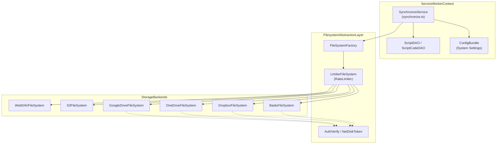
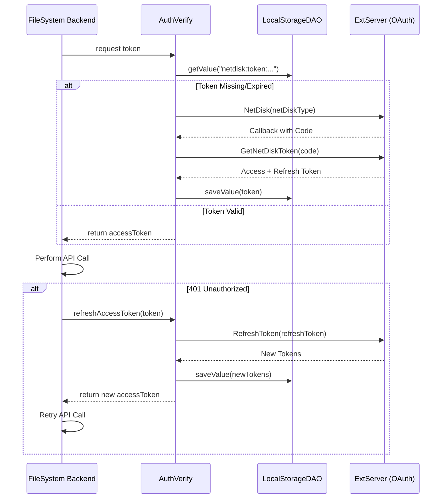

# Cloud Synchronization

Relevant source files

The following files were used as context for generating this wiki page:

- [packages/filesystem/auth.test.ts](../packages/filesystem/auth.test.ts)
- [packages/filesystem/auth.ts](../packages/filesystem/auth.ts)
- [packages/filesystem/baidu/baidu.test.ts](../packages/filesystem/baidu/baidu.test.ts)
- [packages/filesystem/baidu/baidu.ts](../packages/filesystem/baidu/baidu.ts)
- [packages/filesystem/baidu/rw.ts](../packages/filesystem/baidu/rw.ts)
- [packages/filesystem/dropbox/dropbox.test.ts](../packages/filesystem/dropbox/dropbox.test.ts)
- [packages/filesystem/dropbox/dropbox.ts](../packages/filesystem/dropbox/dropbox.ts)
- [packages/filesystem/dropbox/rw.ts](../packages/filesystem/dropbox/rw.ts)
- [packages/filesystem/factory.ts](../packages/filesystem/factory.ts)
- [packages/filesystem/googledrive/googledrive.test.ts](../packages/filesystem/googledrive/googledrive.test.ts)
- [packages/filesystem/googledrive/googledrive.ts](../packages/filesystem/googledrive/googledrive.ts)
- [packages/filesystem/googledrive/rw.ts](../packages/filesystem/googledrive/rw.ts)
- [packages/filesystem/limiter.test.ts](../packages/filesystem/limiter.test.ts)
- [packages/filesystem/limiter.ts](../packages/filesystem/limiter.ts)
- [packages/filesystem/onedrive/onedrive.test.ts](../packages/filesystem/onedrive/onedrive.test.ts)
- [packages/filesystem/onedrive/onedrive.ts](../packages/filesystem/onedrive/onedrive.ts)
- [packages/filesystem/onedrive/rw.ts](../packages/filesystem/onedrive/rw.ts)
- [packages/filesystem/s3/client.test.ts](../packages/filesystem/s3/client.test.ts)
- [packages/filesystem/s3/client.ts](../packages/filesystem/s3/client.ts)
- [packages/filesystem/s3/rw.ts](../packages/filesystem/s3/rw.ts)
- [packages/filesystem/s3/s3.test.ts](../packages/filesystem/s3/s3.test.ts)
- [packages/filesystem/s3/s3.ts](../packages/filesystem/s3/s3.ts)
- [packages/filesystem/utils.test.ts](../packages/filesystem/utils.test.ts)
- [packages/filesystem/utils.ts](../packages/filesystem/utils.ts)
- [packages/filesystem/webdav/webdav.test.ts](../packages/filesystem/webdav/webdav.test.ts)
- [packages/filesystem/webdav/webdav.ts](../packages/filesystem/webdav/webdav.ts)
- [src/app/service/agent/core/compact_prompt.test.ts](../src/app/service/agent/core/compact_prompt.test.ts)
- [src/app/service/agent/core/content_utils.test.ts](../src/app/service/agent/core/content_utils.test.ts)
- [src/app/service/service_worker/subscribe.ts](../src/app/service/service_worker/subscribe.ts)
- [src/app/service/service_worker/synchronize.test.ts](../src/app/service/service_worker/synchronize.test.ts)
- [src/app/service/service_worker/synchronize.ts](../src/app/service/service_worker/synchronize.ts)
- [src/pages/install/App.tsx](../src/pages/install/App.tsx)
- [src/pkg/utils/script.ts](../src/pkg/utils/script.ts)

## Purpose and Scope

This document describes ScriptCat's cloud synchronization system, which enables users to maintain a consistent environment across multiple browser installations. The system synchronizes userscripts, background scripts, scheduled tasks, metadata, and script-level storage values. It utilizes an abstracted filesystem layer to support various backends including WebDAV, Amazon S3, and major cloud drives.

For details on the underlying persistence mechanisms, see [6.1 Storage Layer](./6-1-storage-layer.md). For manual data movement, see [6.2 Import and Export](./6-2-import-and-export.md).

## Overview

Cloud synchronization in ScriptCat is orchestrated by the `SynchronizeService` within the Service Worker context. It provides a robust mechanism for conflict resolution and state management across disparate devices.

**Key Features:**
- **Abstracted Filesystem Layer**: A unified interface for diverse storage backends [packages/filesystem/factory.ts:13-13](../packages/filesystem/factory.ts#L13-L13).
- **Conflict Resolution Strategy**: Uses `sync_content_md5` and file timestamps to detect and resolve version mismatches [src/app/service/service_worker/synchronize.ts:47-47](../src/app/service/service_worker/synchronize.ts#L47-L47), [src/app/service/service_worker/synchronize.ts:100-101](../src/app/service/service_worker/synchronize.ts#L100-L101).
- **Tombstone Mechanism**: Tracks deleted scripts to ensure removals are propagated across devices when `syncDelete` is enabled [src/app/service/service_worker/synchronize.ts:52-53](../src/app/service/service_worker/synchronize.ts#L52-L53), [src/app/service/service_worker/synchronize.ts:62-62](../src/app/service/service_worker/synchronize.ts#L62-L62).
- **Rate Limiting & Retries**: Built-in concurrency control and automatic retries for transient errors (e.g., HTTP 429, 5xx) [packages/filesystem/limiter.ts:8-71](../packages/filesystem/limiter.ts#L8-L71).
- **OAuth Integration**: Automated token lifecycle management for Google Drive, OneDrive, Dropbox, and Baidu Netdisk [packages/filesystem/auth.ts:77-130](../packages/filesystem/auth.ts#L77-L130).

### System Architecture Diagram

**Sources:** [src/app/service/service_worker/synchronize.ts:173-194](../src/app/service/service_worker/synchronize.ts#L173-L194), [packages/filesystem/factory.ts:25-88](../packages/filesystem/factory.ts#L25-L88), [packages/filesystem/limiter.ts:75-84](../packages/filesystem/limiter.ts#L75-L84)

## Synchronization Service Implementation

The `SynchronizeService` manages the data flow between IndexedDB and the remote storage.

### Data Structures and Metadata

- **`SyncMeta`**: A metadata object for each script containing its `uuid`, `origin`, and an `isDeleted` flag used for the tombstone mechanism [src/app/service/service_worker/synchronize.ts:57-63](../src/app/service/service_worker/synchronize.ts#L57-L63).
- **`ScriptcatSync`**: A global status file (`scriptcat-sync.json`) that stores the extension version and a map of script states (enabled, sort order, update time) [src/app/service/service_worker/synchronize.ts:65-72](../src/app/service/service_worker/synchronize.ts#L65-L72).
- **`PendingSyncOp`**: Tracks uncompleted operations (e.g., a partial script push where `.user.js` succeeded but `.meta.json` failed) to ensure atomicity across sync cycles [src/app/service/service_worker/synchronize.ts:132-133](../src/app/service/service_worker/synchronize.ts#L132-L133).

### Conflict Resolution Strategy

ScriptCat employs a "last-write-wins" approach based on timestamps, but with strict guards for true conflicts:
1. **Timestamp Normalization**: Both local `updatetime` (ms) and cloud `mtime` (often second-precision) are truncated to the nearest second before comparison to avoid false "newer" detections caused by clock skew [src/app/service/service_worker/synchronize.ts:99-101](../src/app/service/service_worker/synchronize.ts#L99-L101).
2. **MD5 Baseline**: Uses `md5OfText` to compare local content against the cloud version [src/app/service/service_worker/synchronize.ts:47-47](../src/app/service/service_worker/synchronize.ts#L47-L47).
3. **True Conflict Handling**: If both local and cloud versions have changed since the last sync, a `SyncBothChangedConflictError` is thrown, and the user is notified to resolve it manually [src/app/service/service_worker/synchronize.ts:118-126](../src/app/service/service_worker/synchronize.ts#L118-L126).

### Operation Serialization
All synchronization tasks are serialized using `stackAsyncTask` [src/app/service/service_worker/synchronize.ts:46-46](../src/app/service/service_worker/synchronize.ts#L46-L46). This ensures that concurrent calls to `syncOnce` do not result in race conditions during file writing or metadata updates [src/app/service/service_worker/synchronize.test.ts:187-207](../src/app/service/service_worker/synchronize.test.ts#L187-L207).

**Sources:** [src/app/service/service_worker/synchronize.ts:46-133](../src/app/service/service_worker/synchronize.ts#L46-L133), [src/app/service/service_worker/synchronize.test.ts:187-207](../src/app/service/service_worker/synchronize.test.ts#L187-L207)

## Filesystem Backends

### Supported Providers

| Provider | Implementation | Key Technical Detail |
| :--- | :--- | :--- |
| **WebDAV** | `WebDAVFileSystem` | Patches `fetch` to set `credentials: "omit"`, ensuring only explicit headers are used [packages/filesystem/webdav/webdav.ts:13-25](../packages/filesystem/webdav/webdav.ts#L13-L25). |
| **Amazon S3** | `S3FileSystem` | Supports custom endpoints and path-style addressing for S3-compatible APIs [packages/filesystem/s3/s3.ts:8-27](../packages/filesystem/s3/s3.ts#L8-L27). |
| **Google Drive** | `GoogleDriveFileSystem` | Operates within the `appDataFolder` scope, providing an isolated space invisible to the user's main Drive [packages/filesystem/googledrive/googledrive.ts:87-87](../packages/filesystem/googledrive/googledrive.ts#L87-L87). |
| **OneDrive** | `OneDriveFileSystem` | Uses the `special/approot` endpoint for application-specific storage [packages/filesystem/onedrive/onedrive.ts:57-57](../packages/filesystem/onedrive/onedrive.ts#L57-L57). |
| **Baidu Netdisk** | `BaiduFileSystem` | Integrated via the Baidu Open Platform OAuth flow [packages/filesystem/auth.ts:167-172](../packages/filesystem/auth.ts#L167-L172). |

### Authentication Lifecycle

Cloud drive providers rely on the `AuthVerify` utility to manage OAuth tokens [packages/filesystem/auth.ts:119-165](../packages/filesystem/auth.ts#L119-L165).

**Sources:** [packages/filesystem/auth.ts:37-165](../packages/filesystem/auth.ts#L37-L165), [packages/filesystem/onedrive/onedrive.ts:125-179](../packages/filesystem/onedrive/onedrive.ts#L125-L179)

## Multi-Device Management

### Deletion and Tombstones
When a script is deleted locally and `syncDelete` is enabled, the `SynchronizeService` marks the script's metadata with `isDeleted: true` in the cloud sync manifest [src/app/service/service_worker/synchronize.ts:62-62](../src/app/service/service_worker/synchronize.ts#L62-L62). Other devices polling the manifest will then call `scriptService.deleteScript` to remove the script from their local IndexedDB [src/app/service/service_worker/synchronize.ts:74-74](../src/app/service/service_worker/synchronize.ts#L74-L74).

### Settings Synchronization
In addition to scripts, ScriptCat can sync system configuration (e.g., UI themes, update intervals) via `ConfigBundle` [src/app/service/service_worker/synchronize.ts:39-39](../src/app/service/service_worker/synchronize.ts#L39-L39). The `getConfigBundle` function extracts settings from `chrome.storage.sync` while filtering out device-specific keys like `language` [src/app/service/service_worker/synchronize.test.ts:145-165](../src/app/service/service_worker/synchronize.test.ts#L145-L165).

### Idempotency
Filesystem implementations are designed to be idempotent:
- **Directory Creation**: `createDir` ignores HTTP 405 (Method Not Allowed) errors, which typically indicate the directory already exists [packages/filesystem/webdav/webdav.ts:85-95](../packages/filesystem/webdav/webdav.ts#L85-L95).
- **File Deletion**: `delete` ignores HTTP 404 errors, ensuring that a "delete" intent is satisfied even if the file is already gone [packages/filesystem/onedrive/onedrive.ts:182-197](../packages/filesystem/onedrive/onedrive.ts#L182-L197).

**Sources:** [src/app/service/service_worker/synchronize.ts:57-74](../src/app/service/service_worker/synchronize.ts#L57-L74), [src/app/service/service_worker/synchronize.test.ts:145-165](../src/app/service/service_worker/synchronize.test.ts#L145-L165), [packages/filesystem/webdav/webdav.ts:85-107](../packages/filesystem/webdav/webdav.ts#L85-L107), [packages/filesystem/onedrive/onedrive.ts:182-197](../packages/filesystem/onedrive/onedrive.ts#L182-L197)

---
