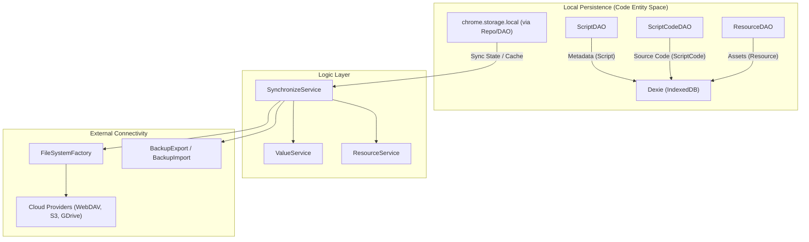

# Data Persistence and Synchronization

<details>
<summary>Relevant source files</summary>

The following files were used as context for generating this wiki page:

- [src/app/repo/repo.test.ts](../src/app/repo/repo.test.ts)
- [src/app/repo/repo.ts](../src/app/repo/repo.ts)
- [src/pages/import/App.tsx](../src/pages/import/App.tsx)
- [src/pkg/backup/backup.test.ts](../src/pkg/backup/backup.test.ts)
- [src/pkg/backup/export.ts](../src/pkg/backup/export.ts)
- [src/pkg/backup/import.ts](../src/pkg/backup/import.ts)
- [src/pkg/backup/struct.ts](../src/pkg/backup/struct.ts)

</details>


This page provides a high-level overview of ScriptCat's data storage architecture, including local persistence via IndexedDB, backup mechanisms, and cloud-based synchronization across devices.

## Overview

ScriptCat utilizes a multi-layered storage strategy to manage userscripts, their execution state, and user configurations. The architecture separates script metadata from source code and execution values to optimize performance and synchronization efficiency.



Sources: `[src/app/repo/repo.ts:170-194](../src/app/repo/repo.ts#L170-L194)`, `[src/pkg/backup/export.ts:8-29](../src/pkg/backup/export.ts#L8-L29)`, `[src/pkg/backup/import.ts:27-45](../src/pkg/backup/import.ts#L27-L45)`

## Storage Layer

The core of ScriptCat's persistence is built on **IndexedDB** (accessed via the **Dexie** library) for heavy data and **chrome.storage.local** for lightweight configuration and synchronization state.

*   **Repo Taxonomy**: The base `Repo<T>` class provides a standardized interface for interacting with `chrome.storage.local`, featuring a `useCache` flag to reduce asynchronous overhead by keeping data in a local `cache` object `[src/app/repo/repo.ts:4-26](../src/app/repo/repo.ts#L4-L26)`, `[src/app/repo/repo.ts:170-182](../src/app/repo/repo.ts#L170-L182)`.
*   **DAO Caching**: Specialized DAOs like `ScriptDAO` and `CodeDAO` extend this pattern. Metadata is stored separately from source code to allow fast listing and matching without loading heavy script bodies `[src/app/repo/repo.ts:196-202](../src/app/repo/repo.ts#L196-L202)`.
*   **Value Storage**: Script-specific data (e.g., `GM_setValue`) is managed through a storage system that tracks timestamps (`ts`) for each key-value pair to facilitate conflict resolution during synchronization `[src/pkg/backup/struct.ts:21-24](../src/pkg/backup/struct.ts#L21-L24)`.

For details on DAO implementation and caching, see [Storage Layer](./6-1-storage-layer.md).

## Import and Export

ScriptCat provides robust tools for manual data portability, supporting the export of scripts, subscriptions, and global configurations into a standardized format.

*   **BackupExport**: This class handles the serialization of data into a file system abstraction. It converts script code, options, and storage values into JSON and JS files `[src/pkg/backup/export.ts:31-65](../src/pkg/backup/export.ts#L31-L65)`. It also handles binary resources by converting base64 data to Blobs `[src/pkg/backup/export.ts:73-87](../src/pkg/backup/export.ts#L73-L87)`.
*   **BackupImport**: The counterpart to export, this class parses directory structures or zip files. It uses a `dealFile` mechanism to identify and process `.user.js`, `.options.json`, and `.storage.json` files, reconstructing the `BackupData` object `[src/pkg/backup/import.ts:45-135](../src/pkg/backup/import.ts#L45-L135)`.
*   **Compatibility**: The system includes logic to handle imports from other managers, such as processing the `violentmonkey` manifest format `[src/pkg/backup/struct.ts:126-152](../src/pkg/backup/struct.ts#L126-L152)` and mapping external metadata to ScriptCat's internal `SCMetadata` `[src/pkg/backup/import.ts:213-220](../src/pkg/backup/import.ts#L213-L220)`.

For details on file formats and drag-and-drop support, see [Import and Export](./6-2-import-and-export.md).

## Cloud Synchronization

Cloud synchronization allows users to keep their scripts and settings consistent across multiple browser instances.

### Synchronization Logic
The system uses a `BackupData` structure as the common exchange format between local storage and cloud providers `[src/pkg/backup/struct.ts:118-123](../src/pkg/backup/struct.ts#L118-L123)`. Synchronization involves serializing the current state into this structure and comparing it with remote versions using MD5 hashes and modification timestamps.

### Supported Backends
ScriptCat abstracts file operations through a `FileSystem` interface `[src/pkg/backup/export.ts:9-13](../src/pkg/backup/export.ts#L9-L13)`, allowing the same synchronization logic to work across various backends:
*   **Generic Interfaces**: WebDAV and S3.
*   **Cloud Services**: Google Drive, OneDrive, Dropbox, and Baidu Netdisk.
*   **Local/Zip**: The `ZipFileSystem` is used for manual file exports/imports `[src/pkg/backup/backup.test.ts:11-16](../src/pkg/backup/backup.test.ts#L11-L16)`.

```mermaid
graph LR
    subgraph "FileSystem Abstraction"
        FS_IF["FileSystem Interface"]
        ZIP_FS["ZipFileSystem"]
    end

    subgraph "Provider Implementations"
        GD["GoogleDriveFS"]
        OD["OneDriveFS"]
        DAV["WebDAVFS"]
    end

    B_EXP["BackupExport"] -- "uses" --> FS_IF
    B_IMP["BackupImport"] -- "uses" --> FS_IF
    FS_IF <|-- ZIP_FS
    FS_IF <|-- GD
    FS_IF <|-- OD
    FS_IF <|-- DAV
```

Sources: `[src/pkg/backup/export.ts:8-13](../src/pkg/backup/export.ts#L8-L13)`, `[src/pkg/backup/import.ts:27-35](../src/pkg/backup/import.ts#L27-L35)`, `[src/pkg/backup/backup.test.ts:24-27](../src/pkg/backup/backup.test.ts#L24-L27)`

For details on configuring cloud providers and sync intervals, see [Cloud Synchronization](./6-3-cloud-synchronization.md).

## Data Structures for Persistence

The following table summarizes the key data structures used during the persistence and backup process:

| Entity | Description | Code Reference |
| :--- | :--- | :--- |
| `ScriptBackupData` | Aggregated data for a single script (code, storage, resources). | `[src/pkg/backup/struct.ts:72-82](../src/pkg/backup/struct.ts#L72-L82)` |
| `ResourceBackup` | Meta and source/base64 data for `@resource` or `@require`. | `[src/pkg/backup/struct.ts:13-19](../src/pkg/backup/struct.ts#L13-L19)` |
| `ValueStorage` | Persistent key-value pairs for a script with a sync timestamp. | `[src/pkg/backup/struct.ts:21-24](../src/pkg/backup/struct.ts#L21-L24)` |
| `ScriptOptionsFile` | Metadata and user-defined settings for a script. | `[src/pkg/backup/struct.ts:64-70](../src/pkg/backup/struct.ts#L64-L70)` |
| `BackupData` | The root object containing all scripts, subscriptions, and config. | `[src/pkg/backup/struct.ts:118-123](../src/pkg/backup/struct.ts#L118-L123)` |

Sources: `[src/pkg/backup/struct.ts:1-123](../src/pkg/backup/struct.ts#L1-L123)`

---
