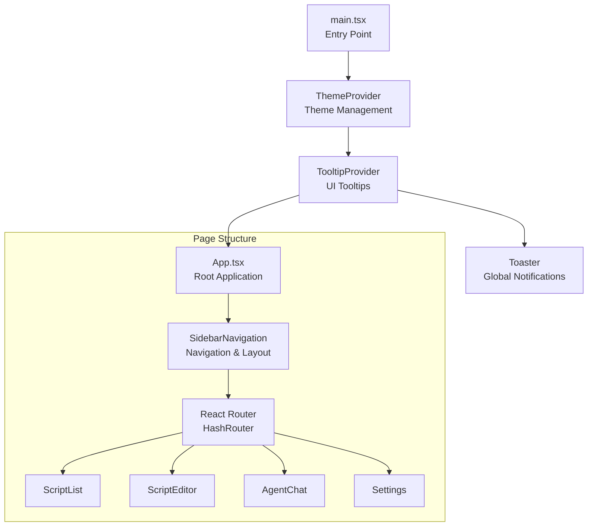
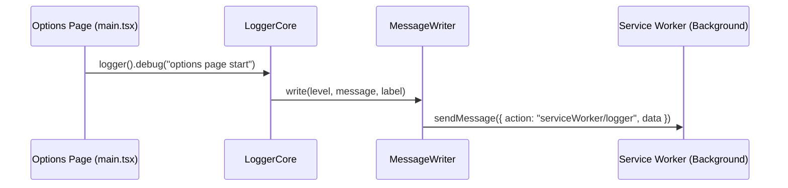
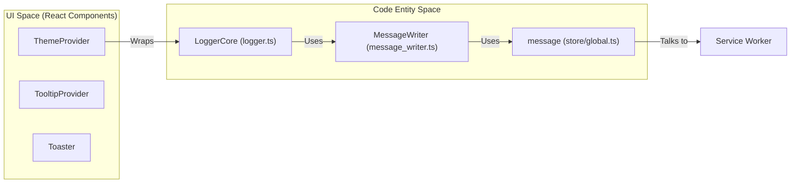

# Options Page Layout

Relevant source files

The following files were used as context for generating this wiki page:

- [docs/references/design-patterns.md](../docs/references/design-patterns.md)
- [packages/chrome-extension-mock/i18n.ts](../packages/chrome-extension-mock/i18n.ts)
- [packages/chrome-extension-mock/tab.ts](../packages/chrome-extension-mock/tab.ts)
- [src/app/logger/core.test.ts](../src/app/logger/core.test.ts)
- [src/app/logger/core.ts](../src/app/logger/core.ts)
- [src/app/logger/logger.ts](../src/app/logger/logger.ts)
- [src/app/logger/message_writer.test.ts](../src/app/logger/message_writer.test.ts)
- [src/app/logger/message_writer.ts](../src/app/logger/message_writer.ts)
- [src/index.css](../src/index.css)
- [src/pages/batchupdate/main.tsx](../src/pages/batchupdate/main.tsx)
- [src/pages/common.ts](../src/pages/common.ts)
- [src/pages/confirm/main.tsx](../src/pages/confirm/main.tsx)
- [src/pages/import/main.tsx](../src/pages/import/main.tsx)
- [src/pages/install/main.tsx](../src/pages/install/main.tsx)
- [src/pages/options.html](../src/pages/options.html)
- [src/pages/options/App.tsx](../src/pages/options/App.tsx)
- [src/pages/options/main.tsx](../src/pages/options/main.tsx)
- [src/pages/popup.html](../src/pages/popup.html)
- [src/pages/popup/main.tsx](../src/pages/popup/main.tsx)

## Purpose and Scope

The options page is the primary administrative interface for ScriptCat, providing tools for script management, system configuration, and AI agent orchestration. The architecture has transitioned to a modern stack utilizing **React 19**, **shadcn/ui**, and **Tailwind CSS v4** [src/pages/options/main.tsx:1-10](../src/pages/options/main.tsx#L1-L10), [src/index.css:1-2](../src/index.css#L1-L2). 

The layout follows a responsive sidebar-and-content pattern, integrated with a global theme provider (supporting dark/light modes) and a centralized logging infrastructure [src/pages/options/main.tsx:12-31](../src/pages/options/main.tsx#L12-L31).

## Overall Layout Architecture

The options page is initialized in `main.tsx`, which wraps the `App` component in several context providers.

**Layout Component Hierarchy:**

Sources: [src/pages/options/main.tsx:20-31](../src/pages/options/main.tsx#L20-L31), [src/pages/options/App.tsx:1-15](../src/pages/options/App.tsx#L1-L15)

## Core Frameworks and Design System

### shadcn/ui and Tailwind CSS v4
ScriptCat uses a custom design system built on Tailwind CSS v4 variables [src/index.css:12-116](../src/index.css#L12-L116). The design defines specific semantic tokens for both Light and Dark modes:

*   **Brand Colors**: Primary blue (`#1296db` light / `#3aacef` dark) [src/index.css:22-128](../src/index.css#L22-L128).
*   **Surface Colors**: `background`, `card`, and `popover` tokens for consistent depth [src/index.css:14-20](../src/index.css#L14-L20).
*   **State Colors**: Specific tokens for `success`, `warning`, and `destructive` actions [src/index.css:53-64](../src/index.css#L53-L64).
*   **Agent/Skill Colors**: Purple accents (`--skill`) used for AI-related components [src/index.css:67-70](../src/index.css#L67-L70).

### Theme Management
Theme switching is handled by the `ThemeProvider` [src/pages/options/main.tsx:21](../src/pages/options/main.tsx#L21). It injects CSS variables and toggles the `.dark` class on the root element, which triggers the Tailwind `dark` variant [src/index.css:4-118](../src/index.css#L4-L118).

## Logging and Observability

The options page initializes a dedicated `LoggerCore` instance upon startup. This logger is configured to communicate with the extension's Service Worker via a `MessageWriter` [src/pages/options/main.tsx:12-18](../src/pages/options/main.tsx#L12-L18).

| Entity | Role |
|--------|------|
| `LoggerCore` | Central log manager for the options context [src/app/logger/core.ts:19-54](../src/app/logger/core.ts#L19-L54) |
| `MessageWriter` | Transports logs via `chrome.runtime.sendMessage` to the background process [src/app/logger/message_writer.ts:7-29](../src/app/logger/message_writer.ts#L7-L29) |
| `LogLevel` | Supports `trace`, `debug`, `info`, `warn`, and `error` [src/app/logger/core.ts:3](../src/app/logger/core.ts#L3) |

**Data Flow for Options Logging:**

Sources: [src/pages/options/main.tsx:13-18](../src/pages/options/main.tsx#L13-L18), [src/app/logger/message_writer.ts:13-28](../src/app/logger/message_writer.ts#L13-L28), [src/app/logger/core.ts:30-54](../src/app/logger/core.ts#L30-L54)

## Routing and Navigation

Navigation within the options page is managed via **React Router**. The layout is designed to be responsive, adapting to desktop and mobile viewports.

### Page Organization
The extension partitions its functionality into several specialized pages, each sharing the same root layout logic (Theme + Toaster + Logger) but serving different HTML entry points:

| Page | Entry Point | Purpose |
|------|-------------|---------|
| Options | `options.html` | Main management dashboard [src/pages/options.html:1-13](../src/pages/options.html#L1-L13) |
| Install | `install.html` | Script installation and preview [src/pages/install/main.tsx:1-31](../src/pages/install/main.tsx#L1-L31) |
| Popup | `popup.html` | Quick access menu from browser toolbar [src/pages/popup.html:1-35](../src/pages/popup.html#L1-L35) |
| Confirm | `confirm.html` | Security and permission confirmation dialogs [src/pages/confirm/main.tsx:1-31](../src/pages/confirm/main.tsx#L1-L31) |
| Import | `import.html` | Bulk script and configuration import [src/pages/import/main.tsx:1-31](../src/pages/import/main.tsx#L1-L31) |
| Batch Update | `batchupdate.html` | Multi-script update interface [src/pages/batchupdate/main.tsx:1-31](../src/pages/batchupdate/main.tsx#L1-L31) |

### Responsive Considerations
The layout includes specific CSS overrides for mobile browsers (e.g., Edge Android) where the viewport might be forced to 100% width, while maintaining a fixed 360px width for standard desktop popups [src/pages/popup.html:8-29](../src/pages/popup.html#L8-L29).

**Entity Bridge Diagram:**

Sources: [src/pages/options/main.tsx:1-31](../src/pages/options/main.tsx#L1-L31), [src/pages/popup.html:8-29](../src/pages/popup.html#L8-L29), [src/app/logger/logger.ts:26-107](../src/app/logger/logger.ts#L26-L107)

---
