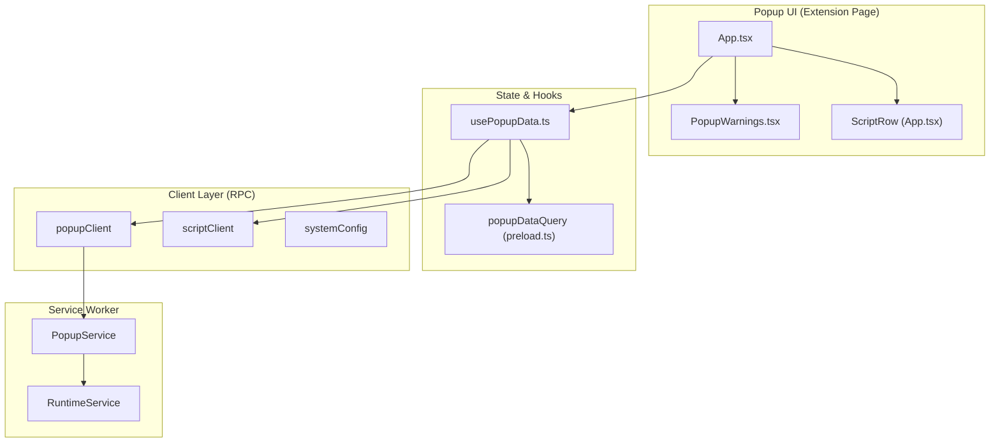
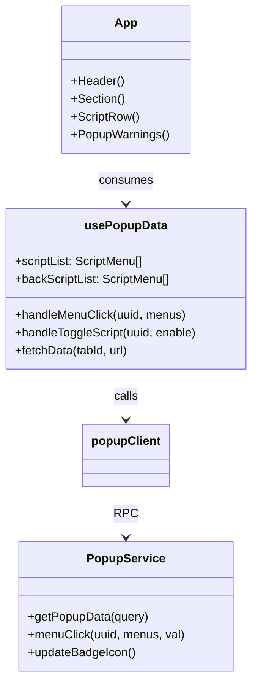

# Popup Interface

Relevant source files

The following files were used as context for generating this wiki page:

- [src/pages/popup/App.tsx](../src/pages/popup/App.tsx)
- [src/pages/popup/preload.ts](../src/pages/popup/preload.ts)
- [src/pages/popup/usePopupData.ts](../src/pages/popup/usePopupData.ts)
- [src/pkg/utils/utils.test.ts](../src/pkg/utils/utils.test.ts)
- [src/pkg/utils/utils.ts](../src/pkg/utils/utils.ts)

This document covers the popup interface that appears when users click the ScriptCat browser extension icon. The popup provides quick access to script management, displays running scripts, and offers controls for the current page and background scripts.

## Overview

The popup interface follows a modern React architecture utilizing a preloading strategy to minimize perceived latency. It is built with `shadcn/ui` components and Tailwind CSS v4 [src/pages/popup/App.tsx:25-56](../src/pages/popup/App.tsx#L25-L56).

1.  **Frontend**: React-based UI ([src/pages/popup/App.tsx](../src/pages/popup/App.tsx)) that displays script data and handles user interactions.
2.  **Data Layer**: A specialized hook `usePopupData` [src/pages/popup/usePopupData.ts:80](../src/pages/popup/usePopupData.ts#L80) and a preloading mechanism `preloadPopupData` [src/pages/popup/preload.ts:85](../src/pages/popup/preload.ts#L85) that fetches configuration and script state before the UI is fully rendered.
3.  **Backend**: `PopupService` class in the service worker that manages popup data, badge display, and context menus.

### System Architecture

Sources: [src/pages/popup/App.tsx:59-103](../src/pages/popup/App.tsx#L59-L103), [src/pages/popup/usePopupData.ts:80-147](../src/pages/popup/usePopupData.ts#L80-L147), [src/pages/popup/preload.ts:34-83](../src/pages/popup/preload.ts#L34-L83)

## usePopupData Hook

The `usePopupData` hook is the central state manager for the popup UI. It synchronizes local React state with the background service worker and preloaded data snapshots [src/pages/popup/usePopupData.ts:80-147](../src/pages/popup/usePopupData.ts#L80-L147).

### Preloading Strategy
To ensure the popup feels instantaneous, ScriptCat uses `createPreloadableQuery` [src/pages/popup/preload.ts:34](../src/pages/popup/preload.ts#L34).
- **`preloadPopupData()`**: Called during the extension's early initialization to start fetching `getCurrentTab()`, `systemConfig` settings, and script lists [src/pages/popup/preload.ts:36-55](../src/pages/popup/preload.ts#L36-L55).
- **`usePopupDataQuery()`**: Consumes the preloaded result. If the data is already available, `usePopupData` initializes its state immediately, avoiding a loading spinner [src/pages/popup/usePopupData.ts:133-147](../src/pages/popup/usePopupData.ts#L133-L147).

### State Synchronization
The hook maintains real-time synchronization via the `IMessageQueue` [src/pages/popup/usePopupData.ts:154-205](../src/pages/popup/usePopupData.ts#L154-L205):

| Event Topic | Handler Action |
|-------------|----------------|
| `popupMenuRecordUpdated` | Refreshes script list if the current tab's menus change [src/pages/popup/usePopupData.ts:159-163](../src/pages/popup/usePopupData.ts#L159-L163). |
| `enableScripts` | Patches the `enable` status of scripts in the local list [src/pages/popup/usePopupData.ts:165-173](../src/pages/popup/usePopupData.ts#L165-L173). |
| `deleteScripts` | Filters out deleted scripts from the local state [src/pages/popup/usePopupData.ts:176-184](../src/pages/popup/usePopupData.ts#L176-L184). |
| `scriptRunStatus` | Updates execution status (Running/Error) for background scripts [src/pages/popup/usePopupData.ts:187-195](../src/pages/popup/usePopupData.ts#L187-L195). |

Sources: [src/pages/popup/usePopupData.ts:80-205](../src/pages/popup/usePopupData.ts#L80-L205), [src/pages/popup/preload.ts:34-92](../src/pages/popup/preload.ts#L34-L92)

## Script Menu Display

Scripts are displayed in two primary sections: **Current Page** and **Background/Others** [src/pages/popup/App.tsx:149-214](../src/pages/popup/App.tsx#L149-L214).

### Sorting Logic
Scripts are sorted using `scriptListSorter` [src/pages/popup/preload.ts:28-32](../src/pages/popup/preload.ts#L28-L32):
1. **Enabled First**: Active scripts appear at the top.
2. **Menu Count**: Scripts with more registered menu commands are prioritized.
3. **Execution Count**: Scripts that run more frequently (`runNum`) appear higher.
4. **Update Time**: Recently updated scripts are prioritized as a tie-breaker.

### Menu Item Rendering
Individual menu items (registered via `GM_registerMenuCommand`) are processed by `getVisibleMenuItems` [src/pages/popup/usePopupData.ts:60-69](../src/pages/popup/usePopupData.ts#L60-L69):
- Filters out separators (`mSeparator`).
- De-duplicates items by `groupKey` (taking only the top-level group).
- Supports keyboard shortcuts (`accessKey`) which are registered globally in the popup via a `keypress` listener [src/pages/popup/App.tsx:65-93](../src/pages/popup/App.tsx#L65-L93).

Sources: [src/pages/popup/App.tsx:65-93](../src/pages/popup/App.tsx#L65-L93), [src/pages/popup/preload.ts:28-32](../src/pages/popup/preload.ts#L28-L32), [src/pages/popup/usePopupData.ts:60-69](../src/pages/popup/usePopupData.ts#L60-L69)

## Badge and Notification System

The popup interface integrates with the extension's badge and notification system to provide feedback on script activity.

- **Badge Count**: The `PopupService` updates the extension icon badge based on the number of running scripts or total execution count [src/app/service/service_worker/popup.ts:554-593](../src/app/service/service_worker/popup.ts#L554-L593).
- **Update Notifications**: The `checkUpdate` state in `usePopupData` tracks if a new extension version is available or if there are administrative notices [src/pages/popup/usePopupData.ts:93-95](../src/pages/popup/usePopupData.ts#L93-L95).
- **Error Display**: Transient error messages (e.g., failed to toggle a script) are displayed at the top of the popup and cleared after 3 seconds [src/pages/popup/usePopupData.ts:113-116](../src/pages/popup/usePopupData.ts#L113-L116).

Sources: [src/pages/popup/usePopupData.ts:93-116](../src/pages/popup/usePopupData.ts#L93-L116), [src/pages/popup/App.tsx:126-130](../src/pages/popup/App.tsx#L126-L130)

## Quick Actions and Site Scope

The popup provides several "Quick Actions" for managing the current environment:

### Site Scope Actions
When `popupSiteScopeActions` is enabled in settings, the UI provides controls to modify script behavior for the specific domain [src/pages/popup/App.tsx:170](../src/pages/popup/App.tsx#L170):
- **Exclude URL**: Adds the current URL to the script's `@exclude` list [src/pages/popup/App.tsx:169](../src/pages/popup/App.tsx#L169).
- **Only Run on URL**: Limits the script to the current URL [src/pages/popup/App.tsx:171](../src/pages/popup/App.tsx#L171).
- **Allow URL**: Specifically allows a URL that might have been excluded [src/pages/popup/App.tsx:172](../src/pages/popup/App.tsx#L172).

### Get More Scripts
The `getMoreScriptUrl` utility generates search links for external script repositories (ScriptCat, GreasyFork, OpenUserJS) based on the current page's hostname [src/pages/popup/usePopupData.ts:28-57](../src/pages/popup/usePopupData.ts#L28-L57). It intelligently strips subdomains (e.g., `www.google.com` to `google.com`) for better search results on GreasyFork [src/pages/popup/usePopupData.ts:43](../src/pages/popup/usePopupData.ts#L43).

Sources: [src/pages/popup/App.tsx:163-172](../src/pages/popup/App.tsx#L163-L172), [src/pages/popup/usePopupData.ts:28-57](../src/pages/popup/usePopupData.ts#L28-L57)

## Implementation Details

### Popup Entry Point
The popup architecture uses a clean separation between the layout (`App.tsx`) and the data logic (`usePopupData.ts`).

### Utility Functions
- **`extractHost(url)`**: Safely parses the hostname and port from a URL for site-specific actions [src/pages/popup/usePopupData.ts:19-25](../src/pages/popup/usePopupData.ts#L19-L25).
- **`filterScripts(list, query)`**: Performs client-side case-insensitive searching within the popup's script list [src/pages/popup/usePopupData.ts:72-76](../src/pages/popup/usePopupData.ts#L72-L76).
- **`getCurrentTab()`**: Retrieves the active tab in the last focused window to determine which scripts to display [src/pkg/utils/utils.ts:101-107](../src/pkg/utils/utils.ts#L101-L107).

Sources: [src/pages/popup/App.tsx:59-220](../src/pages/popup/App.tsx#L59-L220), [src/pages/popup/usePopupData.ts:19-80](../src/pages/popup/usePopupData.ts#L19-L80), [src/pkg/utils/utils.ts:101-107](../src/pkg/utils/utils.ts#L101-L107)

---
