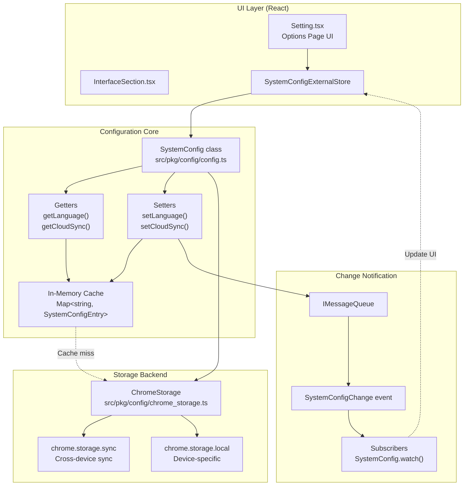
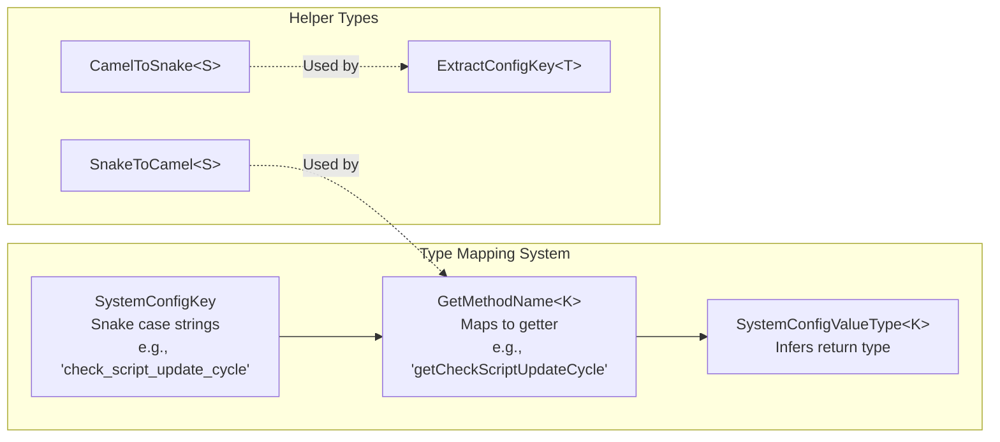
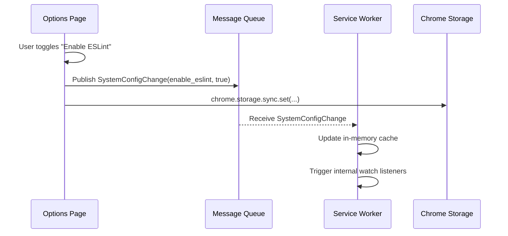

# Settings and Configuration

Relevant source files

The following files were used as context for generating this wiki page:

- [src/locales/de-DE/settings.json](../src/locales/de-DE/settings.json)
- [src/locales/en-US/settings.json](../src/locales/en-US/settings.json)
- [src/locales/ja-JP/settings.json](../src/locales/ja-JP/settings.json)
- [src/locales/ko-KR/settings.json](../src/locales/ko-KR/settings.json)
- [src/locales/pt-BR/settings.json](../src/locales/pt-BR/settings.json)
- [src/locales/ru-RU/settings.json](../src/locales/ru-RU/settings.json)
- [src/locales/tr-TR/settings.json](../src/locales/tr-TR/settings.json)
- [src/locales/vi-VN/settings.json](../src/locales/vi-VN/settings.json)
- [src/locales/zh-CN/settings.json](../src/locales/zh-CN/settings.json)
- [src/locales/zh-TW/settings.json](../src/locales/zh-TW/settings.json)
- [src/pages/options/routes/Setting/sections/InterfaceSection.test.tsx](../src/pages/options/routes/Setting/sections/InterfaceSection.test.tsx)
- [src/pages/options/routes/Setting/sections/InterfaceSection.tsx](../src/pages/options/routes/Setting/sections/InterfaceSection.tsx)
- [src/pkg/config/config.test.ts](../src/pkg/config/config.test.ts)
- [src/pkg/config/config.ts](../src/pkg/config/config.ts)

This page documents the configuration management system that stores and manages user preferences, application settings, and system-wide options. The configuration system provides type-safe access to settings, automatic change propagation across contexts, and a multi-tier caching strategy for performance optimization.

For information about cloud synchronization features, see [Cloud Synchronization](./6-3-cloud-synchronization.md). For information about script-specific storage (GM_setValue/GM_getValue), see [Script Storage and Values](./2-4-script-storage-and-values.md).

## Overview

The configuration system is centered around the `SystemConfig` class, which manages application-wide settings. Data is persisted using `chrome.storage.sync` for cross-device synchronization or `chrome.storage.local` for device-specific preferences. The system employs an in-memory cache and a message-based update mechanism to ensure settings remain consistent across the Service Worker, Options Page, and Popup contexts.

## Architecture

The following diagram maps the configuration system's natural language concepts to the specific code entities used in the implementation.

**System Configuration Data Flow**

**Sources:** [src/pkg/config/config.ts:189-209](../src/pkg/config/config.ts#L189-L209), [src/pkg/config/config.ts:126-163](../src/pkg/config/config.ts#L126-L163), [src/pkg/config/chrome_storage.ts:1-10](../src/pkg/config/chrome_storage.ts#L1-L10)

## SystemConfig Class Structure

The `SystemConfig` class uses a pattern-based architecture where configuration keys use snake_case naming (e.g., `check_script_update_cycle`) and are accessed through camelCase getter/setter methods (e.g., `getCheckScriptUpdateCycle()`, `setCheckScriptUpdateCycle()`).

### Type System and Mapping

The class uses TypeScript mapped types to ensure type safety between snake_case keys and camelCase methods. It uses `CamelToSnake` and `SnakeToCamel` utility types to bridge the naming conventions.

**Code Entity Mapping: Types to Strings**

The type system automatically extracts configuration keys from method names on lines [src/pkg/config/config.ts:91-98](../src/pkg/config/config.ts#L91-L98) and provides type-safe value inference on lines [src/pkg/config/config.ts:111-118](../src/pkg/config/config.ts#L111-L118).

**Sources:** [src/pkg/config/config.ts:81-118](../src/pkg/config/config.ts#L81-L118)

### React Integration via External Store

For React components, ScriptCat implements the `SystemConfigExternalStore` class. This class adheres to the `useSyncExternalStore` pattern, allowing UI components to subscribe to specific configuration keys and re-render only when those specific values change.

- **`subscribe`**: Registers a listener and starts watching the `SystemConfig` for changes to a specific key [src/pkg/config/config.ts:138-151](../src/pkg/config/config.ts#L138-L151).
- **`getSnapshot`**: Returns the current cached value for the UI to render [src/pkg/config/config.ts:136-136](../src/pkg/config/config.ts#L136-L136).
- **`set`**: Updates the value through `SystemConfig` [src/pkg/config/config.ts:153-156](../src/pkg/config/config.ts#L153-L156).

**Sources:** [src/pkg/config/config.ts:126-163](../src/pkg/config/config.ts#L126-L163)

## Storage Strategy

ScriptCat uses a dual-storage strategy using `chrome.storage.sync` for settings that should follow the user across devices, and `chrome.storage.local` for device-specific settings.

### Storage Tiers

| Tier | Backend | Use Case |
|------|---------|----------|
| **Sync Storage** | `chrome.storage.sync` | Default for most settings (e.g., update cycle, ESLint config). |
| **Local Storage** | `chrome.storage.local` | Settings defined in `STORAGE_LOCAL_KEYS` (e.g., cloud sync tokens, language, VSCode URL) [src/pkg/config/consts.ts:3-14](../src/pkg/config/consts.ts#L3-L14). |
| **Memory Cache** | `Map<string, SystemConfigEntry>` | Session-lifetime cache for performance [src/pkg/config/config.ts:190](../src/pkg/config/config.ts#L190). |

### Data Persistence Flow

1. **Write**: When `set(key, value)` is called, the value is updated in the in-memory `cache` [src/pkg/config/config.ts:213-216](../src/pkg/config/config.ts#L213-L216).
2. **Persistence**: The value is then written to the appropriate `ChromeStorage` instance (local or sync) [src/pkg/config/config.ts:203-205](../src/pkg/config/config.ts#L203-L205).
3. **Propagation**: A `SystemConfigChange` message is published to the `IMessageQueue` [src/pkg/config/config.ts:220-224](../src/pkg/config/config.ts#L220-L224).
4. **Synchronization**: Other contexts receiving the message update their own internal caches to maintain consistency [src/pkg/config/config.ts:210-219](../src/pkg/config/config.ts#L210-L219).

**Sources:** [src/pkg/config/config.ts:193-224](../src/pkg/config/config.ts#L193-L224), [src/pkg/config/config.test.ts:22-42](../src/pkg/config/config.test.ts#L22-L42)

## Configuration Categories

The settings UI is divided into several sections, each mapping to specific configuration keys in `SystemConfig`.

### General and Interface
- **Language**: Managed via `getLanguage`/`setLanguage`. Stored locally [src/pkg/config/consts.ts:9](../src/pkg/config/consts.ts#L9).
- **Icon Badge**: Controls what number appears on the extension icon (e.g., script count, run count) [src/locales/en-US/settings.json:57-66](../src/locales/en-US/settings.json#L57-L66).
- **Layout**: Options for compact popup layouts and menu expansion counts [src/locales/en-US/settings.json:70-78](../src/locales/en-US/settings.json#L70-L78).

### Runtime and Update
- **Update Frequency**: Frequency for checking script updates [src/locales/en-US/settings.json:79-81](../src/locales/en-US/settings.json#L79-L81).
- **Background Execution**: Controls if the extension stays active after closing browser windows [src/locales/en-US/settings.json:103-115](../src/locales/en-US/settings.json#L103-L115).
- **ESLint**: Configuration for code quality checks in the editor [src/locales/en-US/settings.json:16-19](../src/locales/en-US/settings.json#L16-L19).

### Security and External Access
- **Blacklist**: URL patterns where ScriptCat is prohibited from running [src/locales/en-US/settings.json:49-50](../src/locales/en-US/settings.json#L49-L50).
- **External Access**: Policies for CLI and MCP (Model Context Protocol) interactions, including `ExternalAccessWritePolicy` and `ExternalAccessSourceReadPolicy` [src/pkg/config/config.ts:43-53](../src/pkg/config/config.ts#L43-L53).

### Cloud Sync
- **Provider Config**: Configuration for WebDAV, S3, Google Drive, etc [src/pkg/config/config.ts:15-21](../src/pkg/config/config.ts#L15-L21).
- **Sync State**: Read-only status tracking for the UI, including last sync time and error messages [src/pkg/config/config.ts:25-30](../src/pkg/config/config.ts#L25-L30).

**Sources:** [src/pkg/config/config.ts:15-66](../src/pkg/config/config.ts#L15-L66), [src/locales/en-US/settings.json:1-136](../src/locales/en-US/settings.json#L1-L136)

## Auto-Refresh and Event Handling

The `SystemConfig` class implements a robust `watch` mechanism. It uses an `EventEmitter` to notify internal subscribers of changes [src/pkg/config/config.ts:207](../src/pkg/config/config.ts#L207). When a setting is updated in one process, the `IMessageQueue` ensures that all other extension processes (e.g., a background worker and an open settings page) synchronize their state.

**Sequence: Cross-Context Update**

**Sources:** [src/pkg/config/config.ts:210-224](../src/pkg/config/config.ts#L210-L224), [src/pkg/config/config.test.ts:44-74](../src/pkg/config/config.test.ts#L44-L74)

---
