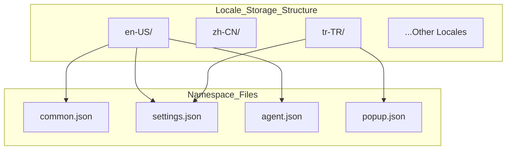
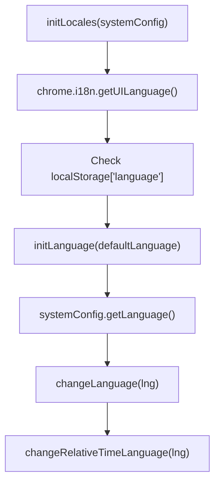
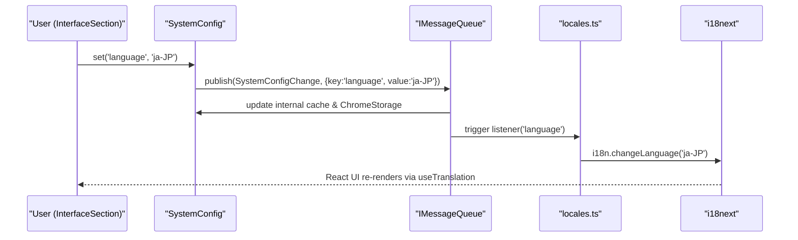

# Internationalization

Relevant source files

The following files were used as context for generating this wiki page:

- [docs/translation.md](../docs/translation.md)
- [scripts/check-i18n.mjs](../scripts/check-i18n.mjs)
- [scripts/check-i18n.test.mjs](../scripts/check-i18n.test.mjs)
- [scripts/git-staged-snapshot.mjs](../scripts/git-staged-snapshot.mjs)
- [src/locales/de-DE/settings.json](../src/locales/de-DE/settings.json)
- [src/locales/en-US/settings.json](../src/locales/en-US/settings.json)
- [src/locales/ja-JP/settings.json](../src/locales/ja-JP/settings.json)
- [src/locales/ko-KR/settings.json](../src/locales/ko-KR/settings.json)
- [src/locales/locales.test.ts](../src/locales/locales.test.ts)
- [src/locales/locales.ts](../src/locales/locales.ts)
- [src/locales/pt-BR/settings.json](../src/locales/pt-BR/settings.json)
- [src/locales/ru-RU/settings.json](../src/locales/ru-RU/settings.json)
- [src/locales/tr-TR/agent.json](../src/locales/tr-TR/agent.json)
- [src/locales/tr-TR/common.json](../src/locales/tr-TR/common.json)
- [src/locales/tr-TR/guide.json](../src/locales/tr-TR/guide.json)
- [src/locales/tr-TR/install.json](../src/locales/tr-TR/install.json)
- [src/locales/tr-TR/logs.json](../src/locales/tr-TR/logs.json)
- [src/locales/tr-TR/permission.json](../src/locales/tr-TR/permission.json)
- [src/locales/tr-TR/popup.json](../src/locales/tr-TR/popup.json)
- [src/locales/tr-TR/script.json](../src/locales/tr-TR/script.json)
- [src/locales/tr-TR/settings.json](../src/locales/tr-TR/settings.json)
- [src/locales/tr-TR/tools.json](../src/locales/tr-TR/tools.json)
- [src/locales/vi-VN/settings.json](../src/locales/vi-VN/settings.json)
- [src/locales/zh-CN/settings.json](../src/locales/zh-CN/settings.json)
- [src/locales/zh-TW/settings.json](../src/locales/zh-TW/settings.json)
- [src/pages/options/routes/Setting/sections/InterfaceSection.test.tsx](../src/pages/options/routes/Setting/sections/InterfaceSection.test.tsx)
- [src/pages/options/routes/Setting/sections/InterfaceSection.tsx](../src/pages/options/routes/Setting/sections/InterfaceSection.tsx)
- [src/pkg/config/config.ts](../src/pkg/config/config.ts)

This document covers the multi-language support system in ScriptCat, including locale management, translation workflows, and the technical implementation of internationalization (i18n) features. The system supports 10+ languages with dynamic language switching and community-driven translation management via Crowdin.

## Supported Languages and Locale Structure

ScriptCat supports multiple languages through a structured locale file system organized by language codes and namespaces. The primary engine used is `i18next`, integrated with React via `react-i18next`.

### Supported Languages

| Language Code | Language | Status |
|---------------|----------|---------|
| `en-US` | English (United States) | Primary/Reference |
| `zh-CN` | Chinese (Simplified) | Complete |
| `zh-TW` | Chinese (Traditional) | Complete |
| `ja-JP` | Japanese | Complete |
| `ru-RU` | Russian | Complete |
| `de-DE` | German | Complete |
| `vi-VN` | Vietnamese | Complete |
| `tr-TR` | Turkish | Complete |
| `pt-BR` | Portuguese (Brazil) | Complete |
| `ko-KR` | Korean | Complete |

**Sources:** [src/locales/locales.ts:47-66](../src/locales/locales.ts#L47-L66), [src/locales/en-US/settings.json:1-5](../src/locales/en-US/settings.json#L1-L5)

### Localization File Structure

The localization data is split into namespaces to optimize loading and organization. These namespaces include: `common`, `popup`, `script`, `editor`, `settings`, `install`, `agent`, `logs`, `guide`, `tools`, `permission`, and `external_access`.

**Sources:** [src/locales/locales.ts:30-43](../src/locales/locales.ts#L30-L43), [src/locales/tr-TR/settings.json:1-10](../src/locales/tr-TR/settings.json#L1-L10)

## Core Implementation: locales.ts

The `locales.ts` file is the central hub for i18n logic. It initializes the `i18n` instance, handles language detection, and provides utility functions for script metadata localization.

### Initialization and Language Detection

The initialization process considers three levels of priority:
1. **User Preference**: Retrieved from `SystemConfig` via `systemConfig.getLanguage()`.
2. **Persistence**: Checked in `localStorage["language"]`.
3. **Browser UI Language**: Detected via `chrome.i18n.getUILanguage()`.
4. **Fallback**: Defaulting to `en-US`.

**Sources:** [src/locales/locales.ts:74-92](../src/locales/locales.ts#L74-L92), [src/locales/locales.ts:20-23](../src/locales/locales.ts#L20-L23), [src/locales/locales.ts:45-53](../src/locales/locales.ts#L45-L53)

### Script Metadata Localization

ScriptCat supports localized script names and descriptions provided in the userscript metadata (e.g., `@name:zh-CN`). The functions `i18nName` and `i18nDescription` handle the resolution logic, including prefix matching (e.g., matching `zh-TW` to a `zh` metadata entry if a specific `zh-TW` entry is missing).

| Function | Logic |
|----------|-------|
| `i18nName` | Searches `metadata` for `name:lang`. If not found, tries `name:prefix`. Falls back to `script.name`. |
| `i18nDescription` | Searches `metadata` for `description:lang`. Falls back to default `description` or empty string. |

**Sources:** [src/locales/locales.ts:117-126](../src/locales/locales.ts#L117-L126), [src/locales/locales.ts:128-138](../src/locales/locales.ts#L128-L138)

## Component Integration

### Settings and Configuration

The application language is managed through the `SystemConfig` class. When a user changes the language in the UI, it updates the `language` key in `SystemConfig`.

*   **Persistence**: Settings are stored using `ChromeStorage` (either `sync` or `local` depending on the key).
*   **Reactivity**: `initLocales` adds a listener to `systemConfig` to react to language changes globally.

**Sources:** [src/pkg/config/config.ts:194-205](../src/pkg/config/config.ts#L194-L205), [src/locales/locales.ts:94](../src/locales/locales.ts#L94), [src/pages/options/routes/Setting/sections/InterfaceSection.tsx:1-10](../src/pages/options/routes/Setting/sections/InterfaceSection.tsx#L1-L10)

### Extension Marketplace (chrome.i18n)

While `i18next` handles the extension's internal UI (Options page, Popup), the extension's name and description in the Chrome Web Store are handled by the native `chrome.i18n` API using `_locales` directories required by the Manifest V3 standard.

**Sources:** [src/locales/locales.ts:75](../src/locales/locales.ts#L75), [src/locales/locales.ts:148](../src/locales/locales.ts#L148)

## Tooling and Workflow

### check:i18n Tooling
The project includes automated scripts to ensure translation consistency.
*   **`scripts/check-i18n.mjs`**: Validates that all translation keys present in the reference language (`en-US`) exist in other locale files. It identifies missing keys and redundant keys that are no longer used.

### Crowdin Workflow
ScriptCat uses Crowdin for community translations.
1.  Developers update `src/locales/en-US/*.json`.
2.  Changes are synced to Crowdin.
3.  Community translators provide localized strings.
4.  Translated files are pulled back into `src/locales/[lang]/*.json`.

**Sources:** [docs/translation.md:1-20](../docs/translation.md#L1-L20), [scripts/check-i18n.mjs:1-50](../scripts/check-i18n.mjs#L1-L50)

### ESLint Rules for i18n
Custom ESLint rules are used to maintain code quality regarding internationalization:
*   `no-i18n-default-value`: Ensures developers do not hardcode default values in translation calls that should be managed by the i18n files.

**Sources:** [src/pkg/config/config.ts:2](../src/pkg/config/config.ts#L2), [src/locales/locales.ts:46-53](../src/locales/locales.ts#L46-L53)

## Key Utility Functions

| Symbol | Purpose |
|--------|---------|
| `t` | The standard i18next translation function. |
| `changeLanguage` | Updates the active language and relative time formatting. |
| `isChineseUser` | Helper to determine if the current locale is a Chinese variant (`zh-`). |
| `matchLanguage` | Matches browser's `acceptLanguages` against available resource bundles. |
| `watchLanguageChange` | Allows components to subscribe to language change events. |

**Sources:** [src/locales/locales.ts:20-23](../src/locales/locales.ts#L20-L23), [src/locales/locales.ts:141-144](../src/locales/locales.ts#L141-L144), [src/locales/locales.ts:147-174](../src/locales/locales.ts#L147-L174), [src/locales/locales.ts:97-113](../src/locales/locales.ts#L97-L113)

## Data Flow: Language Updates

Language changes are propagated through the `SystemConfig` which utilizes an `IMessageQueue` to notify all extension contexts.

**Sources:** [src/pkg/config/config.ts:210-216](../src/pkg/config/config.ts#L210-L216), [src/locales/locales.ts:80-95](../src/locales/locales.ts#L80-L95), [src/pkg/config/config.ts:153-156](../src/pkg/config/config.ts#L153-L156)

---
