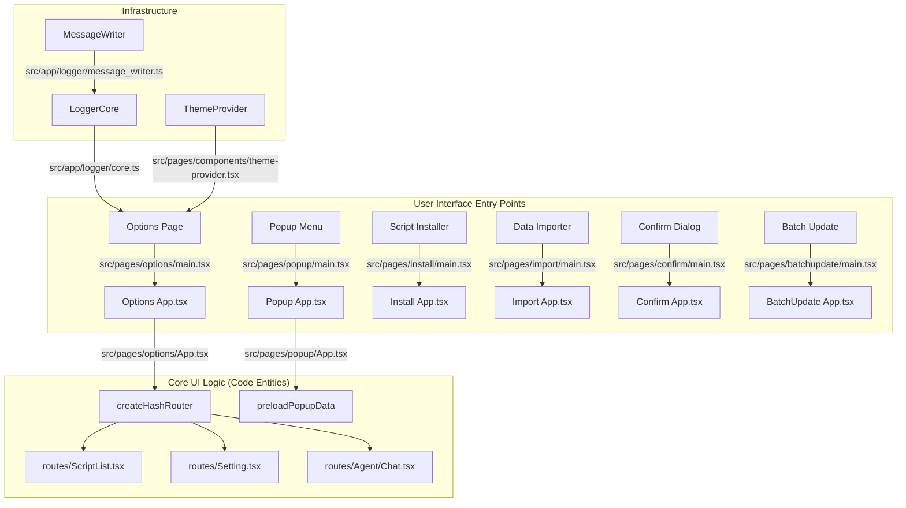
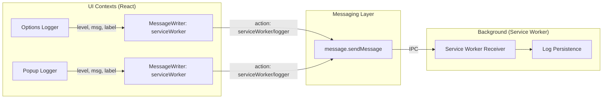

# User Interface

Relevant source files

The following files were used as context for generating this wiki page:

- [docs/references/design-patterns.md](../docs/references/design-patterns.md)
- [src/app/logger/core.test.ts](../src/app/logger/core.test.ts)
- [src/app/logger/core.ts](../src/app/logger/core.ts)
- [src/app/logger/logger.ts](../src/app/logger/logger.ts)
- [src/app/logger/message_writer.test.ts](../src/app/logger/message_writer.test.ts)
- [src/app/logger/message_writer.ts](../src/app/logger/message_writer.ts)
- [src/pages/batchupdate/main.tsx](../src/pages/batchupdate/main.tsx)
- [src/pages/confirm/main.tsx](../src/pages/confirm/main.tsx)
- [src/pages/import/main.tsx](../src/pages/import/main.tsx)
- [src/pages/install/main.tsx](../src/pages/install/main.tsx)
- [src/pages/options/App.tsx](../src/pages/options/App.tsx)
- [src/pages/options/main.tsx](../src/pages/options/main.tsx)
- [src/pages/popup/main.tsx](../src/pages/popup/main.tsx)

This page provides an overview of ScriptCat's React-based UI architecture. The interface is built using **React 19**, **shadcn/ui**, and **Tailwind CSS v4**, serving as the primary interaction layer for script management, configuration, and AI agent orchestration.

For information about the underlying service worker clients that the UI communicates with, see [GM API Reference](./4-gm-api-reference.md). For details about inter-process communication between UI and background processes, see [Inter-Process Communication](./5-inter-process-communication.md).

## UI Architecture Overview

ScriptCat's UI is partitioned into several entry points (HTML pages), each optimized for specific user tasks. These pages share a common infrastructure including a `ThemeProvider` for dark/light mode, a `Toaster` for notifications, and a centralized `LoggerCore` for diagnostic reporting.

### Bridge: Natural Language to Code Entities (UI Entry Points)

The following diagram maps user-facing interfaces to their corresponding React entry points and core logic files.

Sources: [src/pages/options/main.tsx:1-32](../src/pages/options/main.tsx#L1-L32), [src/pages/options/App.tsx:69-104](../src/pages/options/App.tsx#L69-L104), [src/pages/popup/main.tsx:1-32](../src/pages/popup/main.tsx#L1-L32), [src/pages/install/main.tsx:1-32](../src/pages/install/main.tsx#L1-L32), [src/pages/import/main.tsx:1-32](../src/pages/import/main.tsx#L1-L32), [src/pages/confirm/main.tsx:1-32](../src/pages/confirm/main.tsx#L1-L32), [src/app/logger/core.ts:19-54](../src/app/logger/core.ts#L19-L54)

## Options Page Layout ([Options Page Layout](./7-1-options-page-layout.md))

The Options Page is the main management console. It uses a responsive `Layout` shell that adapts between a desktop sidebar and a mobile bottom tab bar.

*   **Navigation**: Managed by `createHashRouter` using `Sidebar` for desktop and `BottomTabBar` for mobile [src/pages/options/App.tsx:26-63](../src/pages/options/App.tsx#L26-L63).
*   **Responsive Breakpoints**: A single source of truth at `768px` determines the layout via the `useIsMobile` hook [docs/references/design-patterns.md:9-12](../docs/references/design-patterns.md#L9-L12).
*   **Drag-and-Drop**: The `useScriptDropzone` hook enables global file dropping for `.js` scripts and `.zip` skill packages [src/pages/options/App.tsx:30-31](../src/pages/options/App.tsx#L30-L31).

For details, see [Options Page Layout](./7-1-options-page-layout.md).

Sources: [src/pages/options/App.tsx:26-104](../src/pages/options/App.tsx#L26-L104), [docs/references/design-patterns.md:3-46](../docs/references/design-patterns.md#L3-L46)

## Popup Interface ([Popup Interface](./7-2-popup-interface.md))

The Popup appears when clicking the extension icon. It is optimized for performance by pre-fetching data before the React tree mounts.

*   **Initialization**: The `preloadPopupData()` function is called at the entry point to minimize perceived latency [src/pages/popup/main.tsx:9-12](../src/pages/popup/main.tsx#L9-L12).
*   **Logging**: Uses a `MessageWriter.serviceWorker` to send logs from the popup context to the background service worker [src/pages/popup/main.tsx:15-18](../src/pages/popup/main.tsx#L15-L18).

For details, see [Popup Interface](./7-2-popup-interface.md).

Sources: [src/pages/popup/main.tsx:1-32](../src/pages/popup/main.tsx#L1-L32), [src/app/logger/message_writer.ts:13-15](../src/app/logger/message_writer.ts#L13-L15)

## Settings and Configuration ([Settings and Configuration](./7-3-settings-and-configuration.md))

The configuration system manages user preferences and system-wide behavior, utilizing a `ThemeProvider` for consistent styling.

*   **Theme Management**: The `ThemeProvider` wraps all major entry points to provide light/dark mode support [src/pages/options/main.tsx:21-26](../src/pages/options/main.tsx#L21-L26).
*   **Layout Patterns**: Long settings pages utilize a scroll-spy pattern to synchronize the navigation rail with the content position [docs/references/design-patterns.md:48-50](../docs/references/design-patterns.md#L48-L50).
*   **UI Components**: Built using `shadcn/ui` primitives (Dialog, Sheet, Popover) which default to a `z-50` floating layer [docs/references/design-patterns.md:52-61](../docs/references/design-patterns.md#L52-L61).

For details, see [Settings and Configuration](./7-3-settings-and-configuration.md).

Sources: [src/pages/options/main.tsx:7-9](../src/pages/options/main.tsx#L7-L9), [docs/references/design-patterns.md:48-61](../docs/references/design-patterns.md#L48-L61)

## Internationalization ([Internationalization](./7-4-internationalization.md))

ScriptCat implements a multi-tier i18n strategy to support a global user base.

*   **Layout Flexibility**: UI components are designed to flex or truncate rather than clip, accommodating varying text lengths across locales [docs/references/design-patterns.md:70-79](../docs/references/design-patterns.md#L70-L79).
*   **Tooling**: The codebase includes custom ESLint rules to enforce i18n standards, such as preventing hardcoded strings in default values [docs/references/design-patterns.md:72-74](../docs/references/design-patterns.md#L72-L74).

For details, see [Internationalization](./7-4-internationalization.md).

### Bridge: UI Logging to Service Worker

This diagram illustrates how logs generated in various UI contexts are routed back to the Service Worker for centralized processing.

Sources: [src/app/logger/message_writer.ts:7-29](../src/app/logger/message_writer.ts#L7-L29), [src/pages/options/main.tsx:13-16](../src/pages/options/main.tsx#L13-L16), [src/pages/popup/main.tsx:15-18](../src/pages/popup/main.tsx#L15-L18)

---
