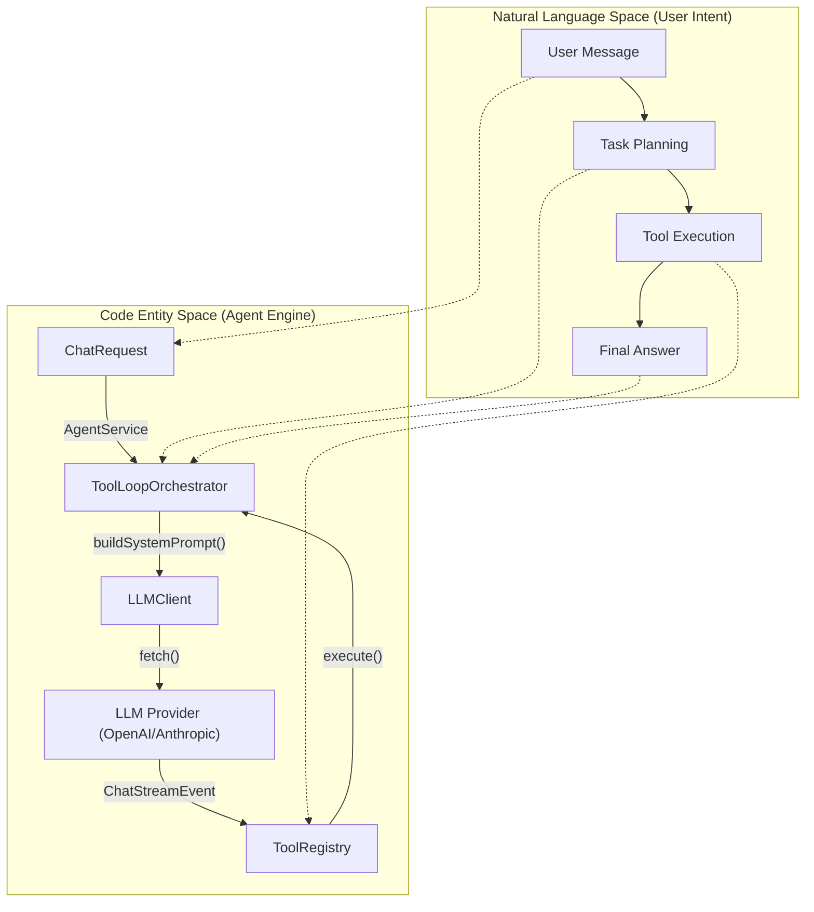
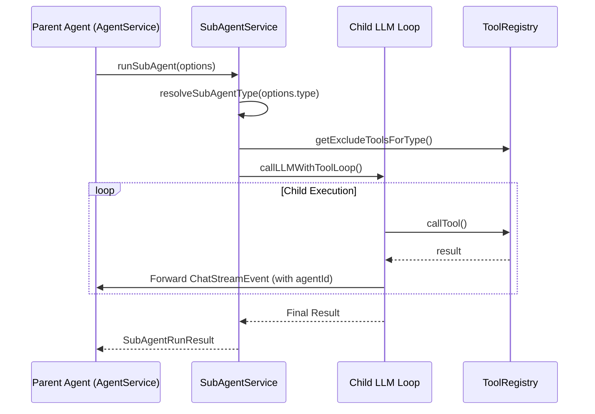

# Agent Core Engine

Relevant source files

The following files were used as context for generating this wiki page:

- [src/app/service/agent/core/compact_prompt.ts](../src/app/service/agent/core/compact_prompt.ts)
- [src/app/service/agent/core/mcp_client.test.ts](../src/app/service/agent/core/mcp_client.test.ts)
- [src/app/service/agent/core/mcp_client.ts](../src/app/service/agent/core/mcp_client.ts)
- [src/app/service/agent/core/providers/anthropic.test.ts](../src/app/service/agent/core/providers/anthropic.test.ts)
- [src/app/service/agent/core/providers/anthropic.ts](../src/app/service/agent/core/providers/anthropic.ts)
- [src/app/service/agent/core/providers/openai.test.ts](../src/app/service/agent/core/providers/openai.test.ts)
- [src/app/service/agent/core/providers/openai.ts](../src/app/service/agent/core/providers/openai.ts)
- [src/app/service/agent/core/sub_agent_types.ts](../src/app/service/agent/core/sub_agent_types.ts)
- [src/app/service/agent/core/system_prompt.test.ts](../src/app/service/agent/core/system_prompt.test.ts)
- [src/app/service/agent/core/system_prompt.ts](../src/app/service/agent/core/system_prompt.ts)
- [src/app/service/agent/core/types.ts](../src/app/service/agent/core/types.ts)
- [src/app/service/agent/service_worker/background.test.ts](../src/app/service/agent/service_worker/background.test.ts)
- [src/app/service/agent/service_worker/background_session_manager.ts](../src/app/service/agent/service_worker/background_session_manager.ts)
- [src/app/service/agent/service_worker/llm_client.ts](../src/app/service/agent/service_worker/llm_client.ts)
- [src/app/service/agent/service_worker/mcp.ts](../src/app/service/agent/service_worker/mcp.ts)
- [src/app/service/agent/service_worker/sub_agent_service.ts](../src/app/service/agent/service_worker/sub_agent_service.ts)

The **Agent Core Engine** is the central orchestration layer of ScriptCat's AI subsystem. It manages the lifecycle of AI interactions, abstracting LLM providers, coordinating tool execution loops, and maintaining session state across background processes.

## AgentService Composition

`AgentService` serves as the primary entry point for the agent subsystem. It orchestrates the flow between user input, LLM reasoning, and tool execution. It is designed to be provider-agnostic, relying on internal services to handle specific tasks like tool registration or model communication.

### Implementation and Data Flow
The engine follows a "Plan-Act-Verify" loop defined in the system prompts [src/app/service/agent/core/system_prompt.ts:35-41](../src/app/service/agent/core/system_prompt.ts#L35-L41). When a request is received, the engine:
1.  **Assembles the Context**: Combines the built-in system prompt, user-defined instructions, and active Skill metadata [src/app/service/agent/core/system_prompt.ts:5-80](../src/app/service/agent/core/system_prompt.ts#L5-L80).
2.  **LLM Abstraction**: Dispatches the request to the `LLMClient`, which selects the appropriate provider (OpenAI or Anthropic) based on the `AgentModelConfig` [src/app/service/agent/core/types.ts:182-194](../src/app/service/agent/core/types.ts#L182-L194).
3.  **Tool Loop**: Enters the `ToolLoopOrchestrator` to handle iterative tool calls.

**Natural Language to Code Entity Mapping: Agent Orchestration**

*Sources: [src/app/service/agent/core/types.ts:172-180](../src/app/service/agent/core/types.ts#L172-L180), [src/app/service/agent/core/system_prompt.ts:1-80](../src/app/service/agent/core/system_prompt.ts#L1-L80), [src/app/service/agent/service_worker/sub_agent_service.ts:13-25](../src/app/service/agent/service_worker/sub_agent_service.ts#L13-L25)*

---

## LLM Provider Abstraction

The engine abstracts differences between providers (OpenAI, Anthropic, etc.) through a unified interface. Each provider implements logic to transform ScriptCat's internal `ChatRequest` into the provider's specific wire format and parse the resulting Server-Sent Events (SSE) stream.

### OpenAI Provider
- **Request Building**: Transforms `ContentBlock` arrays into OpenAI's `image_url` or `input_audio` formats [src/app/service/agent/core/providers/openai.ts:14-56](../src/app/service/agent/core/providers/openai.ts#L14-L56).
- **Stream Parsing**: Handles standard `content_delta` as well as specialized fields like `reasoning_content` for DeepSeek/OpenAI o-series models [src/app/service/agent/core/providers/openai.ts:193-201](../src/app/service/agent/core/providers/openai.ts#L193-L201).
- **Usage Tracking**: Extracts `prompt_tokens` and `completion_tokens`, including `cached_tokens` details [src/app/service/agent/core/providers/openai.ts:176-192](../src/app/service/agent/core/providers/openai.ts#L176-L192).

### Anthropic Provider
- **Prompt Caching**: Automatically injects `cache_control: { type: "ephemeral" }` into the system prompt and the final tool definition to optimize costs for long conversations [src/app/service/agent/core/providers/anthropic.test.ts:124-146](../src/app/service/agent/core/providers/anthropic.test.ts#L124-L146).
- **Tool Format**: Maps tool parameters to `input_schema` and handles `tool_use` content blocks [src/app/service/agent/core/providers/anthropic.test.ts:60-86](../src/app/service/agent/core/providers/anthropic.test.ts#L60-L86).

*Sources: [src/app/service/agent/core/providers/openai.ts:59-127](../src/app/service/agent/core/providers/openai.ts#L59-L127), [src/app/service/agent/core/providers/anthropic.test.ts:15-36](../src/app/service/agent/core/providers/anthropic.test.ts#L15-L36)*

---

## ToolLoopOrchestrator Lifecycle

The `ToolLoopOrchestrator` manages the iterative process where the LLM requests a tool call, the engine executes it, and the result is fed back to the LLM.

### Lifecycle Stages
1.  **Streaming**: Events like `content_delta` and `tool_call_delta` are streamed to the UI in real-time [src/app/service/agent/core/types.ts:116-123](../src/app/service/agent/core/types.ts#L116-L123).
2.  **Retry Logic**: If a tool call fails, the system prompt instructs the agent to analyze the error and try a different approach rather than repeating the same call [src/app/service/agent/core/system_prompt.ts:46-50](../src/app/service/agent/core/system_prompt.ts#L46-L50).
3.  **Compacting**: When a conversation exceeds the model's context window, the `COMPACT_SYSTEM_PROMPT` is used to generate a structured summary that replaces the history [src/app/service/agent/core/compact_prompt.ts:1-48](../src/app/service/agent/core/compact_prompt.ts#L1-L48).

### Session vs. Global Tool Registry
The engine distinguishes between two types of tool availability:
- **Global ToolRegistry**: Contains built-in tools (e.g., `web_search`, `tabs`) and MCP tools registered at the system level [src/app/service/agent/service_worker/mcp.ts:74-86](../src/app/service/agent/service_worker/mcp.ts#L74-L86).
- **SessionToolRegistry**: A transient registry created for a specific conversation. It can include ephemeral tools provided by a userscript via the `CAT.agent` API [src/app/service/agent/core/types.ts:225-227](../src/app/service/agent/core/types.ts#L225-L227).

*Sources: [src/app/service/agent/core/compact_prompt.ts:3-48](../src/app/service/agent/core/compact_prompt.ts#L3-L48), [src/app/service/agent/service_worker/mcp.ts:22-35](../src/app/service/agent/service_worker/mcp.ts#L22-L35), [src/app/service/agent/core/types.ts:209-228](../src/app/service/agent/core/types.ts#L209-L228)*

---

## SubAgentService

`SubAgentService` allows the primary agent to delegate specialized tasks to child agents. This isolation prevents the primary agent from being overwhelmed by DOM details or complex research tasks.

### Sub-Agent Types
Sub-agents are governed by `SubAgentTypeConfig`, which defines their tool access via white/blacklists [src/app/service/agent/core/sub_agent_types.ts:3-11](../src/app/service/agent/core/sub_agent_types.ts#L3-L11).

| Type | Description | Key Tools Allowed |
| :--- | :--- | :--- |
| `researcher` | Read-only info gathering | `web_search`, `web_fetch`, `get_tab_content` |
| `page_operator` | DOM automation | `execute_script`, `get_tab_content`, `tabs` |
| `general` | General purpose | All tools except `ask_user` and `agent` |

### Execution Flow
1.  **Resolution**: The engine resolves the type and applies tool exclusions [src/app/service/agent/core/sub_agent_types.ts:122-132](../src/app/service/agent/core/sub_agent_types.ts#L122-L132).
2.  **Prompt Injection**: A specialized `SubAgentSystemPrompt` is generated, including role-specific instructions [src/app/service/agent/core/sub_agent_types.ts:35-82](../src/app/service/agent/core/sub_agent_types.ts#L35-L82).
3.  **Event Forwarding**: `ChatStreamEvent` objects from the sub-agent are tagged with a `SubAgentEventInfo` and forwarded to the parent conversation [src/app/service/agent/service_worker/sub_agent_service.ts:122-182](../src/app/service/agent/service_worker/sub_agent_service.ts#L122-L182).

**Sub-Agent Invocation Architecture**

*Sources: [src/app/service/agent/service_worker/sub_agent_service.ts:33-94](../src/app/service/agent/service_worker/sub_agent_service.ts#L33-L94), [src/app/service/agent/core/sub_agent_types.ts:17-98](../src/app/service/agent/core/sub_agent_types.ts#L17-L98)*

---

## BackgroundSessionManager

The `BackgroundSessionManager` maintains the state of active agent conversations in the Service Worker. This ensures that long-running tasks, such as multi-step browser automation or large data extraction, can continue even if the UI (Options page or Popup) is closed.

- **Persistence**: It handles the serialization of `ChatMessage` and `SubAgentDetails` to the database [src/app/service/agent/core/types.ts:65-81](../src/app/service/agent/core/types.ts#L65-L81).
- **Lifecycle**: It monitors `AbortSignal` for timeouts or user cancellations, ensuring sub-agents are cleaned up properly [src/app/service/agent/service_worker/sub_agent_service.ts:197-205](../src/app/service/agent/service_worker/sub_agent_service.ts#L197-L205).

*Sources: [src/app/service/agent/core/types.ts:87-104](../src/app/service/agent/core/types.ts#L87-L104), [src/app/service/agent/service_worker/sub_agent_service.ts:184-205](../src/app/service/agent/service_worker/sub_agent_service.ts#L184-L205)*

---
