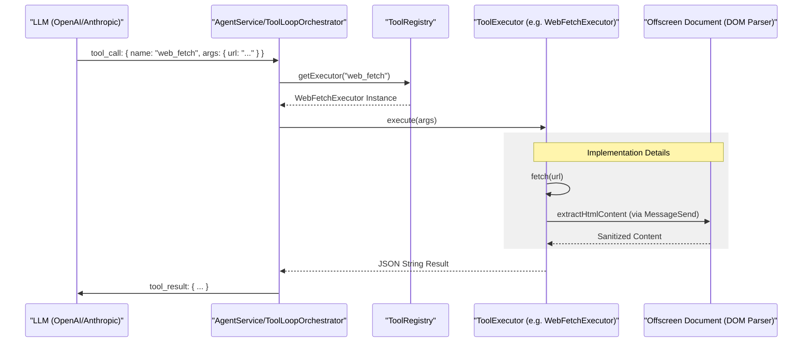
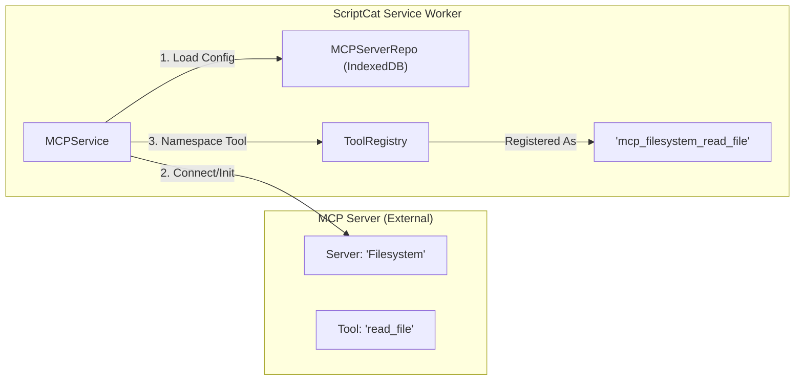

# Tool System and MCP Integration

Relevant source files

The following files were used as context for generating this wiki page:

- [src/app/service/agent/core/mcp_client.test.ts](../src/app/service/agent/core/mcp_client.test.ts)
- [src/app/service/agent/core/mcp_client.ts](../src/app/service/agent/core/mcp_client.ts)
- [src/app/service/agent/core/tools/web_fetch.test.ts](../src/app/service/agent/core/tools/web_fetch.test.ts)
- [src/app/service/agent/core/tools/web_fetch.ts](../src/app/service/agent/core/tools/web_fetch.ts)
- [src/app/service/agent/core/tools/web_search.test.ts](../src/app/service/agent/core/tools/web_search.test.ts)
- [src/app/service/agent/core/tools/web_search.ts](../src/app/service/agent/core/tools/web_search.ts)
- [src/app/service/agent/service_worker/mcp.ts](../src/app/service/agent/service_worker/mcp.ts)
- [src/app/service/offscreen/gm_api.ts](../src/app/service/offscreen/gm_api.ts)
- [src/app/service/service_worker/clipboard.ts](../src/app/service/service_worker/clipboard.ts)
- [src/app/service/service_worker/types.ts](../src/app/service/service_worker/types.ts)
- [src/template/scriptcat.d.tpl](../src/template/scriptcat.d.tpl)
- [src/types/main.d.ts](../src/types/main.d.ts)
- [src/types/scriptcat.d.ts](../src/types/scriptcat.d.ts)

The ScriptCat Tool System provides a unified interface for the AI Agent to interact with the browser, the web, and external services. It abstracts complex browser operations into discrete, schema-validated functions (Tools) and integrates the **Model Context Protocol (MCP)** to allow external servers to provide additional capabilities dynamically.

## 1. Tool Architecture

The system is built around a registry pattern that separates tool definitions (metadata for LLMs) from their execution logic.

### 1.1 ToolRegistry and SessionToolRegistry
The `ToolRegistry` serves as the global repository for all available tools in the Service Worker context. 

*   **Global Registry**: Stores built-in tools (e.g., `web_search`, `web_fetch`) and tools registered by MCP servers.
*   **Session Registry**: Created per agent session, it combines global tools with session-specific tools (like `skill` meta-tools or tab-specific automation tools).

### 1.2 Data Flow: Natural Language to Code Execution

The following diagram illustrates how a natural language request from an LLM is translated into a technical tool execution within the ScriptCat architecture.

**Tool Execution Lifecycle**

**Sources:** [src/app/service/agent/core/tool_registry.ts:1-50](../src/app/service/agent/core/tool_registry.ts#L1-L50), [src/app/service/agent/core/tools/web_fetch.ts:40-141](../src/app/service/agent/core/tools/web_fetch.ts#L40-L141)

## 2. Built-in Tools

ScriptCat provides several high-performance tools out of the box, often utilizing the **Offscreen Document** for DOM-heavy operations to avoid blocking the Service Worker.

| Tool Name | Class / Executor | Purpose | Key Files |
| :--- | :--- | :--- | :--- |
| `web_fetch` | `WebFetchExecutor` | Fetches URL content, extracts text/JSON, and optionally summarizes via LLM. | [src/app/service/agent/core/tools/web_fetch.ts:10-28](../src/app/service/agent/core/tools/web_fetch.ts#L10-L28) |
| `web_search` | `WebSearchExecutor` | Performs searches via Bing, DuckDuckGo, Baidu, or Google Custom Search. | [src/app/service/agent/core/tools/web_search.ts:14-26](../src/app/service/agent/core/tools/web_search.ts#L14-L26) |
| `tab_tools` | `TabExecutor` | Manages browser tabs (create, close, switch, list). | [src/types/scriptcat.d.ts:190-196](../src/types/scriptcat.d.ts#L190-L196) |
| `opfs` | `OPFSExecutor` | Provides a sandboxed file system for the agent to read/write persistent data. | [src/types/main.d.ts:25-34](../src/types/main.d.ts#L25-L34) |

### 2.1 Implementation Detail: Web Fetch & Search
`WebFetchExecutor` and `WebSearchExecutor` use the `AGENT_USER_AGENT` [src/app/service/agent/core/tools/web_fetch.ts:8](../src/app/service/agent/core/tools/web_fetch.ts#L8) and implement timeouts via `AbortSignal.timeout` [src/app/service/agent/core/tools/web_search.ts:86](../src/app/service/agent/core/tools/web_search.ts#L86). For HTML responses, they delegate parsing to the offscreen context via `extractHtmlContent` to safely strip `<script>` and `<style>` tags while preserving semantic text [src/app/service/agent/core/tools/web_fetch.ts:97](../src/app/service/agent/core/tools/web_fetch.ts#L97).

**Sources:** [src/app/service/agent/core/tools/web_fetch.ts:31-38](../src/app/service/agent/core/tools/web_fetch.ts#L31-L38), [src/app/service/agent/core/tools/web_search.ts:78-101](../src/app/service/agent/core/tools/web_search.ts#L78-L101)

## 3. MCP (Model Context Protocol) Integration

ScriptCat acts as an **MCP Client**, allowing it to connect to remote or local MCP servers to extend the Agent's capabilities without modifying the extension code.

### 3.1 MCP Client Architecture
The `MCPClient` handles the low-level JSON-RPC communication over HTTP/SSE with MCP servers.

*   **Initialization**: Connects to the server and identifies as "ScriptCat" with the current extension version [src/app/service/agent/core/mcp_client.ts:16](../src/app/service/agent/core/mcp_client.ts#L16).
*   **Capability Discovery**: Calls `listTools`, `listResources`, and `listPrompts` to map server features to ScriptCat's internal registry [src/app/service/agent/core/mcp_client.ts:27-85](../src/app/service/agent/core/mcp_client.ts#L27-L85).
*   **Tool Execution**: Wraps remote tool calls in `MCPToolExecutor`, which handles parameter passing and error normalization [src/app/service/agent/core/mcp_client.ts:38-55](../src/app/service/agent/core/mcp_client.ts#L38-L55).

### 3.2 MCP Service Management
The `MCPService` manages the lifecycle of multiple MCP server connections.

**MCP Registration Mapping**

**Sources:** [src/app/service/agent/service_worker/mcp.ts:22-53](../src/app/service/agent/service_worker/mcp.ts#L22-L53), [src/app/service/agent/service_worker/mcp.ts:74-86](../src/app/service/agent/service_worker/mcp.ts#L74-L86)

### 3.3 Namespacing
To avoid name collisions, MCP tools are registered using a slugified server name prefix:
`mcp_{serverName}_{toolName}` [src/app/service/agent/service_worker/mcp.ts:8-13](../src/app/service/agent/service_worker/mcp.ts#L8-L13).

## 4. Tool Execution & Security

### 4.1 Parameter Validation
Tools use utility functions like `requireString` and `optionalNumber` to ensure arguments provided by the LLM match the expected `ToolDefinition` schema [src/app/service/agent/core/tools/param_utils.ts](../src/app/service/agent/core/tools/param_utils.ts).

### 4.2 Clipboard & System Access
Tools requiring sensitive access, such as `GM_setClipboard`, are routed through the `GMApi` handler in the Service Worker or Offscreen context, ensuring that `mightPrepareSetClipboard` is called to satisfy browser user-gesture requirements where possible [src/app/service/offscreen/gm_api.ts:19-31](../src/app/service/offscreen/gm_api.ts#L19-L31).

**Sources:** [src/app/service/offscreen/gm_api.ts:1-32](../src/app/service/offscreen/gm_api.ts#L1-L32), [src/app/service/agent/core/tools/web_fetch.ts:51-64](../src/app/service/agent/core/tools/web_fetch.ts#L51-L64)

---
