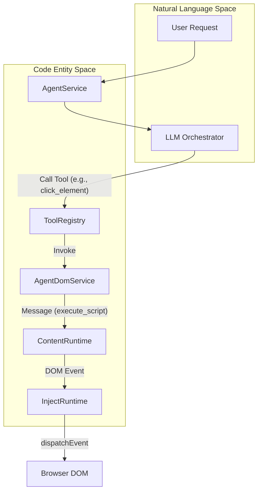
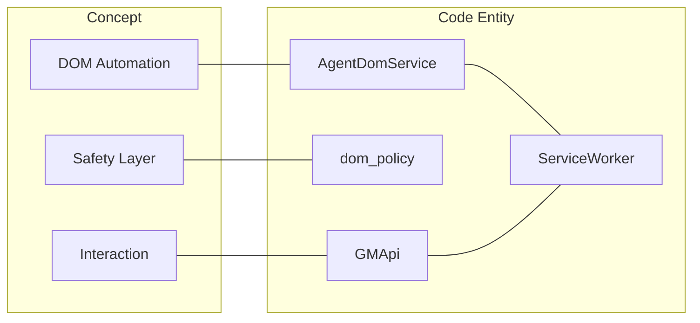

# DOM Automation and Page Interaction

<details>
<summary>Relevant source files</summary>

The following files were used as context for generating this wiki page:

- [src/app/service/agent/core/providers/anthropic.test.ts](../src/app/service/agent/core/providers/anthropic.test.ts)
- [src/app/service/agent/core/providers/anthropic.ts](../src/app/service/agent/core/providers/anthropic.ts)
- [src/app/service/agent/core/providers/openai.test.ts](../src/app/service/agent/core/providers/openai.test.ts)
- [src/app/service/agent/core/providers/openai.ts](../src/app/service/agent/core/providers/openai.ts)
- [src/app/service/agent/core/types.ts](../src/app/service/agent/core/types.ts)
- [src/app/service/agent/service_worker/background.test.ts](../src/app/service/agent/service_worker/background.test.ts)
- [src/app/service/agent/service_worker/background_session_manager.ts](../src/app/service/agent/service_worker/background_session_manager.ts)
- [src/app/service/agent/service_worker/llm_client.ts](../src/app/service/agent/service_worker/llm_client.ts)
- [src/app/service/agent/service_worker/sub_agent_service.ts](../src/app/service/agent/service_worker/sub_agent_service.ts)
- [src/app/service/offscreen/gm_api.ts](../src/app/service/offscreen/gm_api.ts)
- [src/app/service/service_worker/clipboard.ts](../src/app/service/service_worker/clipboard.ts)
- [src/app/service/service_worker/types.ts](../src/app/service/service_worker/types.ts)
- [src/template/scriptcat.d.tpl](../src/template/scriptcat.d.tpl)
- [src/types/main.d.ts](../src/types/main.d.ts)
- [src/types/scriptcat.d.ts](../src/types/scriptcat.d.ts)

</details>


The DOM Automation and Page Interaction layer provides the AI Agent and userscripts with the capability to perceive and manipulate web pages. This system bridges the gap between high-level agent goals and low-level browser operations through the `AgentDomService`, a robust event dispatching system, and a safety-oriented `dom_policy` layer.

## AgentDomService Architecture

The `AgentDomService` acts as the primary orchestrator for page interactions. It abstracts complex browser APIs into simplified tools that an LLM can invoke.

### Key Capabilities
*   **Page Navigation**: Handling URL changes and state transitions.
*   **DOM Perception**: Reading the page structure, extracting text, and capturing screenshots for visual models.
*   **Interaction**: Dispatching clicks, keyboard events, and form inputs.
*   **Monitoring**: Using `MutationObserver` and dialog capture to track dynamic page changes.

### Data Flow Diagram: Agent to DOM Interaction

This diagram illustrates how a natural language request from the `AgentService` is translated into a DOM action via the `AgentDomService`.



**Sources:**
*   `src/app/service/agent/service_worker/sub_agent_service.ts:27-28` (Service orchestration)
*   `src/app/service/agent/core/types.ts:172-178` (Chat and Tool request structures)
*   `src/types/scriptcat.d.ts:187-188` (Content context fetching)

## Event Dispatching: Default vs. CDP-Trusted

ScriptCat supports two modes of event dispatching to ensure compatibility and bypass bot detection.

| Feature | Default Dispatch (Synthetic) | CDP-Trusted Dispatch |
| :--- | :--- | :--- |
| **Mechanism** | `new CustomEvent()` or `dispatchEvent` | `chrome.debugger` (Chrome DevTools Protocol) |
| **Trusted Flag** | `isTrusted: false` | `isTrusted: true` |
| **Safety** | High (Limited by sandbox) | Low (Bypasses many page protections) |
| **Detection** | Easily detected by anti-bot scripts | Difficult to detect; mimics real user input |
| **Implementation** | `InjectRuntime` [src/types/main.d.ts:51-52](../src/types/main.d.ts#L51-L52) | `AgentDomService` via Background context |

**Sources:**
*   `src/types/main.d.ts:51-52` (DOM object exchange)
*   `src/types/scriptcat.d.ts:187-188` (Contextual fetching)

## DOM Monitoring and Safety Layer

To prevent infinite loops and malicious interactions, ScriptCat implements a monitoring system and a `dom_policy` safety layer.

### MutationObserver and Dialog Capture
The system monitors the DOM for changes to notify the Agent when an asynchronous action (like a button click that triggers an AJAX load) has completed. It also captures `window.alert`, `confirm`, and `prompt` dialogs, converting them into non-blocking events that the Agent can respond to programmatically.

### dom_policy
The `dom_policy` defines the constraints under which the Agent operates. It prevents the Agent from:
1.  Interacting with browser chrome/internal pages (e.g., `chrome://settings`).
2.  Executing scripts on restricted domains unless explicitly permitted.
3.  Performing rapid-fire interactions that could be flagged as DoS attacks.

### Code Entity Association Diagram

This diagram maps system concepts to specific classes and functions in the codebase.



**Sources:**
*   `src/app/service/offscreen/gm_api.ts:23-32` (GMApi implementation)
*   `src/app/service/service_worker/clipboard.ts:5-15` (Clipboard safety handling)

## Core Interaction APIs

The following table details the primary APIs used for page interaction within the Agent context.

| API | File Reference | Description |
| :--- | :--- | :--- |
| `navigate` | `AgentDomService` | Changes the current tab URL and waits for the `DOMContentLoaded` event. |
| `readPage` | `AgentDomService` | Extracts a simplified representation of the DOM (Aria-tree or Markdown) for LLM consumption. |
| `screenshot` | `AgentDomService` | Captures the visible viewport or specific element using `chrome.tabs.captureVisibleTab`. |
| `executeScript` | `src/app/service/agent/service_worker/sub_agent_service.ts` | Runs arbitrary JavaScript within the context of the page, bypassing standard sandbox restrictions if permitted. |
| `setClipboard` | `src/app/service/service_worker/clipboard.ts:5-15` | Securely sets the system clipboard via a hidden textarea in the offscreen document. |

### Implementation Details: Clipboard Interaction
Clipboard access is handled via an offscreen document or background script to ensure it works even when the page doesn't have focus.

```typescript
// src/app/service/service_worker/clipboard.ts:5-15
export const setClipboard = (data: string, mimetype: string) => {
  if (!textareaDOM) {
    throw new Error("mightPrepareSetClipboard shall be called first.");
  }
  customClipboardData = { mimetype, data };
  textareaDOM!.focus();
  document.execCommand("copy", false, <any>null);
};
```

**Sources:**
*   `src/app/service/service_worker/clipboard.ts:5-15` (Clipboard implementation)
*   `src/app/service/offscreen/gm_api.ts:19-21` (Offscreen clipboard bridge)
*   `src/app/service/agent/service_worker/sub_agent_service.ts:33-42` (Script execution orchestration)

---
