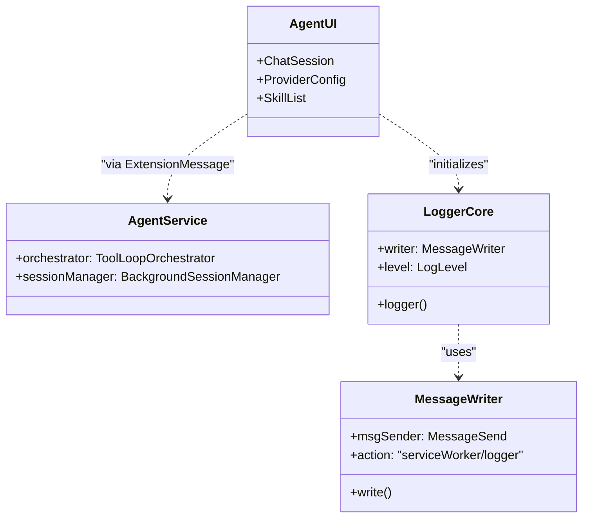

# Agent UI

<details>
<summary>Relevant source files</summary>

The following files were used as context for generating this wiki page:

- [src/app/logger/core.test.ts](../src/app/logger/core.test.ts)
- [src/app/logger/core.ts](../src/app/logger/core.ts)
- [src/app/logger/logger.ts](../src/app/logger/logger.ts)
- [src/app/logger/message_writer.test.ts](../src/app/logger/message_writer.test.ts)
- [src/app/logger/message_writer.ts](../src/app/logger/message_writer.ts)
- [src/app/service/agent/core/providers/anthropic.test.ts](../src/app/service/agent/core/providers/anthropic.test.ts)
- [src/app/service/agent/core/providers/anthropic.ts](../src/app/service/agent/core/providers/anthropic.ts)
- [src/app/service/agent/core/providers/openai.test.ts](../src/app/service/agent/core/providers/openai.test.ts)
- [src/app/service/agent/core/providers/openai.ts](../src/app/service/agent/core/providers/openai.ts)
- [src/app/service/agent/core/types.ts](../src/app/service/agent/core/types.ts)
- [src/app/service/agent/service_worker/background.test.ts](../src/app/service/agent/service_worker/background.test.ts)
- [src/app/service/agent/service_worker/background_session_manager.ts](../src/app/service/agent/service_worker/background_session_manager.ts)
- [src/app/service/agent/service_worker/llm_client.ts](../src/app/service/agent/service_worker/llm_client.ts)
- [src/app/service/agent/service_worker/sub_agent_service.ts](../src/app/service/agent/service_worker/sub_agent_service.ts)
- [src/pages/batchupdate/main.tsx](../src/pages/batchupdate/main.tsx)
- [src/pages/confirm/main.tsx](../src/pages/confirm/main.tsx)
- [src/pages/import/main.tsx](../src/pages/import/main.tsx)
- [src/pages/install/main.tsx](../src/pages/install/main.tsx)
- [src/pages/options/main.tsx](../src/pages/options/main.tsx)
- [src/pages/popup/main.tsx](../src/pages/popup/main.tsx)

</details>


The Agent UI is a specialized section of the ScriptCat options page that provides a graphical interface for interacting with the AI Agent subsystem. It encompasses chat interfaces, provider configurations, skill and task management, and file system exploration via the Origin Private File System (OPFS).

## Architecture Overview

The Agent UI is built using React 19 and integrated into the main Options page routing structure. It communicates with the `AgentService` and other background services through a standardized messaging layer.

### Data Flow and Communication
The UI components utilize a `LoggerCore` instance initialized at the entry point to handle environment-specific logging, sending logs back to the Service Worker via `MessageWriter` [src/pages/options/main.tsx:12-16](../src/pages/options/main.tsx#L12-L16).

Title: Agent UI to Background Communication
```mermaid
graph TD
    subgraph "Options Page (UI Context)"
        [AgentChat] -- "sendMessage" --> [GlobalStore]
        [AgentSettings] -- "updateConfig" --> [GlobalStore]
        [OPFSBrowser] -- "CAT_fileStorage" --> [Background]
    end

    subgraph "Service Worker (Background Context)"
        [GlobalStore] -- "ExtensionMessage" --> [AgentService]
        [AgentService] -- "orchestrate" --> [ToolLoopOrchestrator]
        [ToolLoopOrchestrator] -- "exec" --> [BuiltinTools]
    end

    [MessageWriter] -- "serviceWorker/logger" --> [LoggerCore]
```
**Sources:** [src/pages/options/main.tsx:1-31](../src/pages/options/main.tsx#L1-L31), [src/app/logger/message_writer.ts:1-29](../src/app/logger/message_writer.ts#L1-L29)

## Chat Interface

The Chat interface provides a streaming interaction environment for the Agent. It supports multi-modal inputs and visualizes the Agent's reasoning and tool-calling process.

### Features
*   **Streaming Responses:** Real-time rendering of content and thinking blocks.
*   **Tool Call Visualization:** Displays when the agent invokes tools (e.g., `web_search`, `executeScript`).
*   **Multi-modal Support:** Handling of images and files through `convertContentBlocks` [src/app/service/agent/core/providers/openai.ts:14-56](../src/app/service/agent/core/providers/openai.ts#L14-L56).

## Provider Configuration

This section manages the connection to Large Language Models (LLMs). ScriptCat supports multiple providers via an abstraction layer defined in `AgentModelConfig` [src/app/service/agent/core/types.ts](../src/app/service/agent/core/types.ts).

### Supported Providers
| Provider | Implementation | Features |
| :--- | :--- | :--- |
| **OpenAI** | `buildOpenAIRequest` | Supports `stream_options`, tool calling, and image generation [src/app/service/agent/core/providers/openai.ts:59-127](../src/app/service/agent/core/providers/openai.ts#L59-L127). |
| **Anthropic** | `AnthropicProvider` | Supports Claude-specific headers and beta features. |
| **Custom** | `AgentModelConfig` | Allows overriding `apiBaseUrl` for proxies or local models (e.g., Ollama) [src/app/service/agent/core/providers/openai.test.ts:27-35](../src/app/service/agent/core/providers/openai.test.ts#L27-L35). |

**Sources:** [src/app/service/agent/core/providers/openai.ts:1-127](../src/app/service/agent/core/providers/openai.ts#L1-L127), [src/app/service/agent/core/providers/openai.test.ts:1-98](../src/app/service/agent/core/providers/openai.test.ts#L1-L98)

## Skills and Tasks Management

The UI provides management views for the Agent's extended capabilities.

### Skills Management
*   **Skill List:** Displays installed skills (packaged as `.zip` or `.md`).
*   **Skill Meta-tools:** Interface to view tools registered by specific skills in the `ToolRegistry`.

### Tasks (Cron)
The Tasks page manages scheduled agent executions handled by `AgentTaskService`. Users can:
*   Configure cron expressions for automated agent runs.
*   View execution logs and retry status for failed tasks (`CATRetryError`).

## OPFS File Browser

The Agent workspace utilizes the **Origin Private File System (OPFS)** for persistent storage. The UI includes a file browser that allows users to:
1.  Navigate the directory structure used by the Agent.
2.  Upload/Download files for Agent consumption.
3.  Manage workspace isolation for different sessions.

## MCP Server Configuration

The Agent UI includes a configuration panel for the **Model Context Protocol (MCP)**. This allows the ScriptCat Agent to connect to external MCP servers, extending its toolset beyond the browser environment.

*   **Server URL:** Endpoint for the MCP inspector or server.
*   **Permission Mapping:** UI for approving which tools an MCP server is allowed to execute.

## Agent Settings

The settings page allows fine-tuning of the `AgentService` behavior:
*   **General Settings:** Default model selection and system prompts.
*   **Safety & Privacy:** DOM policy management (`dom_policy`) and screenshot permissions.
*   **Logging:** Configuration of the `LoggerCore` level (debug, info, warn, error) [src/app/logger/core.ts:19-54](../src/app/logger/core.ts#L19-L54).

Title: Agent UI Entity Mapping

**Sources:** [src/app/logger/core.ts:19-54](../src/app/logger/core.ts#L19-L54), [src/app/logger/logger.ts:26-107](../src/app/logger/logger.ts#L26-L107), [src/pages/options/main.tsx:12-31](../src/pages/options/main.tsx#L12-L31)

---
