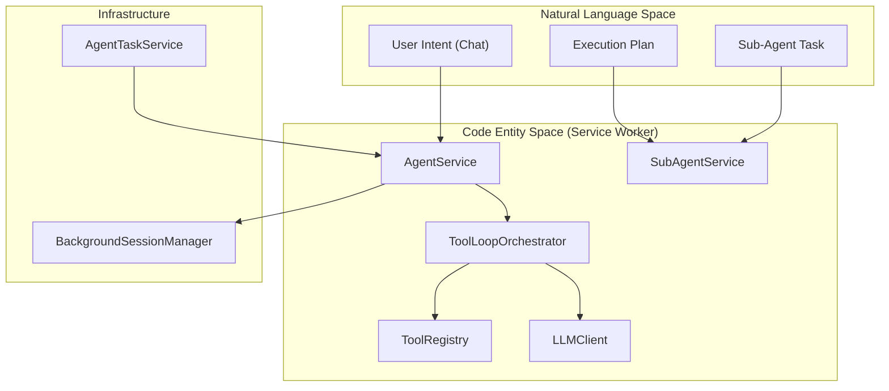

# Agent / AI Subsystem

Relevant source files

The following files were used as context for generating this wiki page:

- [src/app/service/agent/core/compact_prompt.ts](../src/app/service/agent/core/compact_prompt.ts)
- [src/app/service/agent/core/providers/anthropic.test.ts](../src/app/service/agent/core/providers/anthropic.test.ts)
- [src/app/service/agent/core/providers/anthropic.ts](../src/app/service/agent/core/providers/anthropic.ts)
- [src/app/service/agent/core/providers/openai.test.ts](../src/app/service/agent/core/providers/openai.test.ts)
- [src/app/service/agent/core/providers/openai.ts](../src/app/service/agent/core/providers/openai.ts)
- [src/app/service/agent/core/sub_agent_types.ts](../src/app/service/agent/core/sub_agent_types.ts)
- [src/app/service/agent/core/system_prompt.test.ts](../src/app/service/agent/core/system_prompt.test.ts)
- [src/app/service/agent/core/system_prompt.ts](../src/app/service/agent/core/system_prompt.ts)
- [src/app/service/agent/core/types.ts](../src/app/service/agent/core/types.ts)
- [src/app/service/agent/service_worker/background.test.ts](../src/app/service/agent/service_worker/background.test.ts)
- [src/app/service/agent/service_worker/background_session_manager.ts](../src/app/service/agent/service_worker/background_session_manager.ts)
- [src/app/service/agent/service_worker/llm_client.ts](../src/app/service/agent/service_worker/llm_client.ts)
- [src/app/service/agent/service_worker/sub_agent_service.ts](../src/app/service/agent/service_worker/sub_agent_service.ts)
- [src/app/service/offscreen/gm_api.ts](../src/app/service/offscreen/gm_api.ts)
- [src/app/service/service_worker/clipboard.ts](../src/app/service/service_worker/clipboard.ts)
- [src/app/service/service_worker/types.ts](../src/app/service/service_worker/types.ts)
- [src/template/scriptcat.d.tpl](../src/template/scriptcat.d.tpl)
- [src/types/main.d.ts](../src/types/main.d.ts)
- [src/types/scriptcat.d.ts](../src/types/scriptcat.d.ts)

The **Agent / AI Subsystem** is a high-level orchestration layer built on top of ScriptCat's multi-context architecture. It transforms the extension from a passive userscript manager into an active AI assistant capable of browser automation, data extraction, and complex task execution.

The subsystem operates by exposing extension capabilities (tabs, DOM, storage) as "Tools" to Large Language Models (LLMs) like OpenAI and Anthropic. It supports autonomous loop execution, sub-agent delegation, and scheduled background tasks.

### Architecture Overview

The agent layer bridges the gap between **Natural Language Space** (user intents and LLM reasoning) and **Code Entity Space** (browser APIs and extension services).

#### Natural Language to Code Mapping
The following diagram illustrates how high-level agent concepts map to specific implementation classes and service worker entities.

**Sources:** [src/app/service/agent/service_worker/sub_agent_service.ts:27-28](../src/app/service/agent/service_worker/sub_agent_service.ts#L27-L28), [src/app/service/agent/service_worker/llm_client.ts](../src/app/service/agent/service_worker/llm_client.ts)

---

### Core Engine and Orchestration
The **Agent Core Engine** is responsible for the "Think-Act-Observe" loop. It manages conversation state, interacts with LLM providers (OpenAI, Anthropic), and handles the streaming of responses.

*   **AgentService**: The primary entry point that coordinates sessions and persists history.
*   **ToolLoopOrchestrator**: Manages the iterative process where the LLM calls tools, the extension executes them, and the results are fed back to the LLM.
*   **LLM Providers**: Abstracted interfaces for different models. For example, `buildOpenAIRequest` converts internal message formats into OpenAI-compatible JSON [src/app/service/agent/core/providers/openai.ts:59-63](../src/app/service/agent/core/providers/openai.ts#L59-L63).
*   **Context Compaction**: When conversation history exceeds token limits, the engine uses `COMPACT_SYSTEM_PROMPT` to summarize progress and preserve critical "Mid-task corrections" [src/app/service/agent/core/compact_prompt.ts:1-19](../src/app/service/agent/core/compact_prompt.ts#L1-L19).

For details, see [Agent Core Engine](./8-1-agent-core-engine.md).

**Sources:** [src/app/service/agent/core/providers/openai.ts:59-127](../src/app/service/agent/core/providers/openai.ts#L59-L127), [src/app/service/agent/core/compact_prompt.ts:1-48](../src/app/service/agent/core/compact_prompt.ts#L1-L48)

---

### Tool System and MCP
The **Tool System** provides the agent with its "hands." Tools are registered in a `ToolRegistry` and described to the LLM using JSON Schema.

*   **Built-in Tools**: Includes `web_fetch`, `web_search`, `tabs`, and `execute_script` [src/app/service/agent/core/system_prompt.ts:31-33](../src/app/service/agent/core/system_prompt.ts#L31-L33).
*   **MCP Integration**: Supports the Model Context Protocol, allowing the agent to connect to external tool servers.
*   **Skill Tools**: Userscripts can be packaged as "Skills," providing domain-specific tools to the agent.

For details, see [Tool System and MCP Integration](./8-2-tool-system-and-mcp-integration.md).

**Sources:** [src/app/service/agent/core/system_prompt.ts:29-33](../src/app/service/agent/core/system_prompt.ts#L29-L33), [src/app/service/agent/core/sub_agent_types.ts:21-32](../src/app/service/agent/core/sub_agent_types.ts#L21-L32)

---

### DOM Automation and Page Interaction
The agent interacts with web pages via a specialized workflow designed to minimize token usage and maximize reliability.

*   **Discovery**: The agent uses `get_tab_content` to receive a Markdown representation of the page, complete with CSS selector annotations like `<!-- #id > .class -->` [src/app/service/agent/core/system_prompt.ts:83-85](../src/app/service/agent/core/system_prompt.ts#L83-L85).
*   **Action**: Once selectors are known, the agent uses `execute_script` to perform clicks or fill forms [src/app/service/agent/core/system_prompt.ts:37-40](../src/app/service/agent/core/system_prompt.ts#L37-L40).
*   **Verification**: The system mandates verifying outcomes (e.g., checking if a field was actually filled) rather than assuming success [src/app/service/agent/core/system_prompt.ts:44-46](../src/app/service/agent/core/system_prompt.ts#L44-L46).

For details, see [DOM Automation and Page Interaction](./8-3-dom-automation-and-page-interaction.md).

**Sources:** [src/app/service/agent/core/system_prompt.ts:35-46](../src/app/service/agent/core/system_prompt.ts#L35-L46), [src/app/service/agent/core/system_prompt.ts:83-86](../src/app/service/agent/core/system_prompt.ts#L83-L86)

---

### Sub-Agents and Task Delegation
For complex workflows, the main agent acts as an **Orchestrator**. It breaks down requests into steps and delegates them to specialized **Sub-Agents**.

| Sub-Agent Type | Capabilities | Limitations |
| :--- | :--- | :--- |
| `researcher` | Web search, page reading, OPFS access | No DOM interaction (clicks/forms) |
| `page_operator` | Tab navigation, DOM interaction (`execute_script`) | No web search |
| `general` | All tools except user interaction | Cannot spawn nested sub-agents |

Sub-agents operate with restricted toolsets defined in `SUB_AGENT_TYPES` [src/app/service/agent/core/sub_agent_types.ts:17-98](../src/app/service/agent/core/sub_agent_types.ts#L17-L98).

For details, see [Skills and Scheduled Tasks](./8-4-skills-and-scheduled-tasks.md).

**Sources:** [src/app/service/agent/core/sub_agent_types.ts:17-98](../src/app/service/agent/core/sub_agent_types.ts#L17-L98), [src/app/service/agent/service_worker/sub_agent_service.ts:33-42](../src/app/service/agent/service_worker/sub_agent_service.ts#L33-L42)

---

### Agent UI and User Experience
The **Agent UI** is integrated into the ScriptCat Options page, providing a chat-based interface for interacting with the AI.

*   **Chat Interface**: Supports streaming text, thinking blocks (e.g., `<think>` tags), and tool execution status.
*   **Configuration**: UI for managing LLM API keys, model selection, and provider endpoints.
*   **Workspace**: A browser for the **OPFS (Origin Private File System)**, where agents store extracted data and artifacts.
*   **Task Monitoring**: A dashboard for viewing the status of long-running or scheduled `AgentTask` instances.

For details, see [Agent UI](./8-5-agent-ui.md).

**Sources:** [src/app/service/agent/core/compact_prompt.ts:57-61](../src/app/service/agent/core/compact_prompt.ts#L57-L61), [src/app/service/agent/core/system_prompt.ts:31-33](../src/app/service/agent/core/system_prompt.ts#L31-L33)

---
