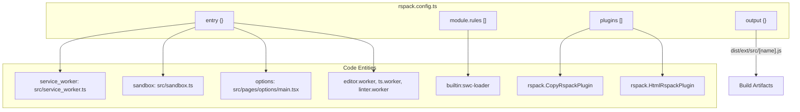
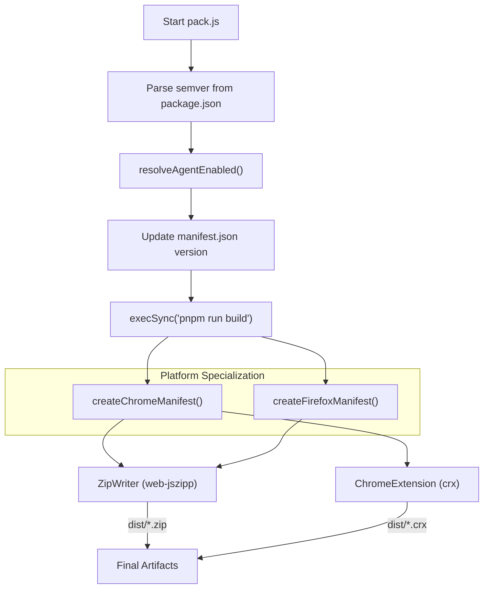

# Build System

Relevant source files

The following files were used as context for generating this wiki page:

- [.github/workflows/build.yaml](../.github/workflows/build.yaml)
- [.github/workflows/packageRelease.yml](../.github/workflows/packageRelease.yml)
- [.github/workflows/test.yaml](../.github/workflows/test.yaml)
- [docs/architecture.md](../docs/architecture.md)
- [docs/references/architecture-build.md](../docs/references/architecture-build.md)
- [docs/references/architecture-data.md](../docs/references/architecture-data.md)
- [docs/references/architecture-gm-api.md](../docs/references/architecture-gm-api.md)
- [docs/references/architecture-services.md](../docs/references/architecture-services.md)
- [docs/references/design-components.md](../docs/references/design-components.md)
- [rspack.config.ts](../rspack.config.ts)
- [scripts/build-config.js](../scripts/build-config.js)
- [scripts/build-config.test.js](../scripts/build-config.test.js)
- [scripts/pack.js](../scripts/pack.js)
- [vitest.config.ts](../vitest.config.ts)

## Purpose and Scope

This document describes the build system that compiles ScriptCat's TypeScript and React source code into a loadable browser extension. The build system handles compilation for multiple execution contexts (service worker, popup UI, options page, content scripts, inject scripts, and sandbox), manages assets, and provides both development and production build modes.

The system is centered around **Rspack**, a high-performance Rust-based bundler, and a custom packaging pipeline for generating distributable `.zip` and `.crx` files for Chrome and Firefox.

**Sources:** [package.json:1-107](../package.json#L1-L107), [src/manifest.json:1-68](../src/manifest.json#L1-L68), [rspack.config.ts:1-227](../rspack.config.ts#L1-L227)

---

## Build Tool: Rspack

ScriptCat uses **Rspack** as its primary bundler. Rspack provides Webpack-compatible APIs with significantly faster build performance. The configuration is defined in `rspack.config.ts`.

### Key Configuration Entities

The following diagram maps the Rspack configuration concepts to the specific code entities used in the ScriptCat build process.

**Configuration Highlights:**
- **Multi-Entry Architecture**: Separate entry points are defined for the service worker, offscreen document, sandbox, content scripts, and various UI pages (popup, options, install, etc.) [rspack.config.ts:56-75](../rspack.config.ts#L56-L75).
- **SWC Loader**: Uses `builtin:swc-loader` for fast TypeScript and JSX transformation, targeting `chrome >= 120`, `edge >= 120`, and `firefox >= 136` [rspack.config.ts:107-128](../rspack.config.ts#L107-L128).
- **Chunk Exclusion**: Specific bundles like `service_worker`, `content`, `inject`, and `scripting` are excluded from standard code splitting to ensure they remain self-contained as required by browser extension runtimes [rspack.config.ts:28-38](../rspack.config.ts#L28-L38).
- **Asset Handling**: `CopyRspackPlugin` manages the migration of `manifest.json`, logos (including beta variants), and localization files (`_locales`) to the build directory [rspack.config.ts:143-182](../rspack.config.ts#L143-L182).

**Sources:** [rspack.config.ts:28-38](../rspack.config.ts#L28-L38), [rspack.config.ts:56-75](../rspack.config.ts#L56-L75), [rspack.config.ts:107-128](../rspack.config.ts#L107-L128), [rspack.config.ts:143-182](../rspack.config.ts#L143-L182)

---

## Build Scripts and Modes

The build system provides several commands via `package.json` to handle different stages of the development lifecycle.

| Script | Command | Purpose |
|--------|---------|---------|
| `dev` | `cross-env NODE_ENV=development rspack` | Watch mode with `inline-source-map` for debugging [rspack.config.ts:41-46](../rspack.config.ts#L41-L46). |
| `build` | `cross-env NODE_ENV=production rspack build` | Optimized production build with minification and no source maps [rspack.config.ts:47-50](../rspack.config.ts#L47-L50). |
| `pack` | `node ./scripts/pack.js` | High-level script that triggers a build and then packages the result into zip/crx formats [scripts/pack.js:59-62](../scripts/pack.js#L59-L62). |

**Sources:** [rspack.config.ts:41-50](../rspack.config.ts#L41-L50), [scripts/pack.js:59-62](../scripts/pack.js#L59-L62)

---

## Packaging Pipeline (`pack.js`)

The `scripts/pack.js` script handles the final preparation of the extension for distribution. It performs version manipulation, environment-specific manifest adjustments, and compression.

### Packaging Flow

**Key Packaging Logic:**
- **Beta Versioning**: If the version in `package.json` contains a prerelease tag, the manifest name is updated to `__MSG_scriptcat_beta__` [scripts/pack.js:36-40](../scripts/pack.js#L36-L40).
- **Agent Feature Flag**: The `resolveAgentEnabled` function determines if the AI Agent feature is active based on whether it is a beta version or if the `SC_DISABLE_AGENT` environment variable is set [scripts/pack.js:31-34](../scripts/pack.js#L31-L34).
- **Git Integration**: If built via GitHub Actions on a branch, the commit SHA is appended to the internal `ExtVersion` constant in `src/app/const.ts` [scripts/pack.js:50-56](../scripts/pack.js#L50-L56).
- **Cross-Browser Manifests**: 
    - **Chrome**: Removes Firefox-specific background scripts and removes `userScripts` from `optional_permissions` [scripts/build-config.js:54-71](../scripts/build-config.js#L54-L71).
    - **Firefox**: Removes `service_worker`, adds `browser_specific_settings` (Gecko ID), and injects a specific Sandbox CSP required for Firefox MV3 [scripts/build-config.js:81-116](../scripts/build-config.js#L81-L116).
- **CRX Generation**: Uses the `crx` package and a private key (`scriptcat.pem`) to generate a signed Chrome extension file [scripts/pack.js:113-123](../scripts/pack.js#L113-L123).

**Sources:** [scripts/pack.js:31-56](../scripts/pack.js#L31-L56), [scripts/pack.js:113-123](../scripts/pack.js#L113-L123), [scripts/build-config.js:54-116](../scripts/build-config.js#L54-L116)

---

## Agent Feature Flag and Manifest Transformations

The build system explicitly handles the AI Agent feature through conditional logic in both the Rspack configuration and the packaging scripts.

| Function | File | Logic |
|----------|------|-------|
| `resolveAgentEnabled` | `scripts/build-config.js` | Defaults to `true` for beta, `false` for stable; overridden by `SC_DISABLE_AGENT` [scripts/build-config.js:7-11](../scripts/build-config.js#L7-L11). |
| `applyAgentManifest` | `scripts/build-config.js` | If Agent is disabled, removes the `debugger` permission from the manifest [scripts/build-config.js:21-27](../scripts/build-config.js#L21-L27). |
| `applyFirefoxSandboxManifest` | `scripts/build-config.js` | Injects `FIREFOX_SANDBOX_CSP` into the manifest for Firefox compatibility [scripts/build-config.js:38-45](../scripts/build-config.js#L38-L45). |

**Sources:** [scripts/build-config.js:7-45](../scripts/build-config.js#L7-L45)

---

## Testing and Quality Assurance

The build pipeline is integrated with a multi-tiered testing strategy defined in `vitest.config.ts` and `.github/workflows/test.yaml`.

- **Vitest Sharding**: Unit tests are split into three projects: `fast` (vmThreads, non-isolated), `ui` (React components), and `isolated` (requires fresh environment for JSZip or Sandbox testing) [vitest.config.ts:59-110](../vitest.config.ts#L59-L110).
- **CI Pipeline**: The `test` workflow runs linting, unit tests (with sharding), and E2E tests via Playwright [.github/workflows/test.yaml:12-241](../.github/workflows/test.yaml#L12-L241).
- **E2E Tests**: Playwright tests are executed against a built version of the extension to verify cross-context communication and GM API functionality [.github/workflows/test.yaml:226-231](../.github/workflows/test.yaml#L226-L231).

**Sources:** [vitest.config.ts:59-110](../vitest.config.ts#L59-L110), [.github/workflows/test.yaml:12-241](../.github/workflows/test.yaml#L12-L241)

---

## Hot Reload and Limitations

- **React DevTools**: Can be enabled via `REACT_DEVTOOLS=true`, which modifies the extension's Content Security Policy (CSP) to allow connection to `localhost:8097` [rspack.config.ts:158-163](../rspack.config.ts#L158-L163).
- **Service Worker**: Due to Manifest V3 limitations, changes to `service_worker.ts` require a manual reload of the extension in the browser's extension management page.
- **Source Maps**: In development, `inline-source-map` is used unless `NO_MAP=true` is specified [rspack.config.ts:45](../rspack.config.ts#L45).
- **Clean Builds**: The output directory `dist/ext/src` is cleaned before every build [rspack.config.ts:79](../rspack.config.ts#L79).

**Sources:** [rspack.config.ts:45](../rspack.config.ts#L45), [rspack.config.ts:79](../rspack.config.ts#L79), [rspack.config.ts:158-163](../rspack.config.ts#L158-L163)

---
