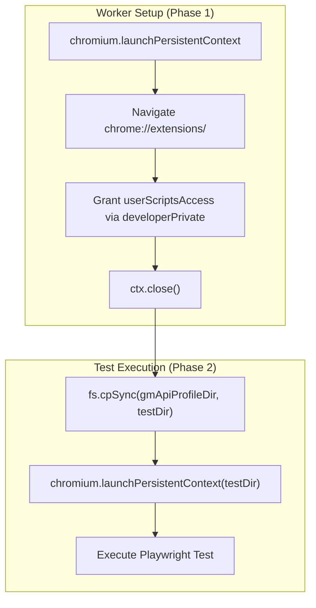
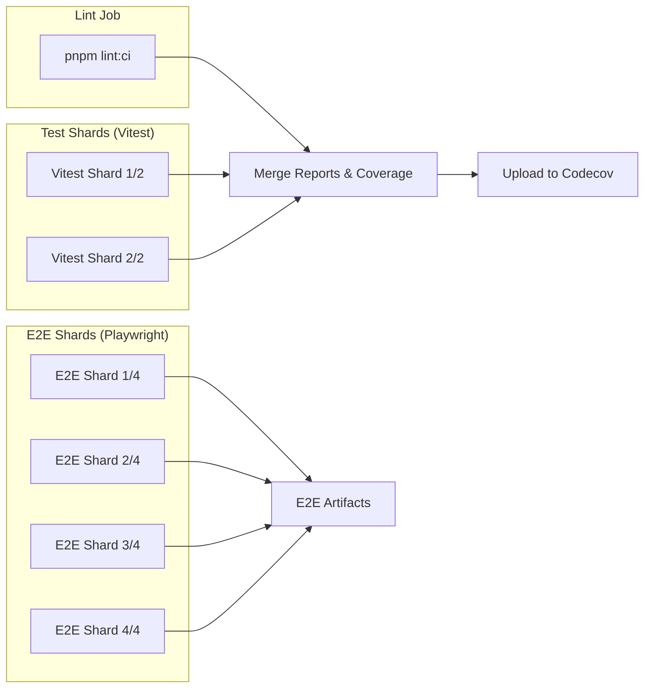

# Testing and Quality

Relevant source files

The following files were used as context for generating this wiki page:

- [.github/workflows/build.yaml](../.github/workflows/build.yaml)
- [.github/workflows/packageRelease.yml](../.github/workflows/packageRelease.yml)
- [.github/workflows/test.yaml](../.github/workflows/test.yaml)
- [e2e/agent-fixtures.ts](../e2e/agent-fixtures.ts)
- [e2e/agent-navigation.spec.ts](../e2e/agent-navigation.spec.ts)
- [e2e/backup-zip.spec.ts](../e2e/backup-zip.spec.ts)
- [e2e/fixtures.ts](../e2e/fixtures.ts)
- [e2e/gm-api.spec.ts](../e2e/gm-api.spec.ts)
- [e2e/gm-xhr-site-access.spec.ts](../e2e/gm-xhr-site-access.spec.ts)
- [e2e/install.spec.ts](../e2e/install.spec.ts)
- [e2e/options.spec.ts](../e2e/options.spec.ts)
- [e2e/popup.spec.ts](../e2e/popup.spec.ts)
- [e2e/script-management.spec.ts](../e2e/script-management.spec.ts)
- [e2e/server-fixtures.ts](../e2e/server-fixtures.ts)
- [e2e/standalone-pages-smoke.spec.ts](../e2e/standalone-pages-smoke.spec.ts)
- [e2e/storage-name.spec.ts](../e2e/storage-name.spec.ts)
- [e2e/subscribe-lifecycle.spec.ts](../e2e/subscribe-lifecycle.spec.ts)
- [e2e/utils.ts](../e2e/utils.ts)
- [packages/chrome-extension-mock/downloads.ts](../packages/chrome-extension-mock/downloads.ts)
- [packages/chrome-extension-mock/extension.ts](../packages/chrome-extension-mock/extension.ts)
- [packages/chrome-extension-mock/index.ts](../packages/chrome-extension-mock/index.ts)
- [packages/chrome-extension-mock/permissions.ts](../packages/chrome-extension-mock/permissions.ts)
- [playwright.config.ts](../playwright.config.ts)
- [rspack.config.ts](../rspack.config.ts)
- [scripts/build-config.js](../scripts/build-config.js)
- [scripts/build-config.test.js](../scripts/build-config.test.js)
- [scripts/pack.js](../scripts/pack.js)
- [src/app/service/service_worker/download.test.ts](../src/app/service/service_worker/download.test.ts)
- [src/app/service/service_worker/download.ts](../src/app/service/service_worker/download.ts)
- [vitest.config.ts](../vitest.config.ts)

## Purpose and Scope

This document describes the testing infrastructure, code quality tools, and quality assurance practices used in the ScriptCat project. It covers the **Vitest** unit test suite, **Playwright** end-to-end (E2E) tests, **ESLint** configuration for static analysis, and the continuous integration (CI) pipeline. These systems ensure the reliability of the ScriptCat browser extension across its various contexts (Service Worker, Sandbox, and UI).

## Testing Infrastructure

ScriptCat employs a layered testing strategy combining fast unit tests for logic and comprehensive E2E tests for browser-level integration.

### Vitest Project Architecture

The Vitest suite is divided into three specialized projects in `vitest.config.ts` to optimize execution speed and environment isolation:

| Project Name | Scope | Pool Type | Isolation | Timeout |
| :--- | :--- | :--- | :--- | :--- |
| `fast` | General logic, utilities, and services. | `vmThreads` | `false` | 340ms |
| `ui` | React components and page-level hooks. | `vmThreads` | `false` | 850ms |
| `isolated` | Tests requiring fresh module environments (e.g., ZIP handling, Sandbox semantics). | `threads` | `true` | 340ms |

**Sources:** [vitest.config.ts:59-110](../vitest.config.ts#L59-L110)

### Vitest Configuration and Environment

Vitest is configured to use `happy-dom` to simulate a browser environment for UI and content script testing [vitest.config.ts:42](../vitest.config.ts#L42).

- **Mocking Strategy**: The project uses a custom `chrome-extension-mock` package to simulate the Chrome extension environment, including `tabs`, `runtime`, `storage`, and `userScripts` [packages/chrome-extension-mock/index.ts:15-34](../packages/chrome-extension-mock/index.ts#L15-L34).
- **Global Setup**: `tests/vitest.setup.ts` initializes the environment, including complex prototype adjustments to simulate extension behavior [vitest.config.ts:43](../vitest.config.ts#L43).
- **Module Isolation**: Specific files like `src/pkg/backup/backup.test.ts` and `src/app/service/content/exec_script.test.ts` are forced into the `isolated` project because they rely on native `happy-dom` Window semantics or require a fresh environment to avoid shared state corruption [vitest.config.ts:27-32](../vitest.config.ts#L27-L32).

**Sources:** [vitest.config.ts:22-48](../vitest.config.ts#L22-L48), [packages/chrome-extension-mock/index.ts:1-37](../packages/chrome-extension-mock/index.ts#L1-L37)

## End-to-End (E2E) Testing

Playwright is used to perform full-system tests that require a real browser instance and the loaded extension.

### E2E Test Lifecycle and Permissions

E2E tests in `e2e/gm-api.spec.ts` follow a complex launch process to handle Chromium's extension permission requirements, specifically for the `userScripts` API:

1.  **Worker-Level Setup**: To avoid the overhead of launching Chrome for every test, a worker-level fixture (`gmApiProfileDir`) performs a one-time setup. It launches Chrome, navigates to `chrome://extensions/`, and uses `developerPrivate.updateExtensionConfiguration` to enable `userScriptsAccess` [e2e/gm-api.spec.ts:41-66](../e2e/gm-api.spec.ts#L41-L66).
2.  **Test-Level Isolation**: Each individual test copies the pre-configured profile to a unique temporary directory to prevent storage or script state leakage between tests [e2e/gm-api.spec.ts:76-89](../e2e/gm-api.spec.ts#L76-L89).

**E2E Permission Granting Flow**

**Sources:** [e2e/gm-api.spec.ts:36-90](../e2e/gm-api.spec.ts#L36-L90)

### E2E Utilities and Patterns

The E2E suite provides helper functions in `e2e/utils.ts` to interact with the extension UI:
- **`autoApprovePermissions`**: Listens for the appearance of `confirm.html` and automatically clicks "Allow" or "Permanent" based on `data-testid` selectors [e2e/utils.ts:9-36](../e2e/utils.ts#L9-L36).
- **`installScriptByCode`**: Automates script creation by opening the Monaco editor, pasting code, and saving via `Control+S` [e2e/utils.ts:136-153](../e2e/utils.ts#L136-L153).
- **`runInlineTestScript`**: A high-level helper that installs a script, navigates to a target URL, and polls the console for "Passed/Failed" markers to verify API behavior [e2e/utils.ts:39-71](../e2e/utils.ts#L39-L71).

**Sources:** [e2e/utils.ts:1-170](../e2e/utils.ts#L1-L170)

### GM API Mocking

To test `GM_xmlhttpRequest` and network APIs, the E2E suite starts a `GMApiMockServer` [e2e/gm-api.spec.ts:110-186](../e2e/gm-api.spec.ts#L110-L186).
- **CSP Bypass**: The server can be reached via `CSP_TARGET_HOST` to verify that ScriptCat's network requests successfully bypass the target site's Content Security Policy [e2e/gm-api.spec.ts:176-181](../e2e/gm-api.spec.ts#L176-L181).
- **Mock Endpoints**: Provides `/get`, `/bytes/:size`, and `/delay/:seconds` to test different data types and timeouts [e2e/gm-api.spec.ts:122-172](../e2e/gm-api.spec.ts#L122-L172).

**Sources:** [e2e/gm-api.spec.ts:110-202](../e2e/gm-api.spec.ts#L110-L202)

## Code Quality Standards

### Custom ESLint Rules

ScriptCat enforces strict quality through custom ESLint rules (referenced in the `lint` task):
- **`no-i18n-default-value`**: Ensures that internationalization keys are used without hardcoded default strings in the source.
- **`no-raw-color-classname`**: Prevents the use of raw Tailwind color classes (e.g., `text-red-500`) to ensure compatibility with the theme system.
- **`require-last-error-check`**: Forces developers to check `chrome.runtime.lastError` after asynchronous extension API calls.

### Build and Packaging Quality

The `scripts/pack.js` script ensures build integrity by:
1.  **Version Synchronization**: Automatically updating `manifest.json` and `src/app/const.ts` with the version from `package.json` [scripts/pack.js:35-56](../scripts/pack.js#L35-L56).
2.  **Cross-Browser Manifests**: Generating distinct manifests for Chrome and Firefox via `createChromeManifest` and `createFirefoxManifest` [scripts/pack.js:68-73](../scripts/pack.js#L68-L73).
3.  **Agent Flagging**: Synchronizing the `SC_DISABLE_AGENT` environment variable between the manifest generation and the Rspack build process to ensure feature consistency [scripts/pack.js:58-62](../scripts/pack.js#L58-L62).

**Sources:** [scripts/pack.js:1-124](../scripts/pack.js#L1-L124), [rspack.config.ts:143-181](../rspack.config.ts#L143-L181)

## Continuous Integration (CI)

The project uses GitHub Actions to enforce quality on every push and pull request.

**CI Pipeline Architecture**

- **Sharding**: Both Vitest and Playwright tests are sharded across multiple runners to reduce total execution time [.github/workflows/test.yaml:63-64, 177-178](../.github/workflows/test.yaml).
- **Coverage**: Vitest generates blob reports per shard, which are merged in a final step before being uploaded to Codecov [.github/workflows/test.yaml:149-169](../.github/workflows/test.yaml#L149-L169).
- **CRX Signing**: The `build` workflow handles production packaging, including signing the CRX using a private key (`CHROME_PEM`) [.github/workflows/build.yaml:49-57](../.github/workflows/build.yaml#L49-L57).

**Sources:** [.github/workflows/test.yaml:1-241](../.github/workflows/test.yaml#L1-L241), [.github/workflows/build.yaml:1-72](../.github/workflows/build.yaml#L1-L72)

---
