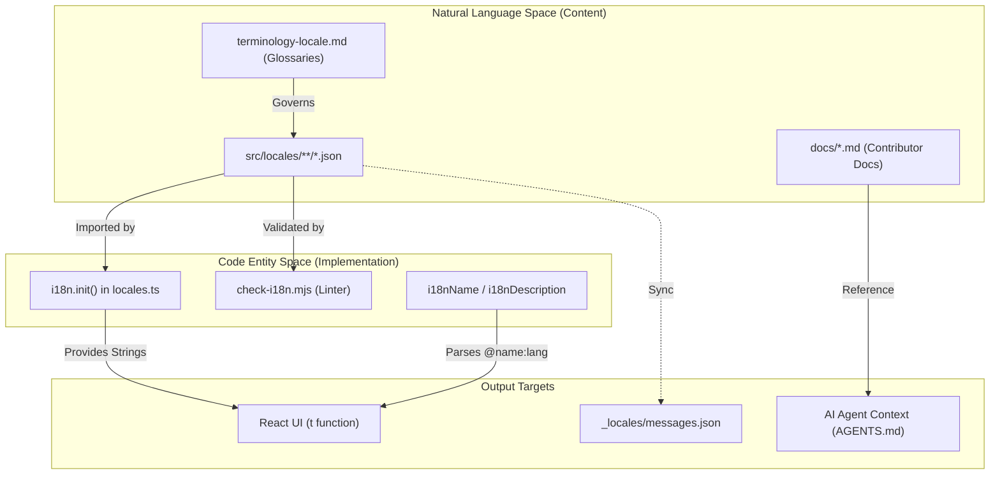
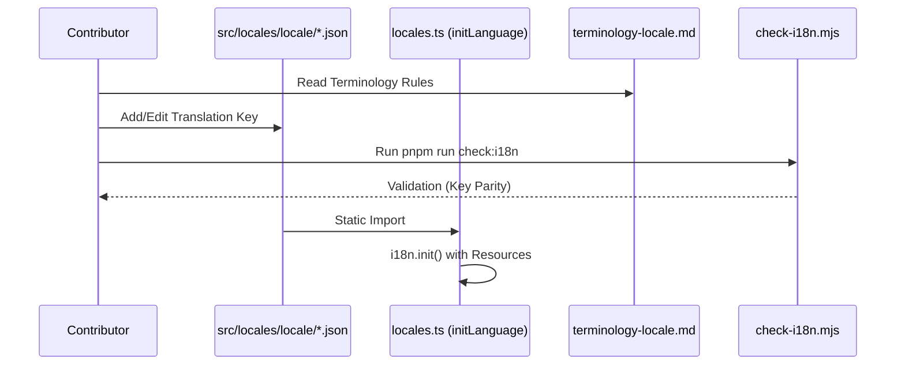

# Documentation Development

Relevant source files

The following files were used as context for generating this wiki page:

- [AGENTS.md](../AGENTS.md)
- [docs/DOC-MAINTENANCE.md](../docs/DOC-MAINTENANCE.md)
- [docs/README.md](../docs/README.md)
- [docs/design.md](../docs/design.md)
- [docs/develop.md](../docs/develop.md)
- [docs/pull-request.md](../docs/pull-request.md)
- [docs/references/develop-testing.md](../docs/references/develop-testing.md)
- [docs/translation.md](../docs/translation.md)
- [docs/verification.md](../docs/verification.md)
- [eslint.config.mjs](../eslint.config.mjs)
- [scripts/check-i18n.mjs](../scripts/check-i18n.mjs)
- [scripts/check-i18n.test.mjs](../scripts/check-i18n.test.mjs)
- [scripts/git-staged-snapshot.mjs](../scripts/git-staged-snapshot.mjs)
- [scripts/git-staged-snapshot.test.mjs](../scripts/git-staged-snapshot.test.mjs)
- [src/locales/locales.test.ts](../src/locales/locales.test.ts)
- [src/locales/locales.ts](../src/locales/locales.ts)
- [src/pages/components/NameAvatar.test.tsx](../src/pages/components/NameAvatar.test.tsx)
- [src/pages/components/ui/empty-state.test.tsx](../src/pages/components/ui/empty-state.test.tsx)

This document explains the documentation infrastructure for ScriptCat, including the `docs/` structure, maintenance rules, translation workflow, and how to contribute to localized content.

## Overview

ScriptCat's documentation and localization infrastructure are split into two distinct areas:
- **Documentation Site**: A Docusaurus-powered site ([docs.scriptcat.org](https://docs.scriptcat.org/)) for user-facing guides and API references [docs/README.md:1-3](../docs/README.md#L1-L3).
- **Contributor/Agent Documentation**: Markdown files within the repository (`AGENTS.md`, `docs/*.md`) for engineering principles and internal architecture [docs/README.md:5-17](../docs/README.md#L5-L17).
- **Extension Localization**: An `i18next`-based system for translating the browser extension's UI strings [src/locales/locales.ts:3-6](../src/locales/locales.ts#L3-L6).

**Sources:** [docs/README.md:1-17](../docs/README.md#L1-L17), [src/locales/locales.ts:1-15](../src/locales/locales.ts#L1-L15), [docs/translation.md:6-10](../docs/translation.md#L6-L10)

## Documentation Architecture

The documentation ecosystem bridges the "Natural Language Space" (translations and guides) to the "Code Entity Space" (UI components and script metadata).

### Documentation Component Diagram

**Sources:** [src/locales/locales.ts:45-66](../src/locales/locales.ts#L45-L66), [docs/translation.md:56-64](../docs/translation.md#L56-L64), [docs/DOC-MAINTENANCE.md:89-102](../docs/DOC-MAINTENANCE.md#L89-L102), [docs/translation.md:83-93](../docs/translation.md#L83-L93)

## Contributor Documentation Structure

The repository maintains a structured set of Markdown files to guide developers and AI agents.

| File | Purpose |
| :--- | :--- |
| `AGENTS.md` | Engineering principles and architecture quick-map. The single source of truth for AI agents [AGENTS.md:1-6](../AGENTS.md#L1-L6). |
| `docs/develop.md` | Concrete development specs: commands, coding style, and UI rules [docs/develop.md:1-8](../docs/develop.md#L1-L8). |
| `docs/DOC-MAINTENANCE.md` | Rules for document organization and fact-checking [docs/DOC-MAINTENANCE.md:1-9](../docs/DOC-MAINTENANCE.md#L1-L9). |
| `docs/translation.md` | The single source of truth for localization workflows [docs/translation.md:6-10](../docs/translation.md#L6-L10). |
| `docs/references/` | Deep-dive technical references (e.g., `terminology-*.md`, `architecture-*.md`) [docs/README.md:10-15](../docs/README.md#L10-L15). |

**Sources:** [docs/README.md:5-17](../docs/README.md#L5-L17), [AGENTS.md:1-18](../AGENTS.md#L1-L18), [docs/DOC-MAINTENANCE.md:89-102](../docs/DOC-MAINTENANCE.md#L89-L102)

## Documentation Maintenance (DOC-MAINTENANCE)

To prevent "doc drift," where documentation becomes inconsistent with the code, the project follows strict rules defined in `DOC-MAINTENANCE.md`.

### Fact-Check Workflow
Contributors must verify every claim against the **Proposed Final Tree** (the state of the code after the PR lands) [docs/DOC-MAINTENANCE.md:34-46](../docs/DOC-MAINTENANCE.md#L34-L46).

1. **Verify with Git**: Use `git grep` or `git ls-files` to ensure referenced classes or files actually exist in the committed code [docs/DOC-MAINTENANCE.md:28-31](../docs/DOC-MAINTENANCE.md#L28-L31).
2. **Policy Consistency**: Ensure a rule in one doc doesn't contradict another [docs/DOC-MAINTENANCE.md:48-56](../docs/DOC-MAINTENANCE.md#L48-L56).
3. **Sanitization**: Scan for local absolute paths or private credentials before committing [docs/DOC-MAINTENANCE.md:80-86](../docs/DOC-MAINTENANCE.md#L80-L86).

**Sources:** [docs/DOC-MAINTENANCE.md:11-32](../docs/DOC-MAINTENANCE.md#L11-L32), [docs/DOC-MAINTENANCE.md:48-59](../docs/DOC-MAINTENANCE.md#L48-L59)

## Translation and Localization Workflow

ScriptCat uses `i18next` for the extension UI, supporting 10+ locales including `en-US`, `zh-CN`, `zh-TW`, `ja-JP`, `de-DE`, `vi-VN`, `ru-RU`, `tr-TR`, `pt-BR`, and `ko-KR` [src/locales/locales.ts:6-15](../src/locales/locales.ts#L6-L15).

### Localization Data Flow

**Sources:** [src/locales/locales.ts:45-72](../src/locales/locales.ts#L45-L72), [docs/translation.md:47-55](../docs/translation.md#L47-L55), [docs/translation.md:83-93](../docs/translation.md#L83-L93)

### Key Rules
- **Terminology Reference**: Every locale MUST have a corresponding `docs/references/terminology-<locale>.md` file [docs/translation.md:89-91](../docs/translation.md#L89-L91).
- **Key Parity**: `check:i18n` ensures that every key in `en-US` (the fallback) exists in all other locales [docs/translation.md:86-88](../docs/translation.md#L86-L88).
- **No Default Values**: The ESLint rule `scriptcat/no-i18n-default-value` bans `t(key, { defaultValue })` to prevent hardcoded text leaking into the codebase [eslint.config.mjs:43-48](../eslint.config.mjs#L43-L48), [docs/develop.md:82-83](../docs/develop.md#L82-L83).

### Implementation Functions
- `initLocales(systemConfig)`: Initializes the i18n instance and sets up language listeners [src/locales/locales.ts:74-95](../src/locales/locales.ts#L74-L95).
- `i18nName(script)`: Dynamically selects the script name based on userscript metadata like `@name:zh-CN` [src/locales/locales.ts:117-126](../src/locales/locales.ts#L117-L126).
- `i18nDescription(script)`: Selects the localized description from metadata [src/locales/locales.ts:128-138](../src/locales/locales.ts#L128-L138).

**Sources:** [src/locales/locales.ts:74-95](../src/locales/locales.ts#L74-L95), [src/locales/locales.ts:117-138](../src/locales/locales.ts#L117-L138), [eslint.config.mjs:67-68](../eslint.config.mjs#L67-L68)

## How to Contribute to Docs

1. **For User Docs**: Edit the Docusaurus site at [docs.scriptcat.org](https://docs.scriptcat.org/) [docs/README.md:3](../docs/README.md#L3).
2. **For Contributor Docs**:
    - Read `DOC-MAINTENANCE.md` first [docs/DOC-MAINTENANCE.md:1-9](../docs/DOC-MAINTENANCE.md#L1-L9).
    - Update the relevant `.md` file in `docs/`.
    - If changing principles, update `AGENTS.md` [AGENTS.md:1-6](../AGENTS.md#L1-L6).
3. **For Translations**:
    - Locate the namespace JSON in `src/locales/<locale>/` [docs/translation.md:49-50](../docs/translation.md#L49-L50).
    - Follow the terminology in `docs/references/terminology-<locale>.md` [docs/translation.md:17-26](../docs/translation.md#L17-L26).
    - Run `pnpm run check:i18n` to verify key integrity [docs/translation.md:80-81](../docs/translation.md#L80-L81).

**Sources:** [docs/README.md:1-17](../docs/README.md#L1-L17), [docs/translation.md:47-55](../docs/translation.md#L47-L55), [docs/DOC-MAINTENANCE.md:89-102](../docs/DOC-MAINTENANCE.md#L89-L102)

---
