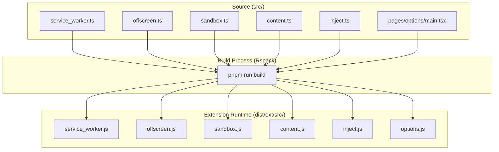
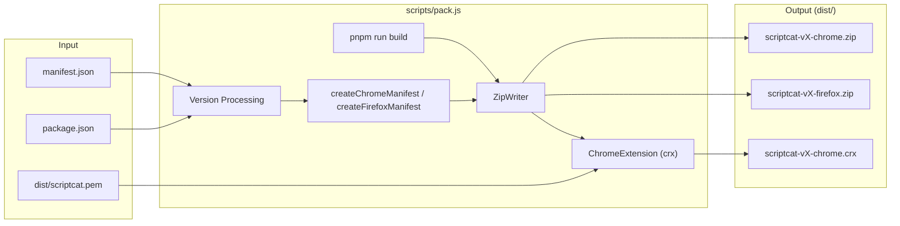

# Development Guide

<details>
<summary>Relevant source files</summary>

The following files were used as context for generating this wiki page:

- [.github/workflows/build.yaml](../.github/workflows/build.yaml)
- [.github/workflows/packageRelease.yml](../.github/workflows/packageRelease.yml)
- [.github/workflows/test.yaml](../.github/workflows/test.yaml)
- [AGENTS.md](../AGENTS.md)
- [CONTRIBUTING.md](../CONTRIBUTING.md)
- [docs/CONTRIBUTING_RU.md](../docs/CONTRIBUTING_RU.md)
- [docs/CONTRIBUTING_ZH.md](../docs/CONTRIBUTING_ZH.md)
- [docs/DOC-MAINTENANCE.md](../docs/DOC-MAINTENANCE.md)
- [docs/README.md](../docs/README.md)
- [docs/design.md](../docs/design.md)
- [docs/develop.md](../docs/develop.md)
- [docs/pull-request.md](../docs/pull-request.md)
- [docs/references/develop-testing.md](../docs/references/develop-testing.md)
- [docs/verification.md](../docs/verification.md)
- [eslint.config.mjs](../eslint.config.mjs)
- [rspack.config.ts](../rspack.config.ts)
- [scripts/build-config.js](../scripts/build-config.js)
- [scripts/build-config.test.js](../scripts/build-config.test.js)
- [scripts/git-staged-snapshot.test.mjs](../scripts/git-staged-snapshot.test.mjs)
- [scripts/pack.js](../scripts/pack.js)
- [src/pages/components/NameAvatar.test.tsx](../src/pages/components/NameAvatar.test.tsx)
- [src/pages/components/ui/empty-state.test.tsx](../src/pages/components/ui/empty-state.test.tsx)
- [vitest.config.ts](../vitest.config.ts)

</details>


This document provides an overview of the development environment, setup procedures, and workflows for contributing to ScriptCat. It covers prerequisites, project structure, development commands, and the basic development lifecycle. For detailed information on specific topics, see the specialized sub-pages: [Build System](./9-1-build-system.md) for bundling configuration, [Technology Stack](./9-2-technology-stack.md) for library documentation, [Testing and Quality](./9-3-testing-and-quality.md) for test patterns, [Contributing Guidelines](./9-4-contributing-guidelines.md) for workflow standards, and [Documentation Development](./9-5-documentation-development.md) for writing docs.

For architectural details about how ScriptCat's runtime systems work, see [Extension Architecture](./1-1-extension-architecture.md). For information about the user-facing features, see [Overview](./1-overview.md).

## Prerequisites

ScriptCat requires the following tools for development:

| Tool | Version | Purpose |
|------|---------|---------|
| Node.js | v22+ | JavaScript runtime (CI uses v22) |
| pnpm | Latest | Package manager (enforced via preinstall) |
| Git | Any recent | Version control |
| Browser | Chrome/Edge/Firefox | Extension testing (Chrome >= 120, Firefox >= 136) |

Sources: [.github/workflows/test.yaml:20](../.github/workflows/test.yaml#L20), [CONTRIBUTING.md:23-28](../CONTRIBUTING.md#L23-L28), [rspack.config.ts:21](../rspack.config.ts#L21)

## Quick Start

Clone the repository and install dependencies:

```bash
git clone https://github.com/scriptscat/scriptcat.git
cd scriptcat
pnpm install
```

Start the development server:

```bash
pnpm run dev
```

Load the extension in your browser:

1. Navigate to `chrome://extensions` (Chrome/Edge) or `about:debugging` (Firefox).
2. Enable "Developer mode".
3. Click "Load unpacked" and select the `dist/ext` directory.

**Important**: Changes to `manifest.json`, `service_worker`, `offscreen`, or `sandbox` contexts require manual extension reload. UI changes in pages like Options or Popup typically hot-reload automatically [CONTRIBUTING.md:103-106](../CONTRIBUTING.md#L103-L106).

Sources: [CONTRIBUTING.md:25-28](../CONTRIBUTING.md#L25-L28), [CONTRIBUTING.md:89-93](../CONTRIBUTING.md#L89-L93), [CONTRIBUTING.md:103-106](../CONTRIBUTING.md#L103-L106), [docs/develop.md:12-13](../docs/develop.md#L12-L13)

## Development Commands

The following scripts are defined for common development tasks:

| Command | Purpose | Notes |
|---------|---------|-------|
| `pnpm run dev` | Start development server with hot reload | Output to `dist/ext` [docs/develop.md:13](../docs/develop.md#L13) |
| `pnpm run dev:noMap` | Development mode without source maps | Required for incognito windows [CONTRIBUTING.md:91-93](../CONTRIBUTING.md#L91-L93) |
| `pnpm run build` | Production Rspack build | Standard production bundle [docs/develop.md:15](../docs/develop.md#L15) |
| `pnpm run pack` | Package extension for distribution | Generates ZIP and CRX files [scripts/pack.js:107-120](../scripts/pack.js#L107-L120) |
| `pnpm test` | Run Vitest unit test suite | Divided into `fast`, `ui`, and `isolated` [vitest.config.ts:64-109](../vitest.config.ts#L64-L109) |
| `pnpm run lint` | Run ESLint and formatting checks | Includes i18n and issue template checks [docs/develop.md:25](../docs/develop.md#L25) |
| `pnpm run test:e2e` | Run Playwright E2E tests | Requires extension build first [docs/develop.md:24](../docs/develop.md#L24) |

Sources: [docs/develop.md:11-30](../docs/develop.md#L11-L30), [scripts/pack.js:59-62](../scripts/pack.js#L59-L62), [vitest.config.ts:59-110](../vitest.config.ts#L59-L110)

## Development Workflow

### Workspace to Runtime Mapping
This diagram associates source code files with their corresponding browser execution contexts after the build process.



**Workspace Context Mapping**

Sources: [rspack.config.ts:56-75](../rspack.config.ts#L56-L75), [rspack.config.ts:76-80](../rspack.config.ts#L76-L80)

## Build and Packaging Pipeline

The build system transforms TypeScript source into browser-ready assets and packages them for Chrome and Firefox.



**Packaging Pipeline**

The packaging script `scripts/pack.js` performs several critical steps:
- **Version Management**: Syncs `package.json` version to `manifest.json` and `src/app/const.ts` [scripts/pack.js:35-56](../scripts/pack.js#L35-L56).
- **Browser Specifics**: Generates distinct manifests for Chrome and Firefox using `createChromeManifest` and `createFirefoxManifest` [scripts/pack.js:68-73](../scripts/pack.js#L68-L73).
- **Feature Flags**: The `Agent` (AI) feature is toggled based on beta status or `SC_DISABLE_ENV` [scripts/pack.js:31-34](../scripts/pack.js#L31-L34).
- **Signing**: Uses `scriptcat.pem` to pack the CRX file for Chrome [scripts/pack.js:113-120](../scripts/pack.js#L113-L120).

Sources: [scripts/pack.js:1-124](../scripts/pack.js#L1-L124), [rspack.config.ts:143-165](../rspack.config.ts#L143-L165)

## Code Quality and Testing

ScriptCat maintains high code standards through automated tooling:

- **Unit Testing**: Powered by **Vitest**. It uses three projects: `fast` (isolated logic), `ui` (React components with `happy-dom`), and `isolated` (tests requiring fresh module environments) [vitest.config.ts:59-110](../vitest.config.ts#L59-L110).
- **E2E Testing**: Powered by **Playwright**. It runs against the built extension in `dist/ext` [docs/develop.md:24](../docs/develop.md#L24), [.github/workflows/test.yaml:226-230](../.github/workflows/test.yaml#L226-L230).
- **Linting**: **ESLint** enforces strict rules including custom rules like `no-i18n-default-value` and `require-last-error-check` [eslint.config.mjs:66-68](../eslint.config.mjs#L66-L68).

Sources: [vitest.config.ts:1-112](../vitest.config.ts#L1-L112), [eslint.config.mjs:1-188](../eslint.config.mjs#L1-L188), [.github/workflows/test.yaml:57-112](../.github/workflows/test.yaml#L57-L112)

## Internationalization (i18n)

ScriptCat uses `i18next` for UI localization. Translation files are located in `src/locales/` [CONTRIBUTING.md:66](../CONTRIBUTING.md#L66).

- **Structure**: Each locale has its own directory containing namespace files like `common.json`, `popup.json`, and `script.json` [CONTRIBUTING.md:66](../CONTRIBUTING.md#L66).
- **Registration**: Locales must be registered in `src/locales/locales.ts` [CONTRIBUTING.md:68](../CONTRIBUTING.md#L68).
- **Enforcement**: Custom ESLint rules prevent hardcoded default values to ensure all strings are extractable [eslint.config.mjs:67](../eslint.config.mjs#L67).

Sources: [CONTRIBUTING.md:61-70](../CONTRIBUTING.md#L61-L70), [docs/develop.md:82-83](../docs/develop.md#L82-L83)

## Technology Stack Overview

ScriptCat is built with a modern, high-performance stack:

| Category | Technology | Purpose |
|----------|-----------|---------|
| Framework | **React 19** | Modern UI component architecture [AGENTS.md:21](../AGENTS.md#L21) |
| Styling | **shadcn/ui + Tailwind CSS v4** | Design system (migrated from Arco/UnoCSS) [AGENTS.md:21](../AGENTS.md#L21) |
| Bundler | **Rspack** | Fast Rust-based build tool [AGENTS.md:21](../AGENTS.md#L21) |
| Database | **Dexie** | IndexedDB wrapper for local persistence [docs/architecture.md:15](../docs/architecture.md#L15) |
| Editor | **Monaco Editor** | The core of the userscript editor [rspack.config.ts:71-73](../rspack.config.ts#L71-L73) |
| Language | **TypeScript** | Type-safe development [AGENTS.md:21](../AGENTS.md#L21) |

For details, see [Technology Stack](./9-2-technology-stack.md).

## Next Steps

Refer to these specialized pages for deeper technical details:

- **[Build System](./9-1-build-system.md)**: Rspack configuration, manifest transformations, and packaging logic.
- **[Technology Stack](./9-2-technology-stack.md)**: Detailed library versions and integration patterns.
- **[Testing and Quality](./9-3-testing-and-quality.md)**: Test suites, custom ESLint rules, and E2E setup.
- **[Contributing Guidelines](./9-4-contributing-guidelines.md)**: Commit standards (gitmoji), PR process, and engineering principles.
- **[Documentation Development](./9-5-documentation-development.md)**: Contributing to this wiki and the Docusaurus site.

Sources: [docs/README.md:1-102](../docs/README.md#L1-L102), [AGENTS.md:1-72](../AGENTS.md#L1-L72)

---
