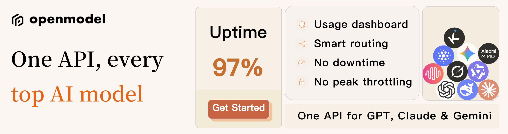

<a href="./docs/README_zh-CN.md">中文</a> <a href="./README.md">English</a> <a href="./docs/README_zh-TW.md">繁體中文</a> <a href="./docs/README_ja.md">日本語</a> <a href="./docs/README_RU.md">Русский</a>

<h1 align="center">
 
ScriptCat
</h1>

ScriptCat is a powerful userscript manager that lets you customize web pages, remove ads, automate tasks, and more — unlocking your browser's full potential!

<a href="https://docs.scriptcat.org/">Documentation</a> ·
<a href="https://discord.gg/JF76nHCCM7">Discord</a> ·
<a href="https://scriptcat.org/en/search">ScriptCat Scripts</a>

## ❤️ Sponsor

> [Want to appear here?](mailto:codfrm@gmail.com)

Click to collapse

**DeepSeek-V4-Flash is now free on OpenModel for a limited time!**

One API, every top AI model.

OpenModel is a high-availability AI model platform built to keep your apps fast and reliable: automatic failover, no
double-charging on retries, and per-key rate limits and quotas. Switch models by changing a single parameter, use new
models the day they launch, and plug straight into Claude Code, Codex, and Gemini CLI.

[Register via this link](https://www.openmodel.ai?ref=pyGPw93M) and get started!

---

<table>
<tr>
<td width="180"></td>
<td>PackyCode is a stable, high-performance API relay provider, offering relay services for Claude Code, Codex, Gemini, and more. With automatic failover, smart routing, and unlimited concurrency, it turns AI programming into a real productivity tool. <a href="https://www.packyapi.com/register?aff=BOKa">Register via this link</a> and get started!</td>
</tr>
<tr>
<td width="180"></td>
<td>Yanxi Technology focuses on custom script software and web application design and development. It provides highly personalized customization services, stable and reliable project solutions, and industry insights to meet a wide range of custom program development needs in one place. Website: <a href="https://enncy.cn/">https://enncy.cn/</a></td>
</tr>
<tr>
<td width="180"></td>
<td>RunAPI is an efficient and stable API platform, and an alternative to OpenRouter. A single API Key gives you access to 150+ leading models, including OpenAI, Claude, Gemini, DeepSeek, Grok, and more, at prices as low as 10% of the original, with exceptional stability. It's seamlessly compatible with tools like Claude Code, OpenClaw, and others. RunAPI offers an exclusive perk for ScriptCat users: register and contact an administrator to claim ¥7 in free credit. <a href="https://runapi.co/register?aff=vpKz">Register via this link</a>.</td>
</tr>
</table>

## About ScriptCat

ScriptCat is a powerful userscript manager based on Tampermonkey's design philosophy, fully compatible with Tampermonkey
scripts. It not only supports traditional userscripts but also innovatively implements a background script execution
framework with rich API extensions, enabling scripts to accomplish more powerful functions. It features an excellent
built-in code editor with intelligent completion and syntax checking, making script development more efficient and
smooth.

**If you find it useful, please give us a Star ⭐ This is the greatest support for us!**

## ✨ Core Features

### 🔄 Cloud Sync

- **Script Cloud Sync**: Sync scripts across devices, easily restore when switching browsers or reinstalling systems
- **Script Subscriptions**: Create and manage script collections, support team collaboration and script combinations

### 🔧 Powerful Functions

- **Full Tampermonkey Compatibility**: Seamlessly migrate existing Tampermonkey scripts with zero learning curve
- **Background Scripts**: Innovative background execution mechanism, keeping scripts running continuously without page
  limitations
- **Scheduled Scripts**: Support timed execution tasks for auto check-ins, scheduled reminders, and more
- **Rich APIs**: Provides more powerful APIs compared to Tampermonkey, unlocking more possibilities

### 🛡️ Security & Reliability

- **Sandbox Mechanism**: Scripts run in isolated environments, preventing malicious code from affecting other scripts
- **Permission Management**: Scripts must explicitly request required permissions, with additional confirmation needed
  for sensitive operations

### 💻 Development Experience

- **Smart Editor**: Built-in code editor with syntax highlighting, intelligent completion, and ESLint
- **Debugging Tools**: Comprehensive debugging features for quick problem identification and resolution
- **Beautiful Interface**: Modern UI design with intuitive and clean operations

> 🚀 More features in continuous development...

## 🚀 Quick Start

### 📦 Install Extension

#### Extension Stores (Recommended)

| Browser | Store Link                                                                                                                                                                                                                       | Status       |
| ------- | -------------------------------------------------------------------------------------------------------------------------------------------------------------------------------------------------------------------------------- | ------------ |
| Chrome  | [Stable Version](https://chromewebstore.google.com/detail/scriptcat/ndcooeababalnlpkfedmmbbbgkljhpjf) [Beta Version](https://chromewebstore.google.com/detail/scriptcat-beta/jaehimmlecjmebpekkipmpmbpfhdacom)                  | ✅ Available |
| Edge    | [Stable Version](https://microsoftedge.microsoft.com/addons/detail/scriptcat/liilgpjgabokdklappibcjfablkpcekh) [Beta Version](https://microsoftedge.microsoft.com/addons/detail/scriptcat-beta/nimmbghgpcjmeniofmpdfkofcedcjpfi) | ✅ Available |
| Firefox | [Stable Version](https://addons.mozilla.org/en/firefox/addon/scriptcat/) [Beta Version](https://addons.mozilla.org/en/firefox/addon/scriptcat-pre/)                                                                              | ✅ MV2       |

#### Manual Installation

If you cannot access extension stores, download the latest ZIP package from
[GitHub Releases](https://github.com/scriptscat/scriptcat/releases) for manual installation.

### 📝 Usage Guide

#### Installing Scripts

1. **Get from Script Markets**: Visit [ScriptCat Script Store](https://scriptcat.org/en/search) or other userscript
   markets
2. **Background Scripts Zone**: Experience unique [Background Scripts](https://scriptcat.org/en/search?script_type=3)
3. **Compatibility**: Supports most Tampermonkey scripts, can be installed directly. If you encounter incompatible
   scripts, please report them to us through [issues](https://github.com/scriptscat/scriptcat/issues).

#### Developing Scripts

Check our [Development Documentation](https://docs.scriptcat.org/docs/dev/) and
[Developer Guide](https://learn.scriptcat.org/) to learn how to write scripts. The documentation covers everything from
basics to advanced topics, making script development effortless.

If you find errors in the documentation or want to contribute content, you can click "Edit this page" on the
documentation page to make modifications.

---

## 🤝 Contributing

We welcome all forms of contributions! Please check the [Contributing Guide](./CONTRIBUTING.md) to learn how to
get started.

### 💬 Community

Join our community to communicate with other users and developers:

- [Telegram](https://t.me/scriptscat)
- [Discord](https://discord.gg/JF76nHCCM7)

### 🙏 Acknowledgments

Thanks to the following developers who have contributed to ScriptCat. ScriptCat becomes better with your help!

---

## 📄 Open Source License

This project is open-sourced under the [GPLv3](./LICENSE) license. Please comply with the relevant license terms.

