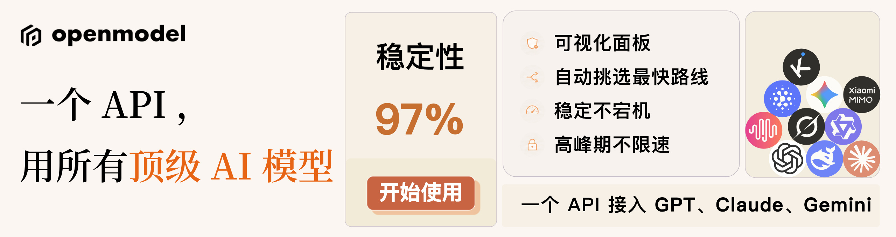
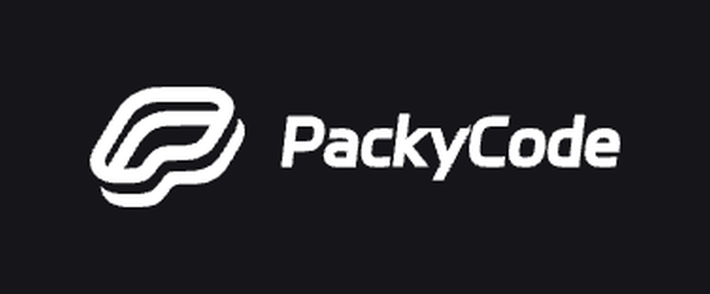
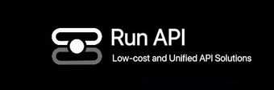

<a href="./README_zh-CN.md">中文</a> <a href="../README.md">English</a> <a href="./README_zh-TW.md">繁體中文</a> <a href="./README_ja.md">日本語</a> <a href="./README_RU.md">Русский</a>

<h1 align="center">
 
ScriptCat
</h1>

脚本猫是一个强大的用户脚本管理器，轻松定制网页、消除广告、自动执行任务等，激活浏览器的无限可能！

<a href="https://docs.scriptcat.org/">文档</a> ·
<a href="https://bbs.tampermonkey.net.cn/">社区（油猴中文网）</a> ·
<a href="https://scriptcat.org/search">脚本站</a>

## ❤️ 赞助商

> [想出现在这里？](mailto:codfrm@gmail.com)

点击折叠

**DeepSeek-V4-Flash 在 OpenModel 上限时免费！**

一个 API，用遍所有顶级 AI 模型。

OpenModel 是一个高可用、高可靠的 AI 模型调用平台，让你的应用快速稳定运行：自动故障转移、重试不重复扣费、每个 Key 可单独设额度与限频。换模型只改一个参数，新模型发布当天即可用，还能直接对接 Claude Code、Codex 和 Gemini CLI。

[点此链接注册](https://www.openmodel.ai?ref=pyGPw93M)，立即开始使用！

---

<table>
<tr>
<td width="180"></td>
<td>PackyCode 是一家稳定、高效的 API 中转服务商，提供 Claude Code、Codex、Gemini 等多种中转服务。具备自动故障转移、智能路由和无限并发等多种功能，让 AI 编程成为真正的生产力工具。<a href="https://www.packyapi.com/register?aff=BOKa">点此链接注册</a>，立即开始使用！</td>
</tr>
<tr>
<td width="180"></td>
<td>言溪科技专注脚本软件定制、网页程序设计开发，提供高度个性化定制服务，项目方案稳定可靠，同步分享行业前沿资讯，一站式满足各类程序开发定制需求。官网：<a href="https://enncy.cn/">https://enncy.cn/</a></td>
</tr>
<tr>
<td width="180"></td>
<td>RunAPI 是高效稳定的 API OpenRouter 平替平台，一个 API Key 即可访问 OpenAI、Claude、Gemini、DeepSeek、Grok 等 150+ 主流模型，低至 1 折，极其稳定，可以无缝兼容 Claude Code、OpenClaw 等工具。RunAPI 为 ScriptCat 用户提供专属福利：注册联系管理员即可领取￥7 的免费额度。<a href="https://runapi.co/register?aff=vpKz">点此链接注册</a>。</td>
</tr>
</table>

## 关于

ScriptCat（脚本猫）是一个功能强大的用户脚本管理器，基于油猴的设计理念，完全兼容油猴脚本。它不仅支持传统的用户脚本，还创新性地实现了后台脚本运行框架，提供丰富的API扩展，让脚本能够完成更多强大的功能。内置优秀的代码编辑器，支持智能补全和语法检查，让脚本开发更加高效流畅。

**如果觉得好用，请给我们一个 Star ⭐ 这是对我们最大的支持！**

## ✨ 核心特性

### 🔄 云端同步

- **脚本云同步**：跨设备同步脚本，更换浏览器或重装系统后轻松恢复
- **脚本订阅**：创建和管理脚本合集，支持团队协作和脚本组合使用

### 🔧 强大功能

- **完全兼容油猴**：无缝迁移现有油猴脚本，零学习成本
- **后台脚本**：独创后台运行机制，让脚本持续运行不受页面限制
- **定时脚本**：支持定时执行任务，实现自动签到、定时提醒等功能
- **丰富 API**：相比油猴提供更多强大 API，解锁更多可能性

### 🛡️ 安全可靠

- **沙盒机制**：脚本运行在隔离环境中，防止恶意代码影响脚本
- **权限管理**：脚本需明确申请所需权限，敏感操作需要额外确认

### 💻 开发体验

- **智能编辑器**：内置代码编辑器支持语法高亮、智能补全和 ESLint
- **调试工具**：完善的调试功能，快速定位和解决问题
- **美观界面**：现代化 UI 设计，操作简洁直观

> 🚀 更多功能持续开发中...

## 🚀 快速开始

### 📦 安装扩展

#### 扩展商店（推荐）

| 浏览器 | 商店链接 | 状态 |
| ------- | ------------------------------------------------------------------------------------------------------------------------------------------------------------------------------------------------------------------------------------------- | ------- |
| Chrome  | [正式版本](https://chromewebstore.google.com/detail/scriptcat/ndcooeababalnlpkfedmmbbbgkljhpjf) [Beta版本](https://chromewebstore.google.com/detail/scriptcat-beta/jaehimmlecjmebpekkipmpmbpfhdacom) | ✅ 可用 |
| Edge    | [正式版本](https://microsoftedge.microsoft.com/addons/detail/scriptcat/liilgpjgabokdklappibcjfablkpcekh) [Beta版本](https://microsoftedge.microsoft.com/addons/detail/scriptcat-beta/nimmbghgpcjmeniofmpdfkofcedcjpfi) | ✅ 可用 |
| Firefox | [正式版本](https://addons.mozilla.org/zh-CN/firefox/addon/scriptcat/) [Beta版本](https://addons.mozilla.org/zh-CN/firefox/addon/scriptcat-pre/) | ✅ MV2 |

#### 手动安装

如果无法访问扩展商店，可以在 [GitHub Releases](https://github.com/scriptscat/scriptcat/releases)
下载最新版本的 ZIP 包进行手动安装。

### 📝 使用指南

#### 安装脚本

1. **从脚本市场获取**：访问 [ScriptCat 脚本站](https://scriptcat.org/search) 或其他用户脚本市场
2. **后台脚本专区**：体验独有的 [后台脚本](https://scriptcat.org/zh-CN/search?script_type=3)
3. **兼容性**：支持绝大部分油猴脚本，可直接安装使用，如果遇到不兼容的脚本，欢迎通过
   [issue](https://github.com/scriptscat/scriptcat/issues) 反馈给我们。

#### 开发脚本

查看我们的 [开发文档](https://docs.scriptcat.org/docs/dev/)与[开发指南](https://learn.scriptcat.org/)
学习如何编写脚本。文档涵盖了从基础到高级的所有内容，让你在编写脚本时得心应手。

如果发现文档有错误或希望贡献内容，可以点击文档页面的"编辑此页"进行修改。

---

## 🤝 参与贡献

我们欢迎所有形式的贡献！请查看 [贡献指南](./CONTRIBUTING_ZH.md) 了解如何开始。

### 💬 社区交流

加入我们的社区，与其他用户和开发者交流：

- [Telegram](https://t.me/scriptscat)
- [Discord](https://discord.gg/JF76nHCCM7)
- [社区（油猴中文网）](https://bbs.tampermonkey.net.cn/)

### 🙏 鸣谢

感谢以下开发者对 ScriptCat 作出的贡献，有你们 ScriptCat 才能变得更好！

---

## 📄 开源许可

本项目基于 [GPLv3](../LICENSE) 协议开源，请遵守相关协议条款。

