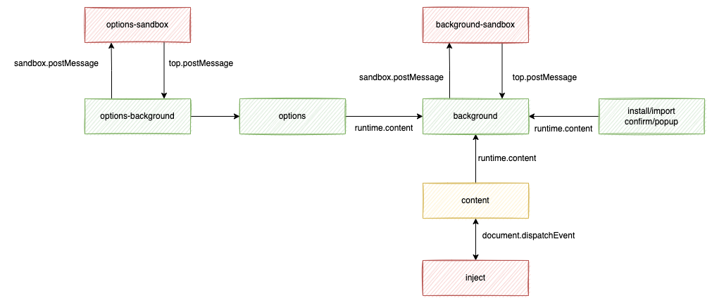

# 通信机制
> 因为通信机制篇幅过于庞大，内容过于复杂，所以单独开一个文档，也方便整理

为了在页面上实现油猴的API，我们需要将实际的操作放到扩展中来。此时就需要通过通讯的方式将信息从网页->content->background，在background中处理完成之后再逆向的返回回去。

又或者是sandbox->background的数据流转，甚至更复杂的场景用户在option页中修改脚本的值，这时需要将值发送给运行中的脚本，可能是页面上的脚本页可能是sandbox中的脚本，相当于是一个广播操作，数据流转路径像下面这样：option->background->content->page和option->background->sandbox。

## 通讯API
chrome扩展中有多种通讯API，可以单向或者双向的进行消息交互：

| API                                     | 接收方法                           | 生命周期          | 描述                                                         |
| --------------------------------------- | ---------------------------------- | ----------------- | ------------------------------------------------------------ |
| runtime.sendMessage                     | runtime.onMessage                  | 单次回复          | 向你的扩展或其他扩展发送单条消息，用于扩展内环境通讯，扩展的所有页面都可接收到；content页到扩展，但扩展到到content需要使用`tabs.sendMessage`。 |
| tabs.sendMessage                        | runtime.onMessage                  | 单次回复/指定窗口 | 向指定窗口的content页面发送单条消息；用于扩展与窗口content通讯 |
| runtime.connect                         | runtime.onConnect                  | 长连接/topic      | 通过name建立连接，可建立长期通信；content页到扩展，但扩展到到content需要使用`tabs.sendMessage`。 |
| tabs.connect                            | runtime.onConnect                  | 长连接/指定窗口   | 通过name建立连接，可建立长期通信；用于扩展与窗口content通讯  |
| document.dispatchEvent(new CustomEvent) | document.addEventListener          | 单向/指定事件     | 利用自定义事件实现content与页面的通讯，可以避免被页面的window.addEventListener截获 |
| top/sandbox.postMessage                 | window.addEventListener('message') | 单向/指定事件     | 使用postMessage实现background与sandbox页的通讯               |

## 相关功能需求

GM API需要从页面上发送消息至content页，再由content转发给background进行消息的处理，完成之后再逆向的传递回去；content页大多数情况下只是做一个代理作用，将页面消息发送给background进行处理，但某些GM API的步骤必须在content进行处理，此时只需要content与页面进行通讯。

在后台脚本中GM API，由sandbox发送给background进行消息的处理，处理完成后再发送回sandbox；后台脚本允许在option进行调试，这种情况的数据流与上述情况一致，只是将background换成了option。

在value更新时，需要将value的更新消息广播给所有的脚本，此时的数据流几乎涉及到了所有的页面，首先通过拦截GM_setValue得知消息变更后，然后再由background广播至所有建立了连接的页面。

另外为了将

- 异步操作同步化（例如value，GM_getValue是同步方法，但查询数据的操作是异步的）
- 临时数据存储（require资源与脚本资源，在脚本安装/更新时，也需要由install页去请求background获取脚本的信息）

需要在建立缓存机制，这些都需要通过通讯去进行操作。

## 设计思路

各页面大多数需要长连接，尽量选择能够长连接的API去实现，并且尽量使用统一一个API，这里选择runtime.connect用于扩展内页通讯。options与background需要与sandbox页去通讯，background-sandbox是执行后台脚本的环境，options-sandbox是调试后台脚本时的环境，此处选择top/sandbox.postMessage进行通讯。content与inject选择CustomEvent自定义事件进行通讯，事件名可以随机，避免被页面拦截。

### 扩展内页面

扩展中的runtime.connect，相当于是一个广播，扩展中的所有runtime.onConnect都会接收到连接，几乎所有信息都是需要流转到background进行处理，所以我们只需要在background中使用runntime.onConnect，其它扩展内页面单向的连接到background，由background再去负责数据的流转。

并且扩展中的所有环境都是使用此API，无法进行区分。我们在background建立连接后使用一个`map<tag,map<id,connect>>`的map将连接都保存起来，在建立连接时，使用连接name作为tag。

平常收到链接进行处理，另外使用一个`broadcast`的字段表示广播，用一个`target<{tag,id[]?}>`表示需要广播的目标，id为空即表示广播给map下的所有connect。id使用tab.id。

### 扩展与沙盒页

使用postMessage通讯，GM API可直接流转到option/background执行，但option页发生的广播（例如value更新）需要广播到background页面进行分发，也需要处理由background页面广播（例如value更新或者菜单事件）过来的事件，在option-background做一个转换（option-background与option是同一个页面，此处只是做了一个功能划分）。

### content与页面

使用CustomEvent自定义事件进行通讯，大多数情况下，content接收到页面的消息后可以直接转发，但有时候有些操作只能在content页执行，需要实现一个拦截操作，此种事件直接在content处理完成后返回去。

沙盒页与页面之间的通讯目标只有双方，所以直接调用通讯的方法即可。

## 多路复用

有时候需要实现发送方与接收方的回信，或者是一个长期的内部通讯，我们给需要二次通讯的消息加上一个`stream`，使用此stream再建立一层连接。尽量只做发送方的单次回调，长期通讯或者接收方的回调需要接受方对stream做持久化，接收方大多数情况下是background长期存在的，容易产生内存膨胀，并且使系统更复杂。

## 实现

源代码：[src/app/connect](../src/app/connect)
